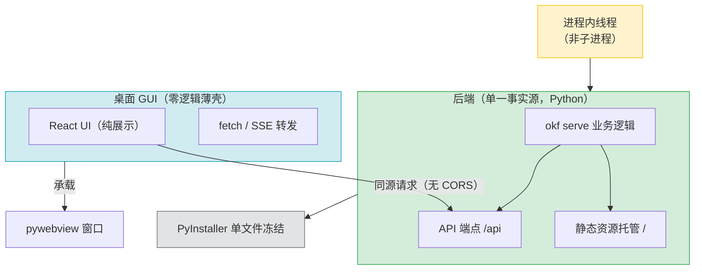

> **提炼自**：okf-desktop 桌面客户端学习复盘 —— 把成熟 CLI/服务端工具链封装为可单文件打包的桌面 GUI 应用

# 零逻辑客户端桌面应用可冻结架构（Zero-Logic Client Freezable Desktop App）

## 模式类型

架构模式（桌面应用 / 单文件分发 / 前后端同源）

## 成熟度

L1 实验性（okf-desktop v0.3.3 实现验证）

## 适用场景

把一个已经成熟的 CLI / 服务端工具链，包装成"可双击运行"的桌面 GUI 应用，且希望最终能用 PyInstaller 之类的工具把整个应用（含前端 UI）冻结成单一可执行文件分发。

典型场景：
- 本地优先工具（本地检索、本地知识库、本地模型对话）需要图形界面
- 已有 Python 服务端（FastAPI/uvicorn），想加一个 React/Vue 前端但不想引入构建服务器
- 需要单文件免安装分发的内部工具 / 开发者工具
- "后端持续演进、GUI 永远是薄壳"的长期维护项目

## 问题背景

把 CLI 工具链 GUI 化时，最常见的两种失败路径：

1. **在 GUI 里重写业务逻辑**：为了图省事，把一部分业务逻辑直接实现进前端，导致"CLI 一份逻辑、GUI 一份逻辑"，后端升级时 GUI 不同步，出现双份维护与技术债。
2. **前端独立部署 + 跨域**：前端静态资源单独起一个 dev server（或 file:// 打开），通过 API 请求后端时触发 CORS / 跨域限制，桌面 webview 环境下尤甚。

根本矛盾：既想让前端获得完整体验，又想保持"业务逻辑单一事实源"与"可单文件冻结"，三者看似不可兼得。

okf-desktop 的解法是用三个支柱同时满足这三者。

## 核心设计思想

**核心洞察**：让"视觉表现"与"业务逻辑"彻底正交——GUI 永远只是一个把后端 HTTP 结果渲染出来的薄壳，而后端才是唯一可信的逻辑来源。因为前端通过 HTTP 同源访问后端，天然跨语言（Python 后端 + React 前端）、可独立演进、可被单文件打包器统一冻结。

## 三个支柱

### 支柱 1：零逻辑客户端（Zero-Logic Client）

GUI 只做"展示 + 转发"，业务逻辑 100% 留在后端工具链，保持**单一事实源**。

| 职责 | 前端（React） | 后端（Python） |
|------|-------------|---------------|
| 业务规则 / 数据处理 | ❌ 不实现 | ✅ 唯一实现 |
| 界面渲染 / 交互反馈 | ✅ 负责 | ❌ 不关心 |
| 调用后端 | ✅ 通过 fetch / SSE | ✅ 提供端点 |
| 状态持久化 | ❌ 由后端托管 | ✅ 数据源 |

价值：后端（CLI/服务端）升级，GUI 自动受益，无需同步改两份代码。

### 支柱 2：单源无 CORS（Single-Origin, No CORS）

后端**同时**托管 UI 静态资源（`/`）与 API（`/api`），前端同源请求，从源头规避桌面 webview 的跨域痛点。

- 前端页面从 `http://127.0.0.1:<port>/` 加载
- API 调用 `http://127.0.0.1:<port>/api/...` 是**同源**请求
- 不需要 CORS 中间件、不需要代理、不需要 `file://` 特殊处理

价值：跨域问题在架构上被"消除"而非"绕过"。

### 支柱 3：进程内服务器（In-Process Server）

服务器在**线程**里跑（而非子进程），使 PyInstaller 能把「Python 后端 + React 前端静态资源」整体冻结成单一可执行文件。

- 子进程方案在冻结时无法干净打包（入口、资源路径、生命周期都断裂）
- 线程方案共享同一 Python 进程，冻结器只需处理一个入口脚本
- 窗口关闭时后端线程随之退出，生命周期一致

价值：单文件分发的可行性由进程模型决定。

## 关键技术细节

okf-desktop 在三个支柱之上的可冻结工程化细节：

| 细节 | 做法 | 目的 |
|------|------|------|
| 随机回环端口 | 启动时随机绑定 `127.0.0.1:<随机端口>` | 避免固定端口冲突，多实例可并存 |
| 随机 Bearer token | 每次启动生成随机 token，前端通过就绪回调注入 | 防止本机其他进程探测/劫持本地 API |
| 就绪轮询 | 前端轮询等待后端 ready 后自动注入 token | 时序解耦，前端无需感知启动顺序 |
| 约束 uvicorn 选项 | 仅启用 `asyncio` 事件循环 + `h11` 协议 + `ws-none`（禁用 websocket） | 避免打包进原生扩展，保证可冻结 |

## 适用边界

### 适用场景

- ✅ 业务逻辑已稳定在 CLI / 服务端，只需加分发入口
- ✅ 前端可完全通过 HTTP API 表达需求（无需本地文件系统直接访问）
- ✅ 需要单文件免安装分发（PyInstaller / electron-builder）
- ✅ 后端是 Python 且已用 FastAPI/uvicorn

### 不适用场景

- ❌ 前端需要大量本地计算（如本地视频剪辑、本地 GPU 渲染）且不能通过后端表达
- ❌ 需要原生系统 API（系统托盘、全局快捷键、文件拖拽）远超 webview 能力，且后端无法覆盖
- ❌ 对启动速度极敏感的小工具，且服务器冷启动成本不可接受
- ❌ 必须是真 C/S 多机架构（本模式是单机本地回环）

## 实施检查清单

封装 CLI 工具链为桌面 GUI 时：

- [ ] 是否确认业务逻辑 100% 留在后端（前端零逻辑）？
- [ ] 后端是否同时托管静态资源（`/`）与 API（`/api`），保证同源？
- [ ] 服务器是否用线程（而非子进程）运行，保证可冻结？
- [ ] 端口是否随机化，避免多实例冲突？
- [ ] 是否用随机 token 保护本地 API，避免本机进程劫持？
- [ ] uvicorn 选项是否约束为纯 Python 实现（asyncio/h11），避免打包原生扩展？
- [ ] 前端是否通过就绪轮询获取 token，而非硬编码/启动顺序假设？

## 反例警示

| 错误做法 | 后果 |
|---------|------|
| 在 GUI 里重写业务逻辑 | 双份维护，后端升级后 GUI 行为不一致 |
| 前端独立部署 + 后端 API 跨域访问 | webview 跨域报错，需要 CORS 补丁打补丁 |
| 用子进程跑服务器 | PyInstaller 无法干净冻结单文件，入口/资源路径断裂 |
| 固定端口号 | 多实例端口冲突，二次启动失败 |
| API 无鉴权直接暴露在本地端口 | 本机任意进程可探测并调用本地 API |
| uvicorn 启用默认 websocket/原生加速 | 打包体积膨胀或冻结失败 |

## 正例：okf-desktop

| 设计决策 | 实现 | 效果 |
|---------|------|------|
| 零逻辑客户端 | React 纯 UI + 通过 fetch/SSE 调 `okf serve` | 后端 okf-kit 升级则 GUI 自动受益 |
| 单源无 CORS | 后端托管 UI 静态资源与 `/api` | 前端同源请求，无跨域问题 |
| 进程内服务器 | 线程跑 FastAPI/uvicorn | PyInstaller 可冻结为单文件 |
| 随机回环端口 + 随机 Bearer token | 启动时生成 + 就绪注入 | 安全且支持多实例 |
| uvicorn 约束 asyncio/h11/ws-none | 禁用 websocket 与原生加速 | 避免打包原生扩展 |

## 与其他模式的关系

| 相关模式 | 关系 | 说明 |
|---------|------|------|
| [tool-skill-separation.md](tool-skill-separation.md) | 思想同源 | "能力层与知识层按变化频率隔离"与本模式"视觉层与逻辑层正交"同源 |
| [three-layer-capability-openness.md](three-layer-capability-openness.md) | 互补 | GUI→CLI→API 三层能力开放中，本模式解决 GUI 层如何薄化接入后端 |
| [zero-update-client-design.md](zero-update-client-design.md) | 思想同源 | "能力在服务端实现、客户端零逻辑"与"控制端实现、被控端零更新"思想一致 |
| [io-boundary-pure-function-core.md](io-boundary-pure-function-core.md) | 关联 | 后端"纯函数核心 + IO 边界"可进一步强化单一事实源的可测性 |
| [hardware-minimal-software-complex.md](../methodology-patterns/product-growth/hardware-minimal-software-complex.md) | 同族（零负担家族·逻辑维度） | 本模式让 GUI 前端"零逻辑"、硬件极简让硬件"零负担"，都是把复杂度上移到可迭代侧，让受限侧保持零负担 |