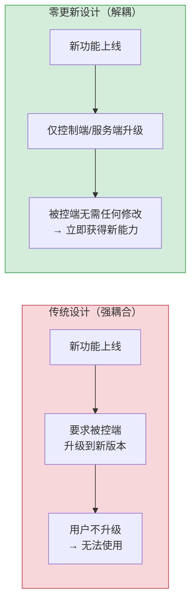

> **提炼自**：向日葵AI开发者生态系统学习萃取 —— 被控端零更新兼容性设计

# 被控端零更新设计模式（Zero-Update Client Compatibility）

## 模式类型

架构模式（向后兼容/远程控制/渐进式升级）

## 成熟度

L1 实验性（向日葵MCP/CLI官方实现验证）

## 适用场景

在远程控制、设备管理、IoT平台等系统中，服务端能力升级时需要兼容大量已部署的旧版客户端/被控端，无法强制用户升级所有终端设备。

典型场景：
- 远程控制软件新功能上线（如AI能力、MCP协议）
- IoT平台能力扩展，存量设备固件版本碎片化
- 企业IT管理系统升级，员工电脑版本不统一
- SaaS平台推出新API，需要兼容旧版客户端
- 任何"服务端快速迭代+客户端海量存量+升级不受控"的系统

## 问题背景

远程控制/IoT类系统面临一个经典矛盾：

1. **服务端需要快速迭代**：AI能力、MCP协议、新功能持续上线，需要快速推出
2. **被控端升级不受控**：用户可能几个月甚至几年不升级客户端；企业环境统一升级需要审批；无人值守设备无法人工升级；存量设备数量庞大（百万/千万级）
3. **强制升级成本高**：强制用户升级导致体验差、流失率高；企业客户拒绝频繁升级；部分设备物理上无法升级

常见错误做法：
- 要求所有被控端升级到最新版才能使用新功能 → 用户升级率低，新功能覆盖率差
- 新服务端不再兼容旧协议 → 旧版客户端直接断连，生产事故
- 为每个旧版本维护兼容分支 → 维护成本爆炸，N个版本N套代码

向日葵的设计：新能力（MCP/AI）只需要控制端（主控端）升级，被控端**零修改、零升级、零感知**即可接入新能力。

## 核心设计思想



**核心洞察**：远程控制系统天然有"主控端-被控端"的区分，只要新能力能通过已有远控协议（屏幕画面+键鼠输入）实现，就不需要被控端做任何升级。

## 实现原理

### 原理1：能力在控制端而非被控端实现

将新的AI能力（MCP工具封装、视觉识别、操作逻辑）全部放在**控制端/服务端**实现：

| 能力 | 实现位置 | 被控端是否需要升级 |
|-----|---------|-----------------|
| MCP协议封装 | 控制端MCP Server | ❌ 不需要 |
| AI视觉识别（UI Locator） | 控制端/云端视觉模型 | ❌ 不需要 |
| Skill流程编排 | 控制端Skill executor | ❌ 不需要 |
| CLI工具逻辑 | 控制端CLI | ❌ 不需要 |
| 屏幕画面传输 | 已有远控协议 | ✅ 早已支持 |
| 键鼠输入模拟 | 已有远控协议 | ✅ 早已支持 |
| 远控连接管理 | 已有远控协议 | ✅ 早已支持 |

### 原理2：复用已有被控端能力

向日葵MCP的9个桌面操作工具，底层全部复用已有的远控协议能力：

```
MCP桌面操作工具 → 底层远控协议指令 → 被控端已有能力
desktop_click_mouse → 鼠标移动+点击指令 → 被控端已有鼠标驱动
desktop_typing_text → 键盘输入指令 → 被控端已有键盘驱动
control_screenshot → 屏幕帧传输 → 被控端已有屏幕采集
control_command → 命令执行通道 → 被控端已有命令通道
```

被控端看到的只是"主控端发来了普通的鼠标点击、键盘输入指令"，完全感知不到这是AI在操作。

### 原理3：视觉操作不依赖被控端API

AI视觉操作闭环（截图→识别→点击→验证）不需要被控端提供任何API：
- 截图：通过已有远控视频流获取画面
- 识别：在控制端/云端用AI视觉模型分析
- 点击：通过已有远控通道发送鼠标指令
- 验证：再次截图，对比画面变化

整个闭环完全在控制端/云端完成，被控端就像被人类用户操作一样，无需知道对面是AI。

### 原理4：协议转换在控制端完成

MCP协议是控制端对外暴露的接口，对内转换为已有远控协议：

```
AI Agent → MCP协议（新）→ 控制端 → 向日葵远控协议（旧）→ 被控端（旧版本即可）
```

被控端看到的仍然是它原本就支持的向日葵远控协议，不需要理解MCP是什么。

## 设计原则

### 原则1：能力下压还是上移？——新能力尽量上移

当设计新功能时，先问：这个功能**必须**在被控端实现吗？

- 如果能通过"控制端发送已有指令组合"实现 → 在控制端实现，被控端零更新
- 如果必须在被控端执行（如底层驱动、内核级操作）→ 才考虑被控端升级，且提供fallback

### 原则2：协议转换而非协议替换

新协议（MCP/AI）是对外接口，对内转换为已有协议，而不是替换已有协议：

```
反模式（协议替换）：
新协议上线 → 废弃旧协议 → 所有客户端必须升级支持新协议 → 大规模兼容问题

正模式（协议转换）：
新协议作为新入口 → 控制端做协议转换 → 底层仍用旧协议通信 → 旧客户端无感
```

### 原则3：最低通用能力基线

识别被控端已有能力的"最小公分母"：
- 所有版本都支持的功能（如：屏幕传输+键鼠输入是远控软件的基本能力）
- 新能力在这个基线上构建，不依赖新版本才有的API

对向日葵来说，这个基线是：被控端只要能被向日葵远控（有画面+能接收键鼠输入），就能使用AI/MCP能力。

### 原则4：渐进式增强而非破坏性升级

新功能是"增强"而非"替换"：
- 旧版被控端：获得基础AI操作能力（通过视觉+键鼠模拟）
- 新版被控端：可获得更高性能/更多功能（如API直连、更高帧率截屏）
- 不因为旧版缺少某些增强能力就完全不让它用新功能

## 适用边界

### 适用场景（被控端零更新可行）

- ✅ 新功能可以通过"画面感知+输入模拟"实现（如AI操作GUI）
- ✅ 新功能是控制端/云端的逻辑封装（如MCP协议、Skill编排）
- ✅ 新功能是已有指令的组合和自动化（如批量操作、流程编排）
- ✅ 新功能是对已有数据的AI分析（如截图分析、状态识别）

### 不适用场景（被控端必须升级）

- ❌ 需要被控端内核级/驱动级新能力（如新增硬件支持）
- ❌ 需要被控端采集新数据类型（如之前不支持摄像头，现在需要）
- ❌ 性能要求极高，通过协议转换无法满足（如亚毫秒级实时控制）
- ❌ 安全机制要求被控端升级（如加密协议升级、认证方式变更）

**对于必须升级的场景**：可以采用渐进策略——旧版被控端用模拟方式提供降级体验，新版提供增强体验，引导升级但不强制。

## 实施检查清单

设计需要兼容存量客户端的新功能时：

- [ ] 新能力是否可以在控制端/服务端实现，而非必须在被控端？
- [ ] 是否识别了被控端已有能力的最低基线（所有版本都有的功能）？
- [ ] 新协议是否做了协议转换（对外新协议，对内旧协议）？
- [ ] 是否避免了废弃旧协议/强制升级？
- [ ] 旧版被控端是否至少能获得基础功能（渐进增强）？
- [ ] 是否通过"画面+输入"通用通道实现，而非依赖特定API？
- [ ] 新功能上线后，存量用户是否无需任何操作就能使用？
- [ ] 被控端是否对新功能完全无感知（就像普通用户操作一样）？

## 反例警示

| 错误做法 | 后果 |
|---------|------|
| 新MCP功能要求被控端升级到V16.2.3+才能使用 | 存量用户升级率低，AI能力覆盖率差 |
| MCP直接调用被控端新API，不走已有远控通道 | 旧版被控端完全无法使用 |
| 新服务端版本不兼容旧版远控协议 | 旧客户端断连，大面积生产事故 |
| 为N个旧版本维护N套兼容代码 | 维护成本随版本数线性增长，技术债务爆炸 |
| 强制用户升级才能继续使用 | 用户体验差，流失率高，企业客户抵触 |
| 视觉操作依赖被控端提供UI元素树（无障碍接口） | 需要被控端开启无障碍权限，兼容性差，旧版不支持 |

## 正例：向日葵MCP/CLI

| 设计决策 | 实现 | 效果 |
|---------|------|------|
| MCP Server内置于控制端（向日葵客户端） | 主控端升级到V16.2.3+即可 | 被控端无需任何升级 |
| 桌面操作复用已有远控键鼠指令 | MCP工具→远控指令→被控端已有驱动 | 被控端看到的是普通键鼠操作 |
| 截图复用远控视频流 | 不新增截屏通道 | 被控端不需要额外截屏权限或软件 |
| UI Locator在控制端/云端分析 | 视觉模型不在被控端运行 | 被控端不需要AI算力、不需要升级 |
| CLI底层调用MCP能力 | CLI→MCP→远控协议→被控端 | 脚本自动化同样不需要被控端升级 |

**覆盖效果**：只要被控端安装了向日葵（任何近期版本），主控端升级后立即获得22个MCP工具能力、Skill封装、CLI工具、视觉定位全部AI能力——被控端用户完全无感知，无需任何操作。

## 与其他模式的关系

| 相关模式 | 关系 | 说明 |
|---------|------|------|
| [four-layer-ai-capability-architecture.md](four-layer-ai-capability-architecture.md) | 架构支撑 | 被控端零更新是四层AI架构能快速落地的关键兼容性设计 |
| [usb-hid-emulation-plug-and-play.md](usb-hid-emulation-plug-and-play.md) | 思想同源 | USB-HID仿真即插即用也是"使用标准协议而非新增驱动"的思想，OS自带驱动无需安装——本模式是远控场景的"协议层面即插即用" |
| [ipkvm-bypass-control.md](ipkvm-bypass-control.md) | 理念一致 | IPKVM硬件旁路控制也是"不依赖被控端软件"的理念——通过HDMI+USB物理接入，被控端零安装 |
| [local-capability-guarantee.md](../methodology-patterns/product-growth/local-capability-guarantee.md) | 产品策略 | 本地能力保障是产品层面的策略（核心能力本地可用），本模式是架构层面的实现（新能力兼容存量客户端） |
| [hardware-minimal-software-complex.md](../methodology-patterns/product-growth/hardware-minimal-software-complex.md) | 理念一致 | 硬件最小化软件复杂度和本模式都是"把复杂度放在能快速迭代的一侧，让不能/不易升级的一侧保持简单稳定" |
