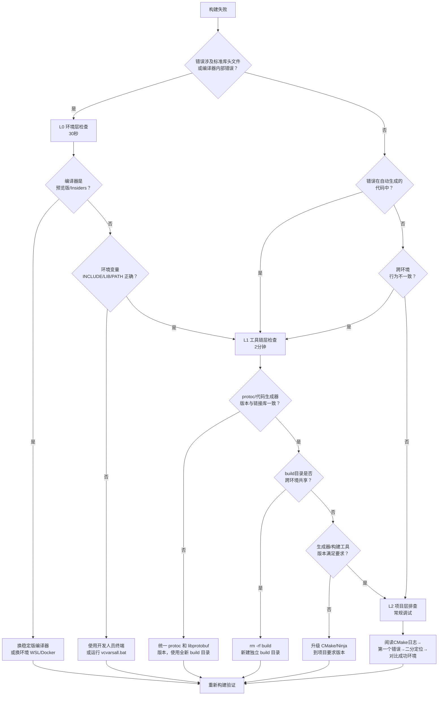

# 构建失败分层排查法

## 触发场景

- C/C++/Rust/CUDA/Fortran 等编译型语言项目构建失败
- 错误信息涉及**标准库头文件**（如 `<vector>`、`<stdint.h>`、`<string>`）
- 错误信息涉及**编译器内部错误**（MSVC C10xx/C1xxx、GCC internal compiler error）
- 错误信息涉及**链接器找不到系统库**（`kernel32.lib`、`libc.so`）
- **跨平台/跨环境行为不一致**（Windows成功WSL失败，或反过来）
- 反复 `make clean` / `rm -rf build` 后错误完全相同
- 错误出现在**自动生成的代码**中（`.pb.h`、`moc_*.cpp`、`ui_*.h`）
- CI 构建失败但本地构建成功，或反过来

## 问题本质

编译型语言（C/C++/Rust/CUDA 等）项目构建失败时，开发者最常犯的错误是**从源码/构建脚本层开始排查**——逐行检查 CMakeLists.txt、阅读报错的源文件、尝试修改代码、反复 `make clean` 后重试。这种"自下而上"的排查方式在遇到以下情况时会浪费大量时间：

1. **工具链 Bug**：编译器预览版/Insiders 版的内部错误（如 MSVC C1041 PDB 锁定），与项目代码完全无关
2. **环境变量缺失**：MSVC `INCLUDE`/`LIB`/`PATH` 未初始化，导致找不到 `<vector>`、`kernel32.lib` 等
3. **代码生成器版本不匹配**：protoc/bison/flex 生成的代码与链接库版本不一致，错误出现在编译阶段而非配置阶段
4. **跨环境污染**：Windows/WSL 共享 build 目录、conda 环境变量穿透到 WSL 导致路径/版本混乱
5. **SDK/工具链版本过旧/过新**：使用了不兼容的编译器版本或预览版工具链

这些问题的共同特征是：**错误信息指向源码或头文件，但根因在环境/工具链层**。从 L2（项目层）开始排查，可能数小时都无法定位问题。

典型案例（caffe-ffi 本次遭遇）：
```
fatal error C1041: 无法打开程序数据库
```
→ 反复 `-j1`、清理缓存、新建 build 目录、杀进程均无效
→ 根因：MSVC 19.50 Insiders 预览版 `/FS` 标志失效
→ 耗时：约40分钟项目级排查 → 换稳定版/WSL后5分钟解决

## 核心原则

**按 L0→L1→L2 三层顺序排查，顺序不可颠倒。** 先排除最快能验证的环境层问题（30秒），再排除工具链版本问题（2分钟），最后才深入项目代码（5分钟+）。

核心设计：
```
                    ┌─────────────────────────┐
                    │    构建失败               │
                    └────────────┬────────────┘
                                 │
         ┌───────────────────────┼───────────────────────┐
         ▼                       ▼                       ▼
┌─────────────────┐    ┌─────────────────┐    ┌─────────────────┐
│  L0 环境层       │    │  L1 工具链层     │    │  L2 项目层       │
│  (30秒检查)      │───▶│  (2分钟检查)     │───▶│  (5分钟+深入)    │
│                 │    │                 │    │                 │
│  ·编译器版本     │    │  ·生成器版本     │    │  ·CMake逻辑     │
│  ·环境变量       │    │  ·代码生成器版本 │    │  ·源码错误      │
│  ·SDK版本       │    │  ·链接库一致性   │    │  ·依赖配置      │
│  ·预览版？       │    │  ·跨环境隔离     │    │  ·链接错误      │
└─────────────────┘    └─────────────────┘    └─────────────────┘
         │                       │                       │
         ▼                       ▼                       ▼
  换工具链/换环境         统一版本/隔离环境        修复代码/配置
  5分钟解决              10分钟解决               正常调试流程
```

**关键原则**：
- **L0 通过后才进入 L1**：环境不对，工具链检查无意义
- **L1 通过后才进入 L2**：工具链版本不一致，源码排查是浪费时间
- **每层有明确的快速验证命令**：不需要深入阅读任何代码即可判定
- **如果在某层发现问题，直接解决/绕过，不向下排查**

## 标准方案

### L0 环境层检查（30秒）

在排查任何代码问题之前，先执行以下命令确认环境正确：

#### 检查1：编译器版本（是否预览版/Insiders）

**MSVC**：
```powershell
cl 2>&1 | Select-String "Version"
# 输出示例：Microsoft (R) C/C++ Optimizing Compiler Version 19.50.35717 for x64
# 如果包含 "Preview"、"Insiders"、"CTP"，高度怀疑是工具链 Bug
```

**GCC/Clang**：
```bash
gcc --version | head -1
clang --version | head -1
# 注意版本号是否为稳定发布版（非 svn/git/trunk/RC）
```

**判定**：如果版本是预览版/Insiders版/非稳定版，**立即切换到稳定版或换环境（如WSL）**，不要继续排查项目代码。

#### 检查2：环境变量是否初始化（MSVC专用）

```powershell
# 在尝试构建的同一个终端中执行
echo "INCLUDE=$env:INCLUDE"
echo "LIB=$env:LIB"
# 如果为空或不包含 MSVC/WindowsSDK 路径 → 环境未初始化
```

**判定**：如果 INCLUDE/LIB 为空，说明未通过 `vcvarsall.bat`/`Launch-VsDevShell.ps1` 初始化。使用正确的开发人员终端或运行项目提供的 `scripts/dev.ps1`。

#### 检查3：SDK/工具路径是否存在

```powershell
# MSVC
where cl.exe
# GCC/Clang
which gcc && which ld
# Rust
rustc --version && cargo --version
# CUDA
nvcc --version
```

**判定**：如果命令不存在或路径指向意外位置（如 WSL 中调用到 Windows conda 的 protoc），环境配置有问题。

### L1 工具链层检查（2分钟）

L0 通过后，检查工具链版本一致性和构建配置：

#### 检查4：代码生成器版本与链接库一致性

对于使用代码生成器的项目（protobuf、flex/bison、Qt moc、Wayland scanner 等）：

```bash
# protoc 版本 vs libprotobuf 版本
protoc --version
# 对比链接时使用的 libprotobuf 版本（检查 CMakeCache.txt 或 pkg-config）
grep "Protobuf_VERSION" build/CMakeCache.txt
pkg-config --modversion protobuf

# 关键：protoc 路径与 libprotobuf 是否来自同一安装？
which protoc
ldd your_binary | grep protobuf  # Linux
dumpbin /dependents your_dll.dll | findstr protobuf  # Windows
```

**判定**：如果 protoc 和 libprotobuf 来自不同安装（如 conda 的 protoc v33 + 系统 libprotobuf v3），生成的 `.pb.h` 会出现模板错误、命名空间错误等编译期问题。

#### 检查5：构建目录是否跨环境共享

```bash
# 检查 build 目录中是否有来自另一个 OS 的产物
ls build/CMakeCache.txt
grep "CMAKE_C_COMPILER" build/CMakeCache.txt  # 检查编译器路径格式
# 如果路径是 /mnt/d/... (WSL) 但在 Windows 下构建，或反之 → 跨环境污染
```

**判定**：跨环境共享 build 目录或 conda 环境，会导致 CMake 缓存中路径格式不一致、目标文件格式不兼容。**使用全新的 build 目录**。

#### 检查6：生成器与构建工具版本

```bash
cmake --version
ninja --version  # 或 make --version / msbuild -version
# 确认 CMake 版本是否满足项目 cmake_minimum_required
```

**判定**：CMake 版本过旧可能不支持新语法；Ninja/Make 版本过旧可能有并发问题。

### L2 项目层检查（5分钟+深入）

**仅当 L0 和 L1 全部通过后**，才进入项目代码层排查：

1. **阅读 CMake 配置日志**：从头到尾读 CMake configure 输出，查找 WARNING 或 NOT FOUND
2. **检查第一个编译错误**：编译器通常输出大量级联错误，只看**第一个** error，忽略后续的
3. **最小化复现**：注释掉一半源文件，二分法定位导致错误的文件
4. **检查最近变更**：`git diff` 或 `git log --oneline -10` 查看最近修改了什么
5. **对比成功环境**：在另一个已知可工作的环境/分支上构建，对比差异

## 决策树



## 快速检查清单

遇到构建失败时，按顺序执行：

- [ ] **L0-1** 编译器版本是稳定版吗？（`cl 2>&1` / `gcc --version`）→ 预览版？换！
- [ ] **L0-2** MSVC 环境变量初始化了吗？（`echo $env:INCLUDE`）→ 空的？用开发人员终端！
- [ ] **L0-3** 编译器/工具在 PATH 中吗？（`where cl.exe` / `which gcc`）
- [ ] **L1-1** protoc/bison 等代码生成器版本与链接库一致吗？→ 不一致？统一版本+新build目录！
- [ ] **L1-2** build 目录是当前环境专用的吗？→ 跨环境共享？rm -rf！
- [ ] **L1-3** CMake/Ninja 版本满足 minimum required 吗？
- [ ] **L2-1** 以上全通过，进入正常代码调试流程

## 代码/命令模板

### L0 快速检查脚本（PowerShell）

```powershell
# build-env-check.ps1 — 构建前环境快速检查
Write-Host "=== L0 环境层检查 ===" -ForegroundColor Cyan

# L0-1: 编译器版本
$cl = cl 2>&1 | Select-String "Version"
if ($cl -match "Preview|Insiders|CTP") {
    Write-Host "⚠ WARNING: 使用预览版编译器！" -ForegroundColor Yellow
    Write-Host "  $cl" -ForegroundColor Yellow
    Write-Host "  建议切换到稳定版或使用 WSL 构建" -ForegroundColor Yellow
} else {
    Write-Host "✔ 编译器版本: $cl" -ForegroundColor Green
}

# L0-2: MSVC 环境变量
if (-not $env:INCLUDE) {
    Write-Host "✘ INCLUDE 环境变量为空！请使用 Developer PowerShell" -ForegroundColor Red
    exit 1
}
Write-Host "✔ INCLUDE 已设置 ($(($env:INCLUDE -split ';').Count) 个路径)" -ForegroundColor Green

# L0-3: 工具路径
$cmake = cmake --version | Select-Object -First 1
Write-Host "✔ $cmake" -ForegroundColor Green

Write-Host "=== L1 工具链层检查 ===" -ForegroundColor Cyan

# L1-1: protoc 版本（如果存在）
$protoc = Get-Command protoc -ErrorAction SilentlyContinue
if ($protoc) {
    $pv = protoc --version
    Write-Host "✔ protoc: $pv ($($protoc.Source))" -ForegroundColor Green
} else {
    Write-Host "· protoc 未安装（非 protobuf 项目可忽略）" -ForegroundColor Gray
}

Write-Host "=== 环境检查通过，可以开始构建 ===" -ForegroundColor Green
```

### L0 快速检查脚本（Bash/WSL）

```bash
#!/bin/bash
# build-env-check.sh — 构建前环境快速检查
set -e

echo "=== L0 环境层检查 ==="

# L0-1: 编译器版本（检查是否为稳定版）
if GCC_VER=$(gcc --version 2>/dev/null | head -1); then
    if echo "$GCC_VER" | grep -qiE "svn|git|trunk|rc|preview"; then
        echo "⚠ WARNING: GCC 可能是非稳定版: $GCC_VER"
    else
        echo "✔ GCC: $GCC_VER"
    fi
fi

# L0-2: 关键工具是否存在
for tool in cmake make ninja; do
    if command -v $tool &>/dev/null; then
        echo "✔ $tool: $($tool --version 2>/dev/null | head -1)"
    else
        echo "· $tool: 未安装"
    fi
done

# L1-1: protoc 版本一致性检查（针对 protobuf 项目）
if command -v protoc &>/dev/null; then
    PROTOC_VER=$(protoc --version | grep -oP '\d+\.\d+')
    PROTOC_PATH=$(which protoc)
    echo "✔ protoc: $PROTOC_VER ($PROTOC_PATH)"
    # 检查是否是 Windows 路径穿透到 WSL
    if echo "$PROTOC_PATH" | grep -qE "^/mnt/[a-z]/"; then
        echo "⚠ WARNING: protoc 指向 Windows 路径！可能导致生成文件不兼容"
    fi
fi

echo "=== 环境检查通过 ==="
```

## 反模式

- ❌ **从源码开始排查**：打开报错的 `.cpp`/`.h` 文件逐行阅读，却没有先确认编译器版本和环境变量——90%的"标准库头文件找不到"是环境问题不是代码问题
- ❌ **反复 `make clean` / `rm -rf build` 但不检查版本**：清理解决不了编译器 Bug 和版本不匹配问题
- ❌ **默认"肯定是我代码写错了"**：预览版工具链的 Bug 比想象中常见；先排除工具链问题再怀疑自己
- ❌ **跨环境共享 build 目录**：Windows 下 cmake configure 后到 WSL 里直接 make，或反过来——CMake 缓存中的路径格式不兼容
- ❌ **conda 环境穿透到 WSL**：WSL 中 `which protoc` 指向 `/mnt/c/Users/.../anaconda3/protoc`，与 WSL 系统 libprotobuf 版本不一致
- ❌ **遇到 C1041/C1060/ICE（internal compiler error）时改代码**：编译器内部错误 99% 是工具链 Bug，不是你的代码问题
- ❌ **在不同终端中初始化环境和构建**：在一个终端运行 vcvarsall.bat，在另一个终端执行 cmake --build——环境变量不继承

## 验证方法

1. **L0 通过标志**：编译器版本显示为稳定版（无 Preview/Insiders/svn/git/trunk/RC），MSVC 环境变量 INCLUDE/LIB 非空，工具路径正确
2. **L1 通过标志**：代码生成器（protoc等）路径与链接库来自同一安装，build 目录为当前环境新建（无跨平台路径），CMake/Ninja 版本满足要求
3. **L2 开始条件**：L0+L1 全部检查通过后，才进入源码/CMake 逻辑调试
4. **修复验证**：在某层发现问题并修复后，重新构建；若仍失败，从 L0 重新开始检查（不要假设之前的检查仍然有效）

## 跨语言/平台迁移验证

| 语言/平台 | L0 环境层关键检查 | L1 工具链层关键检查 |
|----------|------------------|-------------------|
| **C/C++ MSVC** | cl.exe 版本、INCLUDE/LIB/PATH、vcvarsall 初始化 | MSVC 版本与 Windows SDK 匹配、CMake generator |
| **C/C++ GCC/Clang** | gcc/g++/clang 版本、CC/CXX 环境变量 | libstdc++/libc++ 版本与编译器匹配 |
| **Rust** | rustc --version、toolchain channel（stable/beta/nightly） | cargo 版本、target 三元组一致 |
| **CUDA** | nvcc --version、CUDA_PATH、驱动版本 | nvcc 与主机编译器（gcc/msvc）版本兼容矩阵 |
| **Go** | go version、GOROOT/GOPATH | CGO_ENABLED、交叉编译目标平台一致 |
| **Java** | java -version、javac -version、JAVA_HOME | Maven/Gradle 版本与 JDK 兼容 |
| **Python (C扩展)** | python --version、setuptools/wheel 版本 | 编译器与 Python ABI 匹配（MSVC 版本对应表） |
| **Docker 构建** | Docker 版本、基础镜像标签（是否 :latest 浮动） | 基础镜像中的包管理器版本、多阶段构建 COPY 来源一致 |

核心原则通用：**环境→工具链→项目代码，顺序不可颠倒。**

## 与现有模式的关系

| 模式 | 焦点 | 区别 |
|------|------|------|
| fix-priority-chain | Bug修复优先级排序 | 聚焦"先修哪个"，本模式聚焦"先查哪层" |
| preflight-checks-script | 构建前环境预检脚本 | 提供脚本化预检，本模式是分层排查方法论 |
| msvc-vcvarsall-path-staging | MSVC vcvarsall 环境配置 | 聚焦 L0-2 的具体解决方案 |
| platform-aware-dependency-detect | 跨平台依赖检测 | 聚焦 CMake 依赖查找，本模式是通用排查框架 |
| conda-windows-cmake-dual-path | Conda+Windows+CMake 路径双轨问题 | L1-2 跨环境问题的具体案例 |
| wsl2-docker-selection-decision | WSL2 Docker 方案选择 | 环境选择决策，本模式包含换环境作为 L0 修复手段 |
| **本模式** | **构建失败的分层排查顺序** | **通用方法论：L0→L1→L2 三层递进，30秒→2分钟→5分钟+** |

## 实际案例

### 案例1：caffe-ffi MSVC C1041（2026-08-01）

- **错误**：`fatal error C1041: 无法打开程序数据库`（PDB 锁定）
- **错误排查路径（错误）**：L2→尝试 `-j1`→清理缓存→新建 build→杀进程→失败（40分钟）
- **正确排查路径**：L0→发现 MSVC 19.50 Insiders 预览版→换 WSL 环境→5分钟确认 CMake 配置正确
- **教训**：编译器内部错误（C10xx）先检查版本，不要改代码

### 案例2：caffe-ffi WSL protobuf 版本不兼容（2026-08-01）

- **错误**：`caffe.pb.h:16299:20: error: 'is_proto_enum' is not a class template`
- **错误排查路径（错误）**：L2→阅读 caffe.pb.h 16299行→检查代码生成逻辑→困惑
- **正确排查路径**：L1→发现 `which protoc` 指向 Windows conda 的 protoc v33.5.0→WSL libprotobuf 版本不同→统一版本
- **教训**：自动生成代码中的编译错误，先查代码生成器版本一致性
