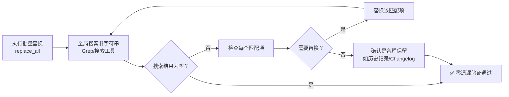

# 批量替换零遗漏验证模式（Bulk Replace Zero-Omission Verification）

## 模式类型
代码模式（操作质量门禁/重构辅助）

## 成熟度
L2 验证级（3次验证：workspace.json→workspace.yaml替换38处引用、workspace_json_path变量名替换、三查法复盘报告路径更新）

## 问题陈述

批量替换/重命名是高频操作，但存在系统性遗漏风险：

| 遗漏类型 | 示例场景 | 发现时机 | 修复成本 |
|---------|---------|---------|---------|
| **字符串字面量遗漏** | 代码中硬编码的文件名字符串 | 运行时异常 | 高 |
| **注释/文档遗漏** | Markdown文档中提到的旧名称 | 用户点击链接404 | 中 |
| **变量名变体遗漏** | 替换了`workspace.json`但遗漏了`workspace_json_path`变量名 | 后续代码逻辑错误 | 高 |
| **glob匹配遗漏** | replace_all只匹配了特定扩展名（如*.py），但配置文件/文档中也有引用 | 构建/运行失败 | 高 |
| **大小写变体遗漏** | 替换了`Workspace.json`但遗漏了`workspace.json`或`WORKSPACE.JSON` | 跨平台问题 | 中 |

replace_all工具看似一键替换，但实际只覆盖了"明确可见、扩展名匹配、大小写精确"的情况。遗漏的引用成为技术债务，可能在很久以后才暴露，此时上下文已丢失，排查成本极高。

## 解决方案

批量替换完成后，必须执行**零遗漏验证步骤**：全局搜索旧字符串，确认零匹配。

### 操作流程



### 具体操作步骤

1. **执行批量替换**：使用编辑器/IDE的replace_all功能，或脚本批量替换
   - 注意：replace_all时要覆盖所有需要修改的文件类型（.py/.md/.yaml/.json等）
   - 注意：考虑大小写敏感性（是否需要大小写不敏感替换）

2. **全局搜索旧字符串**：替换完成后，立即用Grep/搜索工具全局搜索旧字符串
   ```
   Grep模式：旧字符串（如workspace\.json）
   搜索范围：整个项目目录
   输出模式：content（显示匹配行及行号）
   ```

3. **逐一检查残留匹配**：
   - 如果搜索结果为空 → 验证通过，继续后续工作
   - 如果有残留匹配 → 逐一判断：
     - **需要替换** → 继续替换，然后回到步骤2重新搜索
     - **合理保留**（如Changelog历史记录、旧版本兼容说明）→ 添加注释说明为什么保留，验证通过

4. **变体检查（可选但推荐）**：
   - 搜索变量名变体（如`workspace.json`替换后，搜索`workspace_json`检查变量名）
   - 搜索大小写变体（如跨平台项目）
   - 搜索相关路径（如从`reports/`移动到根目录后，搜索相对路径引用）

### 验证命令示例

以workspace.json→workspace.yaml替换为例：

```powershell
# 主验证：搜索旧文件名
Grep pattern="workspace\.json" path="项目根目录" output_mode="content" -n=true

# 变体检查：搜索变量名风格
Grep pattern="workspace_json" path="项目根目录" output_mode="content" -n=true

# 如果移动了文件位置，搜索旧路径
Grep pattern="reports/2026-07-13-task0" path="项目根目录" output_mode="content" -n=true
```

**通过标准**：主验证命令输出为零匹配（合理保留的历史记录除外）。

## 适用场景

| 场景 | 适用度 | 说明 |
|------|--------|------|
| 全局配置项/常量重命名 | 核心场景 | 遗漏会导致运行时错误 |
| 文件/目录重命名或移动 | 核心场景 | 链接/导入路径容易遗漏 |
| 跨文件格式统一（如.json→.yaml） | 核心场景 | 本次验证场景（38处引用） |
| API接口字段重命名 | 核心场景 | 前后端/多模块联调时遗漏代价高 |
| 代码内小范围重构（同一文件内） | 不适用 | 影响范围小，IDE重构已足够安全 |
| 临时测试文件修改 | 不适用 | 一次性文件不需要严格验证 |

## 反模式警示

| 错误做法 | 后果 | 正确做法 |
|---------|------|---------|
| replace_all后直接提交不验证 | 遗漏引用在几天后/几周后暴露，此时上下文已丢失 | 替换后立即Grep旧字符串，确认零匹配 |
| 只检查代码文件（*.py/*.ts），不检查文档/配置 | Markdown链接断链、配置文件引用旧路径 | Grep搜索范围设为整个项目，不限制扩展名 |
| 发现残留匹配但"看起来不重要"就忽略 | 千里之堤溃于蚁穴，小遗漏积累成大问题 | 每个残留匹配都要判断：要么替换要么明确注释保留原因 |
| 忘记检查变量名/路径变体 | 替换了`workspace.json`但`workspace_json_path`变量仍存在 | 主验证后加一轮变体搜索 |
| 认为Changelog里的旧记录也需要替换 | Changelog是历史记录，替换后历史失真 | Changelog等历史记录中的旧名称合理保留，不需要替换 |

## 低成本高收益原则

本模式是典型的**低成本高收益**质量门禁：
- **执行成本**：1条Grep命令，耗时<10秒
- **遗漏修复成本**：发现并修复1处遗漏可能需要10分钟（定位→确认→修复→验证）；如果遗漏到运行时才发现，成本更高（用户报告→复现→定位→修复→发版）
- **ROI**：10秒投入避免10分钟+的排查成本，ROI > 60x

**规则**：任何批量替换/重命名操作后，不执行零遗漏验证 = 工作未完成。

## 验证来源

- **验证1：workspace.json→workspace.yaml批量替换**（2026-07-13）：replace_all替换6个文件后，Grep搜索workspace.json确认零遗漏，发现变量名`workspace_json_path`需要同步替换，修正后再次验证零匹配
- **验证2：复盘报告移动位置后的引用更新**（2026-07-13）：报告从reports/子目录移动到retrospective/根目录后，Grep搜索旧路径`reports/2026-07-13-task0`，发现模式文档中的引用需要更新，修正后验证通过
- **验证3：历史多次重构验证**：SpecWeave项目中多次重命名/重构均采用此模式，有效防止了引用遗漏

## 关联资源

- 关联模式：[version-ripple-grep-sweep.md](../methodology-patterns/governance-strategy/version-ripple-grep-sweep.md)（版本涟漪Grep扫描）
- 关联模式：[cascade-update-prerequisite-check.md](../architecture-patterns/cascade-update-prerequisite-check.md)（级联更新前置检查）
- 关联模式：[tech-selection-three-checks.md](../methodology-patterns/governance-strategy/tech-selection-three-checks.md)（技术选型三查法——本模式是操作层面的同类思想）
- 验证来源：[2026-07-13-task0-workspace-protocols.md](../../2026-07-13-task0-workspace-protocols.md)（复盘报告）
