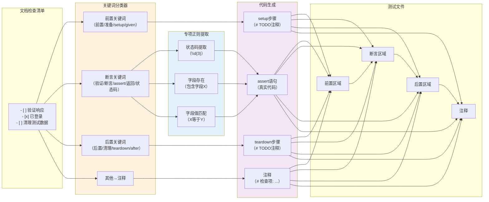

# 检查清单→断言转换：将人类验收标准自动转换为机器测试步骤

## 模式概述
文档中的复选框检查清单（`- [ ] 验证状态码200`）是人类可读的验收标准，通过关键词分类和正则提取，可以将其自动分类为前置条件/断言/后置清理/注释四类，并转换为对应的测试代码行（setup/assert/teardown/comment）。这是连接"文档作为Single Source of Truth"和"自动化测试"的关键桥梁。

## 问题现象
文档驱动测试生成时常见问题：
- 验收标准只写在文档里，测试代码需要人工手动编写，容易遗漏
- 文档更新后测试忘记同步，导致"文档漂移"——文档说应该返回200但测试还在断言旧状态码
- 纯自动生成的测试是空骨架（`assert response is not None`），没有业务语义
- 前置准备步骤和断言步骤混在一起，生成的测试代码结构混乱
- 人工编写的测试断言与文档验收标准不一致，Code Review时难以发现
- 中文和英文验收标准混排，关键词匹配困难

## 解决方案

**核心思路**：通过多层关键词分类+专项正则提取，将自然语言检查项智能转换为结构化测试步骤。



**关键机制**：

1. **四级关键词分类（中文优先）**：
   ```python
   _PRE_KEYWORDS = ("前置", "准备", "before", "setup", "given", "前提", "登录", "认证")
   _ASSERT_KEYWORDS = ("验证", "确认", "断言", "assert", "expect", "返回", "状态码", "包含", "字段")
   _POST_KEYWORDS = ("后置", "清理", "teardown", "after", "cleanup")
   # 其他→注释
   ```
   - 按pre→post→assert顺序匹配，避免assert关键词范围过宽误分类
   - 中文关键词在前，支持中英文混合场景

2. **结构化顺序输出**：
   所有检查项分类后，按 **pre → assert → post → note** 顺序重新排列，保证测试代码结构清晰。

3. **专项正则生成真实断言代码**：
   ```python
   _STATUS_CODE_RE = re.compile(r"(?:状态码|status\s*code)[^\d]*?(\d{3})")
   _FIELD_EXISTS_RE = re.compile(r"(?:包含|存在|has|contain)[^，。；]*?(?:字段|field)[^，。；]*?([a-zA-Z_]\w*)")
   _FIELD_VALUE_RE = re.compile(r"([a-zA-Z_]\w*)\s*(?:字段)?\s*(?:等于|为|是|==?)\s*([^`'\"，。；]+)")
   ```
   - 识别到"状态码200"→直接生成 `assert response.status_code == 200`
   - 识别到"包含字段id"→生成 `assert "id" in data`
   - 识别到"status为success"→生成 `assert data["status"] == "success"`

4. **Python字面量转换**：
   将自然语言值（true/false/null/数字/字符串）自动转换为Python字面量（True/False/None/int/float/str）。

5. **TODO兜底机制**：
   无法自动提取为具体断言的检查项生成`# TODO: 实现断言逻辑: {text}`注释，不丢失验收标准。

6. **已勾选状态保留**：
   CheckItem的`checked`属性（`- [x]`）被保留在ChecklistStep中，可用于统计验收进度。

## 适用场景

- Markdown/MDI/API文档→测试代码自动生成
- 验收标准（Acceptance Criteria）在文档中维护的项目
- 需要"文档即测试"（Docs-as-Tests）理念的工具链
- 测试骨架生成+人工补充混合模式
- 支持中英文双语验收标准

## 实际案例

**MDI项目checklist_converter.py**：

为3个验证案例生成测试：
- **user-api.md**：验收检查清单"验证返回状态码200"→生成 `assert response.status_code == 200`
- **todo-api.md**："响应包含id字段"→生成 `assert "id" in data`
- **file-cli.md**：CLI工具的检查清单转换为subprocess测试注释

**效果**：
- 测试文件自动包含从文档提取的具体断言，不再是空骨架
- 文档中修改验收标准后重新生成测试，断言自动同步
- 已勾选（`[x]`）和未勾选（`[ ]`）状态保留，可用于验收进度追踪
- 前置/后置步骤清晰分区，测试代码可读性提升

## 反模式

1. **所有检查项都当断言**：不做分类直接把所有checkbox变成assert，导致"前置登录"被写成 `assert "登录" in response` 这类无意义断言
2. **试图100%自动生成**：自然语言理解无法达到100%准确率，必须保留TODO注释兜底机制，让人工补充
3. **关键词顺序不重要**：如果先匹配assert再匹配pre，"前置条件应验证状态码"会被错误分类为assert
4. **只支持英文关键词**：中文项目中只用英文关键词会漏分大量检查项
5. **不保留原始顺序信息**：分类后完全打乱顺序，丢失检查项之间的逻辑依赖关系（应该分类但保持同类型内的原始顺序）
6. **不做值类型转换**："status为true"直接生成 `assert data["status"] == "true"`（字符串）而非 `== True`（布尔值）

## 与其他模式的关系

- 与**示例驱动测试生成**配合：示例代码块提供请求/响应数据，检查清单提供断言逻辑，两者结合生成完整测试
- 被**三层+Profile解析生成架构**使用：作为Generator层测试生成器的组件
- 依赖**Directive参数状态机解析**：检查清单从Markdown中解析出来后才进行转换

## 边界与选型

- 验收标准是完全自由格式散文（非checkbox列表）时，此模式无法发挥作用，需要NLP/LLM辅助
- 高安全场景（金融/医疗）不能依赖自动生成的断言，必须人工审核
- 检查清单本身质量差（模糊不清、相互矛盾）时，转换结果质量也会差——Garbage In Garbage Out
- 如果测试框架不是pytest/Jest这种xUnit风格，需要调整代码生成模板，但分类机制可复用
