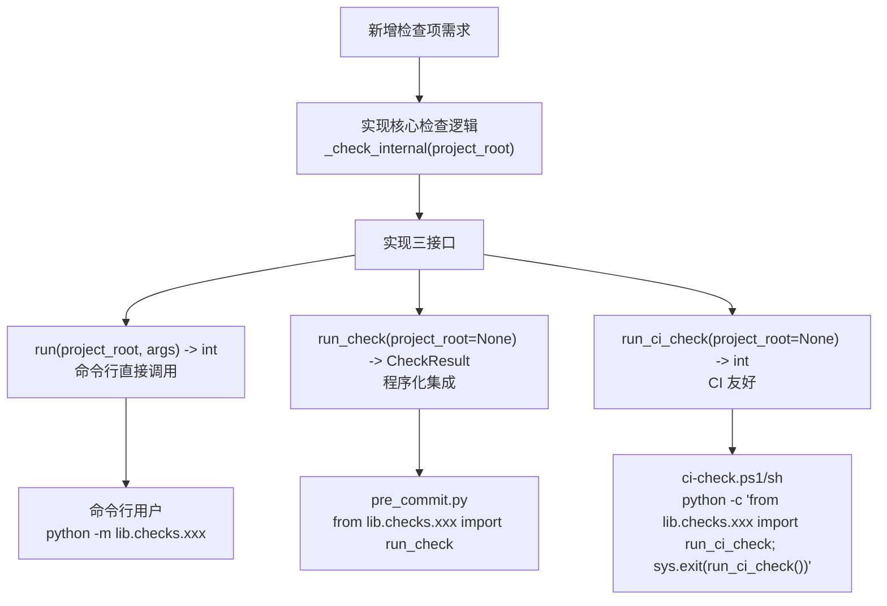

# CI 集成三接口模式

## 模式概述

新增检查项需要同时集成到"命令行直接调用"、"pre-commit 钩子"、"CI 质量门禁"三个场景时，在 `lib/checks/` 下实现统一的三接口模块：`run(project_root, args) -> int`、`run_check(project_root=None) -> CheckResult`、`run_ci_check(project_root=None) -> int`。三个接口共享核心检查逻辑，但针对不同调用场景提供适配的输入输出格式。

与"为每个场景写独立脚本"或"单一脚本承担所有场景"相比，三接口模式既避免代码重复，又保证各场景的输入输出适配。

## 核心逻辑

```
CI 集成检查模块 = 三接口共享核心检查逻辑 + 各接口适配调用场景
               = run()       → 命令行直接调用（人类可读输出 + 退出码）
               = run_check() → 程序化集成（结构化 CheckResult）
               = run_ci_check() → CI 友好（仅退出码，无冗余输出）
               ≠ 为每个场景写独立脚本（代码重复，逻辑漂移）
               ≠ 单一脚本承担所有场景（输出格式难以适配）
```

**为什么有效**：

1. **DRY 原则**：核心检查逻辑只写一次，三个接口复用，避免逻辑漂移
2. **场景适配**：每个接口针对调用场景优化输出格式（人类可读/结构化/CI 友好）
3. **统一调用方式**：ci-check.ps1/sh 与 pre_commit.py 可以用相同方式调用不同检查模块
4. **退出码语义一致**：三个接口遵循相同的退出码语义（0=通过，1=警告/不阻塞，2=错误/阻塞）

## 问题现象：检查脚本的多场景适配困境

新增检查项时常见的反模式：

### 反模式 A：为每个场景写独立脚本

```
check-file-placement.py        # 命令行直接调用
check-file-placement-precommit.py  # pre-commit 钩子调用
check-file-placement-ci.py     # CI 质量门禁调用
```

**问题**：三个脚本的核心检查逻辑重复，修复 bug 时需要同步修改三个文件，容易遗漏导致逻辑漂移。

### 反模式 B：单一脚本承担所有场景

```python
# check-file-placement.py 单一脚本
def main():
    if os.environ.get('CI_MODE'):
        # CI 模式输出
        print(json.dumps(result))
    elif os.environ.get('PRECOMMIT_MODE'):
        # pre-commit 模式输出
        print_colored(result)
    else:
        # 命令行模式输出
        print_detailed(result)
```

**问题**：单一脚本承担所有场景，输出格式难以适配，环境变量判定脆弱（用户可能误设环境变量）。

### 反模式 C：脚本与 CI 集成模块紧耦合

```python
# ci-check.ps1 直接调用 check-file-placement.py 并解析输出
$result = python check-file-placement.py --json
$json = $result | ConvertFrom-Json
if ($json.errors.Count -gt 0) { exit 1 }
```

**问题**：CI 脚本与检查脚本的输出格式紧耦合，检查脚本输出格式变更会破坏 CI 集成。

## 模式流程



### 接口 1：`run(project_root, args) -> int` —— 命令行直接调用

**目标用户**：开发者手动运行检查脚本

**输入**：`project_root`（项目根目录）、`args`（命令行参数，如 `--json`、`--verbose`）

**输出**：人类可读的彩色终端输出（或 `--json` 时的 JSON 输出）

**退出码**：0=通过，1=警告，2=错误

```python
def run(project_root: Path, args: argparse.Namespace) -> int:
    """命令行直接调用入口。"""
    result = _check_internal(project_root)

    if args.json:
        print(json.dumps(result.to_dict(), ensure_ascii=False, indent=2))
    else:
        _print_human_report(result)

    return result.exit_code
```

### 接口 2：`run_check(project_root=None) -> CheckResult` —— 程序化集成

**目标用户**：pre_commit.py、其他 Python 模块

**输入**：`project_root`（可选，默认自动检测）

**输出**：结构化 `CheckResult` 对象（含 `errors`、`warnings`、`exit_code`、`details`）

**退出码**：通过 `CheckResult.exit_code` 属性获取，不直接返回

```python
@dataclass
class CheckResult:
    """检查结果结构化对象。"""
    errors: list[str]
    warnings: list[str]
    exit_code: int  # 0=通过, 1=警告, 2=错误
    details: dict

def run_check(project_root: Path | None = None) -> CheckResult:
    """程序化集成入口，返回结构化结果。"""
    if project_root is None:
        project_root = _detect_project_root()
    return _check_internal(project_root)
```

### 接口 3：`run_ci_check(project_root=None) -> int` —— CI 友好

**目标用户**：ci-check.ps1/sh、GitHub Actions、其他 CI 系统

**输入**：`project_root`（可选，默认自动检测）

**输出**：最小化输出（仅错误信息），避免 CI 日志噪声

**退出码**：0=通过，1=警告，2=错误（CI 据此决定是否阻塞）

```python
def run_ci_check(project_root: Path | None = None) -> int:
    """CI 友好入口，最小化输出。"""
    result = run_check(project_root)
    # 仅输出错误，不输出警告（CI 日志保持简洁）
    for error in result.errors:
        print(f"[ERROR] {error}", file=sys.stderr)
    return result.exit_code
```

## 适用边界

### 适用场景

- ✅ 新增检查项需要同时集成到"命令行+pre-commit+CI"三个场景
- ✅ 检查逻辑较复杂（≥50 行），值得抽象为独立模块
- ✅ 项目已有 `lib/checks/` 目录约定（如 SpecWeave 的 `.agents/scripts/lib/checks/`）
- ✅ 多个检查项需要统一的调用方式（ci-check.ps1/sh 用相同方式调用不同模块）

### 反模式（何时不适用）

- ❌ **简单一次性检查**：只运行一次的检查，不需要集成到 CI/pre-commit，直接写脚本即可
- ❌ **仅命令行场景**：只有开发者手动运行，不需要 pre-commit/CI 集成，单接口脚本即可
- ❌ **检查逻辑极简**（<20 行）：三接口抽象开销超过收益，直接写在 ci-check.ps1 中
- ❌ **项目无 lib/checks/ 约定**：没有统一的检查模块目录，三接口模式失去统一调用优势

## 反模式（不要这么做）

### 反模式 1：三接口逻辑独立实现

```python
# ❌ 错误：三个接口各自实现检查逻辑
def run(project_root, args):
    # 重新实现检查逻辑
    errors = []
    for file in MANAGED_FILES:
        if (project_root / file).exists():
            errors.append(f"{file} 错误放置在根目录")
    return 2 if errors else 0

def run_check(project_root=None):
    # 又重新实现一遍
    errors = []
    for file in MANAGED_FILES:
        if (project_root / file).exists():
            errors.append(f"{file} 错误放置在根目录")
    return CheckResult(errors=errors, ...)

def run_ci_check(project_root=None):
    # 第三次重新实现
    ...
```

**为什么错误**：三接口逻辑独立实现会导致逻辑漂移——修复 bug 时只改一个接口，其他接口保持旧逻辑。

**正确做法**：三接口共享核心检查逻辑 `_check_internal()`，各接口只负责输入输出适配。

### 反模式 2：run_ci_check 输出冗余信息

```python
# ❌ 错误：CI 接口输出详细报告
def run_ci_check(project_root=None):
    result = run_check(project_root)
    print("=== 检查报告 ===")
    print(f"总检查项：{len(result.details)}")
    for item in result.details:
        print(f"  {item}")
    return result.exit_code
```

**为什么错误**：CI 日志应保持简洁，冗余信息会淹没真正的错误。CI 系统通常只关心退出码和错误信息。

**正确做法**：CI 接口仅输出错误信息，不输出警告和详细信息。

### 反模式 3：CheckResult 结构不统一

```python
# ❌ 错误：每个检查模块的 CheckResult 字段不同
# file_placement.py
class CheckResult:
    errors: list
    file_count: int

# temp_lifecycle.py
class CheckResult:
    errors: list
    expired_items: list
    warning_count: int
```

**为什么错误**：CheckResult 结构不统一，ci-check.ps1/sh 无法用相同方式处理不同模块的结果。

**正确做法**：CheckResult 统一字段（errors、warnings、exit_code、details），不同模块的特有信息放入 details 字典。

### 反模式 4：退出码语义不一致

```python
# ❌ 错误：不同接口退出码语义不同
def run(): return 0 if pass else 1  # 0/1
def run_ci_check(): return 0 if pass else 2  # 0/2
```

**为什么错误**：退出码语义不一致，CI 系统和 pre-commit 钩子需要为每个模块写特殊处理。

**正确做法**：三个接口退出码语义一致（0=通过，1=警告/不阻塞，2=错误/阻塞）。

## 检验标准

做完之后怎么知道做对了？

1. **三接口存在**：`run`、`run_check`、`run_ci_check` 三个函数都已实现
2. **核心逻辑共享**：三接口都调用 `_check_internal()`，无重复实现
3. **CheckResult 统一**：与其他检查模块的 CheckResult 字段一致
4. **退出码一致**：三接口退出码语义一致（0/1/2）
5. **调用方式统一**：ci-check.ps1/sh 用相同方式调用不同模块（`python -c "from lib.checks.xxx import run_ci_check; sys.exit(run_ci_check())"`）
6. **输出适配**：`run` 输出人类可读，`run_check` 返回结构化对象，`run_ci_check` 仅输出错误

## 跨场景迁移示例

| 应用场景 | 检查对象 | run() 调用者 | run_check() 调用者 | run_ci_check() 调用者 |
|---------|---------|-------------|-------------------|---------------------|
| **文件放置检查** | 受管文件位置 | 开发者手动运行 | pre_commit.py | ci-check.ps1/sh |
| **临时文件生命周期** | .temp/ 下文件保留期 | 开发者手动运行 | pre_commit.py | ci-check.ps1/sh |
| **代码风格检查** | 代码格式规范 | 开发者手动运行 | pre_commit.py | ci-check.ps1/sh |
| **依赖安全扫描** | 依赖漏洞 | 开发者手动运行 | 其他 Python 脚本 | CI 系统 |
| **文档链接检查** | Markdown 链接有效性 | 开发者手动运行 | 其他 Python 脚本 | CI 系统 |

## 实际案例

### 案例 1：lib/checks/file_placement.py（本模式来源之一）

**检查对象**：7 个受管关键文件（sitecustomize.py、setup-utf8-env.ps1 等）是否被错误放置到根目录

**三接口实现**：

```python
@dataclass
class CheckResult:
    errors: list[str]
    warnings: list[str]
    exit_code: int
    details: dict

def _check_internal(project_root: Path) -> CheckResult:
    """核心检查逻辑（共享）。"""
    errors, warnings = [], []
    for file in MANAGED_FILES:
        if (project_root / file).exists():
            errors.append(f"{file} 错误放置在根目录，正确位置：.agents/scripts/")
    return CheckResult(
        errors=errors,
        warnings=warnings,
        exit_code=2 if errors else (1 if warnings else 0),
        details={"managed_files": MANAGED_FILES}
    )

def run(project_root: Path, args: argparse.Namespace) -> int:
    """命令行直接调用。"""
    result = _check_internal(project_root)
    if args.json:
        print(json.dumps(asdict(result), ensure_ascii=False, indent=2))
    else:
        _print_human_report(result)
    return result.exit_code

def run_check(project_root: Path | None = None) -> CheckResult:
    """pre_commit.py 程序化集成。"""
    if project_root is None:
        project_root = _detect_project_root()
    return _check_internal(project_root)

def run_ci_check(project_root: Path | None = None) -> int:
    """ci-check.ps1/sh CI 友好。"""
    result = run_check(project_root)
    for error in result.errors:
        print(f"[ERROR] {error}", file=sys.stderr)
    return result.exit_code
```

### 案例 2：lib/checks/temp_lifecycle.py（本模式来源之二）

**检查对象**：.temp/ 下文件的命名合规性与保留期

**三接口实现**：与案例 1 结构一致，差异在于：
- 核心检查逻辑不同（命名合规校验、保留期检测）
- 多了 `run_precommit_check()` 接口（pre-commit 专用，超 30 天阻塞提交）
- CheckResult.details 包含 `expired_items`、`non_compliant_items` 等特有字段

**调用方式统一**：

```powershell
# ci-check.ps1 用相同方式调用两个模块
python -c "from lib.checks.file_placement import run_ci_check; import sys; sys.exit(run_ci_check())"
python -c "from lib.checks.temp_lifecycle import run_ci_check; import sys; sys.exit(run_ci_check())"
```

```python
# pre_commit.py 用相同方式调用两个模块
from lib.checks.file_placement import run_check as check_file_placement
from lib.checks.temp_lifecycle import run_check as check_temp_lifecycle

result1 = check_file_placement(project_root)
result2 = check_temp_lifecycle(project_root)
```

**价值证明**：两个独立检查模块（file_placement + temp_lifecycle）都实现了三接口模式，ci-check.ps1/sh 与 pre_commit.py 可以用相同方式调用，CI 集成成本降至最低。

## 与其他模式的关系

| 关联模式 | 关系类型 | 关系说明 |
|---------|---------|---------|
| [three-tier-check-tool.md](three-tier-check-tool.md) | 对比 | 三段式检查工具架构聚焦脚本内部分层（输入层→检查引擎→输出层），本模式聚焦对外接口分层（命令行/程序化/CI） |
| [script-json-output-contract.md](script-json-output-contract.md) | 配套 | JSON 输出契约规范 `--json` 输出字段，本模式的 `run()` 接口应遵循此契约 |
| [cli-json-pipeline.md](cli-json-pipeline.md) | 配套 | CLI-JSON 管道模式规范全局 --json 标志，本模式的 `run()` 接口可应用此模式 |
| [cli-as-api-design.md](cli-as-api-design.md) | 上位 | CLI 即 API 设计是更通用的"CLI 同时服务人类和机器"模式，本模式是其在检查模块场景的具体应用 |
| [chain-pre-commit-hooks.md](chain-pre-commit-hooks.md) | 上下游 | 链式 pre-commit 钩子模式规范多个钩子的串联，本模式规范单个检查模块的多接口设计 |

## Changelog

<!-- changelog -->
- 2026-07-18 | create | 初始版本，从 config-file-placement-governance spec 复盘 S3.1 模式 3 沉淀，L2-validated（2 案例支撑：file_placement + temp_lifecycle），来源：retrospective-config-file-placement-governance-20260718
