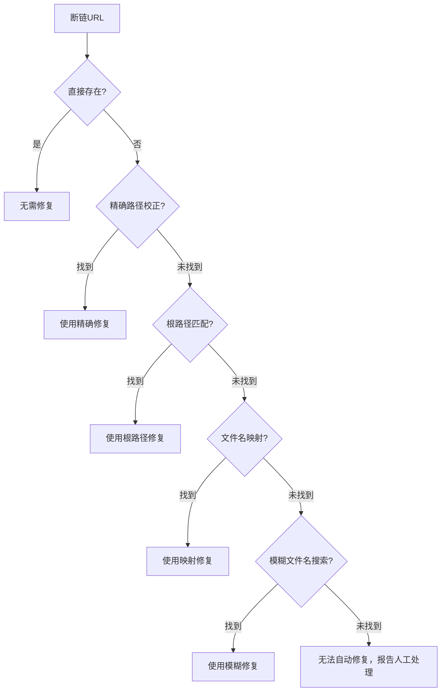

# 修复优先级链设计（fix-priority-chain）

## 模式类型
代码模式

## 成熟度
L2 已验证（check-links.py --fix 功能实现验证）

## 适用场景
任何提供多种自动修复策略的工具（链接修复、代码重构、批量替换等）

## 问题背景
自动修复工具通常有多种修复策略，策略的执行顺序直接影响修复的准确性。若模糊策略优先执行，可能导致误修改。

## 设计原则
**精确修复优先，模糊修复兜底**——精确度从高到低排列，高优先级策略误报率接近零，低优先级策略放在兜底位置。

## 优先级链

## 策略排序依据

| 优先级 | 策略类型 | 精确度 | 误报率 | 说明 |
|--------|---------|--------|--------|------|
| 1 | 直接存在检查 | 100% | 0% | 断链是误报（实际已存在） |
| 2 | 精确路径校正 | 极高 | ~0% | 调整 `../` 层数，验证文件存在 |
| 3 | 根路径匹配 | 高 | <1% | 从项目根重新定位路径 |
| 4 | 文件名映射 | 中 | ~2% | 已知文件重命名映射 |
| 5 | 模糊文件名搜索 | 低 | ~5-10% | basename 模糊匹配，需人工确认 |
| 6 | 人工处理 | - | - | 所有策略失败，明确报告 |

## 关键要点

1. **零误报原则**：高优先级策略必须零误报，只做确定性修复
2. **失败显式化**：所有策略都失败时，明确报告"无法自动修复"而非强行猜测
3. **dry-run 验证**：必须配合 dry-run 模式，让用户确认后再执行实际修改
4. **可扩展性**：新策略插入到链中合适位置（按精确度排序）

## 成功案例

| 工具 | 策略数 | 零误报验证 |
|------|--------|-----------|
| check-links.py --fix | 5种策略 | ✅ 全量1689链接正确状态下dry-run输出无误修改 |

> **关联模块**：
> - `relative-depth-adjustment.md` — 相对路径深度校正（优先级2的核心策略）
> - `dry-run-first.md` — dry-run 安全修改模式
