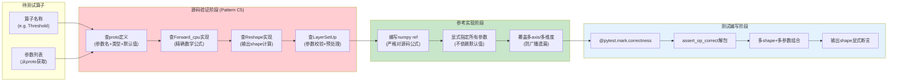

# 框架参数语义验证：算子测试前必查源码确认参数行为

## 模式概述

为深度学习框架（Caffe/PyTorch/TensorFlow/ONNX等）编写算子正确性测试时，**必须先查阅框架源码/proto定义确认每个参数的精确语义和隐式行为**，禁止凭直觉或其他框架经验假设参数语义。标量参数在多维度算子中可能被隐式广播，参数默认值可能因框架版本不同而不同，同名算子在不同框架中语义可能不同。

## 问题现象

为DL框架算子编写测试时的常见错误：

1. **参数广播误解**：Caffe Crop层`offset`是标量时被隐式广播到所有空间维度（yx），传入单值`offset=2`期望只偏移y轴，实际y和x都偏移2导致越界
2. **算子语义误解**：Caffe Threshold层按名称直觉假设是"x>threshold时通过"（ReLU式pass-through），实际源码实现是二值化输出（1/0）
3. **axis语义差异**：不同框架axis默认值不同（有的默认-1最后一维，有的flatten后续维度），不查阅文档测试结果完全错误
4. **默认值陷阱**：ELU的alpha默认1.0、Swish的beta默认1.0看起来合理，但Exp的base默认-1代表自然指数e而非10，容易踩坑
5. **版本差异**：同一框架不同版本/fork的算子可能参数不同（caffex中Permute层不存在，因为BVLC fork未合入SSD的Permute层）

这些错误的共同特征：**参考实现(numpy)逻辑本身是正确的，但对框架算子行为的假设是错误的**，导致测试要么误报失败、要么（更危险）错误实现恰好通过测试。

## 解决方案

**核心思路**：测试编写的第一步不是写numpy参考，而是**查阅源码验证每个参数的语义**，建立"框架行为→参考实现"的正确映射，再开始写测试代码。

**关键检查清单**（对应Checklist阶段2的8个检查项）：

1. **查proto确认算子存在**：搜索proto文件确认参数定义存在，层已注册
2. **查Forward_cpu确认数学公式**：直接阅读CPU前向传播代码，确认精确计算逻辑
3. **查Reshape确认输出shape**：确认axis/参数如何影响输出维度
4. **识别广播风险参数**：对于axis/offset/stride/pad等参数，确认标量是否会广播到多维度
5. **确认axis语义**：axis是0-based还是1-based？默认值是什么？负数axis如何处理？
6. **确认默认值**：不要假设默认值，查proto的`[default = x]`确认
7. **显式指定每个维度参数**：多维度参数（如offset=[y,x]）显式传列表，不依赖标量广播
8. **不可用算子标记skip**：层不存在时用`@pytest.mark.skip(reason=...)`保留参考实现

## 适用场景

- Caffe/PyTorch/TensorFlow/ONNX/MXNet等任意DL框架的算子正确性测试
- 框架升级/迁移后验证算子行为一致性
- 新算子接入测试基础设施时
- 单元测试中对框架API行为有疑问时

## 实际案例

### 案例1：Caffe Crop层offset广播（来源：前一轮复盘）

- **背景**：Crop层`offset`参数，测试时传入`offset=2`期望裁剪y方向2个像素
- **源码行为**：标量offset被广播到所有空间维度，实际yx都偏移2
- **后果**：坐标越界或裁剪区域错误，测试失败
- **修正**：显式传入`offset=[0, 2]`或`offset=[2, 3]`指定每个维度
- **验证**：查阅`crop_layer.cpp`的Reshape和Forward实现

### 案例2：Caffe Threshold层二值化语义（来源：本次任务）

- **背景**：按Threshold名称直觉编写numpy参考：`np.where(x > threshold, x, 0)`（pass-through）
- **源码行为**：`top_data[i] = (x > threshold) ? 1 : 0`（纯二值化0/1输出）
- **后果**：测试会使用错误参考实现，正数输入>threshold时Caffe输出1但参考期望原始值，测试失败且debug方向错误
- **修正**：参考实现改为`(x > threshold).astype(np.float32)`
- **验证**：查阅`threshold_layer.cpp`第21行Forward_cpu实现
- **额外收益**：发现后立即在测试中加入`assert set(np.unique(output)).issubset({0.0, 1.0})`显式验证二值化性质

## 反模式

1. **凭直觉假设语义**：看到"Threshold"就认为是截断，看到"Exp"就认为是自然指数，不验证
2. **依赖其他框架经验**：PyTorch的Threshold是pass-through+value填充，但Caffe是二值化，同名不同义
3. **依赖默认值不显式传参**：Exp的base=-1是特殊值代表e，不是默认10；不显式传base=2.0可能用错底数
4. **不检查算子是否存在**：caffex中没有Permute层，写完测试才发现AttributeError
5. **只看文档不看源码**：文档可能过时或描述模糊，Forward_cpu源码是唯一精确的行为规范
6. **标量参数不测多维度**：axis参数只测默认值，不测axis=0/1/2/3各维度
7. **不可用算子直接删除测试**：丢失参考实现，未来支持时需要从零重写

## 与其他模式的关系

- 被**dl-framework-op-correctness-test-checklist**引用为阶段2核心步骤
- 与**example-driven-test-generation**互补：示例驱动从文档提取测试数据，本模式从源码验证语义
- 与**selective-testing-strategy**配合：正向marker选择正确性测试，配合源码验证确保测试可信
- 被C2/C3/C4模式依赖：只有语义正确了，断言解包、marker选择、文件名序列化才有意义

## 边界与选型

- **源码不可访问时**（闭源API/云端服务），退化为查官方文档+多组边界值测试推断行为，但测试置信度降低
- **非常简单的算子**（ReLU: max(x,0)）源码验证成本极低，仍建议快速扫一眼确认无意外实现
- **快速原型验证**可以跳过源码直接写测试，但正式提交前必须补做验证
- 本模式是**正确性测试的必要非充分条件**：验证语义后仍需C2-C4模式保障测试基础设施正确

## 推广：参数语义验证三问

对每个算子参数，回答三个问题后再开始写参考实现：

1. **What**：这个参数控制什么行为？（从proto和Forward中找答案）
2. **How**：标量值如何在多维度中作用？（是否广播？广播到哪些维度？）
3. **Default**：不传这个参数时的默认值是什么？（从proto的default字段找答案，不要猜）
