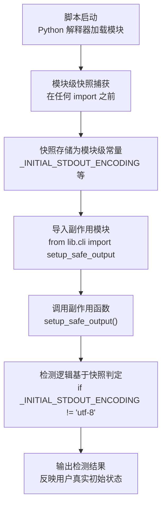

# 模块级快照防御自身副作用污染

## 模式概述

检测脚本本身会修改被检测对象的状态（如调用 `setup_safe_output()` 修改 stdout 编码、import 触发 sys.path 变更），这会导致"检测结果被自身副作用污染"。解决方案是：**在导入任何可能产生副作用的模块之前，在模块顶层捕获状态快照**（如 `_INITIAL_STDOUT_ENCODING`），检测逻辑基于快照而非当前状态进行判定。

与"临时修改-恢复"模式（如 `temporary-syspath-modification`）不同，本模式不恢复原状（因为副作用是必需的，如脚本本身需要 UTF-8 输出），而是用快照作为检测基准。

## 核心逻辑

```
检测自身影响的状态 = 模块级快照（在副作用发生前捕获） + 基于快照判定（不基于当前状态）
                 ≠ 临时修改-恢复（副作用是必需的，不能恢复）
                 ≠ 在函数内捕获（函数执行时副作用已发生，快照失效）
                 ≠ 不做快照直接检测（检测结果被自身副作用污染，得到错误结论）
```

**为什么有效**：

1. **时序正确性**：模块级快照在 `import` 副作用发生前捕获，保证快照是"原始状态"
2. **不可变性**：快照存储为模块级常量（`_INITIAL_*` 命名约定），导入后不可修改
3. **检测基准**：检测逻辑基于快照判定"原始状态是否符合要求"，而非"当前状态"（当前状态已被副作用修改）
4. **副作用保留**：脚本本身仍可享受副作用带来的好处（如 UTF-8 输出），不影响检测准确性

## 问题现象：检测脚本被自身副作用污染

编写检测脚本时的常见陷阱：

```python
# ❌ 反模式：在副作用发生后才检测
import sys
from lib.cli import setup_safe_output  # 这个 import 会触发 sitecustomize.py 副作用

setup_safe_output()  # 这个调用会修改 stdout 编码为 utf-8

# 此时检测 stdout 编码——但已经被 setup_safe_output() 改成 utf-8 了！
# 检测结果永远是"utf-8"，无法反映用户真实环境的初始状态
encoding = sys.stdout.encoding
print(f"stdout 编码：{encoding}")  # 总是输出 utf-8，掩盖了真实问题
```

**根本原因**：检测脚本本身的副作用（setup_safe_output 修改编码、import 触发 sys.path 变更）修改了被检测的状态，导致检测逻辑基于"被污染后的状态"做出判定，得到错误结论。

## 模式流程



### 阶段 1：识别需要快照的状态

常见需要快照的全局状态：

| 状态类型 | 快照变量命名 | 捕获方式 |
|---------|-------------|---------|
| stdout 编码 | `_INITIAL_STDOUT_ENCODING` | `getattr(sys.stdout, 'encoding', None)` |
| stderr 编码 | `_INITIAL_STDERR_ENCODING` | `getattr(sys.stderr, 'encoding', None)` |
| sys.path | `_INITIAL_SYS_PATH` | `sys.path.copy()` |
| sitecustomize 模块 | `_INITIAL_SITECUSTOMIZE_MODULE` | `sys.modules.get('sitecustomize')` |
| 环境变量 | `_INITIAL_ENV_VAR` | `os.environ.get('VAR_NAME')` |
| 工作目录 | `_INITIAL_CWD` | `os.getcwd()` |

### 阶段 2：模块级快照捕获

**关键要求**：快照必须在**任何可能产生副作用的 import 之前**捕获。

```python
#!/usr/bin/env python3
"""检测脚本：验证 sitecustomize.py 自动加载状态。"""

# ============================================================================
# 模块级快照：在任何 import 之前捕获（防止后续 import 副作用污染）
# ============================================================================
import sys as _sys  # 内置模块，无副作用

_INITIAL_STDOUT_ENCODING = getattr(_sys.stdout, 'encoding', None)
_INITIAL_STDERR_ENCODING = getattr(_sys.stderr, 'encoding', None)
_INITIAL_SYS_PATH = _sys.path.copy()  # copy() 而非直接赋值
_INITIAL_SITECUSTOMIZE_MODULE = _sys.modules.get('sitecustomize')

# ============================================================================
# 现在可以安全地导入副作用模块
# ============================================================================
from lib.cli import setup_safe_output, print_pass, print_warn

setup_safe_output()  # 这会修改 stdout 编码为 utf-8，但不影响快照
```

**关键点**：

1. **内置模块（sys、os）可以先 import**：这些模块无副作用，用于捕获快照
2. **第三方/项目模块必须后 import**：这些模块可能有 import 副作用
3. **`sys.path.copy()` 而非 `sys.path`**：列表是可变对象，直接赋值是引用
4. **`sys.modules.get('sitecustomize')` 而非 `'sitecustomize' in sys.modules`**：保存模块对象，便于后续检查属性

### 阶段 3：检测逻辑基于快照判定

```python
def check_stdout_encoding() -> bool:
    """检测用户初始环境的 stdout 编码是否为 utf-8。"""
    # ❌ 错误：基于当前状态（已被 setup_safe_output 修改为 utf-8）
    # return sys.stdout.encoding == 'utf-8'

    # ✅ 正确：基于快照（反映用户真实初始状态）
    return _INITIAL_STDOUT_ENCODING == 'utf-8'

def check_sitecustomize_loaded() -> bool:
    """检测 sitecustomize.py 是否在脚本启动前被自动加载。"""
    # ❌ 错误：基于当前 sys.modules（可能被后续 import 触发）
    # return 'sitecustomize' in sys.modules

    # ✅ 正确：基于快照（脚本启动瞬间的状态）
    return _INITIAL_SITECUSTOMIZE_MODULE is not None
```

## 适用边界

### 适用场景

- ✅ 检测脚本本身需要调用会修改被检测状态的函数（如 `setup_safe_output()`）
- ✅ 检测脚本需要 import 可能触发副作用的模块（如 `sitecustomize.py`）
- ✅ 检测目标是"用户环境的初始状态"，而非"脚本运行后的状态"
- ✅ 副作用是必需的（脚本本身需要 UTF-8 输出），不能避免

### 反模式（何时不适用）

- ❌ **检测脚本无副作用**：不需要快照，直接检测当前状态即可
- ❌ **检测目标是"当前状态"**：如检测"setup_safe_output 后编码是否正确"，应检测当前状态
- ❌ **状态不可变**：如检测文件存在性，无副作用污染风险
- ❌ **性能敏感场景**：模块级快照增加启动开销，极端性能场景需权衡

## 反模式（不要这么做）

### 反模式 1：在函数内捕获快照

```python
# ❌ 错误：函数执行时副作用已发生
def check_encoding():
    import sys
    initial_encoding = sys.stdout.encoding  # 此时已是副作用后的状态
    from lib.cli import setup_safe_output
    setup_safe_output()
    # initial_encoding 已经被前面的 import 污染了
```

**为什么错误**：函数被调用时，模块早已加载完成，import 副作用已发生。必须在模块加载时（即 import 之前）捕获快照。

**正确做法**：在模块顶层（任何 import 之前）捕获快照。

### 反模式 2：快照变量可变

```python
# ❌ 错误：快照变量可被修改
_INITIAL_SYS_PATH = sys.path  # 这是引用，不是快照

def some_func():
    _INITIAL_SYS_PATH.append('new/path')  # 修改了原始 sys.path
```

**为什么错误**：可变对象的赋值是引用，后续修改会影响原始对象。

**正确做法**：使用 `copy()` 创建浅拷贝，或 `tuple()` 创建不可变副本。

### 反模式 3：快照后基于当前状态判定

```python
# ❌ 错误：捕获了快照但不用
_INITIAL_STDOUT_ENCODING = sys.stdout.encoding

def check_encoding():
    return sys.stdout.encoding == 'utf-8'  # 用当前状态，不是快照
```

**为什么错误**：捕获快照却不用，等于没捕获。检测逻辑仍被副作用污染。

**正确做法**：检测逻辑必须显式引用 `_INITIAL_*` 变量。

### 反模式 4：过度快照（快照不需要的状态）

```python
# ❌ 错误：快照所有可能的状态
_INITIAL_EVERYTHING = {
    'sys.path': sys.path.copy(),
    'sys.modules': sys.modules.copy(),
    'os.environ': os.environ.copy(),
    'sys.argv': sys.argv.copy(),
    # ... 几十个状态
}
```

**为什么错误**：过度快照增加启动开销，且大部分状态不会被副作用污染。

**正确做法**：只快照"会被脚本副作用修改"且"需要用于检测"的状态。

## 检验标准

做完之后怎么知道做对了？

1. **时序正确**：快照变量在所有副作用 import 之前定义，可通过 `python -c "import module; print(module._INITIAL_*)"` 验证
2. **不可变性**：快照变量命名以 `_INITIAL_` 开头，且存储为不可变类型或 copy
3. **检测基准**：检测函数显式引用 `_INITIAL_*` 变量，而非当前状态
4. **准确性**：在"无副作用环境"和"有副作用环境"运行检测脚本，结果应该一致（都反映用户初始状态）
5. **副作用保留**：脚本本身的输出仍享受副作用好处（如 UTF-8 输出正常）

## 跨场景迁移示例

| 应用场景 | 被检测状态 | 副作用来源 | 快照变量 |
|---------|-----------|-----------|---------|
| **sitecustomize 自动加载验证** | stdout 编码、sys.path、sitecustomize 模块 | `from lib.cli import *`、`setup_safe_output()` | `_INITIAL_STDOUT_ENCODING`、`_INITIAL_SYS_PATH`、`_INITIAL_SITECUSTOMIZE_MODULE` |
| **环境变量检测脚本** | PYTHONPATH、PYTHONIOENCODING | 脚本自身的 `os.environ.setdefault()` | `_INITIAL_PYTHONPATH` |
| **工作目录检测脚本** | os.getcwd() | 脚本自身的 `os.chdir()` | `_INITIAL_CWD` |
| **日志配置检测脚本** | logging.root.handlers | 脚本自身的 `logging.basicConfig()` | `_INITIAL_ROOT_HANDLERS` |
| **信号处理器检测脚本** | signal handlers | 脚本自身的 `signal.signal()` | `_INITIAL_SIGNAL_HANDLERS` |

## 实际案例

### 案例：verify-sitecustomize-autoload.py 模块级快照（本模式来源）

**检测目标**：验证用户环境的 sitecustomize.py 自动加载状态（是否已加载、sys.path 是否包含目标路径、stdout 编码是否为 utf-8）

**副作用来源**：
- `from lib.cli import setup_safe_output`：lib.cli 模块本身可能在 import 时触发 sitecustomize.py 加载（如果 PYTHONPATH 已配置）
- `setup_safe_output()`：显式修改 stdout/stderr 编码为 utf-8

**快照捕获**：

```python
import sys as _sys

# 模块级快照：在任何副作用 import 之前捕获
_INITIAL_STDOUT_ENCODING = getattr(_sys.stdout, 'encoding', None)
_INITIAL_STDERR_ENCODING = getattr(_sys.stderr, 'encoding', None)
_INITIAL_SYS_PATH = _sys.path.copy()
_INITIAL_SITECUSTOMIZE_MODULE = _sys.modules.get('sitecustomize')

# 现在安全导入副作用模块
from lib.cli import setup_safe_output, print_pass, print_warn, print_error
setup_safe_output()
```

**基于快照的检测逻辑**：

```python
def check_autoload_status() -> int:
    """检测 sitecustomize.py 自动加载状态。"""
    # 检测 1：sys.path 是否包含 .agents/scripts/（基于快照）
    scripts_dir = str(Path(__file__).resolve().parent)
    path_ok = any(scripts_dir in p for p in _INITIAL_SYS_PATH)

    # 检测 2：sitecustomize 是否已加载（基于快照）
    sitecustomize_loaded = _INITIAL_SITECUSTOMIZE_MODULE is not None
    if sitecustomize_loaded:
        # 检测 3：__file__ 是否指向正确文件（基于快照中的模块对象）
        file_ok = getattr(_INITIAL_SITECUSTOMIZE_MODULE, '__file__', '') == expected_path

    # 检测 4：stdout 编码是否为 utf-8（基于快照）
    encoding_ok = _INITIAL_STDOUT_ENCODING == 'utf-8'

    return 0 if all([path_ok, sitecustomize_loaded, file_ok, encoding_ok]) else 1
```

**价值证明**：如果不使用快照，`setup_safe_output()` 会把 stdout 编码改成 utf-8，检测逻辑会错误地报告"编码正常"，掩盖用户环境初始编码问题。

## 与其他模式的关系

| 关联模式 | 关系类型 | 关系说明 |
|---------|---------|---------|
| [temporary-syspath-modification.md](temporary-syspath-modification.md) | 对比 | 临时 sys.path 修改是"修改-恢复"模式（恢复原状），本模式是"快照-检测"模式（不恢复，用快照作为基准） |
| [cross-platform-encoding-enforcement.md](cross-platform-encoding-enforcement.md) | 配套 | 跨平台编码强制设置提供 `setup_safe_output()` 函数，本模式解决"调用此函数后如何检测原始编码"的问题 |
| [defensive-attribute-access.md](defensive-attribute-access.md) | 配套 | 快照捕获时使用 `getattr(stream, 'encoding', None)` 防御性访问，避免 stream 对象属性不存在导致崩溃 |
| [script-json-output-contract.md](script-json-output-contract.md) | 上下游 | 检测脚本通常遵循 JSON 输出契约，本模式解决检测脚本内部的"自污染"问题 |

## 待验证场景

本模式目前仅有 1 个案例支撑（verify-sitecustomize-autoload.py），标记为 L1-draft。建议在以下场景验证以提升至 L2-validated：

1. **环境变量检测脚本**：检测脚本需要 `os.environ.setdefault()` 设置默认值，但同时需要检测用户初始环境变量
2. **日志配置检测脚本**：检测脚本需要 `logging.basicConfig()` 配置自身日志，但同时需要检测用户初始日志配置
3. **信号处理器检测脚本**：检测脚本需要注册自身信号处理器，但同时需要检测用户初始信号处理器配置

## Changelog

<!-- changelog -->
- 2026-07-18 | create | 初始版本，从 config-file-placement-governance spec 复盘 S3.1 模式 2 沉淀，L1-draft（单案例待验证），来源：retrospective-config-file-placement-governance-20260718
