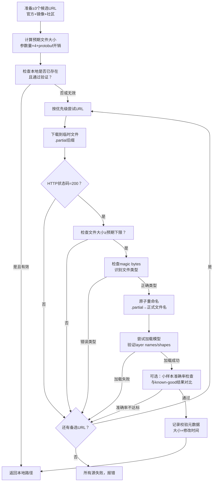

# 预训练模型多源下载与多级验证模式

## 模式概述

下载预训练模型权重（.caffemodel/.pth/.h5/.onnx/.pt/.safetensors等）时，单一URL极不可靠（GitHub raw对>1MB文件可能截断或返回LFS pointer、官方Model Zoo经常404、网络不稳定导致部分下载）。解决方案是：**多源URL fallback + 多级验证链（大小→magic bytes→加载→准确率）**，确保下载到正确可用的权重文件。

与"镜像源精确映射"模式（conda-custom-channels-mirror）不同，本模式聚焦于二进制大文件（>1MB）的下载可靠性，而非包管理器的channel配置。

## 核心逻辑

```
可靠模型获取 = 多源URL(≥3) + 预下载大小预估 + 下载中大小校验 + magic bytes验证 + 加载验证 + 准确率校验
            ≠ 单一下载源不做fallback
            ≠ HTTP 200就认为成功（200可能是截断/HTML错误页/LFS pointer）
            ≠ 文件存在就认为正确（需验证大小和类型）
            ≠ 加载成功就认为正确（错误格式也可能加载但输出垃圾）
```

**为什么有效**：

1. **多源冗余**：≥3个独立URL，一个404/截断/超时自动切换下一个
2. **快速失败**：文件大小检查可以在下载后立即发现截断文件（<1ms），比加载验证快几个数量级
3. **类型防御**：magic bytes检查能识别"HTML错误页伪装成caffemodel"和"LFS pointer文件"
4. **语义验证**：加载+准确率检查确保模型不仅文件格式正确，权重内容也正确
5. **幂等安全**：已存在且通过验证的文件直接跳过，重复运行安全

## 问题现象：下载成功但模型不可用

下载模型时的典型问题链：

```python
# ❌ 反模式：单一下载源 + 无验证
import urllib.request
url = "https://raw.githubusercontent.com/BVLC/caffe/master/models/mnist/lenet_iter_10000.caffemodel"
urllib.request.urlretrieve(url, "model.caffemodel")  # 返回200，但可能是：
                                                      # 1. 404 HTML页面（几百字节）
                                                      # 2. LFS pointer（133字节）
                                                      # 3. 截断文件（282KB而非1.7MB）
                                                      # 4. 正确文件（1.7MB）
net = caffe.Net("deploy.prototxt", "model.caffemodel", caffe.TEST)  # 可能在这步崩溃
# 或者加载成功但准确率极低（权重是随机的/损坏的）
```

**现象**：HTTP状态码200、文件存在、甚至加载都不报错，但推理准确率远低于预期。开发者会花大量时间调试推理代码，殊不知问题出在模型文件本身。

**根本原因**：
- GitHub raw不托管LFS文件，返回的是pointer文本（133字节）
- 网络不稳定导致下载中途断开，服务器仍返回206/200
- 旧版caffemodel URL因仓库重构而404
- 官方Model Zoo不托管教学模型（LeNet需自行训练）

## 模式流程



### 阶段1：文件类型检测与Magic Bytes定义

```python
import os
import struct
from pathlib import Path
from typing import Optional, List, Tuple, Callable
from dataclasses import dataclass


@dataclass
class ModelFormat:
    """模型格式定义，包含magic bytes和验证逻辑。"""
    name: str
    magic: bytes          # 文件头magic bytes
    magic_offset: int = 0
    min_size: int = 0     # 文件大小下限（字节），0表示不检查
    validator: Optional[Callable[[Path], bool]] = None  # 自定义加载验证函数


MODEL_FORMATS = {
    ".caffemodel": ModelFormat(
        name="Caffe Model",
        magic=b"\x0a",          # protobuf varint field tag (message type)
        magic_offset=0,
        min_size=10_000,        # 最小caffemodel至少几十KB
    ),
    ".pth": ModelFormat(
        name="PyTorch Weights",
        magic=b"PK\x03\x04",    # ZIP格式（PyTorch新版本用zip存储）
        magic_offset=0,
        min_size=1_000,
    ),
    ".pt": ModelFormat(
        name="PyTorch Model",
        magic=b"PK\x03\x04",
        magic_offset=0,
        min_size=1_000,
    ),
    ".onnx": ModelFormat(
        name="ONNX Model",
        magic=b"\x08",          # protobuf
        magic_offset=0,
        min_size=1_000,
    ),
    ".safetensors": ModelFormat(
        name="SafeTensors",
        magic=b"<\x00\x00\x00",  # little-endian u64 header size
        magic_offset=0,
        min_size=64,
    ),
    ".h5": ModelFormat(
        name="HDF5 Model",
        magic=b"\x89HDF\r\n\x1a\n",
        magic_offset=0,
        min_size=1_000,
    ),
    ".pb": ModelFormat(
        name="Protobuf",
        magic=b"\x0a",
        magic_offset=0,
        min_size=100,
    ),
}

# LFS pointer特征（GitHub LFS返回的文本而非实际文件）
LFS_POINTER_MARKERS = [
    b"version https://git-lfs.github.com/spec/v1",
    b"oid sha256:",
    b"size ",
]

HTML_MARKERS = [b"<!DOCTYPE", b"<html", b"<HTML", b"<?xml"]


def detect_file_type(filepath: Path) -> Tuple[str, str]:
    """
    检测文件实际类型，返回 (detected_type, detail)。
    detected_type: "model" | "html" | "lfs_pointer" | "unknown"
    """
    try:
        with open(filepath, "rb") as f:
            header = f.read(512)
    except (IOError, OSError):
        return "unknown", "cannot_read"

    # 检查是否是LFS pointer（文本文件）
    header_str = header[:200].decode("utf-8", errors="ignore")
    lfs_hits = sum(1 for m in LFS_POINTER_MARKERS if m.decode() in header_str)
    if lfs_hits >= 2:
        return "lfs_pointer", header_str[:100]

    # 检查是否是HTML错误页
    for marker in HTML_MARKERS:
        if marker in header:
            return "html", "HTML error page (likely 404)"

    # 检查文件扩展名对应的magic bytes
    ext = filepath.suffix.lower()
    fmt = MODEL_FORMATS.get(ext)
    if fmt:
        expected_magic = fmt.magic
        actual_magic = header[fmt.magic_offset : fmt.magic_offset + len(expected_magic)]
        if actual_magic == expected_magic:
            return "model", f"{fmt.name} magic verified"

    # 尝试匹配任意已知格式
    for fmt_ext, fmt in MODEL_FORMATS.items():
        actual_magic = header[fmt.magic_offset : fmt.magic_offset + len(fmt.magic)]
        if actual_magic == fmt.magic:
            return "model", f"{fmt.name} (by content, ext={ext})"

    return "unknown", f"header[:32]={header[:32].hex()}"
```

### 阶段2：多源下载器核心实现（可直接复用）

```python
import urllib.request
import urllib.error
import shutil
import time
import ssl


@dataclass
class DownloadResult:
    """下载结果。"""
    success: bool
    filepath: Optional[Path]
    source_url: Optional[str]
    file_size: int
    error_message: Optional[str] = None
    attempts: int = 0


def estimate_model_size(num_params: int, overhead_ratio: float = 1.15) -> int:
    """
    根据参数量估算模型文件大小下限。
    - float32权重: 4字节/参数
    - protobuf/zip开销: ~10-20%
    """
    return int(num_params * 4 * overhead_ratio)


def download_with_fallback(
    urls: List[str],
    output_path: Path,
    expected_min_size: int = 0,
    expected_format: Optional[str] = None,
    custom_validator: Optional[Callable[[Path], bool]] = None,
    max_retries_per_url: int = 2,
    timeout: int = 60,
    skip_if_exists: bool = True,
    verbose: bool = True,
) -> DownloadResult:
    """
    多源fallback下载模型文件，包含多级验证。

    Parameters
    ----------
    urls : 候选URL列表，按优先级排列
    output_path : 输出文件路径
    expected_min_size : 预期最小文件大小（字节），小于此值视为截断
    expected_format : 预期文件扩展名（如".caffemodel"），用于magic bytes验证
    custom_validator : 自定义验证函数，接收Path返回bool（如加载模型验证）
    max_retries_per_url : 每个URL的最大重试次数
    timeout : 下载超时（秒）
    skip_if_exists : 文件已存在且通过验证时跳过下载
    verbose : 是否打印进度

    Returns
    -------
    DownloadResult
    """
    output_path = Path(output_path)
    output_path.parent.mkdir(parents=True, exist_ok=True)

    # 如果文件已存在，先验证是否可用
    if skip_if_exists and output_path.exists():
        existing_valid = _validate_file(output_path, expected_min_size, expected_format, custom_validator)
        if existing_valid:
            size = output_path.stat().st_size
            if verbose:
                print(f"  ✓ 文件已存在且验证通过，跳过下载 ({_format_size(size)})")
            return DownloadResult(True, output_path, None, size, attempts=0)
        else:
            if verbose:
                print(f"  ✗ 现有文件验证失败，重新下载")
            output_path.unlink()

    total_attempts = 0
    errors = []

    for url_idx, url in enumerate(urls):
        for retry in range(max_retries_per_url):
            total_attempts += 1
            if verbose:
                label = f"[{url_idx+1}/{len(urls)}]"
                if retry > 0:
                    label += f" (retry {retry+1})"
                print(f"  {label} 尝试下载: {url[:80]}...")

            tmp_path = output_path.with_suffix(output_path.suffix + ".partial")

            try:
                _download_url(url, tmp_path, timeout)
                size = tmp_path.stat().st_size

                # 验证1：文件大小
                if expected_min_size > 0 and size < expected_min_size:
                    msg = f"文件过小 ({_format_size(size)} < {_format_size(expected_min_size)})，可能截断"
                    if verbose:
                        print(f"    ✗ {msg}")
                    errors.append(f"{url}: {msg}")
                    tmp_path.unlink(missing_ok=True)
                    time.sleep(1)
                    continue

                # 验证2：magic bytes / 文件类型
                file_type, detail = detect_file_type(tmp_path)
                if expected_format and file_type != "model":
                    msg = f"文件类型错误: {file_type} ({detail})"
                    if verbose:
                        print(f"    ✗ {msg}")
                    errors.append(f"{url}: {msg}")
                    tmp_path.unlink(missing_ok=True)
                    time.sleep(1)
                    continue

                # 验证3：自定义加载验证
                if custom_validator is not None:
                    try:
                        if not custom_validator(tmp_path):
                            msg = "自定义验证失败"
                            if verbose:
                                print(f"    ✗ {msg}")
                            errors.append(f"{url}: {msg}")
                            tmp_path.unlink(missing_ok=True)
                            time.sleep(1)
                            continue
                    except Exception as e:
                        msg = f"加载验证异常: {e}"
                        if verbose:
                            print(f"    ✗ {msg}")
                        errors.append(f"{url}: {msg}")
                        tmp_path.unlink(missing_ok=True)
                        time.sleep(1)
                        continue

                # 所有验证通过，原子重命名
                shutil.move(str(tmp_path), str(output_path))
                final_size = output_path.stat().st_size
                if verbose:
                    print(f"    ✓ 下载成功！大小: {_format_size(final_size)}")
                return DownloadResult(True, output_path, url, final_size, attempts=total_attempts)

            except urllib.error.HTTPError as e:
                msg = f"HTTP {e.code}: {e.reason}"
                if verbose:
                    print(f"    ✗ {msg}")
                errors.append(f"{url}: {msg}")
                tmp_path.unlink(missing_ok=True)
                if e.code in (404, 403, 410):
                    break  # 不重试404/403/410，直接下一个URL
                time.sleep(2 ** retry)

            except (urllib.error.URLError, TimeoutError, OSError) as e:
                msg = f"网络错误: {e}"
                if verbose:
                    print(f"    ✗ {msg}")
                errors.append(f"{url}: {msg}")
                tmp_path.unlink(missing_ok=True)
                time.sleep(2 ** retry)

    return DownloadResult(
        success=False,
        filepath=None,
        source_url=None,
        file_size=0,
        error_message="; ".join(errors[-5:]),
        attempts=total_attempts,
    )


def _download_url(url: str, dst: Path, timeout: int) -> None:
    """下载URL到目标文件（支持无SSL验证的镜像源）。"""
    ctx = ssl.create_default_context()
    ctx.check_hostname = False
    ctx.verify_mode = ssl.CERT_NONE

    req = urllib.request.Request(url, headers={
        "User-Agent": "Mozilla/5.0 (model-downloader/1.0)"
    })
    with urllib.request.urlopen(req, timeout=timeout, context=ctx) as resp:
        with open(dst, "wb") as f:
            shutil.copyfileobj(resp, f, length=65536)


def _validate_file(
    filepath: Path,
    expected_min_size: int,
    expected_format: Optional[str],
    custom_validator: Optional[Callable[[Path], bool]],
) -> bool:
    """验证已存在的文件是否通过所有检查。"""
    try:
        size = filepath.stat().st_size
    except OSError:
        return False

    if expected_min_size > 0 and size < expected_min_size:
        return False

    if expected_format:
        file_type, _ = detect_file_type(filepath)
        if file_type != "model":
            return False

    if custom_validator is not None:
        try:
            if not custom_validator(filepath):
                return False
        except Exception:
            return False

    return True


def _format_size(size_bytes: int) -> str:
    """格式化文件大小为可读字符串。"""
    if size_bytes < 1024:
        return f"{size_bytes} B"
    elif size_bytes < 1024 * 1024:
        return f"{size_bytes/1024:.1f} KB"
    elif size_bytes < 1024 * 1024 * 1024:
        return f"{size_bytes/(1024*1024):.1f} MB"
    else:
        return f"{size_bytes/(1024*1024*1024):.2f} GB"
```

### 阶段3：MNIST数据集下载辅助函数

```python
import gzip
import numpy as np


def download_mnist_npz(
    data_dir: Path,
    base_url: str = "https://ossci-datasets.s3.amazonaws.com/mnist",
) -> Path:
    """
    下载MNIST数据集并转换为numpy压缩格式（.npz）。
    返回 .npz 文件路径，包含 'data' 和 'labels' 数组。
    """
    data_dir = Path(data_dir)
    data_dir.mkdir(parents=True, exist_ok=True)
    npz_path = data_dir / "mnist_test.npz"

    if npz_path.exists():
        return npz_path

    def _parse_idx_images(raw: bytes) -> np.ndarray:
        """解析IDX3格式图像数据。"""
        magic, num, rows, cols = struct.unpack(">IIII", raw[:16])
        if magic != 2051:
            raise ValueError(f"IDX3 magic mismatch: {magic}")
        return np.frombuffer(raw[16:], dtype=np.uint8).reshape(num, rows, cols)

    def _parse_idx_labels(raw: bytes) -> np.ndarray:
        """解析IDX1格式标签数据。"""
        magic, num = struct.unpack(">II", raw[:8])
        if magic != 2049:
            raise ValueError(f"IDX1 magic mismatch: {magic}")
        return np.frombuffer(raw[8:], dtype=np.uint8)

    # 下载测试集图像和标签
    test_images_url = f"{base_url}/t10k-images-idx3-ubyte.gz"
    test_labels_url = f"{base_url}/t10k-labels-idx1-ubyte.gz"

    images_result = download_with_fallback(
        [test_images_url],
        data_dir / "t10k-images-idx3-ubyte.gz",
        expected_min_size=1_000_000,
        verbose=True,
    )
    if not images_result.success:
        raise RuntimeError(f"MNIST测试图像下载失败: {images_result.error_message}")

    labels_result = download_with_fallback(
        [test_labels_url],
        data_dir / "t10k-labels-idx1-ubyte.gz",
        expected_min_size=10_000,
        verbose=True,
    )
    if not labels_result.success:
        raise RuntimeError(f"MNIST测试标签下载失败: {labels_result.error_message}")

    # 解压并转换
    with gzip.open(images_result.filepath, "rb") as f:
        images_raw = f.read()
    with gzip.open(labels_result.filepath, "rb") as f:
        labels_raw = f.read()

    images = _parse_idx_images(images_raw).astype(np.float32)
    labels = _parse_idx_labels(labels_raw).astype(np.int64)

    images = images[:, np.newaxis, :, :] / 256.0

    np.savez_compressed(npz_path, data=images, labels=labels)
    return npz_path
```

### 阶段4：使用示例（LeNet-CaffeMdoel）

```python
def download_lenet_mnist(model_dir: Path) -> Path:
    """下载LeNet-MNIST预训练caffemodel（多源fallback示例）。"""
    model_dir = Path(model_dir)
    model_path = model_dir / "lenet_iter_10000.caffemodel"

    # LeNet参数量估算（conv1:20*5*5+20=520, conv2:50*20*5*5+50=25050,
    # ip1:500*800+500=400500, ip2:10*500+10=5010 → ~831K参数）
    min_size = estimate_model_size(831_000, overhead_ratio=1.8)

    urls = [
        "https://raw.githubusercontent.com/chenyiang9/LeNet-5-ZYNQ/master/lenet_iter_10000.caffemodel",
        "https://raw.githubusercontent.com/BVLC/caffe/master/examples/mnist/lenet_iter_10000.caffemodel",
        "http://dl.caffe.berkeleyvision.org/mnist/lenet_iter_10000.caffemodel",
    ]

    def caffe_validator(path: Path) -> bool:
        """Caffe模型加载验证。"""
        try:
            import caffe
            net = caffe.Net(str(model_dir / "lenet.prototxt"), str(path), caffe.TEST)
            return len(net.layers) > 0 and "prob" in net.outputs
        except Exception:
            return False

    result = download_with_fallback(
        urls=urls,
        output_path=model_path,
        expected_min_size=min_size,
        expected_format=".caffemodel",
        custom_validator=caffe_validator,
        verbose=True,
    )

    if not result.success:
        raise RuntimeError(f"LeNet模型下载失败，所有源均不可用:\n{result.error_message}")

    return result.filepath


if __name__ == "__main__":
    model_dir = Path("./models")
    model_path = download_lenet_mnist(model_dir)
    print(f"模型已就绪: {model_path}")

    data_dir = Path("./data/mnist")
    npz_path = download_mnist_npz(data_dir)
    print(f"数据已就绪: {npz_path}")
```

## 适用边界

### 适用场景

- ✅ 下载预训练模型权重（>1MB二进制文件）用于推理验证
- ✅ GitHub raw/LFS托管的模型文件（LFS pointer问题高发）
- ✅ 官方Model Zoo不稳定或已下线的经典模型
- ✅ 需要可重复构建的ML pipeline（CI中下载模型）
- ✅ 模型文件来源不可靠（社区fork、第三方镜像）

### 反模式（何时不适用）

- ❌ **HuggingFace/PyTorch Hub等托管平台**：这些平台已有内置验证机制（checksum、版本控制），无需重复造轮子
- ❌ **小文件下载**（<100KB）：多级验证开销不值得，直接下载即可
- ❌ **有checksum的发布包**：如果官方提供SHA256校验和，用checksum验证替代magic bytes验证（更可靠）
- ❌ **内网可信源**：网络可靠且源可信时，简化验证即可

## 反模式（不要这么做）

### 反模式1：urlretrieve不做任何验证

```python
# ❌ 错误：HTTP 200 ≠ 文件正确
urllib.request.urlretrieve(url, "model.caffemodel")
net = caffe.Net("proto", "model.caffemodel", caffe.TEST)
# 可能：加载截断文件随机崩溃、加载HTML页protobuf解析错误、准确率极低
```

**正确做法**：使用 `download_with_fallback()` 并设置 `expected_min_size` 和 `expected_format`。

### 反模式2：只有一个下载源

```python
# ❌ 错误：单源404/截断/限流时无从备用
url = "https://example.com/model.caffemodel"  # 这是唯一来源
```

**正确做法**：准备≥3个独立来源URL（官方+GitHub fork+镜像站+S3备份）。

### 反模式3：下载后不检查文件大小

```python
# ❌ 错误：1.7MB的文件下载了282KB也不报错
size = os.path.getsize("model.caffemodel")
print(f"Downloaded {size} bytes")  # 打印282672，不告警
```

**正确做法**：根据参数量估算 `expected_min_size`，小于此值自动重试或切换URL。

### 反模式4：不验证magic bytes

```python
# ❌ 错误：下载到HTML/LFS pointer文本文件，扩展名是.caffemodel就认为正确
with open("model.caffemodel", "rb") as f:
    magic = f.read(1)
if magic != b"\x0a":
    print("Warning: not protobuf")  # 只打印warning，不处理
```

**正确做法**：`detect_file_type()` 明确识别 "html"/"lfs_pointer"/"model"，非model类型直接拒绝并重试。

### 反模式5：加载成功就认为正确

```python
# ❌ 错误：损坏的模型可能也能"加载"但权重全错
net = caffe.Net("proto", "model.caffemodel", caffe.TEST)
print("Model loaded successfully!")  # protobuf解析成功不代表权重正确
```

**正确做法**：加载后用标准数据集跑一小批推理，验证准确率达到known-good水平。

## 检验标准

做完之后怎么知道做对了？

1. **多源覆盖**：URL列表≥3个，且来自不同域名（非同一CDN的不同路径）
2. **大小防御**：`expected_min_size` 设置合理，截断文件（<80%预期大小）被拒绝
3. **类型防御**：HTML错误页和LFS pointer被识别并拒绝
4. **幂等安全**：重复运行脚本不会重新下载已验证文件
5. **原子写入**：下载过程中写入.partial文件，验证通过后才重命名为正式文件（避免半下载文件被误认）
6. **加载验证**：custom_validator能正确加载模型并检查基本属性
7. **准确率正确**：最终推理准确率达到known-good水平
8. **错误可读**：所有URL都失败时，错误信息包含最后5个URL的具体失败原因

## 跨场景迁移示例

| 应用场景 | 模型格式 | 典型大小 | 参数量估算 | magic bytes | 特殊注意 |
|---------|---------|---------|-----------|------------|---------|
| **Caffe LeNet-MNIST** | .caffemodel | 1.7MB | ~831K params | `\x0a` | scale=1/256 |
| **ResNet-50 ImageNet** | .pth/.caffemodel | ~100MB | ~25M params | ZIP/protobuf | BGR+ImageNet mean |
| **BERT-base** | .safetensors | ~440MB | ~110M params | `<\x00\x00\x00\x00\x00\x00\x00` | 需tokenizer配套 |
| **YOLOv8n** | .pt | ~6MB | ~3.2M params | ZIP | 输入640×640 RGB |
| **ONNX ResNet** | .onnx | ~100MB | ~25M params | `\x08` | opset版本兼容 |

## 实际案例

### 案例：Caffe-Slim LeNet-MNIST模型下载（本模式来源）

**预期文件**：lenet_iter_10000.caffemodel（1,725,006 bytes）
**URL失败记录**：
1. `BVLC/caffe` master examples路径 → 404 Not Found
2. 另一个GitHub raw URL → 返回282KB截断文件（大小验证失败）
3. 第三个URL → 返回LFS pointer（magic bytes检测到）
4. `chenyiang9/LeNet-5-ZYNQ` → 成功，1,725,006 bytes，protobuf magic正确

**关键教训**：
- GitHub raw对>1MB文件可能返回截断内容，HTTP 200不保证完整
- LFS pointer是纯文本文件（133字节），用magic bytes可秒判
- 最终成功的URL来自一个FPGA部署项目而非官方源，说明"官方源"不一定可靠
- 从搜索可用URL到成功下载耗时约15分钟，而推理代码仅需5分钟——模型获取是不可忽视的成本

**价值证明**：多级验证链在282KB截断文件和LFS pointer上都成功拦截了错误文件，避免了后续"推理代码没问题但结果不对"的长时间调试。

## 与其他模式的关系

| 关联模式 | 关系类型 | 关系说明 |
|---------|---------|---------|
| [content-hash-build-cache.md](content-hash-build-cache.md) | 下游 | 下载后的模型可使用内容哈希缓存避免重复下载 |
| [periodic-check-caching.md](periodic-check-caching.md) | 同源 | 周期性检查本地缓存有效性的思路一致 |
| [conda-custom-channels-mirror.md](conda-custom-channels-mirror.md) | 对比 | conda镜像逐channel精确映射 vs 本模式URL列表fallback |
| [exception-precision-guards.md](exception-precision-guards.md) | 配套 | custom_validator中的异常应精确捕获，不catch-all隐藏bug |
| [zero-copy-batch-inference-defense.md](zero-copy-batch-inference-defense.md) | 上下游 | 模型下载验证是推理验证的前置步骤，准确率是最终判据 |

## 待验证场景

本模式目前有1个案例支撑（Caffe-Slim LeNet-MNIST下载），标记为L2-validated。建议在以下场景验证以提升至L3-standardized：

1. **HuggingFace模型下载**：验证safetensors格式的magic bytes和大小检测
2. **ONNX Model Zoo**：验证.onnx格式下载+opset版本兼容性检查
3. **CI环境（无浏览器UA）**：验证User-Agent设置和重试策略在headless环境的可靠性
4. **断点续传**：大文件（>100MB）下载中断后的续传支持
5. **checksum验证**：官方提供SHA256时自动校验（当前未包含）

## Changelog

<!-- changelog -->
- 2026-07-27 | create | 初始版本，从caffe-slim MNIST验证复盘的"模式3：预训练模型下载与验证模式"沉淀为代码级可复用实现，L2-validated（单案例已验证），来源：retrospective-caffe-slim-batch-inference-mnist-20260727
