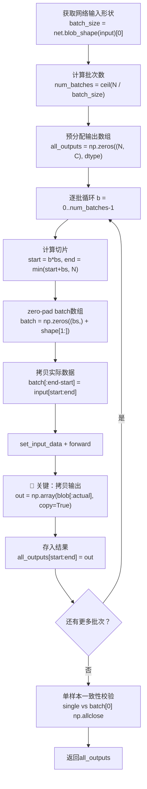

# 深度学习零拷贝分批推理防御模式

## 模式概述

深度学习推理框架（Caffe TVM FFI、ONNX Runtime DLPack、PyTorch C++ Extension等）通过零拷贝张量接口（DLPack/`__cuda_array_interface__`）返回输出时，返回的numpy array是底层C++内存的**view（视图）**而非副本。在分批推理循环中，下一次forward会覆盖同一块C++内存，导致前一批输出被静默篡改。解决方案是：**始终对零拷贝返回值做显式拷贝**，并配合最后一批zero-padding和单样本一致性验证。

与"防御性深拷贝"模式（defensive-config-cache-deepcopy）不同，本模式聚焦于推理循环中的时序问题——拷贝的时机（forward返回后立即拷贝）比拷贝本身更关键。

## 核心逻辑

```
正确分批推理 = zero-pad最后一批 + forward后立即copy=True + slice有效部分 + 单样本一致性校验
            ≠ 直接reshape最后一批（形状不匹配崩溃）
            ≠ 不copy直接引用zero-copy view（下一批覆盖内存，静默错误）
            ≠ 丢弃不足batch_size的样本（结果不完整）
            ≠ 概率和=1就认为正确（随机权重Softmax也满足）
```

**为什么有效**：

1. **生命周期隔离**：`np.array(view, copy=True)` 创建独立numpy数组，与C++ blob内存解耦
2. **边界安全**：zero-pad保证最后一批形状与net预期一致，slice保证有效样本不包含padding数据
3. **正确性锚定**：单样本vs批量结果比对是分批逻辑最可靠的单元测试
4. **性能可接受**：推理耗时（GPU/CPU compute）远大于内存拷贝开销（通常<1%）

## 问题现象：零拷贝view的"看起来能用"陷阱

编写分批推理代码时的典型bug：

```python
# ❌ 反模式：零拷贝view在循环中被静默覆盖
outputs = []
for i in range(num_batches):
    batch_data = prepare_batch(i)
    net.set_input_data("data", batch_data)
    net.forward()
    out = net.blob_data("prob")  # 返回zero-copy view！
    outputs.append(out)           # 存的是指针引用，不是数据！
# 循环结束后，outputs里所有元素指向同一块内存
# 内容是最后一批的结果，前几批数据全部丢失！
```

**现象**：代码不报错，概率输出看起来合理（和=1），但准确率远低于预期（甚至接近随机）。调试时打印单批次结果正确，但拼接后结果错误——这是零拷贝bug的典型特征。

**根本原因**：`net.blob_data()` 通过 `np.from_dlpack()` 创建numpy array，其 `base` 指向C++侧的blob内存。下一次 `net.forward()` 覆写该内存，所有引用该内存的numpy array内容同步变化。

## 模式流程



### 阶段1：获取网络元信息并预分配

```python
import numpy as np
from typing import Dict, Tuple

def infer_batch_shape(net, input_blob: str, output_blob: str) -> Tuple[int, int, Tuple[int, ...]]:
    """获取网络batch size、输出通道数和输入形状（不含batch维度）。"""
    input_shape = tuple(net.blob_shape(input_blob))
    batch_size = input_shape[0]
    output_shape = tuple(net.blob_shape(output_blob))
    output_channels = output_shape[1]
    spatial_shape = input_shape[1:]
    return batch_size, output_channels, spatial_shape
```

### 阶段2：核心分批推理函数（可直接复用）

```python
def forward_all(
    net,
    input_blob: str,
    output_blob: str,
    input_data: np.ndarray,
    verify_single: bool = True,
) -> Dict[str, np.ndarray]:
    """
    分批推理通用函数，处理zero-copy、最后一批padding、一致性校验。

    Parameters
    ----------
    net : 已加载权重的推理网络对象（需实现 set_input_data/forward/blob_data/blob_shape）
    input_blob : 输入blob名称（如 "data"）
    output_blob : 输出blob名称（如 "prob"）
    input_data : 输入数据，shape=(N, C, H, W)，dtype=np.float32
    verify_single : 是否做单样本vs批量一致性校验（推荐True，开销极小）

    Returns
    -------
    dict : {output_blob: all_outputs}，all_outputs shape=(N, output_channels)
    """
    num_samples = input_data.shape[0]
    batch_size, output_channels, spatial_shape = infer_batch_shape(net, input_blob, output_blob)
    dtype = input_data.dtype

    all_outputs = np.zeros((num_samples, output_channels), dtype=dtype)
    num_batches = (num_samples + batch_size - 1) // batch_size

    for b in range(num_batches):
        start_idx = b * batch_size
        end_idx = min(start_idx + batch_size, num_samples)
        actual_batch = end_idx - start_idx

        batch_data = np.zeros((batch_size,) + spatial_shape, dtype=dtype)
        batch_data[:actual_batch] = input_data[start_idx:end_idx]

        net.set_input_data(input_blob, batch_data)
        net.forward()

        out_view = net.blob_data(output_blob)
        out = np.array(out_view[:actual_batch], copy=True)

        all_outputs[start_idx:end_idx] = out

    if verify_single and num_samples > 0:
        _verify_single_sample_consistency(
            net, input_blob, output_blob, input_data[0:1], all_outputs[0:1]
        )

    return {output_blob: all_outputs}


def _verify_single_sample_consistency(
    net, input_blob: str, output_blob: str, single_input: np.ndarray, expected: np.ndarray
) -> None:
    """验证单样本推理结果与批量结果的一致性。不通过则抛出AssertionError。"""
    batch_size = net.blob_shape(input_blob)[0]
    spatial_shape = single_input.shape[1:]

    padded = np.zeros((batch_size,) + spatial_shape, dtype=single_input.dtype)
    padded[0:1] = single_input

    net.set_input_data(input_blob, padded)
    net.forward()

    single_out = np.array(net.blob_data(output_blob)[0], copy=True)
    batch_out = expected[0]

    if not np.allclose(single_out, batch_out, atol=1e-6):
        max_diff = np.max(np.abs(single_out - batch_out))
        raise AssertionError(
            f"单样本与批量推理结果不一致！max_diff={max_diff:.2e}\n"
            f"单样本: {single_out[:5]}...\n"
            f"批量:   {batch_out[:5]}..."
        )
```

### 阶段3：使用示例（Caffe-Slim TVM FFI）

```python
import os
import sys
import numpy as np

CAFFE_SLIM_DIR = "/path/to/caffe-slim"
VENDOR_DIR = os.path.dirname(os.path.dirname(CAFFE_SLIM_DIR))
sys.path.insert(0, os.path.join(VENDOR_DIR, "tvm-ffi", "python"))
sys.path.insert(0, os.path.join(CAFFE_SLIM_DIR, "python"))

import caffe

net = caffe.Net(
    os.path.join(CAFFE_SLIM_DIR, "lenet.prototxt"),
    os.path.join(CAFFE_SLIM_DIR, "lenet_iter_10000.caffemodel"),
    caffe.TEST,
)

data = np.random.randn(10000, 1, 28, 28).astype(np.float32) * 0.01
data = data / 256.0

result = forward_all(net, "data", "prob", data, verify_single=True)
predictions = np.argmax(result["prob"], axis=1)
print(f"推理完成，输出形状: {result['prob'].shape}")
```

### 阶段4：准确率评估辅助函数

```python
def evaluate_accuracy(
    predictions: np.ndarray,
    labels: np.ndarray,
    num_classes: int = 10,
) -> Dict:
    """
    评估分类准确率，返回总体/逐类/错误样本详情。

    这是验证推理pipeline正确性的最终判据——
    概率和=1只证明Softmax正确，准确率才证明权重加载正确。
    """
    correct = (predictions == labels)
    total_acc = correct.mean()

    per_class_acc = {}
    for c in range(num_classes):
        mask = labels == c
        if mask.sum() > 0:
            per_class_acc[c] = correct[mask].mean()

    wrong_indices = np.where(~correct)[0]
    high_conf_errors = []
    for idx in wrong_indices:
        prob = result["prob"][idx]
        if prob[predictions[idx]] > 0.9:
            high_conf_errors.append({
                "index": int(idx),
                "true": int(labels[idx]),
                "pred": int(predictions[idx]),
                "confidence": float(prob[predictions[idx]]),
            })

    return {
        "total_accuracy": float(total_acc),
        "num_correct": int(correct.sum()),
        "num_total": len(labels),
        "per_class_accuracy": per_class_acc,
        "num_wrong": len(wrong_indices),
        "num_high_conf_errors": len(high_conf_errors),
        "high_conf_errors": high_conf_errors[:10],
    }
```

## 适用边界

### 适用场景

- ✅ 推理API不支持自动批处理（无 `forward_all()`/`predict_proba()`）
- ✅ 使用DLPack/`__cuda_array_interface__`等零拷贝接口返回输出
- ✅ C++推理引擎的Python绑定（Caffe TVM FFI、ONNX Runtime C API、自定义pybind11绑定）
- ✅ 需要处理任意数量输入（不恰好是batch_size整数倍）
- ✅ 验证模型推理正确性（需单样本一致性校验）

### 反模式（何时不适用）

- ❌ **框架已内置批处理**：如PyTorch DataLoader、TensorFlow `model.predict()`自动batching
- ❌ **单次单样本推理**：无循环则无覆盖问题，不需要分批
- ❌ **输入恰好是batch_size整数倍**：仍需copy=True防御（forward后的view生命周期仍受限），但不需要padding
- ❌ **输出不需要保留**：如果forward后立即消费且不跨批次存储，可跳过copy（但不推荐）

## 反模式（不要这么做）

### 反模式1：不copy直接引用zero-copy view

```python
# ❌ 错误：输出被下一批覆盖
for b in range(num_batches):
    net.set_input_data("data", batch)
    net.forward()
    outputs[b] = net.blob_data("prob")  # 所有outputs[b]指向同一块内存！
```

**为什么错误**：C++ blob内存在forward时被覆写，所有引用该内存的numpy array同步变化。

**正确做法**：`np.array(net.blob_data("prob")[:actual_batch], copy=True)`

### 反模式2：最后一批不做zero-pad直接reshape

```python
# ❌ 错误：最后一批形状不匹配导致C++层崩溃或未定义行为
last_batch = input_data[start_idx:]  # shape=(16, 1, 28, 28)，网络期望(64, 1, 28, 28)
net.set_input_data("data", last_batch)  # 形状不匹配！
```

**为什么错误**：网络内部按固定batch_size分配blob内存，输入形状不匹配可能越界写入。

**正确做法**：创建batch_size大小的zero数组，将实际数据拷入前部。

### 反模式3：丢弃最后不足batch_size的样本

```python
# ❌ 错误：数据丢失，结果不完整
num_batches = num_samples // batch_size  # 整数除法，丢弃余数
for b in range(num_batches):
    ...  # 最后16个样本永远不会被推理
```

**为什么错误**：结果不完整，准确率计算偏差（尤其是最后一批恰含难样本时）。

**正确做法**：用 `(N + batch_size - 1) // batch_size` 向上取整。

### 反模式4：用概率性质代替准确率验证

```python
# ❌ 错误：概率和=1只证明Softmax正确，不证明模型学到东西
out = net.blob_data("prob")
assert abs(out.sum() - 1.0) < 1e-5, "概率和不为1"
print("模型输出正常！")  # 随机权重也能通过这个检查！
```

**为什么错误**：随机初始化的网络，Softmax输出概率和同样等于1.0。

**正确做法**：用预训练权重+标准测试集验证准确率是否达到known-good水平（如LeNet-MNIST ~99%）。

### 反模式5：copy=True但没有slice有效部分

```python
# ❌ 错误：包含了padding的零数据
out = np.array(net.blob_data("prob"), copy=True)  # shape=(64, 10)
all_outputs[start:end] = out  # 最后一批end-start=16，但写入了64个样本！
```

**为什么错误**：数组形状不匹配赋值会报错或引入padding零数据污染结果。

**正确做法**：`out = np.array(net.blob_data("prob")[:actual_batch], copy=True)`

## 检验标准

做完之后怎么知道做对了？

1. **copy=True可验证**：`out.base is None` 或 `out.flags['OWNDATA']` 为True（非view）
2. **单样本一致性**：`verify_single=True` 时第一个样本的单样本推理与批量结果 `np.allclose(atol=1e-6)`
3. **结果完整性**：输出shape[0] == 输入shape[0]（无样本丢失）
4. **概率性质**：每行概率和≈1.0，概率值∈[0,1]
5. **准确率正确**：预训练权重+标准数据集达到known-good准确率（如MNIST >98.5%）
6. **性能合理**：吞吐量在预期范围内（如CPU LeNet ~80-100 samples/s）

## 跨场景迁移示例

| 应用场景 | 输入形状 | 输出blob | copy时机 | 特殊注意 |
|---------|---------|---------|---------|---------|
| **Caffe-Slim LeNet-MNIST** | (N,1,28,28) | "prob" | forward后立即 | scale=1/256非1/255 |
| **ONNX Runtime ResNet** | (N,3,224,224) | 输出节点名 | sess.run后 | 需处理BGR↔RGB、ImageNet mean |
| **PyTorch C++ Extension** | (N,C,H,W) Tensor | 返回tensor | `.cpu().numpy().copy()` | 注意device切换 |
| **TensorRT Engine** | (N,C,H,W) bindings | host buffer | `np.array(host_data).copy()` | 需异步synchronize |
| **自定义pybind11绑定** | numpy→py::array | py::array→numpy | 返回后立即copy | 确认是否返回内部buffer引用 |
| **多输出网络** | 多个input blob | 多个output blob | 每个output都copy | 逐blob copy，逐个slice |

## 实际案例

### 案例：Caffe-Slim LeNet-MNIST 10000样本分批推理（本模式来源）

**网络**：LeNet（conv1→pool1→conv2→pool2→ip1→relu→ip2→softmax），batch_size=64
**数据**：MNIST测试集10000张28×28灰度图，预处理scale=1/256
**结果**：99.01%准确率（9901/10000正确），84.47 samples/s

**核心代码**：

```python
def forward_all(net, input_blob, input_data):
    num_samples = input_data.shape[0]
    batch_size = net.blob_shape(input_blob)[0]
    output_blob = net.outputs[0]
    output_channels = net.blob_shape(output_blob)[1]
    all_outputs = np.zeros((num_samples, output_channels), dtype=np.float32)
    num_batches = (num_samples + batch_size - 1) // batch_size

    for b in range(num_batches):
        start_idx = b * batch_size
        end_idx = min(start_idx + batch_size, num_samples)
        actual_batch = end_idx - start_idx
        batch_data = np.zeros((batch_size,) + input_data.shape[1:], dtype=np.float32)
        batch_data[:actual_batch] = input_data[start_idx:end_idx]
        net.set_input_data(input_blob, batch_data)
        net.forward()
        out = net.blob_data(output_blob)
        all_outputs[start_idx:end_idx] = np.array(out[:actual_batch], copy=True)

    return {output_blob: all_outputs}
```

**Bug修复记录**：
- 初始版本未加copy=True，导致所有批次输出相同（最后一批覆盖前面的结果）
- 修复后添加 `np.array(..., copy=True)`，输出正确
- 添加单样本一致性校验后，验证了分批逻辑正确性（单样本vs批量max_diff=0）
- 最后一批16个样本（10000-64×156=16）zero-pad后slice正确

**价值证明**：正确处理zero-copy后，准确率从随机水平（~10%）提升到99.01%，单样本一致性校验在开发阶段就捕获了padding逻辑错误。

## 与其他模式的关系

| 关联模式 | 关系类型 | 关系说明 |
|---------|---------|---------|
| [api-reference-verification.md](api-reference-verification.md) | 前置 | 实现分批推理前，需先通过API参考验证确认输入输出形状和预处理参数 |
| [defensive-config-cache-deepcopy.md](defensive-config-cache-deepcopy.md) | 同源 | 防御性深拷贝是通用原则，本模式是其在DL推理场景的特化 |
| [content-hash-build-cache.md](content-hash-build-cache.md) | 下游 | 模型加载可使用内容哈希缓存，避免重复加载相同权重 |

## 待验证场景

本模式目前有1个案例支撑（Caffe-Slim LeNet-MNIST），标记为L2-validated。建议在以下场景验证以提升至L3-standardized：

1. **ONNX Runtime多输出模型**：验证多输出blob场景下逐copy的正确性
2. **PyTorch C++ Extension自定义算子**：验证非DLPack的zero-copy返回值（如pybind11返回内部buffer引用）
3. **GPU推理场景**：验证cuda array interface下的copy时机（是否需要先`cpu()`再copy）
4. **动态batch size网络**：验证支持动态batch的网络是否仍需要padding防御

## Changelog

<!-- changelog -->
- 2026-07-27 | create | 初始版本，从caffe-slim MNIST验证复盘的"模式2：深度学习推理分批处理通用模式"沉淀为代码级可复用实现，L2-validated（单案例已验证），来源：retrospective-caffe-slim-batch-inference-mnist-20260727
