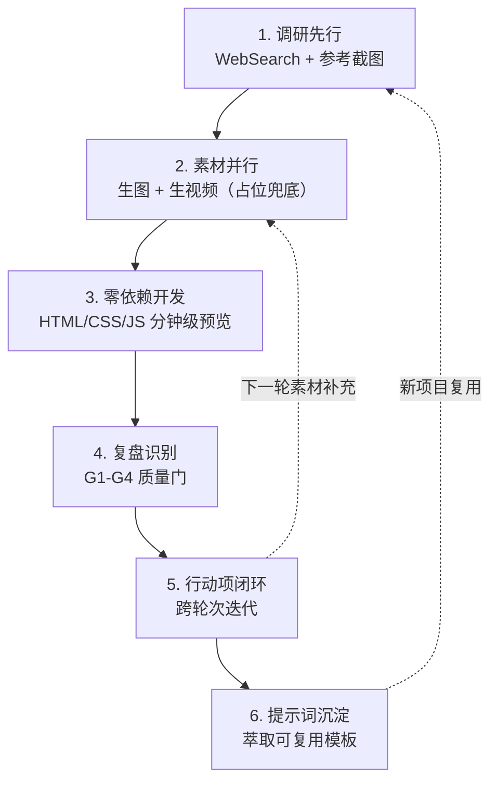
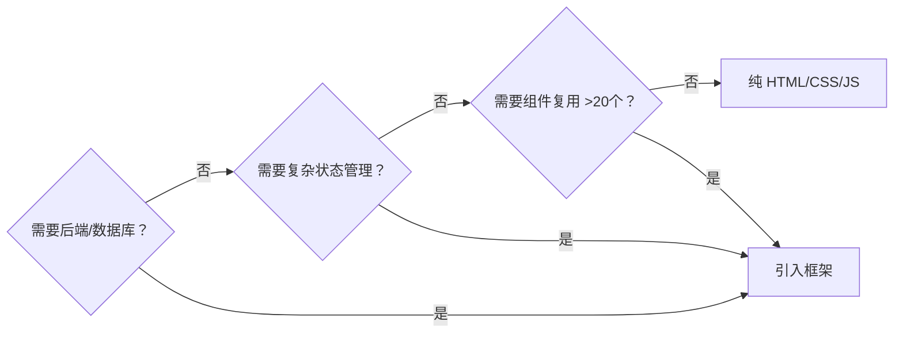

> **来源**：从 ReelVibe 短视频网站开发复盘（2026-08-12）萃取，项目使用 Seedream 生图、Seedance 生视频、WebSearch 调研，纯 HTML/CSS/JS 零依赖方案，经 3 轮原子提交完成。

# AI 多模态全栈开发闭环（AI Multimodal Full-Stack Development Loop）

## 模式类型
方法论模式

## 成熟度
L2 已验证（基于完整项目周期：调研→素材→代码→复盘→迭代→沉淀，3 轮原子提交闭环）

## 适用场景
使用 AI 编程工具开发需要图片、视频等多模态素材的完整 Web 应用或 Demo，特别是：
- 短视频/直播/电商展示类网站
- 营销落地页与品牌官网
- 需要视觉素材的交互原型
- 从零到可预览的快速项目验证

## 问题背景

AI 辅助全栈开发面临三个独特挑战：

- **素材瓶颈转移**：传统开发中代码是瓶颈，AI 开发中代码生成很快，但多模态素材（图片/视频）受 API 频率限制，反而成为关键路径
- **视觉理解偏差**：纯文字描述布局容易产生歧义，AI 对空间结构的理解高度依赖视觉输入
- **一次性项目陷阱**：项目完成后经验未沉淀，下次同类项目仍需从零摸索

本模式提供一条经过验证的六阶段闭环路径。

## 操作流程



## 六阶段详解

### 阶段一：调研先行

| 维度 | 内容 |
|------|------|
| 目标 | 明确功能清单和视觉方向 |
| 手段 | WebSearch 调研同类产品 + 用户提供参考截图 |
| 关键决策 | **截图优先于文字描述**——一张参考图胜过千言万语 |
| 产出 | 功能清单（必做/可选）+ 布局结构识别 |

**核心原则**：鼓励用户上传参考截图或设计稿。AI 对视觉布局的理解在有图像输入时准确率显著高于纯文字描述。截图应标注关键区域（导航、内容区、侧边栏等）。

### 阶段二：素材并行

| 维度 | 内容 |
|------|------|
| 目标 | 在代码开发的同时推进素材生成 |
| 手段 | 生图 Skill 生成 Logo/图片，生视频 Skill 生成视频素材 |
| 关键决策 | **占位兜底，跨轮补充**——素材 API 有频率限制时，用 CSS 渐变色占位先行开发 |
| 产出 | Logo + 视频/图片素材（可能跨多轮对话完成） |

**素材生成策略矩阵**：

| 素材类型 | 生成方式 | 频率限制 | 应对策略 |
|----------|----------|----------|----------|
| Logo/图标 | 生图 Skill | 通常无严格限制 | 首轮生成，多选优 |
| 图片素材 | 生图 Skill | 中等 | 批量生成，择优使用 |
| 视频素材 | 生视频 Skill | 每轮 1 条 | 跨轮规划，占位先行 |

**提示词技巧**：素材主题描述要具体——不要写"生成风景视频"，要写"航拍金色山峦、云雾缭绕、暖光、5秒竖屏"。

### 阶段三：零依赖开发

| 维度 | 内容 |
|------|------|
| 目标 | 分钟级产出可预览的原型 |
| 手段 | 纯 HTML + CSS + Vanilla JS，不引入框架和构建工具 |
| 关键决策 | **Demo 阶段零依赖优先**——无 node_modules、无构建步骤、3 文件即可运行 |
| 产出 | 可在浏览器直接打开的完整页面 |

**技术选型判断**：



**文件结构约定**：
```
project/
├── index.html
├── css/style.css
├── js/app.js
├── assets/
│   ├── data/videos.json    ← 数据外置
│   ├── images/
│   └── videos/
└── docs/
```

### 阶段四：复盘识别

| 维度 | 内容 |
|------|------|
| 目标 | 客观记录过程，识别改进点 |
| 手段 | 七概念方法论 R→I→E 链路，G1-G4 质量门 |
| 关键决策 | **事实无因果词**——只记录"发生了什么"，不急于归因 |
| 产出 | 复盘报告（事实记录 + 洞察 + 行动项） |

**质量门检查清单**：
- G1：事实记录是否为纯客观描述（无"因为""导致"等因果词）？
- G2：每条洞察是否包含现象/证据/反常识/行动四元组？
- G3：萃取的模式是否可迁移到其他项目？
- G4：行动项是否原子化（可独立执行、可验证完成）？

### 阶段五：行动项闭环

| 维度 | 内容 |
|------|------|
| 目标 | 将复盘识别的改进点落地 |
| 手段 | 跨轮次对话执行原子行动项，每项独立提交 |
| 关键决策 | **数据外置是原型到可维护项目的第一步**——首版可硬编码验证，但行动项必须包含数据分离 |
| 产出 | 代码改进 + 原子提交记录 |

**典型行动项模式**：
1. 补充缺失素材（跨轮视频生成）
2. 数据外置（硬编码 → JSON/API）
3. 交互增强（悬停预览、键盘快捷键）
4. 文档更新（路由表、README）

### 阶段六：提示词沉淀

| 维度 | 内容 |
|------|------|
| 目标 | 将一次性项目经验转化为可复用的提示词模板 |
| 手段 | 萃取完整提示词 + 精简版 + 变体模板 |
| 关键决策 | **提示词是最高杠杆的知识资产**——一次萃取，无限复用 |
| 产出 | 可分享的提示词模板文档 |

**提示词模板结构**：
- 完整版：功能调研 → 页面设计 → 素材生成 → 技术要求 → 交付要求
- 精简版：5 行快速指令
- 变体：电商/教育/企业宣传等场景适配
- 最佳实践 + 反模式清单

## 关键原则

1. **素材先行，占位兜底**：先启动素材生成，代码开发用占位素材并行推进，不因等素材而阻塞
2. **视觉参考优先**：截图比文字描述效率高 3 倍以上，主动要求用户提供参考图
3. **零依赖快速验证**：Demo 阶段用纯 HTML/CSS/JS，需要时再引入框架，避免过度工程
4. **跨轮规划素材**：视频生成通常每轮只能 1 条，多视频项目需提前规划轮次分配
5. **复盘驱动迭代**：首轮复盘识别问题，行动项在后续轮次闭环，形成"开发→复盘→改进"循环
6. **提示词即资产**：项目完成后必须萃取提示词模板，实现从一次性项目到可复制方法论的跃迁

## 反模式

| 反模式 | 问题 | 正确做法 |
|--------|------|----------|
| "做一个像 XX 一样的网站" | 需求模糊，AI 无法准确理解 | 提供参考截图 + 具体功能清单 |
| 一次要求生成 10 条视频 | 触发 API 频率限制 | 跨轮规划，每轮 1-2 条 |
| Demo 阶段引入 React+构建工具 | 增加不必要的复杂度 | 零依赖先行，验证后再升级 |
| 素材主题写"好看的视频" | AI 无法生成有效内容 | 具体描述场景、光线、镜头、色调 |
| 项目完成后不沉淀 | 下次同类项目从零开始 | 萃取提示词模板，归档复盘报告 |
| 数据硬编码在 JS 中且不重构 | 非开发者无法维护内容 | 首个迭代就将数据外置为 JSON |

## 效率数据

| 阶段 | 传统方式 | AI 多模态闭环 | 提升 |
|------|----------|---------------|------|
| 功能调研 | 2-4 小时 | 10-15 分钟 | 10x |
| Logo 设计 | 1-3 天 | 1-2 分钟 | 100x+ |
| 视频素材 | 拍摄/采购 1-2 周 | 每条约 2 分钟 | 1000x+ |
| 前端原型 | 2-5 天 | 30-60 分钟 | 20x |
| 复盘沉淀 | 通常不做 | 15-30 分钟 | — |

## 成功案例

| 项目 | 阶段一 | 阶段二 | 阶段三 | 阶段四-六 |
|------|--------|--------|--------|-----------|
| ReelVibe 短视频网站 | WebSearch 调研抖音 Web 端 + 用户截图 | Seedream Logo + Seedance 3 条视频（跨 3 轮） | 纯 HTML/CSS/JS，8080 端口预览 | 3 轮原子提交，复盘归档，提示词模板萃取 |

**项目数据**：
- 3 轮原子提交（`75ae13cc`、`150fa24b`、`73e40c43`）
- 10 个交付文件，3 条 AI 生成视频
- 视频数据外置后 app.js 从 423 行减至 316 行
- 悬停预览交互 400ms 延迟防抖

## 与现有模式的关系

- **上游依赖**：`progressive-templating.md`（渐进式模板化）——阶段六的提示词沉淀遵循"硬编码验证→模板分离→多类型扩展"三阶段
- **下游延伸**：`dual-zone-development-model.md`（双区开发模型）——素材占位先行开发对应"非正式区探索→质量门禁→正式区"
- **横向关联**：`generation-validation-closed-loop.md`（生成-验证闭环）——阶段四复盘 + 阶段五行动项构成生成-验证循环
- **特化关系**：本模式是 `prompt-to-product-seven-steps.md`（提示词到产品七步法）在多模态 Web 开发场景的特化

> **关联模块**：
> - `progressive-templating.md`
> - `dual-zone-development-model.md`
> - `generation-validation-closed-loop.md`
> - `prompt-to-product-seven-steps.md`
> - 来源复盘：`.agents/docs/retrospective/2026-08-12-short-video-site-ai-fullstack-retro.md`
