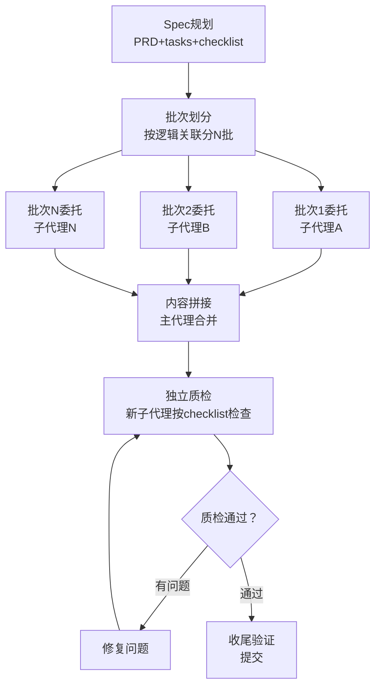

# 分批创作+独立质检模式

## 模式概述

创作500行以上长文档（wiki教程、技术报告、分析文档等）时，将内容分为N个逻辑批次委托子代理创作（每批聚焦2-4个相关章节），最后通过**独立的质检子代理**按checklist统一质量检查，而非单代理一次生成或主代理逐章手动编辑。分批保证每批内容深度，独立质检保证系统性捕获格式/完整性问题。

## 核心逻辑

```
长文档创作 = 分批委托（子代理专注局部） + 独立质检（第三方视角系统性检查）
           ≠ 单代理一次性生成（上下文不足，质量不稳定）
           ≠ 主代理逐章编辑（效率低，检查标准不一致）
```

**为什么有效**：
1. **上下文窗口限制突破**：单代理一次性生成500+行文档时，后期内容容易出现风格漂移、前后矛盾、遗漏要点
2. **每批专注度高**：每个子代理聚焦有限范围（2-4个相关章节），内容深度和质量更好
3. **独立质检视角**：创作者难以自查出自己的格式错误/编号问题/字段遗漏；独立质检子代理以"第三方"视角按checklist逐项核对，系统性更强
4. **并行效率**：无依赖的批次可以并行委托，总耗时缩短

## 问题现象：单代理长文质量不稳定

委托单个子代理"一次性写完整篇wiki"的常见问题：

1. **前后风格不一致**：前半部分详细，后半部分简略（"写累了"效应）
2. **格式规范漂移**：开头frontmatter正确，后面章节逐渐偏离格式要求
3. **编号/链接错误**：章节编号重复、跳号、交叉链接错误
4. **系统性遗漏**：某些参数/要点在提取阶段遗漏后，后期不会自动补回
5. **质检盲区**：子代理自己"自检"时，对自己犯的错误存在认知盲区

## 模式流程



### 阶段1：批次划分原则

| 划分维度 | 原则 | 示例 |
|---------|------|------|
| **逻辑关联** | 同一批内章节主题紧密相关 | "产品概述+核心概念"为一批，"技术参数"为一批 |
| **批次大小** | 每批委托后预计产出100-200行 | 避免单批过大再次出现上下文问题 |
| **依赖关系** | 有依赖的批次顺序执行，无依赖可并行 | 概述/概念类批次先于深度分析类 |
| **边界清晰** | 批次边界在章节自然分隔处 | 不要在一个表格/代码块中间切分 |

### 阶段2：分批委托模板

每批委托时提供给子代理的信息：
- 本批次要创作的章节列表和每个章节的核心要点
- 已完成的前文内容（作为风格参考）
- 格式规范要求（frontmatter、标题层级、编号规则）
- 产出物存放路径
- **不要**让子代理做最终质检——质检交给独立环节

### 阶段3：独立质检

独立质检子代理的任务描述应包含：
1. 完整的checklist（格式规范+内容质量+结构完整性）
2. 原始数据源（defuddle提取的干净文本），用于参数交叉核对
3. 明确指令："逐项检查，列出所有发现的问题，不要自行修复，只报告问题清单"
4. 检查范围：frontmatter格式、字段完整性、标题编号、参数表完整性、链接有效性等

**质检报告格式要求**：
```
【质检报告】
1. frontmatter格式：通过/问题描述
2. 标题编号：通过/问题描述（列出具体哪个编号错误）
3. 参数完整性：通过/遗漏了哪些参数（对照原始数据源）
4. ...
```

### 阶段4：修复+二次验证

主代理根据质检报告修复问题后，如有必要可让质检子代理对修复点做二次验证。

## 适用边界

### 适用场景

- ✅ 500行以上长文档创作
- ✅ 格式规范严格（需要统一frontmatter/编号/链接格式）
- ✅ 内容需要准确（技术参数、产品规格、API文档等）
- ✅ 有明确的checklist可供质检对照
- ✅ 多章节之间有逻辑关联但可独立创作

### 反模式（何时不适用）

- ❌ **短文档**（<200行）：分批+质检的开销超过直接创作
- ❌ **创意写作**：小说、诗歌等需要连贯文气的内容，分批会打断思路
- ❌ **格式简单的文档**：如会议记录、快速笔记等，质检价值低
- ❌ **紧急任务**：时间只够一次生成时

## 批次大小参考

| 文档规模 | 建议批次数 | 每批行数 | 质检方式 |
|---------|-----------|---------|---------|
| 200-400行 | 1-2批 | 150-200行 | 主代理自检即可 |
| 400-800行 | 2-4批 | 150-200行 | 独立质检子代理 |
| 800行以上 | 4+批 | 150-200行 | 独立质检+二次验证 |

## 案例验证：向日葵SU1摄像头wiki（L2验证）

14章约660行wiki教程分为5个批次：
- 批次1：文档框架+frontmatter+目录导航
- 批次2：产品概述+核心概念（2章）
- 批次3：技术参数（图像+音频+硬件，3章）
- 批次4：应用场景+UX分析+产品洞察（3章）
- 批次5：注意事项+FAQ+资源链接（3章收尾）

独立质检子代理使用30点checklist检查，发现3个问题：
1. 三级标题编号使用x.0而非x.1（格式问题）
2. 硬件参数表遗漏工作电流220mA（内容完整性问题）
3. frontmatter缺少author/version字段（后经调查确认单文件wiki不需要这两个字段，修正为检查模板问题）

修复后二次验证全部通过。

### 跨案例验证

- **MopMonk安全Agent wiki**：分批创作+质检，拦截了frontmatter格式错误
- **text-to-cad wiki**：验证了分批+质检流程有效性
- **多次硬件wiki**：向日葵PDU/开机盒子/安全产品wiki均采用类似模式

## 与其他模式的关系

| 关系模式 | 关系类型 | 说明 |
|---------|---------|------|
| [two-stage-outline-then-expand.md](two-stage-outline-then-expand.md) | 前置 | 两阶段大纲→展开是分批创作的微观应用（单章节内），分批创作是宏观应用（跨章节） |
| [subagent-atomic-task-template.md](subagent-atomic-task-template.md) | 配套 | 子代理原子任务模板用于构造每批委托的任务描述 |
| [three-stage-content-validation.md](../governance-strategy/three-stage-content-validation.md) | 上位 | 三段式内容验证（任务级/产出级/集成级）是本模式的理论框架 |
| [spec-mode-doc-creation-workflow.md](spec-mode-doc-creation-workflow.md) | 上位 | Spec Mode工作流中，分批创作属于L4层，独立质检属于L6收尾验证层 |
| [wiki-dual-track-frontmatter.md](../governance-strategy/wiki-dual-track-frontmatter.md) | 配套 | 双轨frontmatter规范是质检checklist中的关键检查项 |
