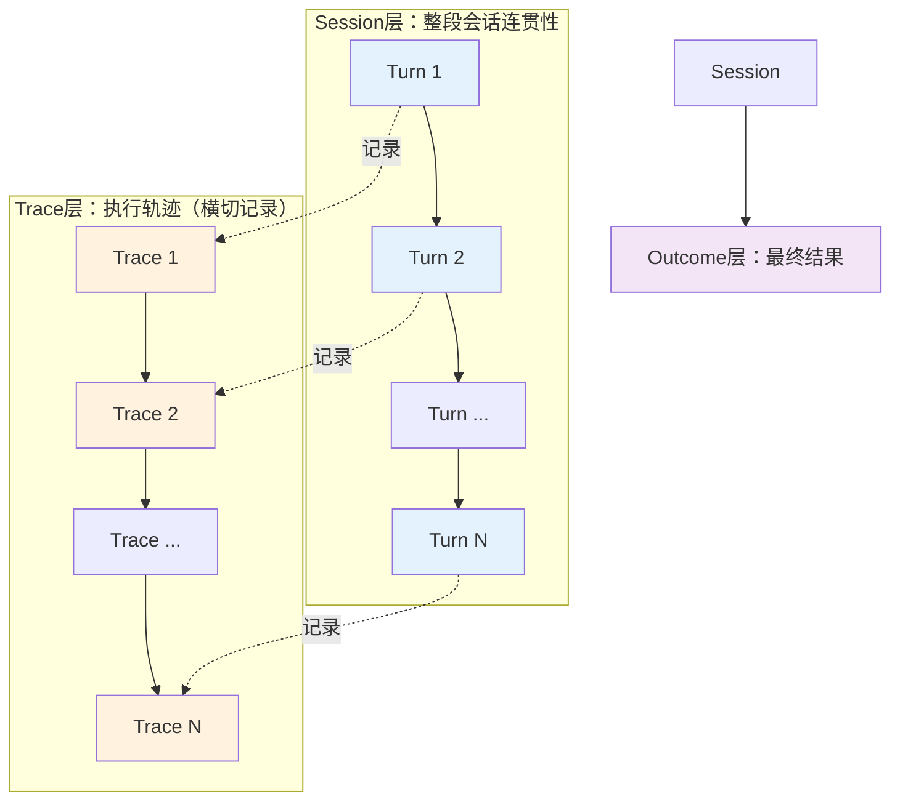

> **提炼自**：[Agent评测体系化建设方法论深度分析报告](../../../reports/insight-extraction/external-learning/retrospective-agent-eval-article-analysis-20260803/analysis-report.md)

# 对话Agent四层评测模式（Dialog Agent Four-Layer Evaluation）

## 模式类型

方法论模式（AI协作/Agent评测/质量保障）

## 成熟度

L1 单案例验证（来源：孙敦灿《Agent评测体系化》文章方法论，待多场景验证）

## 适用场景

专门针对对话型AI Agent的评测体系设计。适用于：

| 场景 | 适用度 | 说明 |
|------|--------|------|
| 对话Agent/客服机器人评测 | ✅✅✅ 核心场景 | 多轮对话是这类Agent的核心交互形式 |
| 工具调用型Agent评测 | ✅✅✅ 核心场景 | 必须检查工具调用过程（参数、顺序、错误处理） |
| RAG/知识问答Agent评测 | ✅✅ 推荐 | 需要检查检索过程和证据使用，不能只看答案 |
| 单轮命令式Agent | ✅ 适用 | 可简化为Turn+Outcome两层 |
| 非对话型分类/回归模型评测 | ❌ 不适用 | 传统ML模型不需要Session/Trace层评测 |

## 问题背景

对话Agent与传统软件/单轮模型有本质差异：
- **非确定性**：大模型输出有随机性，同一输入不一定产生同样输出
- **黑盒化**：仅看最终答案无法发现过程中的风险和错误路径
- **错误级联放大**：多步链路中前面一个小偏差会在后续被放大
- **假阳性陷阱**：最终答案看起来正确，但执行路径已偏离或带风险（如未做必要校验、跳过关键步骤）

单一维度评测（如只看最终答案正确率）会漏掉大量生产级隐患，尤其是假阳性问题。

## 核心原则：四层递进评测架构

> **注意区分两种顺序**：
> - **架构层级依赖顺序**：Turn → Session → Outcome（单轮组成会话，会话产出结果）；Trace横切记录整个Session的所有Turn执行过程
> - **评测执行顺序**：推荐 Outcome粗筛 → Trace精判抓假阳性 → Session/Turn抽样检查（效率优先）

四层是**从局部到整体、从过程到结果**的质量防御体系：

| 层级 | 中文释义 | 关注点 | 核心检查项（含评分方式参考） | 失败后果 |
|------|---------|--------|---------------------------|---------|
| **Turn（单轮）** | 单轮交互层 | 每一轮交互的质量 | 单轮回复相关性（LLM Judge 1-5分）、单轮工具调用正确性（规则校验）、意图识别准确率（规则+人工标注） | 单轮错误累积，导致后续会话偏离 |
| **Session（会话）** | 整段会话层 | 整段多轮对话的连贯性和任务完成 | 对话状态跟踪准确率（规则）、端到端任务完成率（规则+人工）、上下文一致性（LLM Judge） | 多轮对话断裂，用户需要重复说明 |
| **Trace（轨迹）** | 执行轨迹层 | 执行过程的内部路径正确性（横切记录） | 工具调用顺序正确性（规则）、参数正确率（规则校验schema）、检索证据充分性（规则+LLM Judge）、计划合理性（LLM Judge）、Guardrail触发准确率（规则）、异常降级成功率（规则） | 假阳性：结果对但过程错，生产中迟早暴露 |
| **Outcome（结果）** | 最终结果层 | 最终输出的正确性 | 最终答案正确率（规则+LLM Judge+人工）、格式符合率（规则）、风险合规通过率（规则） | 用户直接可见的失败 |

## 核心做法：四层评测实施五步法

### 第一步：四层能力基线建设

为每一层定义明确的评测维度和判定标准：

1. **Turn层**：单轮回复相关性评分、单轮工具调用准确率、意图识别准确率
2. **Session层**：对话状态跟踪准确率、任务完成率、上下文一致性
3. **Trace层**：工具调用顺序正确性、参数正确率、检索召回准确率、计划合理性评分、Guardrail触发准确率、异常降级成功率
4. **Outcome层**：最终答案正确率、格式符合率、风险合规通过率

### 第二步：分层筛查执行策略

采用"粗筛→精判"分层策略提高评测效率：

1. **粗筛（Outcome先行）**：先用规则+轻量模型快速检查Outcome层，明显失败直接标记为badcase
2. **精判（Trace补漏）**：对Outcome通过的样本，重点做Trace层过程检查抓假阳性
3. **专项深度**：对Session连贯性和Turn单轮质量做抽样检查或专项评测

> **为什么Outcome先行？** Outcome失败是用户直接感知的失败，优先级最高；Outcome通过但Trace有问题的假阳性是隐蔽风险，必须第二层防线拦截。

### 第三步：假阳性专项防御

针对"最终答案正确但过程有问题"的假阳性场景，增加Trace层专项检查：

| 假阳性类型 | Trace层检查方法 |
|-----------|----------------|
| 未做必要校验就承诺结果 | 检查关键校验步骤（如订单状态查询）是否被调用 |
| 检索证据不充分就生成答案 | 检查检索召回片段是否覆盖答案所需关键信息 |
| 工具调用顺序错误但结果巧合正确 | 检查工具调用序列是否符合预设流程 |
| 跳过Guardrail直接输出 | 检查高风险场景Guardrail是否被触发 |
| 异常未降级直接返回错误 | 检查工具调用失败后是否有降级逻辑执行 |

### 第四步：Trace标准化作为被测能力

不要事后补救Trace采集，将Trace输出作为被测Agent的标准能力要求：

至少稳定记录：
- 工具名、入参、返回值
- 时间戳、耗时
- 错误信息和异常栈
- 复杂Agent还需记录：计划生成过程、检索过程、Guardrail拦截记录

评测环境要隔离，避免多用例共享状态导致分数不可复现。

### 第五步：四层映射质量门禁

将四层评测结果映射到发布门禁体系：

| 层级 | 门禁等级 | 不达标后果 |
|------|---------|-----------|
| Outcome P0风险 | P0门禁 | 绝对不能发布 |
| Trace关键路径错误 | P0门禁 | 即使Outcome正确也不能发布（假阳性风险） |
| Session连贯性问题 | P1门禁 | 影响版本比较，严重时阻塞发布 |
| Turn单轮体验问题 | P2门禁 | 不阻塞发布，但持续追踪优化 |

## 反模式

| 反模式 | 为什么错误 | 正确做法 |
|--------|----------|---------|
| 只看Outcome层"答案对不对" | 漏掉假阳性：结果对但过程错，生产中会出问题（如未校验订单状态就承诺退款） | Outcome通过后必须做Trace层过程检查 |
| 四层平均权重算总分 | 不同层的失败后果严重程度不同，Trace关键路径错误是P0风险，Turn单轮小问题是P2 | 分层分级门禁，不是一个总分决定发布 |
| Trace采集事后加日志 | 评测时才想到加Trace，要么加不全，要么侵入业务逻辑 | 将Trace标准化作为Agent的一等能力，开发时就内置 |
| 所有样本四层全量检查 | 评测成本太高，效率低下 | 分层筛查：Outcome粗筛→Trace精判假阳性→Turn/Session抽样 |
| 对话Agent只用单轮评测集 | 多轮上下文依赖、状态累积问题完全测不出来 | 必须包含多轮Session级评测用例 |
| 不区分对话Agent类型一刀切 | 客服对话、工具调用、知识问答不同类型的四层权重不同 | 先区分Agent类型，再定制四层权重和检查项 |

## 分阶段落地建议

不需要一开始就做全四层，可以按产品阶段逐步建设：

| 产品阶段 | 推荐覆盖层 | 重点 | 说明 |
|---------|-----------|------|------|
| **Demo/原型期** | Outcome + 关键Trace | 快速验证能力上限 | 先保证答案基本正确，加几个关键路径的Trace检查防明显错误 |
| **Beta/小规模上线** | Outcome + Trace + Session | 防假阳性、保多轮体验 | Trace层是重点，拦截假阳性；Session保多轮基本可用 |
| **正式生产/大规模** | 四层全量 + 分层门禁 | 完整质量防御体系 | P0门禁覆盖Outcome+Trace关键路径，P1/P2持续优化 |

> **成本参考**：分层筛查策略下，Outcome粗筛可自动化快速完成60-80%样本的判定，剩余20-40%进入Trace精判，Session/Turn层抽样10-20%，总体成本远低于全量四层检查。

## 检验标准

做完之后怎么知道做对了？

1. **四层覆盖完整**：评测方案明确包含Turn/Session/Trace/Outcome四个层级，每个层级有具体检查项
2. **假阳性有防线**：有专门的Trace层检查机制拦截"结果对但过程错"的假阳性case
3. **分层门禁清晰**：每一层的问题对应明确的门禁等级（P0/P1/P2），不是模糊的"总分"
4. **效率可接受**：通过分层筛查策略，评测成本在可接受范围内（不是全量四层深度检查）
5. **Trace标准化**：被测Agent能输出结构化Trace，不是散乱的日志
6. **案例验证**：用已知假阳性case（如"未校验状态就承诺"）测试，评测系统能正确识别

## 跨场景迁移示例

| 应用场景 | Turn层 | Session层 | Trace层 | Outcome层 |
|---------|--------|----------|---------|----------|
| **电商客服Agent** | 单轮回复是否礼貌、是否理解用户问题 | 多轮对话中是否记住订单号、问题类型 | 是否查询了订单状态、是否校验了退款条件、工具调用顺序是否正确 | 最终问题是否解决、退款承诺是否准确 |
| **代码生成Agent** | 单轮代码片段语法是否正确 | 多轮修改中是否记住项目上下文、之前的修改 | 工具调用（读文件/搜代码/跑测试）顺序是否正确、是否读取了必要上下文 | 最终代码是否通过测试、是否解决问题 |
| **RAG知识问答Agent** | 单轮回复是否与问题相关 | 多轮追问中是否记住之前的问答上下文 | 检索是否召回正确文档、生成是否忠实使用检索证据、是否有幻觉编造 | 最终答案是否准确、是否有引用支撑 |
| **传统软件测试（迁移类比）** | 单元测试 | 集成测试 | 代码覆盖率/路径测试 | 端到端/验收测试 |

## 实际案例

### 案例：已发货订单退款假阳性（本模式来源）

**场景**：用户询问已发货订单能否退款，Agent直接回复"可以退款，我帮您申请"，答案看起来正确但实际上——

**Outcome层检查**：答案正确（已发货订单确实可以退款）→ 通过 ✅

**Trace层检查**：Agent没有调用订单状态查询接口，直接根据"用户说已发货"就默认订单状态是已发货，也没有检查该订单是否符合退款条件 → 发现假阳性 ❌

**生产风险**：如果用户撒谎或者订单状态实际有特殊情况（如已拦截、已拒收），Agent错误承诺退款会导致客诉和资金损失。

**四层价值体现**：只看Outcome会漏掉这个问题，Trace层检查才能拦截这类生产隐患。

## 与其他模式的关系

| 关联模式 | 关系类型 | 关系说明 |
|---------|---------|---------|
| [quality-assurance-three-layer-model.md](../governance-strategy/quality-assurance-three-layer-model.md) | 上位模式 | 三层质量保障模型在Agent评测领域的具体落地 |
| [generation-validation-closed-loop.md](generation-validation-closed-loop.md) | 互补 | 生成-验证闭环是开发阶段质量保障，四层评测是评测阶段质量保障 |
| [three-layer-rule-enforcement.md](../governance-strategy/three-layer-rule-enforcement.md) | 思想同源 | 规则>LLM>人工三层评分与四层评测都是分层防御思想的体现 |
| [ai-reliability-four-layer-defense.md](../product-growth/ai-reliability-four-layer-defense.md) | 领域相关 | AI可靠性四层防御是产品侧的可靠性架构，本模式是评测侧的四层架构 |

## Changelog

- 2026-08-05 | create | 初始版本，从孙敦灿《Agent评测体系化》文章分析沉淀，L1成熟度，单案例验证
