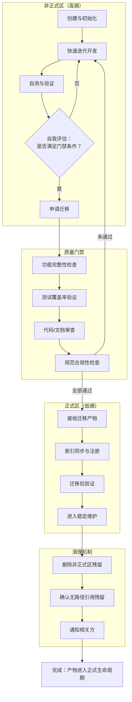
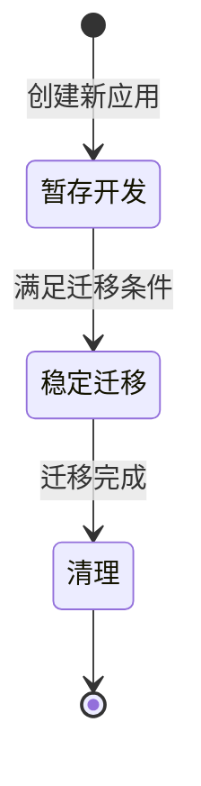

# 双区开发模型

## 来源

本方法论萃取自以下实践与洞察：

- `docs/retrospective/reports/retrospective-report-create-apps-directory.md` 关键发现 1："暂存→正式"双区开发模式具有通用性
- `.agents/protocols/app-development-workflow.md`：应用开发生命周期的三阶段规范（暂存开发 → 稳定迁移 → 清理），为本模型的核心实践载体
- `.agents/protocols/dependency-management.md`：`.temp/` 通用管理章程，定义了临时工作区的目录结构、清理机制与禁止提交条款，为本模型提供了非正式区的基础治理框架

## 核心思想

双区开发模型是一种通用的开发工作流范式，其核心思想可概括为：**将开发过程划分为两个具有不同治理强度的区域，通过单向的质量门禁将产物从高熵区迁移至低熵区**。

具体而言：

- **非正式区（高熵区）**：允许频繁修改、快速试错、不受审查约束。代码与文档在此区域进行初始探索与迭代开发，追求速度与灵活性。
- **正式区（低熵区）**：结构规范、通过质量审查、可对外引用。只有达到预设质量标准的产物才能进入此区域，追求稳定性与可维护性。
- **质量门禁**：两个区域之间的唯一通道，由一组可验证的条件构成（如功能稳定、测试通过、审查完成、文档完善），确保只有合格的产物能够迁移。
- **单向流动**：产物只能从非正式区流向正式区，禁止逆向流动。正式区内的修改应通过版本控制的分支或迭代机制完成，而非回退到非正式区。

这一模型的本质是将"探索"与"规范"两种相互矛盾的需求解耦——在高熵区保护创造力与迭代速度，在低熵区保护稳定性与可引用性，二者通过明确的门禁机制衔接。

## 模型图

**模型关键要素说明**：

| 要素 | 说明 |
|------|------|
| 非正式区 | 高熵环境，允许频繁修改、无审查约束、快速试错；产物状态不稳定，不可对外引用 |
| 正式区 | 低熵环境，结构规范、通过审查、可对外引用；产物状态稳定，纳入版本控制 |
| 质量门禁 | 一组可验证的通过条件，是进入正式区的唯一通道；全部条件必须同时满足 |
| 单向流动 | 产物只能从非正式区流向正式区，禁止逆向回退 |
| 清理机制 | 迁移完成后须清除非正式区残留，避免目录膨胀和状态混淆 |

## 本项目的实际应用

### 应用一：apps/ 应用开发工作流

本项目已将此模型具象化为应用开发生命周期规范（`.agents/protocols/app-development-workflow.md`），其映射关系如下：

| 模型要素 | 具体实现 |
|---------|---------|
| 非正式区 | `.temp/<app-name>/`：应用在暂存目录中进行初始开发与迭代 |
| 正式区 | `apps/<app-name>/`：应用迁移后进入正式工作空间，对外可引用 |
| 质量门禁 | 四项迁移条件：核心功能实现且测试通过、代码审查通过、无阻塞性缺陷、文档已编写 |
| 单向流动 | 禁止在 `apps/` 下直接启动新应用开发，禁止已迁移应用回退到 `.temp/` |
| 清理机制 | 迁移验证通过后删除 `.temp/<app-name>/` 目录，并通知相关智能体 |

工作流状态图（`app-development-workflow.md` 中定义）：

### 应用二：文档与中间产物管理

`dependency-management.md` 定义的 `.temp/` 子目录结构，承载了文档编写、日志记录、缓存管理等场景的"非正式→正式"路径：

| 非正式区路径 | 用途 | 迁移方向 |
|-------------|------|---------|
| `.temp/logs/` | 运行时日志暂存 | 有价值的日志可归档至 `docs/` 或复盘报告 |
| `.temp/cache/` | 临时缓存文件（设置过期时间） | 缓存仅用于加速，不进行迁移；过期自动清理 |
| `.temp/output/` | 任务中间产物 | 成熟产物可迁移至 `docs/` 或 `apps/` 对应位置 |

这种分层使得所有临时性工作都有明确的存放位置和生命周期终点，避免临时文件污染正式目录。

## 复用场景

双区开发模型适用于任何需要"初始探索 → 质量标准 → 正式发布"工作流的场景：

| 复用场景 | 非正式区（示例） | 正式区（示例） | 质量门禁（示例） |
|---------|-----------------|---------------|-----------------|
| 应用开发 | `.temp/<app-name>/` | `apps/<app-name>/` 或项目仓库 | 功能稳定、测试通过、审查完成、文档完善 |
| 文档编写 | `.temp/drafts/` | `docs/` 对应分类目录 | 内容完整、格式合规、链接有效、审查通过 |
| 配置管理 | `.temp/config-staging/` | 正式配置目录 | 语法校验通过、环境验证通过、回滚方案就绪 |
| 库/模块开发 | `.temp/<lib-name>/` | `vendor/<lib-name>/` 或包管理器 | API 稳定、测试覆盖达标、文档完善、依赖声明完整 |
| 复盘报告编写 | `.temp/reports/` | `docs/retrospective/reports/` | 结构完整、数据准确、洞察可追溯、建议可执行 |
| CI/CD 流水线 | 暂存分支 | 主分支（main/master） | 全部检查通过、审查批准、无合并冲突 |

## 约束与注意事项

### 一、必须定义清晰的质量门禁条件

质量门禁是双区模型的枢纽环节，其模糊程度直接决定模型的有效性。门禁条件必须满足以下原则：

- **可验证性**：每项条件均可通过自动化工具或人工审查客观判定，避免"代码质量良好"等主观表述
- **完备性**：门禁条件应覆盖功能正确性、质量标准、规范合规性三个维度
- **最小化**：条件数量不宜过多，否则会形成流程瓶颈；通常 3-5 项为宜

反面示例："代码达到生产级别"（不可验证）；正面示例："全部测试用例通过率 100%，且 P0/P1 缺陷数为零"（可验证）。

### 二、两个区域应有明确的路径映射规则

非正式区与正式区的目录结构应有清晰的对应关系，避免以下问题：

- 迁移时无法确定目标路径，需临时决策
- 多个非正式区产物映射到同一正式区位置，产生冲突
- 迁移后路径引用失效，需手动修正硬编码路径

推荐做法：非正式区与正式区采用同构的目录命名规则（如均使用 kebab-case），迁移时路径替换可机械完成。

### 三、迁移后必须清除非正式区残留

迁移完成后，非正式区中的原始文件可能产生以下问题：

- 后续开发者误操作非正式区的过期副本，导致并行修改
- `.temp/` 目录持续膨胀，增加存储开销和认知负担
- 非正式区与正式区各自独立演化，产生分歧

清理机制应包括三个步骤：(1) 删除非正式区原始目录；(2) 验证正式区产物可独立运行、无路径引用指向非正式区；(3) 通知相关方迁移完成。

### 四、两个区域应使用不同的 Git 追踪策略

| 区域 | Git 追踪策略 | 理由 |
|------|------------|------|
| 非正式区 | 通常不纳入版本控制（`.gitignore`） | 高熵状态下的频繁变更无版本控制价值，且可能包含敏感或临时数据 |
| 正式区 | 完整纳入版本控制 | 稳定产物的变更历史具有追溯价值，是团队协作的基础 |

本项目通过 `dependency-management.md` 的禁止提交条款和 `.gitignore` 配置实现了这一策略：`.temp/` 被 `.gitignore` 忽略，`apps/` 被显式纳入版本控制。

### 五、防止门禁退化

长期运行后，质量门禁可能出现退化现象：

- **形式化通过**：审查流于形式，未实际检查每项条件
- **条件腐蚀**：因"特殊情况"频繁豁免某些条件，导致门禁形同虚设
- **流程跳过**：直接绕过门禁在正式区进行开发

缓解措施：(1) 门禁检查项应尽量自动化，减少人为判断空间；(2) 对门禁豁免建立审批记录，定期回顾豁免合理性；(3) 通过 pre-commit hook 或 CI 检查阻断未经门禁的正式区写入。

### 六、模型适用性边界

双区开发模型并非适用于所有场景。以下场景中适用性较低：

- 单人项目的简单脚本（双区开销大于收益）
- 一次性任务（无需正式区维护）
- 对时效性要求极高的紧急修复（可在事后补齐门禁流程，而非绕过模型）

在这些场景中，可在保留模型思想的前提下简化流程，而非机械套用全部要素。

---

> **关联模块**：
> - `.agents/protocols/app-development-workflow.md` — 应用开发生命周期规范（本模型的核心实现）
> - `.agents/protocols/dependency-management.md` — 临时依赖管理流程（非正式区治理基础）
> - `docs/retrospective/patterns/methodology-patterns/governance-strategy/three-tier-governance.md` — 三层治理模型（正式区的治理框架）
> - `docs/retrospective/patterns/methodology-patterns/retrospective-knowledge/review-insight-export-loop.md` — 复盘→洞察→导出知识闭环（本模型来源于其洞察环节）
> - `docs/retrospective/reports/retrospective-report-create-apps-directory.md` — 项目复盘报告（本模型的洞察来源）
