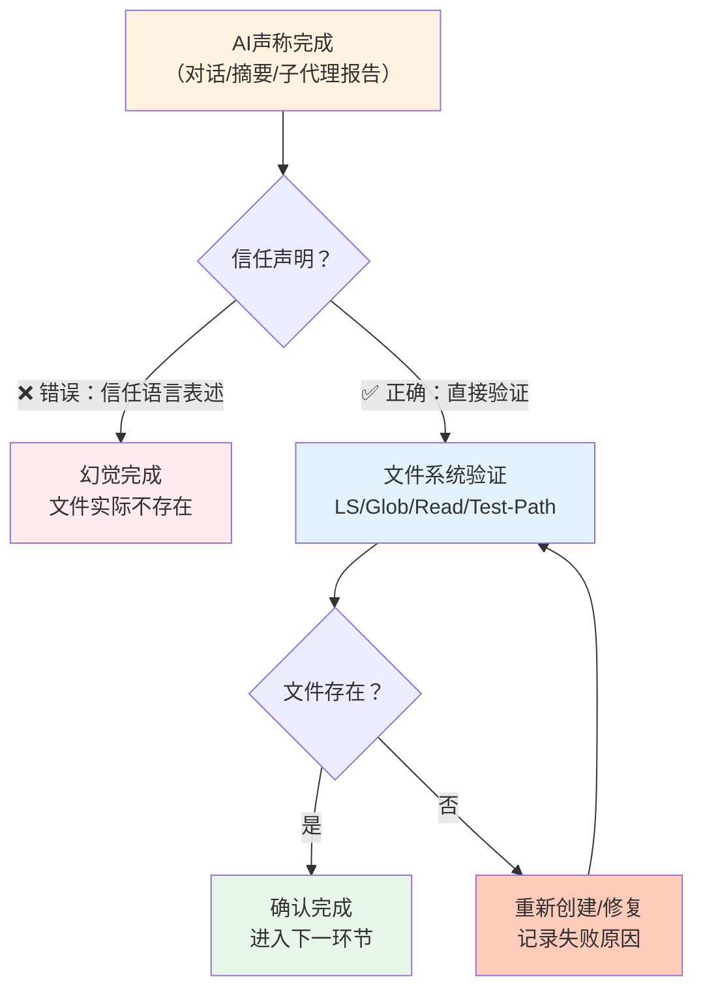

> **提炼自**：5个独立案例复盘（Headroom Wiki上下文幻觉、国内大模型对比Sub-Agent路径错误、Papi酱Wiki记忆依赖、ADHD知识结晶验证缺失、first-principles命令创建引用错误）

# 文件存在性验证门模式（File Existence Verification Gate）

## 模式类型

方法论模式（AI协作/工程实践/质量保障）

## 成熟度

L2 已验证（5次验证来源：2026-07-04 国内大模型对比、2026-07-06 Papi酱Wiki、2026-07-09 first-principles命令、2026-07-28 ADHD知识结晶、2026-08-03 Headroom Wiki）

## 适用场景

任何AI辅助创建文件/代码/文档/产物后，需要确认产物真实存在的场景。这是AI协作的基础质量门，适用于：

| 场景 | 适用度 | 说明 |
|------|--------|------|
| AI批量创建文档/代码文件 | ✅✅✅ 核心场景 | 多文件创建后最容易出现"声称完成但实际缺失" |
| 子代理（Sub-Agent）执行任务 | ✅✅✅ 核心场景 | 子代理返回"完成"必须实际验证产物存在 |
| 长上下文/多轮对话任务 | ✅✅✅ 核心场景 | 上下文压缩后状态追踪易产生幻觉 |
| 对话恢复（summary续接） | ✅✅✅ 核心场景 | 摘要信息可能失真，必须重新验证文件状态 |
| 单文件小修改 | ✅✅ 推荐 | 即使是小修改，改完后也应Read确认内容正确 |
| 纯对话问答/分析（无文件产出） | ❌ 不适用 | 无文件产出时无需此验证 |

## 问题背景

AI辅助文件创建存在结构性风险——**"说完成了"不等于"文件存在"**：

1. **上下文压缩幻觉**：长对话中AI的工作记忆采用压缩表示，容易混淆"计划执行"和"已经执行"的状态，产生"完成幻觉"
2. **子代理自报告偏差**：子代理返回"已完成"仅是语言层面的表述，可能因路径错误、权限问题、执行中断导致文件实际未创建
3. **对话摘要失真**：会话恢复时摘要声称任务已完成，但摘要可能基于中间状态而非最终状态
4. **记忆不可靠**：依赖对话历史记忆"刚才创建过"是危险的——AI会"记得"做过某事，即使实际Write/Edit工具调用失败了

这类似于分布式系统中的拜占庭将军问题——不能信任其他节点（包括过去的自己）的状态报告，必须直接验证。

## 核心原则：直接感知验证原则



| 原则 | 说明 |
|------|------|
| **声明≠事实** | 对话中的"已完成"、"创建成功"、"文件已写入"仅是语言表述，不代表文件系统真实状态 |
| **直接感知优先** | 必须通过实际文件系统调用（LS/Glob/Read/Test-Path）验证，而非依赖对话记忆或子代理报告 |
| **创建即验证** | 文件创建（Write/Edit）后立即验证，不把验证留到最后批量做 |
| **批量分批验证** | 批量创建时每3-5个文件验证一次，不要等全部"完成"后才发现第一批就错了 |
| **续会话重验证** | 对话恢复/上下文续接时，第一件事是验证上次声称完成的文件是否真实存在 |

## 核心做法：验证三步法

### 第一步：创建后立即验证（即时验证）

每调用Write/Edit工具创建或修改文件后，立即执行验证：

| 操作 | 验证方法 | 验证目标 |
|------|---------|---------|
| 创建新文件 | `LS <目录>` 确认文件在列表中 | 文件存在 |
| 修改文件 | `Read <文件>` 确认修改内容正确 | 内容正确 |
| 移动/重命名 | `LS <旧目录>` 确认旧位置不存在 + `LS <新目录>` 确认新位置存在 | 移动成功 |
| 删除文件 | `LS <目录>` 或 `Test-Path <文件>` 确认已删除 | 删除彻底 |

```powershell
# ❌ 错误做法：创建后直接宣布完成
Write-File "path/to/file.md" $content
Write-Host "文件已创建完成！"

# ✅ 正确做法：创建后立即验证
Write-File "path/to/file.md" $content
if (Test-Path "path/to/file.md") {
    $content = Get-Content "path/to/file.md" -Raw
    if ($content -match "预期关键内容") {
        Write-Host "✅ 文件验证通过"
    }
}
```

### 第二步：批量任务分批验证（批量验证）

当任务涉及创建3个以上文件时，采用分批验证策略：

1. **创建前**：先LS目标目录，记录初始文件列表
2. **每3-5个文件**：执行一次LS，确认新文件都在目录中
3. **全部完成后**：用Glob匹配预期文件模式，与计划清单对比
4. **抽样Read验证**：随机选1-2个文件Read内容，确认不是空文件或错误内容

```
计划创建10个文件（00.md ~ 09.md）：
├─ 创建 00-02.md → LS验证 → ✅ 3个文件都在
├─ 创建 03-05.md → LS验证 → ✅ 3个文件都在
├─ 创建 06-09.md → Glob *.md验证 → ✅ 10个文件齐全
└─ 抽样Read 00.md和09.md → ✅ 内容正确
```

参考模式：[batched-creation-independent-review.md](batched-creation-independent-review.md)

### 第三步：续会话重验证（恢复验证）

对话恢复/上下文续接时，**第一件事**是验证文件状态：

1. 不要相信摘要中的"已完成"声明
2. 进入目标目录LS，确认上次声称创建的文件真实存在
3. 如果发现文件缺失，直接重新创建，不要纠结"为什么摘要说完成了"
4. 将重验证结果记录在todo/spec中，防止再次幻觉

```
场景：摘要说"Wiki 28个文件已创建完成"
恢复时正确操作：
1. LS d:\AI\docs\knowledge\learning\headroom-context-compression-wiki\
2. 发现目录不存在或只有部分文件
3. 直接重新创建缺失文件
4. 全部验证通过后再继续后续任务
```

## 反模式

| 反模式 | 为什么错误 | 正确做法 |
|--------|----------|---------|
| 信任AI/子代理的"已完成"声明 | 上下文压缩和自报告偏差会导致幻觉完成，语言表述≠文件系统事实 | 任何完成声明后必须用LS/Glob/Read实际验证 |
| 创建完一批文件后最后才验证 | 如果第一个文件路径就错了，后面全部白做 | 分批验证，每3-5个文件检查一次 |
| 依赖对话记忆"刚才创建过" | AI会"记得"执行过Write调用，即使调用失败了或路径错了 | 不依赖记忆，只认文件系统的当前状态 |
| 只验证第一个文件就认为全部OK | 批量创建时可能前几个成功、中间某个失败、后面路径错了 | 用Glob统计文件数量，或逐个LS确认 |
| 续会话时直接基于摘要继续 | 摘要可能基于中间状态，也可能完全幻觉 | 续会话第一件事：LS验证关键目录和文件 |
| 验证文件存在但不Read内容 | 文件可能存在但是空文件、错误内容、或写到了错误路径 | 关键文件除了存在性验证，还应抽样Read确认内容 |
| 简单任务跳过验证（"就改一个字还需要验证？"） | 简单任务恰恰是最容易产生"我记得改了"的过度自信偏差；而且路径错误、编码问题等不随任务复杂度降低 | 简单任务改完后顺手Read确认，10秒成本避免30分钟返工 |

参考风险提醒：[simple-task-high-risk.md](../governance-strategy/simple-task-high-risk.md)

## 检验标准

做完之后怎么知道做对了？

1. **即时验证**：每个Write/Edit后有对应的LS/Read验证记录
2. **批量数量对**：Glob统计的文件数量与计划一致
3. **续会话重验证**：对话恢复后第一操作是LS而非继续任务
4. **无幻觉返工**：没有出现过"用户问文件在哪发现找不到"的情况
5. **抽样内容对**：随机Read的文件内容与预期一致，不是空文件或错位内容

## 跨场景迁移示例

| 应用场景 | 验证方法 | 验证时机 |
|---------|---------|---------|
| **AI写代码** | 编译/运行测试 + Read源码确认修改 | 每个函数/文件写完后立即编译 |
| **AI创建文档** | LS确认文件存在 + Read确认内容 | 每个章节写完后LS，批量完成后Glob统计 |
| **子代理执行任务** | 主代理收到"完成"报告后，显式LS/Read子代理声称创建的文件 | 子代理返回后立即验证，不直接信任 |
| **配置文件修改** | 读取配置确认关键配置项正确 | 修改后立即Read，启动服务前再确认 |
| **Shell批量操作** | 操作后Test-Path/ls确认目标文件状态 | 每个关键操作后检查返回码并验证文件状态 |
| **Git操作** | git status确认预期文件已暂存/提交 | git add后git diff --cached验证 |

## 实际案例

### 案例1：Headroom Wiki上下文压缩幻觉（2026-08-03）——本模式直接来源

- **现象**：对话摘要声称"Wiki 28个文件+复盘8个文件已创建"，实际磁盘上只有3个Spec规划文件（spec.md/tasks.md/checklist.md），Wiki和复盘文件全部不存在
- **根因**：多轮对话中上下文压缩，AI混淆了"计划创建"和"已经创建"的状态
- **修复**：用LS发现问题后重新创建所有39个文件，经Glob验证真实存在后才提交
- **教训**："说完成了"是最不可信的声明，必须用文件系统命令直接验证

### 案例2：国内大模型对比学习Sub-Agent路径错误（2026-07-04）

- **现象**：验证Sub-Agent报告了错误的文件路径，声称文件在spec规定路径下
- **根因**：Sub-Agent假设了spec规定的路径，未实际读取文件验证存在性
- **修复**：在Sub-Agent协议中新增"必须实际读取文件验证存在性"要求
- **教训**：不仅主代理要验证，子代理的验证环节也必须实际读文件，不能假设路径正确

### 案例3：Papi酱Wiki上下文压缩后目录信息丢失（2026-07-06）

- **现象**：上下文压缩后summary中目录信息不完整，依赖记忆判断文件位置
- **根因**：依赖记忆而非LS验证，压缩后的摘要丢失了精确路径信息
- **教训**：路径信息属于易丢失的精确信息，必须通过LS实时获取，不能从压缩摘要中恢复

### 案例4：ADHD知识结晶任务验证遵循度断崖（2026-07-28）

- **现象**：审计发现前半段（规划/准备/搜索）遵循度50-100%，后半段（验证/闭环/对比检查）遵循度0-50%，主代理信任子代理自报告跳过逐文件验证
- **根因**：任务疲劳+对子代理的过度信任导致验证环节被跳过
- **教训**：验证是最容易在任务后半段被省略的环节，必须作为强制质量门嵌入流程，不能依赖自觉

### 案例5：first-principles命令创建引用错误（2026-07-09）

- **现象**：spec中引用了self-cognition.md作为关联模块，但实施阶段发现该文件不存在
- **根因**：spec阶段写下引用时未验证目标文件存在性
- **修复**：沉淀spec-reference-validation-pattern，spec阶段增加引用验证检查项
- **教训**：不仅创建文件后需要验证，引用其他文件时也需要验证引用目标存在

## 与其他模式的关系

| 关联模式 | 关系类型 | 关系说明 |
|---------|---------|---------|
| [generation-validation-closed-loop.md](generation-validation-closed-loop.md) | 上下游关系 | 本模式是生成-验证闭环在"文件存在性"维度的具体化：生成后必须验证产物真实存在 |
| [batched-creation-independent-review.md](batched-creation-independent-review.md) | 互补关系 | 批量创建独立审查关注"内容质量审查"，本模式关注"存在性验证"，两者互补 |
| [subagent-atomic-task-template.md](subagent-atomic-task-template.md) | 嵌入关系 | 子代理原子任务模板中的"验收标准"环节应包含本模式的文件存在性验证 |
| [edit-verify-separation.md](edit-verify-separation.md) | 理念一致 | 编辑-验证分离强调编辑和验证由不同步骤/角色完成，本模式是其在文件操作的具体应用 |
| [visual-operation-closed-loop.md](visual-operation-closed-loop.md) | 理念一致 | 可视化操作闭环要求操作后通过视觉确认结果，本模式是文件系统层面的同类理念 |
| [simple-task-high-risk.md](../governance-strategy/simple-task-high-risk.md) | 风险提醒 | 简单任务最容易跳过验证（"就改一个字"），本模式明确简单任务也必须验证 |
| [spec-reference-validation-pattern.md](spec-workflow/spec-reference-validation-pattern.md) | 同领域模式 | spec引用验证关注"引用目标存在性"，是本模式在文档引用场景的变体 |

## Changelog

- 2026-08-03 | create | 初始版本，从Headroom Wiki上下文压缩幻觉问题+4个历史案例沉淀，L2成熟度，5次验证实例
