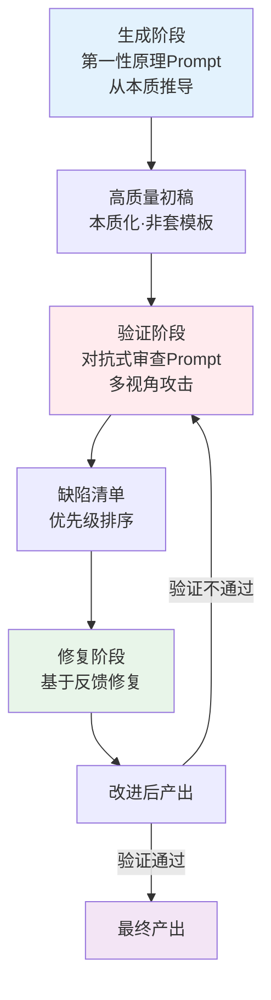

> **提炼自**：[Vibe Coding两大神级Prompt学习分析洞察3](../../../reports/insight-extraction/external-learning/retrospective-vibe-coding-prompts-learning-analysis-20260704/insights/03-generation-validation-loop.md)

# 生成-验证闭环模式（Generation-Validation Closed Loop）

## 模式类型

方法论模式（AI协作/质量保障）

## 成熟度

L2 已验证（3次验证来源：卡兹克文章多场景示例、代码开发场景验证、写作审查场景验证）

## 适用场景

任何需要"高质量产出 + 高质量验证"的双保险任务。适用于：

| 场景 | 适用度 | 说明 |
|------|--------|------|
| AI辅助代码开发 | ✅✅✅ 核心场景 | 第一性原理生成架构 + 多Agent对抗审查安全/性能/逻辑 |
| AI辅助写作创作 | ✅✅✅ 核心场景 | 从核心论点推导结构 + 多读者视角攻击逻辑漏洞 |
| 商业方案设计 | ✅✅✅ 核心场景 | 从市场规律推导模式 + 多利益相关方攻击风险 |
| 复杂人生决策 | ✅✅ 推荐 | 从核心价值观推导选择 + 多视角攻击风险/机会成本 |
| 架构设计评审 | ✅✅ 强烈推荐 | 第一性原理设计 + 对抗式审查找缺陷 |
| 简单机械性任务 | ❌ 不适用 | 简单任务不需要双阶段，直接执行即可 |

## 问题背景

单一生成Prompt或单一审查Prompt都有结构性缺陷：
- 只生成不验证：AI会产生自信的错误（幻觉、逻辑漏洞、边界情况遗漏）
- 只验证不生成：没有高质量初稿作为审查基础，审查缺乏靶子
- 生成和验证由同一个Agent完成：确认偏误导致"自审自过"，发现不了自己的盲点

第一性原理Prompt和对抗式审查Prompt不是孤立的两类技巧，而是构成完整闭环：生成管"从0到1的高质量产出"，验证管"从1到0.99的缺陷修复"，二者结合才能实现质量双保险。

## 核心原则：双阶段闭环逻辑

| 阶段 | 使用方法 | 目标 | 核心要求 |
|------|---------|------|---------|
| **生成阶段** | 第一性原理思维/Prompt | 从本质推导，产出高质量初稿 | 禁止类比套模板，必须追溯底层原理 |
| **验证阶段** | 对抗式审查/多Agent攻击 | 多视角攻击，发现缺陷 | 证伪导向而非证明正确，主动找漏洞 |
| **修复阶段** | 基于缺陷清单逐项修复 | 修复验证发现的问题 | 必须对应缺陷清单，不做无关改动 |
| **迭代** | 闭环重复直到验证通过 | 持续优化 | 每次迭代聚焦修复，不发散 |

## 核心做法：生成-验证四步法

### 第一步：生成阶段——第一性原理推导

不要让AI"参考类似案例"或"按照惯例做"，而是强制追溯本质：

1. 明确核心目标和约束条件（不要预设方案）
2. 追问底层原理/物理规律/第一性原则
3. 从本质推导出方案骨架，而非类比已有方案
4. 产出初稿时标注每个关键决策的本质依据

| ❌ 错误生成Prompt | ✅ 正确生成Prompt（第一性原理） |
|------------------|------------------------------|
| "参考XX项目做一个用户系统" | "用户系统的本质是什么？从身份认证、权限管理、审计追踪三个底层需求推导设计" |
| "写一篇关于AI的文章" | "这篇文章要改变读者的什么认知？从核心论点反向推导结构" |

参考模式：[first-principles-prompt-pattern.md](first-principles-prompt-pattern.md)

### 第二步：验证阶段——多视角对抗攻击

生成完成后，绝对不要让同一个Agent"检查一下"——必须切换到攻击者视角：

1. 定义多个攻击者角色（如安全专家、性能专家、最终用户、竞争对手）
2. 每个角色从自身视角全力攻击方案，找漏洞而非赞美
3. 按严重程度排序缺陷（致命/严重/一般/建议）
4. 每个缺陷必须有具体的反例或失败场景，不能只说"可能有问题"

| ❌ 错误验证Prompt | ✅ 正确验证Prompt（对抗式） |
|------------------|--------------------------|
| "帮我检查一下这个方案有没有问题" | "你是一个吹毛求疵的安全评审员，专门找逻辑漏洞。请列出这个设计中3个最致命的缺陷，每个缺陷必须给出具体的攻击路径" |
| "看看这篇文章写得怎么样" | "你是这篇文章的反对者，列出5个最有说服力的反驳理由，每个理由必须有证据支撑" |

参考模式：[adversarial-review-prompt-pattern.md](adversarial-review-prompt-pattern.md)

### 第三步：修复阶段——对应缺陷逐项修复

修复阶段最容易犯的错误是"边修边改"导致引入新问题：

1. 严格按照缺陷清单逐项修复，不做清单外的改动
2. 每个修复项标注"修复了哪个缺陷"
3. 如果修复引入新假设，必须回退到第一步重新验证该假设
4. 修复后再次进入验证阶段，而非直接认为完成

### 第四步：迭代闭环——直到验证通过

- 小缺陷：直接修复，快速验证
- 大缺陷：回退到生成阶段，重新从本质推导（说明初稿的基础假设有问题）
- 迭代2-3轮仍无法通过：说明问题定义本身有问题，回退到需求澄清

## 反模式

| 反模式 | 为什么错误 | 正确做法 |
|--------|----------|---------|
| 生成后让同一个Agent"自检" | 确认偏误：自己生成的东西自己很难发现问题，大脑（AI也一样）会自动补全逻辑漏洞 | 必须切换视角/角色/Agent，用对抗式审查 |
| 只做一轮生成-验证就结束 | 第一轮验证发现的是表面缺陷，深层缺陷需要多轮迭代 | 至少2轮验证，致命缺陷必须重新生成而非小修小补 |
| 验证阶段只说优点或模糊建议 | "写得不错""建议优化"是无效反馈，无法指导修复 | 每个缺陷必须具体，有攻击路径/反例/失败场景 |
| 生成时允许类比和参考案例 | 类比走System1捷径，会引入路径依赖，无法产生突破性方案 | 生成阶段必须强制第一性原理，参考案例放在验证后再看 |
| 修复时随意重构/优化 | 修复引入新问题是质量滑坡的主要原因 | 修复阶段严格聚焦清单内缺陷，优化作为下一轮生成的输入 |
| 简单任务也用完整闭环 | 杀鸡用牛刀，简单任务双阶段反而降低效率 | 根据任务复杂度判断：简单任务直接生成+快速检查即可 |

## 检验标准

做完之后怎么知道做对了？

1. **生成质量**：初稿中每个关键决策都有本质依据，没有"行业惯例""大家都这么做"的理由
2. **验证质量**：缺陷清单具体可执行，每个缺陷都有攻击场景而非模糊评价
3. **修复对应**：修复项100%对应缺陷清单，没有无关改动
4. **验证闭环**：最终产出经过至少1轮对抗审查，致命/严重缺陷清零
5. **跨场景迁移**：该流程可以自然应用到非代码场景（写作/决策/方案），而非仅限编程

## 跨场景迁移示例

| 应用场景 | 生成阶段（第一性原理） | 验证阶段（对抗式审查） |
|---------|---------------------|---------------------|
| **代码开发** | 从用户需求本质推导架构，不参考"类似项目" | 多Agent攻击：安全专家/性能专家/边界测试员分别找漏洞 |
| **写作创作** | 从核心论点推导文章结构，不套"爆款模板" | 多读者视角攻击：反对者/外行/专家分别找逻辑漏洞 |
| **商业方案** | 从市场基本规律推导商业模式，不模仿竞品 | 多利益相关方攻击：财务/法律/运营/竞争对手分别找风险 |
| **人生决策** | 从个人核心价值观推导选择，不随大流 | 多时间视角攻击：1天/1年/10年后回头看，风险是什么 |
| **架构评审** | 从问题本质推导设计，不套用"最佳实践" | 多质量属性攻击：性能/安全/可维护性/可扩展性分别找缺陷 |

## 实际案例

### 案例：卡兹克Vibe Coding双Prompt模式（本模式来源）

卡兹克提出的两大神级Prompt正是生成-验证闭环的经典实现：
- **第一性原理Prompt**："你是一个使用第一性原理思考的专家..." → 生成阶段，打断类比推理，从本质推导
- **对抗式审查Prompt**："你是一个代码审查者，专门找bug..." → 验证阶段，多视角攻击，发现缺陷

文章展示了该闭环在代码审查、写作、商业决策、人生选择等多场景的通用性。

### 案例：本项目第一性原理学习的反面验证

学完生成-验证闭环后，在简单格式更新任务中恰恰因为只做了"生成"（类比套用file:///格式）而没有"验证"（查开发规范），导致批量格式错误。这从反面证明了：
1. 即使知道闭环模式，System1也会跳过验证阶段
2. 简单任务更需要强制闭环（参考[simple-task-high-risk.md](../governance-strategy/simple-task-high-risk.md)）
3. 闭环不能只靠记忆，需要嵌入流程（参考[pre-decision-three-checks.md](pre-decision-three-checks.md)）

## 与其他模式的关系

| 关联模式 | 关系类型 | 关系说明 |
|---------|---------|---------|
| [first-principles-prompt-pattern.md](first-principles-prompt-pattern.md) | 组成部分 | 第一性原理Prompt是本模式生成阶段的核心工具 |
| [adversarial-review-prompt-pattern.md](adversarial-review-prompt-pattern.md) | 组成部分 | 对抗式审查Prompt是本模式验证阶段的核心工具 |
| [multi-agent-closed-loop-execution.md](../../architecture-patterns/multi-agent-closed-loop-execution.md) | 架构级对应 | 多Agent闭环执行是本模式在Agent架构层的实现 |
| [batched-creation-independent-review.md](batched-creation-independent-review.md) | 互补 | 批量创建独立审查是本模式在批量操作场景的变体 |
| [cognitive-practice-gap-recursive-defense.md](../governance-strategy/cognitive-practice-gap-recursive-defense.md) | 防御补充 | 认知偏差递归防御解释了为什么人/AI会跳过验证阶段，以及如何建立强制机制 |
| [simple-task-high-risk.md](../governance-strategy/simple-task-high-risk.md) | 风险提醒 | 简单任务是闭环最容易被跳过的高风险区 |

## Changelog

- 2026-07-13 | create | 初始版本，从Vibe Coding Prompt学习分析洞察3沉淀，L2成熟度，3次验证实例
