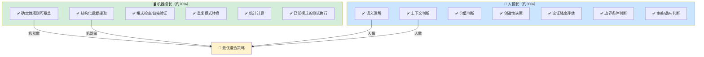

> **提炼自**：[第一性原理知识体系复盘关键洞察](../../../reports/project-reports/retrospective-first-principles-knowledge-system-20260710/supporting-analysis/key-insights.md#INSIGHT-010)

# 人机协作70/30分工定律（Human-AI Collaboration 70/30 Rule）

## 模式类型

方法论模式（AI协作/架构设计）

## 成熟度

L2 已验证（3次验证来源：知识图谱混合策略、质量双维度检查、知识图谱配置与代码分离架构）

## 适用场景

AI辅助内容创作、工具开发、数据处理、知识工程等所有人机协作场景，划分人与AI/自动化的最优分工边界。适用于：

| 场景 | 适用度 | 说明 |
|------|--------|------|
| AI辅助内容/文档创作 | ✅✅✅ 核心场景 | 确定哪些部分AI生成，哪些部分必须人工撰写/审查 |
| 自动化工具设计 | ✅✅✅ 核心场景 | 确定哪些功能自动化，哪些必须人工介入 |
| 数据处理/ETL流程 | ✅✅✅ 核心场景 | 结构化提取自动化，语义关系人工标注 |
| 质量保证体系设计 | ✅✅✅ 核心场景 | 形式合规自动化，内容质量人工判断 |
| 低代码/无代码平台 | ✅✅ 强烈推荐 | 通用逻辑固化为平台能力，定制逻辑暴露为配置 |
| 软件工程架构 | ✅✅ 强烈推荐 | 不变项写死在代码里，可变项配置化 |
| 全自动流水线 | ⚠️ 间接适用 | 纯机械性任务可以接近100%自动化，但需要人工监控兜底 |
| 纯创造性艺术 | ❌ 不适用 | 创意工作中人的比例远高于70%，不适用这个比例 |

## 问题背景

在AI辅助开发和自动化工具设计中，存在两种截然相反但同样有害的意识形态偏见：

### 偏见1：技术乐观主义——"追求100%全自动"

认为"自动化就是好的，越自动化越好"，为了自动化那最后30%需要投入不成比例的资源，而且效果往往不好：
- 最后30%往往是需要语义理解、价值判断、上下文感知的部分
- 为了全自动，要么大幅降低质量标准（"自动提取的语义关系虽然不准，但总比没有好"）
- 要么投入10倍的资源试图解决AI目前不擅长的问题，ROI极低
- 更危险的是：全自动产生"已经搞定了"的虚假安全感，反而漏掉了关键的人工审查

### 偏见2：工匠情怀——"坚持100%全手工"

认为"机器做的质量不行，必须全手工才放心"，放弃70%的效率提升：
- 在机械重复工作上浪费大量认知资源
- 70%的结构化工作其实机器做得比人好（更快、更一致、不会累）
- 人应该把精力集中在机器做不了的30%高价值工作上
- 全手工不仅效率低，而且人在重复工作中会疲劳走神，质量反而不稳定

这两种偏见的共同根源是**意识形态纯粹性优先于实际效果**：不是从"什么方案整体效果最好"出发，而是从"全自动/全手工"的理念出发。

### 70/30定律的提出

在第一性原理知识体系构建中，多个场景独立验证了同一个最优分工比例：

| 场景 | 机器做（约70%） | 人做（约30%） | 纯自动/纯手工的问题 |
|------|----------------|--------------|-------------------|
| 知识图谱构建 | 结构化数据（术语、人物、时间、文件引用）100%自动提取 | 语义关系（因果、批判、演化）手工补充 | 纯NLP自动提取准确率不足；纯手工效率低难维护 |
| 质量保证 | 形式合规（格式/链接/统计）自动化检查 | 内容质量（审慎态度/批判性视角）人工审查 | 纯自动无法判断内容质量；纯手工检查格式效率极低 |
| 工具架构（知识图谱） | 不变项（通用提取逻辑、渲染框架）固化在代码中 | 可变项（节点类型、关系类型、构建规则）暴露为配置 | 全代码写死无法复用；全配置化框架本身开发成本极高 |

三个完全不同的场景，最优分工都是约70%机器+30%人——这不是巧合，而是由人和机器的能力边界决定的。

## 核心原则：人机能力边界划分

70/30不是精确的数字，而是一个**数量级指导原则**：机器做大部分（约70%），人做小部分（约30%），关键是正确划分边界——机器做人擅长的，人做机器不擅长的。

### 机器擅长什么（约70%）

只要是可以用明确规则描述、不需要语义理解、重复执行的工作，机器做得比人好：

| 能力 | 为什么机器更擅长 | 典型任务 |
|------|----------------|---------|
| 结构化数据提取 | 速度快、不会遗漏、一致性100% | 从文档中提取术语、日期、人名、引用关系 |
| 格式/合规检查 | 不知疲倦、规则执行严格 | 链接检查、格式验证、命名规范检查、Lint |
| 重复模式转换 | 批量执行不会出错 | 格式批量转换、路径批量更新、模板批量应用 |
| 统计计算 | 计算速度快、准确率100% | 字数统计、覆盖率计算、指标统计、报表生成 |
| 已知模式测试执行 | 严格按照用例执行，不会"觉得没问题"就跳过 | 单元测试、回归测试、CI流水线 |

**关键特征**：有明确对错标准、可以形式化描述、重复执行。

### 人擅长什么（约30%）

需要理解语义、判断价值、感知上下文的工作，机器目前（以及可预见的未来）做不好：

| 能力 | 为什么人更擅长 | 典型任务 |
|------|----------------|---------|
| 语义关系识别 | 理解"因果""批判""演化"等抽象关系 | 知识图谱中语义关系的标注和验证 |
| 论证强度评估 | 判断一个论点是否有说服力、证据是否充分 | 内容审查、论文评审、Code Review中的逻辑审查 |
| 批判性视角 | 发现隐含假设、识别逻辑漏洞、提出反例 | 对抗性审查、边界条件分析、方法论自反性测试 |
| 偏差识别 | 识别确认偏差、幸存者偏差等认知偏差 | 内容中的偏见识别、方法论原教旨主义识别 |
| 审美/品味判断 | 判断什么是"好的"设计、"清晰的"表达 | 文档结构设计、UI设计、代码可读性判断 |
| 边界条件判断 | 判断"什么时候规则不适用" | 异常场景处理、方法论适用边界判断 |
| 创造性决策 | 提出全新的解决方案、建立新的连接 | 架构设计、产品创新、理论构建 |

**关键特征**：需要理解意义、依赖上下文、涉及价值判断、需要创造性。

## 核心规则

### 规则1：边界划分基于实际能力，而非意识形态

划分人机分工时，第一个问题不是"我想实现多少自动化"，而是：
1. 这个任务中，哪些部分是有明确规则、机器能做得又快又好的？→ 100%自动化
2. 哪些部分是需要语义理解/价值判断、机器做不好的？→ 必须人工做
3. 不要为了"自动化率"这个数字，强行让机器做它不擅长的事——最后要么质量差，要么成本极高

- ❌ 错误出发点："我们的目标是90%自动化率"
- ✅ 正确出发点："机器能做好的全部自动化，机器做不好的必须人来做，整体效果最优是目标"

### 规则2：配置与代码分离——架构设计中的70/30定律

70/30定律在软件架构中的直接体现就是"配置与代码分离"原则：
- **70%不变项**：通用逻辑、框架代码、不变的核心流程——固化在代码中，机器执行，可复用
- **30%可变项**：定制化规则、业务逻辑、场景特定配置——暴露为配置/DSL，人来编写和维护

这正是知识图谱工具重构（决策11）采用的架构：
- 通用提取逻辑、渲染框架、图算法（70%）→ Python代码，写一次所有场景复用
- 节点类型定义、关系类型定义、提取规则（30%）→ TOML配置，新场景只改配置不改代码

### 规则3：最后30%不要强行自动化，要做"人机接口"设计

不要花大力气去自动化最后30%——这部分ROI极低。相反，应该设计良好的人机接口：
- 机器先自动完成70%，输出结构化的中间结果
- 人在中间结果基础上，专注完成剩下30%的高价值工作
- 设计好的界面/工具让人能高效地完成这30%，而不是让人从头做

| 反模式 | 正确做法 |
|--------|---------|
| 花3个月开发NLP模块自动提取语义关系，准确率60% | 机器先提取100%结构化数据，生成待标注的候选关系列表，人花20%时间标注/修正剩下30% |
| 试图让AI自动审查内容的批判性视角 | 机器先做格式/链接/统计检查，输出checklist，人对照checklist做批判性审查 |
| 为了"无代码"把所有逻辑都做成可视化配置，框架本身复杂度爆炸 | 70%通用逻辑写代码，30%定制逻辑做配置，二者兼顾效率和灵活性 |

### 规则4：警惕"全自动"的虚假安全感

100%自动化（即使技术上能做到）往往比70%自动化更危险：
- 全自动会让人放松警惕，不再审查结果
- 但没有任何自动化是100%准确的，总会有边缘情况
- 70%自动化+30%人工审查，整体质量反而比100%全自动更高，因为：
  1. 机器不会疲劳，70%的基础工作质量稳定
  2. 人只需要集中精力在30%的高价值判断上，不会因为疲劳走神
  3. 人知道自己需要审查这30%，不会产生"已经全自动搞定了"的虚假安全感

### 规则5：警惕"全手工"的质量不稳定

反过来，100%全手工也不是高质量的保证：
- 人在做重复工作时会疲劳、会走神、会犯低级错误（链接写错、格式不一致）
- 70%自动化把人从重复劳动中解放出来，人才能把精力集中在真正需要判断力的地方
- 让机器做机器擅长的，人做人擅长的——二者的结合比任何单一方面都强

## 反模式

| 反模式 | 为什么错误 | 正确做法 |
|--------|----------|---------|
| 追求100%自动化 | 最后30%需要语义/价值判断，强行自动化要么质量差要么成本极高；还会产生虚假安全感 | 70%自动化+30%人工，整体效果最优 |
| 坚持100%全手工 | 70%的机械重复工作机器做得更快更好，全手工浪费认知资源且质量不稳定 | 能自动化的全部自动化，人专注于高价值部分 |
| 自动化率KPI导向 | 为了凑自动化率数字，强行让机器做不擅长的事，ROI极低且质量下降 | 以整体效果（质量+效率）为导向，不以自动化率为目标 |
| 全自动后不做人工审查 | 没有任何系统是100%准确的，虚假安全感导致漏过关键错误 | 即使自动化覆盖率很高，最后30%的关键判断必须有人工审查 |
| 机器输出后让人从头重做 | 机器做了70%，人觉得"机器做的不行"又从头做一遍，浪费了机器的工作 | 设计好人机接口，人在机器输出基础上修改完善，不是从头做 |
| 配置化过度设计 | 为了"灵活"把所有逻辑都做成配置，框架本身复杂度爆炸，学习成本极高 | 70%不变项写代码（稳定、高效），30%真正可变的部分做配置 |
| 人机分工一成不变 | 随着AI能力提升，边界是动态变化的，今天需要人做的事明天可能机器就能做 | 定期重新评估分工边界，持续把更多工作移交给机器，但永远保留人对关键判断的掌控 |

## 实际案例

### 案例1：知识图谱构建的70/30混合策略（本模式来源）

| 方案 | 自动化率 | 效果 | 问题 |
|------|---------|------|------|
| 纯手工构建 | 0% | 语义关系准确，但效率极低，200个节点的图谱要做一周；更新维护困难 | 70%的机械提取工作浪费人力，人疲劳了还会写错 |
| 纯NLP自动提取 | 100% | 速度快，5分钟生成，但语义关系准确率不足50%，有大量噪声和错误 | 最后30%的语义理解NLP做不好，全自动结果不可用 |
| **70/30混合策略** | **70%** | 机器100%自动提取结构化数据（术语、人物、时间、引用）→ 人只需要标注/修正语义关系（因果/批判/演化） | 整体效率提升3倍，准确率保持在95%以上；人只需要做最有价值的语义判断部分 |

最终采用70/30混合策略，成为知识图谱构建的标准方法。

### 案例2：质量保证三层体系中的人机分工

质量保证三层模型（见[quality-assurance-three-layer-model.md](../governance-strategy/quality-assurance-three-layer-model.md)）本质上就是70/30定律的应用：

| 层 | 负责人/机器 | 占比 | 内容 |
|----|-----------|------|------|
| 层1：自动化工具 | 机器100% | 约60% | 格式检查、链接验证、统计指标、语法/类型检查 |
| 层2：Checklist审查 | 人+机器辅助 | 约20% | 按照yes/no清单检查，机器可以先做预检查，人做最终判断 |
| 层3：批判性审查 | 人100% | 约20% | 语义理解、论证强度、批判性视角、边界条件 |

机器负责层1（60%）+ 层2的预检查（10%）= 约70%；人负责层2的最终判断（10%）+ 层3（20%）= 约30%——完美符合70/30定律。

### 案例3：知识图谱工具架构的配置与代码分离

v1.4知识图谱脚本是100%专用代码（0%配置），无法复用；v1.7重构后：
- 70%：通用提取逻辑、渲染框架、图算法——Python代码固化，所有场景复用
- 30%：节点类型、关系类型、提取规则——TOML配置，新场景只改配置不改代码

这是70/30定律在架构设计中的直接体现，重构后新场景开发时间从2天缩短到2小时。

## 与其他模式的关系

| 关联模式 | 关系类型 | 关系说明 |
|---------|---------|---------|
| [quality-assurance-three-layer-model.md](../governance-strategy/quality-assurance-three-layer-model.md) | 理论应用 | 质量三层模型是70/30定律在质量保证领域的具体应用——层1机器，层3人 |
| [validation-semantic-gap.md](../tools-automation/validation-semantic-gap.md) | 边界解释 | 验证语义缺口解释了为什么最后30%无法自动化——技术正确≠语义可用，语义理解必须人来做 |
| [human-in-the-loop-augmentation.md](human-in-the-loop-augmentation.md) | 方法论同源 | 人在环增强是70/30定律的另一种表述——机器增强人，不是替代人 |
| [spec-driven-subagent-execution.md](spec-driven-subagent-execution.md) | 执行模式 | Spec驱动子代理执行遵循70/30：子代理执行明确的任务（70%），人做Spec设计和结果审查（30%） |
| [tool-adoption-funnel.md](tool-adoption-funnel.md) | 演化视角 | 工具采纳漏斗解释了自动化边界的动态演化——今天人做的事，明天可能机器就能做，但永远有最后30%需要人 |

## Changelog

- 2026-07-13 | create | 初始版本，从第一性原理知识体系复盘关键洞察010沉淀，L2成熟度，3次验证实例
