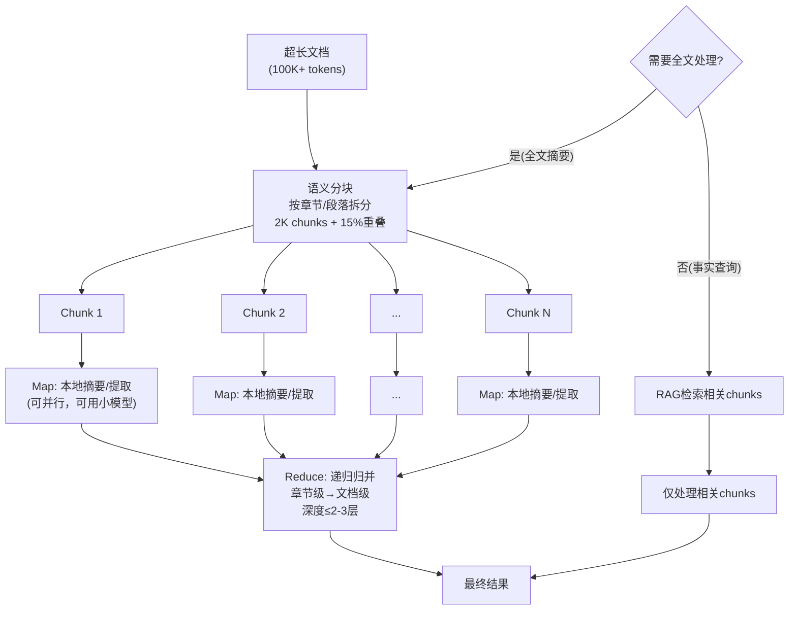

> **来源**：萃取自LLM×MapReduce框架、ToM树状MapReduce、Yellow.ai W-RAC等研究和案例

# 分层分治MapReduce模式（Divide and Conquer MapReduce Pattern）

## 模式类型

方法论模式

## 成熟度

L2 已验证（多个学术研究和工业案例验证）

## 适用场景

- 超长文档处理（法律合同100K+ tokens、代码库、书籍、研报）
- 批量内容处理（大量文档需要摘要/分析）
- 超过模型单次上下文窗口的任务
- "Lost in the Middle"问题明显的长上下文场景
- 不需要一次性理解全文的任务（检索问答、分点摘要）

**不适用于**：短文档（<10K tokens）直接处理即可，分块开销大于收益；需要深度跨章节推理且无法分块处理的任务。

## 问题背景

面对超长文档（100K+ tokens），即使模型支持大上下文窗口，也存在三个问题：
1. **O(n²)复杂度**：成本是4K文档的25倍（n=100K是n=4K的25倍，计算量是625倍）
2. **"Lost in the Middle"问题**：中间部分注意力下降30%+
3. **TTFT首token延迟高**：与上下文长度成正比

分层分治通过"拆分→并行处理→递归归并"，将大问题拆解为小问题解决，实现复杂度从O(n²)→O(n²/k)（k为分块大小），100K文档用2K chunk分块计算量降低约50倍。

## 核心规则

### 规则1：语义分块而非固定大小切割

- 不要按固定token数切分（这会切断语义）
- 在自然语义边界拆分：段落、章节、标题、页面
- 结构化文档（Markdown/HTML/PDF）按原生结构拆分
- 分块大小建议（行业经验估算）：
  - 事实查询类：256-512 tokens，15%重叠
  - 分析摘要类：1024-2048 tokens 或 页级分块
- NVIDIA测试显示15%重叠比例是甜点，金融文档页级分块准确率最高（0.648）

### 规则2：Map阶段并行独立处理

- 将每个chunk独立发送给LLM处理
- 根据任务类型处理每个chunk：
  - 摘要任务：每个chunk生成本地摘要
  - QA任务：每个chunk提取与问题相关的信息
  - 信息提取：每个chunk提取实体/关系/关键点
- Map阶段可以并行执行（chunk之间无依赖），大幅提升吞吐量
- 每个chunk的处理可以用小模型（因为任务简单明确）

### 规则3：Reduce阶段递归归并

- 将Map阶段的输出（各chunk摘要/提取结果）收集起来
- 如果归并后仍超过token限制，递归执行Reduce：
  - 第1层Reduce：合并N个chunk摘要 → 章节级摘要
  - 第2层Reduce：合并章节摘要 → 文档级摘要
  - 建议递归深度≤2-3层，避免信息逐层丢失
- 保持层次结构（如ToM树状MapReduce），保留文档原生语义关系

### 规则4：按需检索分流（可选但推荐）

- 不需要对整个文档摘要时，不要跑全量MapReduce
- 先用检索（RAG）找到与问题相关的chunks
- 只对相关chunks做处理，无关chunks直接跳过
- 事实查询类任务这一步可以减少80-90%工作量

## 处理流程

## 效果数据（行业经验估算，实际效果以测量为准）

| 文档大小 | 全量处理成本 | MapReduce处理成本 | 成本降低 | 信息保留率 |
|---------|-------------|------------------|---------|-----------|
| 10K tokens | 基线（1x） | ~0.3x | ~70% | 95%+ |
| 50K tokens | 25x（相对4K） | ~4x | ~84% | 92%+ |
| 100K tokens | 100x（相对4K） | ~15x | ~85% | 90%+ |

**典型案例验证**：
- LLM×MapReduce框架：100K文档处理从100K+ tokens降到15K-30K tokens，70-85%降低
- ToM树状MapReduce（arXiv:2511.00489）：构建DocTree保持层次语义，比线性MapReduce质量更高
- Yellow.ai W-RAC：LLM仅做分组决策不做生成，分块阶段成本降低一个数量级（~90%）

## 实施检查清单

- [ ] 分块是否在自然语义边界（段落/章节/标题），而非固定token数？
- [ ] 分块大小是否合适（摘要1-2K，查询256-512）？
- [ ] chunks之间是否有15%重叠避免边界信息丢失？
- [ ] Map阶段是否可以并行处理且使用小模型？
- [ ] Reduce递归深度是否≤2-3层？
- [ ] 是否保持了文档的层次结构（树状归并而非线性拼接）？
- [ ] 事实查询类任务是否先用RAG检索相关chunks？
- [ ] 短文档（<10K）是否避免过度设计直接处理？

## 反例警示

| 错误做法 | 后果 |
|---------|------|
| 固定大小切分语义：不按段落/章节边界，在句子中间切断 | 每个chunk语义不完整，处理质量差 |
| 递归层数过多：超过3层归并 | 信息逐层丢失，"摘要的摘要的摘要"最后什么都没了 |
| 所有任务都MapReduce：短文档也分块 | 分块开销大于收益，反而增加成本 |
| 不需要摘要也硬做摘要：事实查询跑全量MapReduce | 80-90%的chunks是无关的，浪费计算 |
| 忽略重叠比例：chunk之间没有重叠 | 边界处信息丢失，15%重叠是经验甜点 |
| 线性归并而非树状：直接拼接所有chunk摘要 | 丢失文档层次结构，语义关系断裂 |

## 迁移验证（跨领域可复用性）

MapReduce是分布式计算经典范式，可迁移到：

1. **Hadoop/Spark大数据处理领域**：InputSplit数据分片→Map阶段并行处理→Shuffle+Reduce阶段归并→多级Reduce Tree，这就是Google MapReduce原始论文的范式
2. **图像/视频分块处理领域**：大图像分块（8x8 JPEG块、医学图像分块）→每个块独立处理（压缩、特征提取、AI推理）→拼接融合结果处理重叠区域，CNN滑动窗口、图像金字塔也是分治思想
3. **大规模数值计算/线性代数领域**：大矩阵分块（Block Matrix）→每个块独立计算矩阵乘法/分解→结果块拼接为最终矩阵，高性能计算（HPC）中的矩阵分块算法、分布式线性代数完全是这个模式

> **关联模块**：
> - [progressive-optimization-pattern.md](progressive-optimization-pattern.md)
> - [lazy-loading-pattern.md](lazy-loading-pattern.md)
