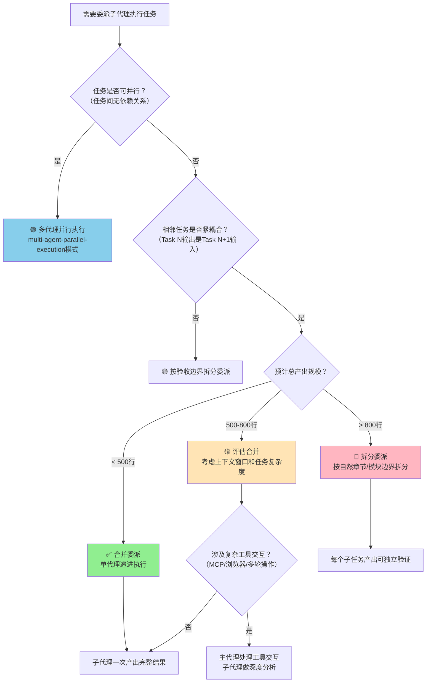

> **来源**：从 [vibe-coding-prompts-learning-analysis 复盘洞察6](../../../reports/insight-extraction/external-learning/retrospective-vibe-coding-prompts-learning-analysis-20260704/insight-extraction.md#洞察6) 提炼，基于2次验证案例（vibe-coding-prompts-learning-analysis的Task1+2合并委派 + spec-driven-subagent-execution模式的单代理递进执行验证）

# 中等规模任务合并委派策略（Medium-Scale Task Merged Delegation Strategy）

## 模式类型
方法论模式（AI协作/子代理委派）

## 成熟度
L2 已验证（2次成功验证：vibe-coding-prompts-learning-analysis Task1+2合并委派产出416行文档 + Orca IDE/HiAgent平台单代理递进执行验证）

## 适用场景
委派子代理（sub-agent/general_purpose_task）执行多步骤任务时，判断相邻任务应该合并委派还是拆分委派。

| 场景 | 是否适用 | 说明 |
|------|---------|------|
| 相邻任务产出紧耦合（Task1的输出是Task2的输入） | ✅ 核心场景 | 合并委派减少上下文传递损失 |
| 预计总产出 < 500 行 | ✅ 核心场景 | 单代理上下文窗口可容纳 |
| 任务需要统一风格和格式 | ✅ 推荐 | 单代理保证产出风格一致 |
| 任务之间无独立验证点 | ✅ 推荐 | 合并后无需中间检查 |
| 预计总产出 > 800 行 | ⚠️ 需评估 | 可能超出单代理上下文窗口，考虑拆分 |
| 任务之间有独立验收标准 | ⚠️ 需评估 | 拆分便于分步验证 |
| 任务可以完全并行执行 | ❌ 不适用 | 应使用多代理并行执行模式 |
| 涉及复杂工具交互（如多轮MCP调用、浏览器操作） | ❌ 不适用 | 主代理处理工具交互，子代理做深度分析更可靠 |

## 问题背景
委派子代理时常见两个极端错误：

1. **过度拆分**：将紧耦合的任务拆分为过多小任务，每个子代理单独执行，导致：
   - 上下文传递损失：子代理无法访问前序任务的完整上下文
   - 风格不一致：多个子代理产出风格、格式、术语不统一
   - 整合成本高：需要额外步骤合并多个子代理的产出
   - 协作开销：启动和等待多个子代理的固定成本

2. **过度合并**：将过大的任务塞给单个子代理，导致：
   - 上下文溢出：产出量超出代理的上下文窗口
   - 质量下降：任务过多时代理注意力分散
   - 验证困难：无法分步验证，错误难定位

根本原因：缺少基于产出规模和任务耦合度的委派决策框架。

## 核心规则

### 任务规模与委派策略决策矩阵

### 决策速查表

| 任务特征 | 推荐策略 | 理由 |
|---------|---------|------|
| 紧耦合 + 产出 < 500行 | ✅ 合并委派 | 上下文损失最小，风格统一，无整合成本 |
| 紧耦合 + 产出500-800行 | 🟡 评估后决定 | 看复杂度和工具交互需求 |
| 紧耦合 + 产出 > 800行 | 🔴 按章节拆分 | 避免上下文溢出 |
| 松耦合 + 可并行 | 多代理并行 | 并行加速 |
| 涉及复杂工具交互 | 主代理工具+子代理分析 | 工具交互可靠性优先 |
| 产出是单一完整文档 | 合并委派 | 保证文档完整性和一致性 |

### 合并委派的三个优势

1. **减少上下文传递损失**：单代理拥有全部上下文，无需在代理间传递中间结果
2. **单一产出无需整合**：一次交付完整结果，避免多代理产出的合并和对齐工作
3. **降低协作开销**：减少子代理启动、等待、验证的固定成本

### 合并委派的边界条件

- **产出上限**：总产出建议不超过800行，避免超出上下文窗口
- **复杂度边界**：如果合并后任务包含3种以上不同类型的工作（如同时需要工具交互、深度分析、格式排版），考虑拆分
- **验证边界**：如果中间结果需要独立验证（如数据提取后需要验证才能分析），考虑在验证点拆分

## 实施步骤

### 步骤1：评估任务耦合度
- 检查相邻任务的输入输出关系：如果Task N的输出直接是Task N+1的输入（且无需额外转换），则为紧耦合
- 检查风格一致性要求：如果产出需要统一格式/术语/风格，紧耦合度更高

### 步骤2：估算产出规模
- 基于类似任务的历史数据估算产出行数
- 考虑内容密度：技术分析类文档密度高于列表/目录类
- 估算保守一些：宁可少估也不要超估

### 步骤3：检查工具交互需求
- 如果任务涉及多轮MCP调用、浏览器操作、Shell命令执行等复杂工具交互
- 工具交互部分由主代理执行，将提取的结构化数据交给子代理做深度分析

### 步骤4：执行委派
- 合并委派：将完整的任务链+上下文作为一个sub-agent任务
- 拆分委派：在自然边界（章节边界、模块边界、验证点）拆分

### 步骤5：验证产出
- 合并委派：一次性验证完整产出，检查风格一致性和内容完整性
- 拆分委派：分步验证每个子任务产出，最后整合验证

## 验证案例

### 案例1：vibe-coding-prompts-learning-analysis（合并委派验证）
- **任务拆分原始设计**：Task1（系统学习提取网页核心内容）+ Task2（创建学习分析文档），共2个任务
- **执行策略**：将Task1+Task2合并委派给单个general_purpose_task子代理
- **输入**：defuddle提取的微信公众号文章全文 + 文档格式规范 + 章节结构要求
- **产出**：416行学习分析文档，11个章节，一次交付
- **结果**：✅ 成功，文档风格统一、结构完整、无需整合
- **关键发现**：对于"提取内容→生成文档"这类紧耦合任务链，合并委派效率明显高于拆分——拆分后Task2子代理需要重新理解Task1的提取结果，反而增加了上下文传递损失

### 案例2：spec-driven-subagent-execution（单代理递进执行验证）
- **任务**：Orca IDE文章分析（8个递进任务，443行产出）和HiAgent平台分析（11个递进任务，800+行产出）
- **执行策略**：单子代理按Spec文档递进执行全部任务
- **结果**：✅ 两次验证均成功，产出质量稳定
- **关键发现**：Spec驱动的单代理递进执行本质上也是合并委派策略的一种形式，验证了线性依赖任务适合单代理完成

## 反模式

| 反模式 | 为什么错误 | 正确做法 |
|--------|----------|---------|
| 紧耦合小任务强行拆分给多个子代理 | 上下文传递损失大，风格不统一，整合成本高 | 产出<500行的紧耦合任务合并委派 |
| 大任务（>800行）不拆分塞给单代理 | 上下文溢出，质量下降，验证困难 | 按章节/模块边界拆分 |
| 涉及复杂工具交互的任务全委托子代理 | 子代理工具交互可靠性低于主代理，容易在MCP/浏览器步骤失败 | 主代理处理工具交互，子代理做分析 |
| 可并行任务串行委派给单代理 | 失去并行加速机会 | 无依赖的任务使用多代理并行 |

## 与其他模式的关系

| 关联模式 | 关系类型 | 关系说明 |
|---------|---------|---------|
| [spec-driven-subagent-execution.md](spec-driven-subagent-execution.md) | 互补 | 本模式解决"何时合并/拆分"的决策问题，spec-driven-subagent-execution解决"如何Spec驱动单代理执行"的问题 |
| [subagent-atomic-task-template.md](subagent-atomic-task-template.md) | 互补 | 原子任务模板是拆分后的最小执行单元，本模式决定是否需要将多个原子任务合并 |
| [multi-agent-parallel-execution.md](../../architecture-patterns/multi-agent-parallel-execution.md) | 分支 | 可并行任务应使用多代理并行，而非合并为单代理 |
| [tool-failure-three-tier-degradation.md](../tools-automation/tool-failure-three-tier-degradation.md) | 关联 | Level 1降级策略（sub-agent委托）中也涉及任务拆分决策 |

## Changelog

- 2026-07-08 | create | 初始版本，基于vibe-coding-prompts-learning-analysis复盘提炼，L2成熟度（2次验证）
