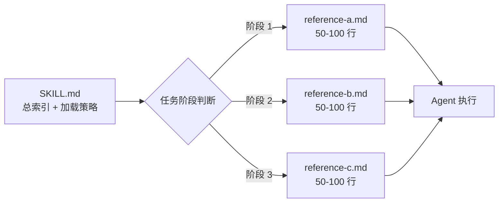

> **已原子化自**：[insight-extraction.md 洞察 2](../../../reports/competitive-analysis/retrospective-ian-xiaohei-source-analysis-20260625/insight-extraction.md) —— Ian Xiaohei Illustrations 仓库源码分析

# 上下文渐进式披露（Progressive Context Disclosure）

## 模式类型

方法论模式

## 成熟度

L2 已验证（Ian Xiaohei Illustrations 完整实践验证）

## 适用场景

设计 AI Skill 的参考文档体系时，需要控制 Agent 的上下文窗口消耗，确保在复杂任务中只加载当前阶段需要的信息。

## 问题背景

AI Agent 的上下文窗口是有限且宝贵的资源。在复杂任务中，如果一次性加载全部参考文档，可能消耗数千 token——这些 token 本可以用来处理用户的实际输入。但另一方面，如果参考文档组织不当，Agent 又可能因缺少关键信息而做出错误决策。

核心矛盾：**信息完整性与上下文窗口消耗之间的平衡**。

Ian Xiaohei Skill 的解决方案是：入口文件只做索引和加载策略声明，5 个参考文档按职责原子化拆分，每个文档标注「何时加载」。Agent 根据当前任务阶段选择性读取。5 个 references 总计 289 行，全部加载约 1500-2000 token，按需加载可降至 300-600 token——节省 60%+ 的上下文开销。

## 核心规则

### 规则 1：入口文件只做索引

Skill 的入口文件（SKILL.md）不应包含详细的操作说明，而应：

- 列出所有参考文档的名称和路径
- 标注每个参考文档的**加载条件**（「何时读」）
- 明确指示：「按任务需要读取，不要一次塞满上下文」

### 规则 2：参考文档按职责原子化

每个参考文档只承担一个职责，控制在 50-100 行以内。职责划分应遵循「单一职责检验」——问自己：这个文档是否只有一个引起变化的原因？

### 规则 3：加载条件与工作流步骤绑定

参考文档的加载时机应与 Skill 的工作流步骤精确绑定：

```text
步骤 1（规划配图）     → 加载 composition-patterns.md
步骤 2（涉及角色设计）   → 加载 xiaohei-ip.md
步骤 3（实际生成图片）   → 加载 style-dna.md + prompt-template.md
步骤 4（质量检查）       → 加载 qa-checklist.md
```

### 规则 4：每个参考文档自包含

即使按需加载，每个参考文档也应做到独立可读——Agent 不需要为了理解当前文档而再去加载另一个文档。

## 操作流程



## 实施检查清单

- [ ] 入口文件是否只包含索引和加载策略，不含详细操作说明？
- [ ] 每个参考文档是否只承担单一职责？
- [ ] 每个参考文档是否控制在 100 行以内？
- [ ] 每个参考文档是否有明确的加载条件（与工作流阶段绑定）？
- [ ] 入口文件是否明确指示了「按需加载」策略？
- [ ] 每个参考文档是否独立可读（不依赖其他参考文档的内部实现）？

## 反例警示

| 错误做法 | 后果 |
|---------|------|
| 把全部参考内容写在一个大文件中 | Agent 被迫在简单任务中也加载全文，浪费数百 token |
| 参考文档拆分过细（10+ 个 20 行文件） | Agent 需要频繁跳转文件，增加加载开销和决策复杂度 |
| 只拆分但不标注加载条件 | Agent 不知道自己该读哪个，可能全部加载或全部忽略 |
| 参考文档之间相互依赖（A 依赖 B 的内部细节） | Agent 被迫级联加载，失去按需加载的意义 |
| 入口文件本身就超过 300 行 | 入口加载成本抵消了按需加载的收益 |

## 正例

Ian Xiaohei Skill 的参考文档体系：

| 文件 | 行数 | 加载时机 |
|------|------|---------|
| style-dna.md | 48 | 每次生成图片前 |
| xiaohei-ip.md | 53 | 构图涉及小黑时 |
| composition-patterns.md | 91 | 设计配图策略时 |
| prompt-template.md | 51 | 实际生成图片时 |
| qa-checklist.md | 46 | 生成后质量检查时 |
| **SKILL.md（入口）** | **205** | **始终加载（但仅做索引）** |

入口文件第 17 行明确指示：`按任务需要读取，不要一次塞满上下文`

## 与现有模式的关系

- `dual-interface-repository.md`：本模式处理「AI 文档内部的按需加载」，该模式处理「人类文档和 AI 文档的物理隔离」。两者是两层递进的信息架构设计。
- `output-behavior-specification.md`：本模式控制「给 Agent 多少信息」，该模式控制「Agent 输出多少信息」。两者共同优化 Agent 的 token 利用率。

> **关联模块**：
> - `dual-interface-repository.md`
> - `output-behavior-specification.md`
