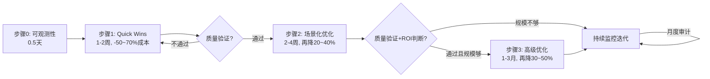

> **来源**：萃取自9个跨行业LLM Token优化案例（Himanshu、Kapden、GitHub Copilot、Zomato、Cursor等）

# 渐进式优化模式（Progressive Optimization Pattern）

## 模式类型

方法论模式

## 成熟度

L2 已验证（9个跨行业案例验证）

## 适用场景

- 新系统刚上线，需要快速降本但又不能影响业务
- 已有系统成本过高，但不知道从哪开始优化
- 团队资源有限，需要按ROI优先级逐步投入
- 优化过程需要持续验证质量，不能一步到位大改
- 月API费用从几百到几万美金的各种规模团队

**不适用于**：极端紧急的线上故障修复（需要快速止血而非渐进优化）、已经经过充分优化且有明确单一瓶颈的系统。

## 问题背景

面对数十种token优化技术，团队容易陷入两个极端：要么什么都不做（觉得优化太复杂），要么一开始就上最复杂的方案（微调、蒸馏、自建RAG），结果投入大量资源却收效甚微或引入质量问题。渐进式优化通过"先易后难、每步验证、小步快跑"的方式，确保每一步投入都有可衡量的收益。

核心原则：按"减少→复用→压缩"三大本质路径的ROI顺序递进——先做投入最小收益最大的"减少"，再做"复用"，最后才做"压缩"和高级方案。

## 核心规则

### 规则1：可观测性先行（0.5天）

- 接入成本监控网关（Helicone/Langfuse/Portkey）
- 识别Top 5花费项：哪个函数/哪个接口/哪类用户花费最多
- 建立基线：当前平均token数、成本、质量指标

### 规则2：Quick Wins速赢优先（1-2周）

这一步预期收益：成本降低50-70%，质量无损失或轻微提升。

- 所有接口设置max_tokens限制（根据场景设合理值）
- 重构prompt为"静态前缀+动态后缀"结构，启用Prompt Caching
- 精简系统提示词（去除冗余修饰、重复说明）
- 升级到现代推理引擎（vLLM）启用PagedAttention和连续批处理

### 规则3：场景化质量优化（2-4周）

这一步预期收益：在Quick Wins基础上再降本20-40%，质量保持90%+。

- 根据场景选择对应技术：
  - 客服/FAQ → 添加语义缓存+意图分流
  - 代码助手 → 工具懒加载+动态上下文
  - RAG场景 → 检索替代全量注入+语义分块
  - Agent场景 → 自动上下文压缩+工具输出过滤
- 每添加一项技术，A/B测试验证质量不下降

### 规则4：高级规模化优化（1-3月，按需投入）

只有当Quick Wins和场景化优化完成后，且月调用量>100万token或ROI>3时才投入。

- 三级模型路由（简单→小模型，复杂→大模型）
- LoRA微调核心任务（缩短提示+提升效果）
- 会话状态机/工作流（任务型Agent场景）
- 这一步预期收益：在场景化优化基础上再降本30-50%

### 规则5：持续监控迭代（长期）

- 建立成本看板，监控每日token消耗趋势
- 定期审计（每月）：识别新的浪费点
- 根据业务变化调整优化策略

## 操作流程



## 效果数据（行业经验估算，实际效果以测量为准）

| 阶段 | 累计成本降低 | 所需时间 | 质量影响 | 案例验证 |
|------|-------------|---------|---------|---------|
| 基线 | 0% | - | - | - |
| Quick Wins完成 | 50-70% | 1-2周 | 无损失或轻微提升 | 所有9个案例均验证 |
| 场景化优化完成 | 70-85% | 2-4周 | 质量保持90%+ | Kapden(76%)、Himanshu(87%)、Copilot |
| 高级优化完成 | 85-95% | 1-3月 | 质量保持或提升 | 批处理场景(95%)、蒸馏场景(90%+) |

**典型案例验证**：
- Himanshu 7天优化：严格按此模式Day1审计→Day2-3缓存→Day4路由→Day5压缩→Day6重试，7天成本降低87%（$4800→$620）
- GitHub Copilot：官方博客明确提到"token效率提升通常不是一个大改动，而是持续的小改进流"

## 实施检查清单

- [ ] 是否已接入成本监控并识别Top 5花费项？
- [ ] Quick Wins是否已全部完成（max_tokens、Prompt Caching、精简提示词）？
- [ ] 每一步优化是否都有A/B测试验证质量？
- [ ] 是否在Quick Wins完成后才考虑高级优化方案？
- [ ] 是否计算了ROI（投入人力成本 vs 月度token节省）？
- [ ] 是否建立了成本监控看板和月度审计机制？

## 反例警示

| 错误做法 | 后果 |
|---------|------|
| 一步到位思维：一开始就上微调/蒸馏/自建RAG | 投入3个月结果不如Quick Win一周的收益 |
| 跳过可观测性：不接监控就开始优化 | 不知道钱花在哪，优化了也无法衡量效果 |
| 质量不验证：每一步优化不做A/B测试 | 质量下降了还不知道，直到用户投诉 |
| 做完就不管：优化上线后不持续监控 | "优化反弹"——省的钱悄悄涨回来 |
| 为优化而优化：投入人力成本大于token节省 | ROI为负，做了不如不做 |

## 本质路径映射

```
减少（Quick Wins：精简提示词、max_tokens）
  ↓
复用（Quick Wins：缓存、场景化：场景缓存、高级：路由复用小模型）
  ↓
压缩（场景化：上下文压缩、高级：状态机/微调）
```

## 迁移验证（跨领域可复用性）

本模式本质是"按ROI分层递进优化"，这是通用系统优化方法论，可迁移到：

1. **CPU缓存优化领域**：profiling找热点→简单算法优化→数据结构优化→向量化/SIMD高级优化
2. **数据库查询优化领域**：慢查询日志→添加索引/避免SELECT *→查询重写/分库分表→读写分离/缓存层
3. **网络传输优化领域**：带宽监控→gzip压缩/连接复用→CDN缓存/资源合并→HTTP/2/QUIC协议升级

> **关联模块**：
> - [layered-caching-pattern.md](layered-caching-pattern.md)
> - [quality-cost-dynamic-balance.md](quality-cost-dynamic-balance.md)
> - [lazy-loading-pattern.md](lazy-loading-pattern.md)
> - [mapreduce-divide-conquer.md](mapreduce-divide-conquer.md)
