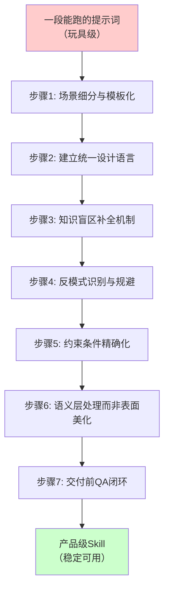

> **提炼自**：[analysis-report.md](../../../../../.trae/specs/retrospectives-insights/analyze-guizang-material-illustration-skill/analysis-report.md) —— 歸藏 guizang-material-illustration Skill 开源文章分析
> **验证次数**：1 次（歸藏材质插画 Skill 完整工程实践验证，待在自有 Skill 开发中验证后升级 L2）

# 提示词到产品七步法（Prompt-to-Product Seven Steps）

## 模式类型

方法论模式（AI协作/Skill开发/产品化工程）

## 成熟度

L1 实验性（1 次完整外部案例萃取：歸藏材质插画 Skill，待在 SpecWeave 自有 Skill 开发中验证 1 次后升级 L2）

> **与现有模式的关系说明**：
> - [skill-five-elements-model.md](skill-five-elements-model.md) 定义了 Skill **文档结构**应该包含哪五个要素（触发、决策树、渐进披露、Why解释、安全清单）
> - [generation-validation-closed-loop.md](generation-validation-closed-loop.md) 定义了**单次生成**的质量闭环（第一性原理生成→对抗审查→修复）
> - 本模式定义的是从 0 到 1 的 **Skill 产品化过程**——如何把一段能跑的提示词系统性地进化为稳定可用的产品级工具

## 适用场景

| 场景 | 是否适用 | 说明 |
|------|---------|------|
| 从提示词开发 AI 图像生成 Skill | ✅ 核心场景 | 歸藏案例即属此类（文本→3D材质解释图） |
| 从提示词开发 AI 写作/内容生成 Skill | ✅ 核心场景 | 文章生成、报告生成、文案生成等内容类 Skill |
| 从提示词开发 AI 代码生成 Skill | ✅ 核心场景 | 代码片段生成、脚手架生成、重构助手等 |
| 从提示词开发 AI 数据分析 Skill | ✅ 适用 | 数据可视化、报表生成、洞察提取等 |
| 一次性 Prompt 调试（不需要复用） | ❌ 不适用 | 一次性任务不需要产品化，直接调提示词即可 |
| 简单单一场景工具（无多样化需求） | ⚠️ 可裁剪 | 场景单一可跳过步骤1（场景细分），但步骤7（QA）仍建议保留 |
| 纯规则引擎（无 LLM 生成环节） | ❌ 不适用 | 本模式针对 LLM 生成类 AI 工具，规则引擎用传统软件工程方法 |
| 个人玩具项目（自己用不发布） | ⚠️ 可大幅简化 | 只需要步骤5（关键约束）+ 步骤7（基础QA），其他步骤遇到问题再加 |
| 公开发布给别人用的 Skill/工具 | ✅ 强烈建议完整执行 | 别人用的工具必须稳定可靠，七步是质量底线 |

### 适用边界说明（重要）

本模式是**产品级Skill的工程化框架**，不是所有AI工具都需要走完七步：
- **自己用的脚本/玩具**：能用就行，不需要工程化，不要过度设计
- **团队内部工具**：建议至少走步骤4（反模式）+ 步骤5（约束）+ 步骤7（QA）
- **公开发布/开源给陌生人用**：完整七步，这是对你的用户负责
- **商业化产品**：七步 + 用户反馈持续迭代闭环

## 快速入门（90分钟上手版）

如果你第一次用这个模式，按这个最小路径走：

1. **先列3-5个用户最常用的场景**（不用完美，先列出来）→ 对应步骤1
2. **选一套你喜欢的风格/配色/格式，所有输出保持一致**→ 对应步骤2
3. **写下"绝对不能出现的3个错误"**（比如错别字、数据错误、格式混乱）→ 对应步骤4
4. **对最关键的1-2个要素给出明确要求**（比如"标题不超过20字""必须有结论段落"）→ 对应步骤5
5. **加一个最后检查：生成完自己看一眼，有明显问题就重生成**→ 对应步骤7
6. **步骤3和步骤6等遇到问题再加**——遇到冷门概念翻车了再补检索，遇到美化效果差再补语义抽取

> **为什么？** 工程化是渐进的，不是一步到位的。先用最小闭环跑起来，在使用中发现问题再补对应的步骤。完美主义是产品化的敌人。

## 问题背景

AI 工具开发最容易陷入的陷阱是"提示词魔术表演"：
1. **一段提示词包打天下**：试图用一个 Prompt 覆盖所有场景，结果什么场景都做不好
2. **风格不一致**：每次生成结果风格漂移，没有统一识别感
3. **知识盲区翻车**：遇到冷门/专业概念直接胡说八道，没有兜底机制
4. **反复踩同样的坑**：同样的错误反复出现，没有系统性防范
5. **约束模糊**：只说"最好有XX"，不说"必须有XX且满足XX条件"，模型自由发挥
6. **表面美化而非深度理解**：直接在原始内容上做风格迁移，继承所有原始缺陷
7. **生成即交付**：没有质量检查环节，把质量控制推给用户
8. **能力边界模糊**：什么都想做，结果什么都做不好，用户预期混乱

这些问题的本质是：**提示词工程≠产品工程**。一段能跑的提示词只是起点，不是终点。产品级 Skill 需要系统性的工程化设计。

## 核心原则

**从"一段提示词"到"一个产品"需要七层工程化加工：场景细分解决覆盖问题，统一语言解决一致性问题，知识补全解决准确性问题，反模式防范解决重复踩坑问题，精确约束解决稳定性问题，语义处理解决深度问题，QA闭环解决质量底线问题。七层缺一不可。**

## 七步法详解

### 步骤 1：场景细分与模板化

**解决问题**：一个提示词包打天下导致的场景适配性差

**核心思想**：不要试图用一个提示词覆盖所有场景。按使用场景逐一拆分，每种类型单独设计视觉/内容/结构模板。

**执行要点**：
1. **穷举使用场景**：列出用户实际会用这个工具的所有典型场景（≥4类）
2. **识别场景差异**：不同场景的表达逻辑、信息结构、重点要素有什么不同？
3. **分场景建模板**：每个场景单独设计提示词模板和输出结构
4. **场景路由逻辑**：建立自动判断逻辑——用户输入属于哪个场景，自动调用对应模板

**歸藏案例**：
- 4大场景模板：工作汇报/产品说明、数据图表、教育解释图、人文配图
- 每个场景的表达逻辑完全不同：教育图强调标注准确，数据图强调材质化表达，人文图强调氛围与理解的平衡

**质量门**：
- [ ] 已识别 ≥4 个典型使用场景
- [ ] 每个场景有独立的模板设计
- [ ] 有明确的场景路由判断逻辑
- [ ] 场景间没有重叠或遗漏

### 步骤 2：建立统一设计语言

**解决问题**：产出风格漂移，缺乏整体识别感，看起来不像"同一个产品做的"

**核心思想**：在场景细分之上，建立一套跨场景的统一设计语言体系，保证不同场景产出的一致性和专业感。

**执行要点**：
1. **定义视觉/风格基底**：光影、材质、配色、字体风格、留白规则
2. **识别标志性元素**：一个鲜明的点缀色/识别特征（如歸藏的 IKB 蓝）
3. **统一载体规范**：输出的基础载体是什么（白底、黑底、卡片、长图？）
4. **跨场景一致性检查**：不同场景的产出放在一起，能看出是"一套东西"

**歸藏案例**：
- 统一视觉基底：白底工作室光线 + 克制的3D材质
- 标志性点缀色：IKB 蓝（International Klein Blue，国际克莱因蓝）
- 统一元素：图内嵌入短中文标签
- 整体效果：像一套实体模型摆在白色桌面上拍的照片

**质量门**：
- [ ] 有明确的配色规范（主色/点缀色/中性色）
- [ ] 有统一的光影/材质/排版基底
- [ ] 有可识别的标志性元素
- [ ] 跨场景产出风格一致

### 步骤 3：知识盲区补全机制

**解决问题**：大模型有知识截止和领域盲区，遇到冷门概念直接翻车

**核心思想**：识别模型的知识边界，对超出边界的内容建立"先检索再生成"的兜底机制——这是 RAG 思想在生成领域的具象化。

**执行要点**：
1. **识别知识边界**：哪些类型的内容是模型大概率不知道的？（冷门概念、专业术语、特定Logo、小众领域）
2. **建立判断逻辑**：生成前先评估"这个概念模型知道吗？"
3. **检索增强**：判定为冷门概念时，先检索参考信息/图片，提取关键视觉/语义线索
4. **风格统一回归**：参考只用来理解"是什么"，不用来复制风格，最终必须回归统一设计语言
5. **关键原则**：检索结果是"素材"而非"模板"

**歸藏案例**：
- 知识盲区：PKCE流程、Zettelkasten卡片系统、小众产品Logo、科学装置、历史文化物件
- 判断逻辑：Agent 生成前评估概念常见度
- 检索内容：轮廓、配色惯例、标志性形状
- 风格回归：所有参考图最终都转化为歸藏材质插画风格

**质量门**：
- [ ] 已识别 ≥3 类模型知识盲区
- [ ] 有自动判断"是否需要检索"的逻辑
- [ ] 检索结果有明确的使用边界（只取事实不取风格）
- [ ] 检索后有回归统一风格的机制

> **步骤3 vs 步骤6的区别**：步骤3是补全模型**本身不知道的外部知识**（如冷门概念长什么样、专业术语什么意思）；步骤6是理解**用户输入内容的语义结构**（如图表里有什么数据、文章核心论点是什么）。前者解决"模型不知道"的问题，后者解决"模型不理解"的问题。

### 步骤 4：反模式识别与规避

**解决问题**：同样的错误反复出现，每次都要手动修正，没有系统性防范

**核心思想**：系统性整理常见失败案例（反模式），把踩过的坑变成检查清单，在提示词中加入针对性规避指令。

**执行要点**：
1. **收集失败案例**：测试过程中把所有生成失败的案例保存下来
2. **分类归纳反模式**：把失败案例归纳为几类典型反模式（≥5类）
3. **分析失败原因**：每类反模式为什么会发生？模型的什么倾向导致的？
4. **针对性规避指令**：在提示词中加入明确的"不要做XX"约束
5. **反模式清单文档化**：把反模式整理成清单，作为QA环节的检查项

**歸藏案例 - 5类反模式**：
1. ❌ 纯氛围图：没有任何文字标签，只画了装饰图
2. ❌ 文字过载：塞一大段文字进图片，根本读不了
3. ❌ 标签错误：中文标签写错字、乱码、指错位置
4. ❌ 提示词泄露：把生成用的提示词直接显示在成品里
5. ❌ 参考图照搬：把参考图的水印、低画质背景、原有UI一起复制

**质量门**：
- [ ] 已收集 ≥5 类典型失败案例
- [ ] 每类反模式有明确的定义和识别标准
- [ ] 提示词中有针对性的规避指令
- [ ] 反模式清单已文档化

### 步骤 5：约束条件精确化

**解决问题**：模糊约束（"最好有标签"）导致模型自由发挥，产出质量不稳定

**核心思想**：对关键产出要素给出明确、可量化的约束，而不是模糊的建议。约束不是越少越好——明确的约束反而能提升生成稳定性。

**执行要点**：
1. **识别关键产出要素**：哪些要素是必须有的，哪些是可选的
2. **量化约束条件**：对关键要素给出具体数值/位置/格式要求
   - 字数限制：如"每个标签2-5个汉字"
   - 位置要求：如"标签放在左上/右下/居中的白色区域"
   - 载体要求：如"标签放在干净的白色标注板上"
3. **识别模型避险行为**：模型是否会"自作聪明"跳过某些环节（如因怕写错字而不加文字）
4. **强制约束打破避险**：对模型倾向于跳过的关键要素，用强制措辞要求必须包含

**歸藏案例 - 图内标签约束**：
- 模型避险行为：GPT-Image 知道可能写错字，干脆不在图里放文字，改用HTML在图片外面贴标签
- 精确约束：
  - 强制要求标签生成在图片**内部**（不是外部）
  - 每个标签**2-5个汉字**（短而精）
  - 指定**空间位置**（左上、右下、居中等）
  - 放在**干净的白色区域或标注板上**
- 迭代过程："调了很多轮，现在标签准确率稳定下来了"

**质量门**：
- [ ] 关键产出要素已识别
- [ ] 每个关键要素有可量化的约束（字数/位置/格式/数量）
- [ ] 已识别模型的"过度避险"行为
- [ ] 对避险跳过的要素有强制约束
- [ ] 经过多轮调试验证约束有效

### 步骤 6：语义层处理而非表面美化

**解决问题**：直接在原始内容上做风格迁移（"换皮"），继承原始内容的所有缺陷

**核心思想**：处理内容类任务时，先走语义理解和信息抽取，理解"是什么"之后再从零生成，而非直接在原始内容上做表面转换。这是"AI增强"vs"AI滤镜"的本质区别。

**执行要点**：
1. **识别"换皮"陷阱**：最直觉的做法（截图→美化）往往是错的
2. **语义抽取层**：先从原始输入中提取纯语义信息——是什么类型？核心结论？关键数据？结构关系？
3. **丢弃原始表现层**：不要把原始排版、颜色、布局等"皮"传给生成模型
4. **从零重绘**：只把纯语义信息交给生成模型，让它基于理解重新设计呈现方式
5. **增强而非复制**：重绘时可以加入更好的布局、更清晰的标注、辅助理解的元素

**两种方案对比**：

| 方案 | 思路 | 问题 |
|------|------|------|
| ❌ 截图换皮 | 原图→风格迁移 | 保留原图所有缺陷，只是美化表面 |
| ✅ 语义抽取+重绘 | 原图→提取语义→从零重绘 | 重新设计信息呈现，彻底解决问题 |

**歸藏案例 - 图表美化**：
- 错误直觉：把原始图表截图扔给模型"美化"
- 问题：原始图表密密麻麻的坐标、模糊的颜色、挤在一起的数据点都会被继承
- 正确做法：
  1. Agent 从图表/数据中提取语义：图表类型、标题、结论、横纵坐标、数据值、单位、类别顺序、强调点
  2. 只把纯语义信息交给 GPT-Image 2.0
  3. 从零画一张全新的材质化图表，加入更大的标题区、更清晰的呈现、辅助图标

**质量门**：
- [ ] 已识别"直接换皮"的直觉错误
- [ ] 有明确的语义抽取环节（提取哪些信息）
- [ ] 原始表现层（排版/颜色/布局）不传给生成模型
- [ ] 生成模型只接收结构化的语义信息
- [ ] 重绘输出比原始输入质量有本质提升

### 步骤 7：交付前 QA 闭环

**解决问题**：生成即交付，把质量控制推给用户，AI产出有明显错误

**核心思想**："生成→校验→不合格则重试"的质量闭环必须内建到 Skill 中。第一次就完美是小概率事件，质量控制是工具本身的责任，不是用户的责任。

**执行要点**：
1. **QA 检查清单**：基于反模式清单制定交付前检查项
2. **自动校验环节**：Agent 在交付前逐项检查（标签、数据、裁切、水印/乱码等）
3. **问题重试机制**：发现问题直接重新生成，不靠外部工具打补丁
4. **闭环不甩锅**：质量问题在生成环节解决，不推给用户事后修改
5. **QA 不是可选**：这是从"玩具"到"工具"的关键一步

**歸藏案例 - QA检查项**：
- ✅ 标签是否存在且位置正确？
- ✅ 数据/标注是否准确？
- ✅ 画面裁切是否合适？
- ✅ 有没有水印/乱码/提示词泄露？
- ✅ 有没有参考图的原有UI元素？

**质量门**：
- [ ] 有基于反模式的QA检查清单
- [ ] Agent 在交付前自动执行检查
- [ ] 发现问题有自动重试机制
- [ ] 问题在生成环节解决，不甩锅给用户
- [ ] QA 失败率/重试率可统计（可选但推荐）

## 完整执行流程图

```mermaid
flowchart TD
    START["起点：一段能跑通的提示词"] --> S1["步骤1: 场景细分与模板化<br/>拆分场景+分场景模板+路由逻辑"]
    S1 --> G1{"G1: ≥4场景+<br/>独立模板+路由？"}
    G1 -->|"否"| S1
    G1 -->|"是"| S2["步骤2: 建立统一设计语言<br/>配色+光影+标志性元素+一致性"]
    S2 --> G2{"G2: 跨场景风格<br/>一致+有识别度？"}
    G2 -->|"否"| S2
    G2 -->|"是"| S3["步骤3: 知识盲区补全<br/>识别盲区+判断逻辑+检索+风格回归"]
    S3 --> G3{"G3: 盲区识别+检索<br/>+风格回归机制？"}
    G3 -->|"否"| S3
    G3 -->|"是"| S4["步骤4: 反模式识别<br/>收集失败案例→分类→规避指令→清单"]
    S4 --> G4{"G4: ≥5类反模式+<br/>规避指令+文档化？"}
    G4 -->|"否"| S4
    G4 -->|"是"| S5["步骤5: 约束精确化<br/>关键要素+量化约束+打破避险"]
    S5 --> G5{"G5: 关键要素有<br/>可量化约束？"}
    G5 -->|"否"| S5
    G5 -->|"是"| S6["步骤6: 语义层处理<br/>语义抽取→丢弃表现层→从零重绘"]
    S6 --> G6{"G6: 走语义抽取而非<br/>直接换皮？"}
    G6 -->|"否"| S6
    G6 -->|"是"| S7["步骤7: QA闭环<br/>检查清单+自动校验+重试机制"]
    S7 --> G7{"G7: QA内建+<br/>问题自动重试？"}
    G7 -->|"否"| S7
    G7 -->|"是"| DONE["✅ 产品级Skill完成<br/>稳定·一致·可控"]
    style START fill:#ffcccc
    style DONE fill:#ccffcc
```

### 迭代回退说明（重要）

实际开发不是严格线性的——后面的步骤发现问题时需要回退：
- 做完步骤3发现某些场景总是需要知识检索 → 回退到步骤1，把这类场景拆分出来单独处理
- 做完步骤5发现约束总是被打破 → 回退到步骤4，这说明有未被识别的反模式
- 做完步骤6发现语义抽取总是不准 → 回退到步骤2，可能统一设计语言本身有问题
- 用户反馈某类场景效果差 → 回退到对应步骤优化，不是推倒重来

> **核心原则**：回退是正常的，说明你在学习。七步法是检查清单，不是瀑布流程。

### 可选：步骤8 - 持续迭代闭环

产品发布后不是结束——建立用户反馈→问题归类→模式更新→版本迭代的持续闭环：
1. 收集用户反馈和失败案例
2. 归类到对应步骤（是场景拆分问题？约束问题？还是新的反模式？）
3. 更新对应环节的模板/约束/反模式清单
4. 发布新版本，循环往复

> 注意：步骤8是**产品持续运营**阶段，不是首次开发必须做的。首次发布走完七步就够了。

## 反模式（不要这么做）

| 反模式 | 为什么错误 | 正确做法 |
|--------|----------|---------|
| ❌ 一个提示词包打天下 | 不同场景的表达逻辑完全不同，一个提示词无法兼顾，结果是所有场景都 mediocre | 步骤1：场景细分，分场景建模板 |
| ❌ 让模型自由发挥风格 | 每次生成风格漂移，没有产品识别感，用户觉得不稳定 | 步骤2：建立统一设计语言，明确配色/光影/风格基底 |
| ❌ 假设模型什么都知道 | 冷门概念/专业术语/特定领域是模型知识盲区，直接生成必然出错 | 步骤3：建立"先判断再检索"的知识补全机制 |
| ❌ 踩了坑只修这一次 | 同样的错误反复出现，每次都要手动修正，效率极低 | 步骤4：系统化整理反模式，加入提示词规避和QA检查 |
| ❌ 用模糊提建议 | "最好有标签""尽量美观"这类模糊约束无法指导模型，产出不稳定 | 步骤5：给出可量化的精确约束（字数/位置/格式） |
| ❌ 直接美化原始内容 | 原始内容的缺陷（排版乱/数据挤/颜色差）会被风格迁移继承，换皮不换骨 | 步骤6：先提取语义信息，丢弃原始表现层，从零重绘 |
| ❌ 生成完直接交付 | 第一次生成大概率有问题，把质量控制推给用户是不负责任 | 步骤7：内建QA环节，发现问题自动重试 |
| ❌ 什么功能都想做 | 贪多求全导致核心功能做不好，用户预期混乱，无法和其他工具组合 | 配套使用 [honest-limitation-acknowledgment.md](honest-limitation-acknowledgment.md)，明确能力边界 |

## 检验标准

做完之后怎么知道做对了？

1. **场景覆盖**：能列举出 ≥4 个典型使用场景，每个场景有独立的模板和示例
2. **风格一致性**：把10张不同场景的生成结果放在一起，能明显看出是"同一个产品做的"
3. **冷门概念准确率**：测试10个冷门专业概念，不会出现明显的事实性错误
4. **反模式拦截率**：5类常见反模式的出现率 < 10%
5. **关键要素稳定**：必须包含的关键要素（如图内标签）出现率 > 95%
6. **语义重绘质量**：重绘后的图表/内容比原始输入有本质的可读性提升，不是"换了个皮"
7. **QA拦截效果**：QA环节能拦截 ≥80% 的明显错误，交付给用户的成品错误率低
8. **跨领域迁移**：这个七步法可以自然应用到非图像场景（写作/代码/数据分析）

## 跨领域迁移示例

这个模式不只是图像生成 Skill 的方法论——它是通用的 AI 产品化框架：

| 应用领域 | 步骤1场景细分 | 步骤2统一语言 | 步骤3知识补全 | 步骤4反模式 | 步骤5精确约束 | 步骤6语义处理 | 步骤7QA闭环 |
|---------|-------------|-------------|-------------|-----------|-------------|-------------|-----------|
| **AI写作Skill** | 拆分为：技术博客、产品文档、营销文案、邮件等 | 统一文风：简洁/专业/结构化，统一排版规范 | 专业术语先检索定义，避免写错 | 反模式：空话套话、逻辑跳跃、过度营销 | 段落长度、标题层级、每段要点数 | 先列大纲提取核心论点，再写内容，不直接"润色"烂文 | 检查逻辑、事实、错别字、格式 |
| **AI代码生成Skill** | 拆分为：脚手架、工具函数、测试用例、重构建议等 | 统一代码风格：命名规范、注释规范、错误处理模式 | 不熟悉的库/API先查文档，不瞎编API | 反模式：SQL注入、XSS、未处理错误、硬编码 | 函数长度、参数数量、测试覆盖率要求 | 先理解需求本质设计接口，再写实现，不直接"翻译"自然语言 | 静态检查、安全扫描、单元测试验证 |
| **AI数据分析Skill** | 拆分为：趋势分析、异常检测、对比分析、预测建模等 | 统一输出结构：结论→证据→建议，统一图表风格 | 冷门业务指标先查定义，不误解指标含义 | 反模式：相关当因果、样本偏差、过度拟合 | 图表类型选择规则、显著性水平、最小样本量 | 先做数据探查理解分布，再选分析方法，不直接"套模型" | 统计检验、残差分析、结论可复现性检查 |
| **AI PPT生成Skill** | 拆分为：汇报、教学、产品发布、答辩等 | 统一排版系统：字体、配色、网格、图标风格 | 专业领域概念先确认定义，不滥用术语 | 反模式：文字堆砌、逻辑混乱、配色灾难、图表误导 | 每页要点数、字号范围、图文比例 | 先提取内容逻辑结构设计大纲，再生成每页，不直接"美化"Word | 检查逻辑连贯性、视觉平衡、错别字、数据准确性 |

## 实际案例验证：歸藏材质插画 Skill

### 案例背景
- **产品**：guizang-material-illustration（开源AI配图Skill）
- **作者**：歸藏
- **功能**：将文章/笔记/数据/产品说明转化为带中文标签的3D材质风格解释图
- **核心技术**：GPT-Image 2.0 + Agent工作流
- **来源文章**：《开源一个非常漂亮的文章配图 Skill》（2026-07-08）

### 七步法对应验证

| 步骤 | 歸藏的实际做法 | 验证结果 |
|------|--------------|---------|
| 步骤1：场景细分 | 4大场景模板：工作汇报/产品说明、数据图表、教育解释图、人文配图 | ✅ 完整覆盖 |
| 步骤2：统一语言 | 白底工作室光线+克制3D材质+IKB蓝点缀+内嵌中文标签 | ✅ 风格高度统一 |
| 步骤3：知识补全 | 冷门概念先检索参考图片，提取视觉线索后回归统一风格 | ✅ RAG思想应用 |
| 步骤4：反模式 | 5类反模式：纯氛围图、文字过载、标签错误、提示词泄露、参考照搬 | ✅ 系统整理 |
| 步骤5：精确约束 | 标签强制在图内、2-5字、指定位置、放白色标注板 | ✅ 量化可执行 |
| 步骤6：语义重绘 | 图表不做截图换皮，先提取语义信息再从零重绘 | ✅ 深度处理 |
| 步骤7：QA闭环 | 交付前检查标签/数据/裁切/水印，发现问题直接重绘 | ✅ 质量内建 |

### 额外亮点：明确边界声明
歸藏在七步法之外还做了关键的一步——明确"不能做什么"（不做小红书排版、不做PPT结构设计等）。这对应 [honest-limitation-acknowledgment.md](honest-limitation-acknowledgment.md) 模式，是产品化的重要补充：
- 预期管理：避免用户误用后失望
- 职责单一：可以和其他Skill组合形成工具链
- 品质保证：聚焦能做好的领域

## 裁剪指南

根据项目复杂度和时间预算，可以适当裁剪，但**步骤7（QA闭环）不可裁剪**：

| 时间预算/复杂度 | 可裁剪步骤 | 保留的最小闭环 |
|----------------|-----------|---------------|
| 快速原型（1-2天） | 步骤3（知识补全，等遇到问题再加） | 步骤1（基础场景）→ 步骤2（基础风格）→ 步骤5（关键约束）→ 步骤7（QA） |
| 标准产品（1-2周） | 无，完整执行七步 | 完整七步 |
| 平台级能力（持续迭代） | 无，七步+持续收集新反模式+持续优化约束 | 七步+数据驱动迭代 |

**不可裁剪的底线**：步骤7（QA闭环）——没有质量检查的AI工具永远是玩具。

## 与其他模式的关系

| 关联模式 | 关系类型 | 关系说明 |
|---------|---------|---------|
| [skill-five-elements-model.md](skill-five-elements-model.md) | **互补（结构vs过程）** | 五要素模型定义 Skill 文档应该**长什么样**，本模式定义 Skill 应该**怎么造出来** |
| [generation-validation-closed-loop.md](generation-validation-closed-loop.md) | **组成部分（宏观vs微观）** | 生成-验证闭环是本模式步骤7（QA）在单次生成层面的具体实现 |
| [honest-limitation-acknowledgment.md](honest-limitation-acknowledgment.md) | **补充（能力边界）** | 七步法完成后，需要用本模式明确"不能做什么"，完成产品化的最后一环 |
| [constraint-driven-creativity.md](../../creative-design/constraint-driven-creativity.md) | **理论基础** | 约束驱动创意是步骤5（精确约束）的底层设计哲学——明确约束反而提升质量稳定性 |
| [progressive-templating.md](progressive-templating.md) | **实现技术** | 渐进式模板化是步骤1（场景细分）和步骤2（统一语言）的具体实现技术 |
| [first-principles-prompt-pattern.md](first-principles-prompt-pattern.md) | **配套使用** | 步骤6（语义层处理）需要第一性原理思维，穿透表面直达本质 |
| [adversarial-review-prompt-pattern.md](adversarial-review-prompt-pattern.md) | **QA技术** | 对抗式审查Prompt可以作为步骤7（QA闭环）的自动化检查技术 |

## 模式演进方向

当前版本为 L1 实验性（1 次外部案例萃取），后续可在以下方向迭代：

1. **自有项目验证（L1→L2 路径）**：在 SpecWeave 体系内开发一个新 Skill 时完整应用本七步法，积累至少 1 次自有项目复用案例以满足 L2 标准
2. **各步骤检查清单细化**：为每个步骤制定更详细的检查清单和验收标准
3. **反模式库持续扩充**：在更多 AI 工具开发中收集反模式，扩充跨领域反模式清单
4. **量化指标体系**：建立各步骤的量化效果指标（风格一致性评分、反模式拦截率、QA通过率等）
5. **裁剪决策树**：根据 Skill 类型（图像/文本/代码/数据）制定更精细的裁剪指南
6. **与 skill-five-elements-model 的融合**：探索"开发过程七步法"+"文档结构五要素"的完整 Skill 工程框架

## Changelog

<!-- changelog -->
- 2026-08-01 | rev.1 | 对抗审查后修正：增加适用边界说明、90分钟快速入门、步骤3vs步骤6区别澄清、迭代回退说明、可选步骤8持续迭代、版本升级至1.1.0
- 2026-08-01 | create | 初始 L1 版本，基于歸藏材质插画 Skill 开源文章分析萃取从提示词到产品级 Skill 的七步工程化方法论
