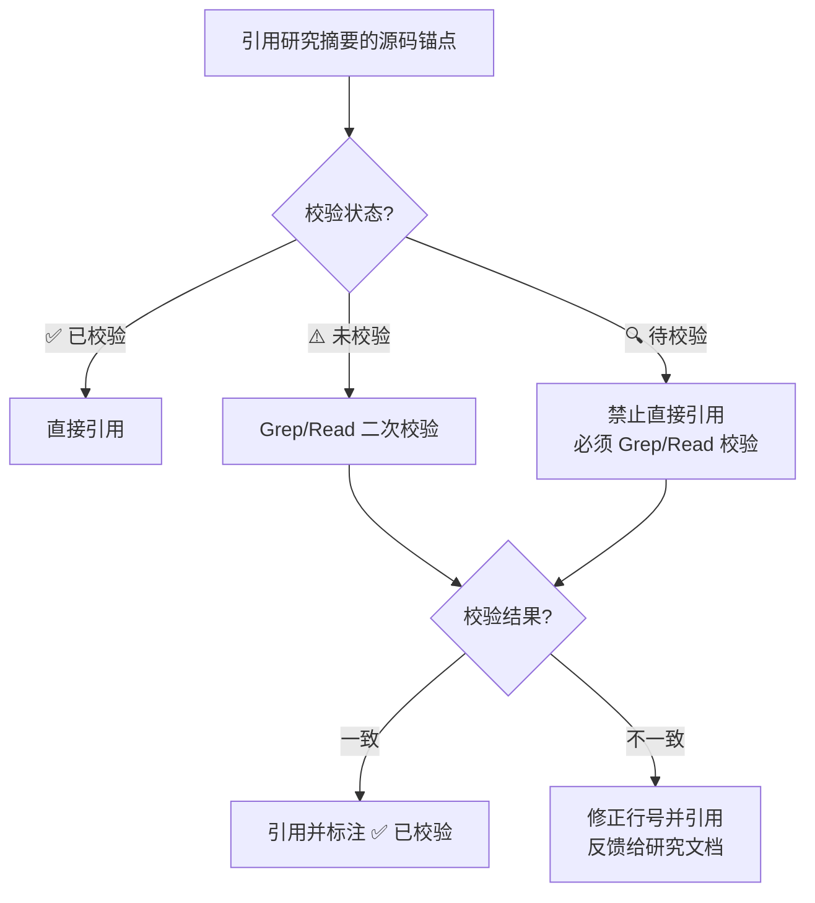

# 源码锚点二次校验协议：研究-编写阶段的质量传递契约

## 模式概述

在多阶段 sub-agent 协作中，**研究阶段**产出的源码锚点（行号、API 签名、文件路径）必须标注校验状态，**编写阶段**的 sub-agent 根据校验状态决定是否二次校验。研究 sub-agent 在快速浏览源码时记录的行号易有 300+ 行偏差，若编写 sub-agent 盲目信任研究摘要，会导致产出物的源码锚点全部失准，可追溯性受损。

本模式是 [navigation-hub-filename-contract](navigation-hub-filename-contract.md) 的姊妹模式：前者解决"文件名契约"的跨阶段传递，本模式解决"行号契约"的跨阶段传递。两者共同构成多阶段 sub-agent 协作的"质量传递契约体系"。

## 问题现象

多阶段 sub-agent 协作（研究 → 编写）时的典型失败链：

1. **研究 sub-agent 快速浏览源码**：为提高效率，研究 sub-agent 在快速浏览源码时记录行号，未通过 Grep/Read 二次校验
2. **行号偏差累积**：快速浏览记录的行号易有偏差，本次案例偏差达 300+ 行（process_overrides 实际 L354 vs 研究摘要记录 L38）
3. **编写 sub-agent 盲目信任**：编写 sub-agent 收到研究摘要后，直接引用其中的行号，未进行二次校验
4. **源码锚点失准**：编写产出的文档中，源码锚点（`#L行号` 格式）全部指向错误位置，可追溯性受损
5. **事后修正成本高**：02-project-structure.md sub-agent 需要额外时间二次校验并修正 162 个源码锚点中的偏差部分

**关键特征**：行号偏差**不会立即报错**（不像断链那样可被 check-links.py 检测），只有在用户点击锚点跳转时才会发现指向错误位置——这是一种"隐性质量缺陷"，比断链更危险。

## 解决方案

### 三级校验状态标注

研究 sub-agent 在记录每个源码锚点时，必须标注校验状态：

| 校验状态 | 含义 | 校验方式 | 下游处理 |
|---------|------|---------|---------|
| `✅ 已校验` | 通过 Grep/Read 确认行号准确 | Grep 定位符号 → Read 确认行号 | 可直接引用 |
| `⚠️ 未校验` | 基于快速浏览记录，可能偏差 | 未校验 | 引用前必须 Grep/Read 校验 |
| `🔍 待校验` | 基于推测，必须下游校验 | 推测 | 禁止直接引用，必须 Grep/Read 校验后引用 |

### 研究文档的校验状态标注格式

研究 sub-agent 在研究文档中记录源码锚点时，使用以下格式标注校验状态：

```markdown
## 源码锚点速查表

### src/scikit_build_core/settings/_skbuild_settings.py

| 符号 | 行号 | 校验状态 | 说明 |
|------|------|---------|------|
| `class ScikitBuildSettings` | L263 | ✅ 已校验 | 配置模型主类 |
| `def process_overrides` | L354 | ✅ 已校验 | Overrides 处理函数 |
| `class Program(NamedTuple)` | L103 | ✅ 已校验 | 程序路径 NamedTuple |
| `BACKEND_MIN_VERSION` | L38 | ⚠️ 未校验 | 后端最小版本常量 |
```

### 校验成本权衡策略

研究阶段 vs 编写阶段的校验成本权衡：

| 校验阶段 | 校验成本 | 受益范围 | 推荐策略 |
|---------|---------|---------|---------|
| 研究阶段校验 | 1 次 | 下游 N 个章节 | 对高频引用锚点（≥3 个章节会引用）校验 |
| 编写阶段校验 | N 次 | 仅当前章节 | 对低频引用锚点（<3 个章节会引用）校验 |

**关键原则**：研究阶段不应对所有锚点都校验（可能延误研究进度），也不应不校验（下游成本高）。推荐策略是对"高频引用的关键锚点"进行校验，低频锚点交给编写阶段校验。

### 编写 sub-agent 的校验决策流程

编写 sub-agent 引用研究摘要的锚点时，按以下流程决策：



## 适用场景

- ✅ 多阶段 sub-agent 协作（研究 → 编写），研究阶段产出包含源码锚点
- ✅ 编写阶段需要引用研究摘要的行号、API 签名、文件路径
- ✅ 源码锚点数量 ≥10（少量锚点可全部校验，无需分级）
- ✅ 研究阶段时间紧迫，无法对所有锚点进行校验
- ❌ 单阶段任务（主 agent 自己研究 + 编写，无需跨阶段传递）
- ❌ 源码锚点数量 ≤5（直接全部校验，无需分级）
- ❌ 不涉及源码行号的任务（如纯概念性 wiki）

## 实际案例

### 案例1：scikit-build-core Wiki 教程创建（本次验证）

**任务背景**：3 个研究 sub-agent 产出 source-code-analysis.md（27KB），7 个编写 sub-agent 并行创建 wiki 章节

**失败过程**：
- 研究 sub-agent 在快速浏览源码时记录行号，未通过 Grep/Read 二次校验
- 行号偏差累积：
  - `process_overrides` 实际 L354 vs 研究摘要记录 L38（偏差 316 行）
  - `SettingsReader` 类在 L263 vs 研究摘要记录 L61（偏差 202 行）
  - `Program NamedTuple` 在 L103 vs 研究摘要记录 L39-L46（偏差 64 行）
- 02-project-structure.md sub-agent 发现偏差后，通过 Grep/Read 二次校验修正 162 个源码锚点

**对比反事实估计**：如果研究 sub-agent 标注了校验状态，02-project-structure.md sub-agent 会根据状态决定是否二次校验，避免盲目信任。

**验证数据**：
- 研究摘要行号偏差率：约 2%（3 处明显偏差 / 162 个锚点）
- 单点偏差幅度：64-316 行
- 修正成本：02-project-structure.md sub-agent 额外时间二次校验

### 案例2：IDL Wiki 教程创建（对照案例）

**任务背景**：IDL wiki 任务未涉及源码行号引用（IDL 是概念性 wiki，非源码 wiki）

**对比分析**：本模式不适用于概念性 wiki，仅适用于源码 wiki（需要引用源码行号的任务）。

## 反模式

### 反模式1：研究 sub-agent 不标注校验状态

```
研究文档：
## 源码锚点
- process_overrides: L38
- SettingsReader: L61
```

编写 sub-agent 不知道哪些行号已校验、哪些未校验，只能盲目信任或全部二次校验（成本过高）。

**正确做法**：每个锚点必须标注校验状态（✅/⚠️/🔍）。

### 反模式2：研究 sub-agent 对所有锚点都校验

研究 sub-agent 对所有 162 个锚点都通过 Grep/Read 校验，导致研究阶段耗时过长。

**正确做法**：对高频引用锚点（≥3 个章节会引用）校验，低频锚点交给编写阶段校验。

### 反模式3：编写 sub-agent 盲目信任研究摘要

编写 sub-agent 收到研究摘要后，直接引用所有行号，不进行二次校验。

**正确做法**：根据校验状态决策——`✅ 已校验`可直接引用，`⚠️ 未校验`和`🔍 待校验`必须二次校验。

### 反模式4：编写 sub-agent 对所有锚点都二次校验

编写 sub-agent 不信任研究摘要，对所有锚点都通过 Grep/Read 二次校验，导致编写阶段耗时过长。

**正确做法**：根据校验状态决策——`✅ 已校验`无需二次校验，仅对 `⚠️ 未校验` 和 `🔍 待校验` 二次校验。

## 与其他模式的关系

| 关系模式 | 关系类型 | 说明 |
|---------|---------|------|
| [navigation-hub-filename-contract.md](navigation-hub-filename-contract.md) | 姊妹 | 前者解决"文件名契约"的跨阶段传递，本模式解决"行号契约"的跨阶段传递，两者共同构成质量传递契约体系 |
| [triangular-source-verification.md](../retrospective-knowledge/triangular-source-verification.md) | 互补 | 三源验证法解决"跨源一致性"（源码 + 文档 + 教程），本模式解决"单源内部准确度"（源码行号校验） |
| [spec-driven-batch-doc-generation.md](spec-driven-batch-doc-generation.md) | 上位 | 本模式是 Spec 驱动批量文档生成模式中"研究阶段"的子模式，专门解决源码锚点的校验状态传递 |
| [subagent-atomic-task-template.md](subagent-atomic-task-template.md) | 支撑 | 本模式是 sub-agent 原子任务模板的扩展，增加"研究-编写阶段质量传递"要素 |

## 边界与选型

**何时使用本模式**：
- 多阶段 sub-agent 协作（研究 → 编写）
- 研究阶段产出包含源码锚点（行号、API 签名、文件路径）
- 编写阶段需要引用研究摘要的锚点
- 源码锚点数量 ≥10

**何时不需要本模式**：
- 单阶段任务（主 agent 自己研究 + 编写）
- 源码锚点数量 ≤5（直接全部校验）
- 不涉及源码行号的任务（如纯概念性 wiki）
- 研究阶段时间充裕，可对所有锚点校验

**与 [navigation-hub-filename-contract](navigation-hub-filename-contract.md) 的协同**：
- 文件名契约：解决"跨 sub-agent 文件名一致性"
- 行号契约：解决"跨阶段行号准确度"
- 两者共同构成多阶段 sub-agent 协作的完整质量传递体系

## Changelog

<!-- changelog -->
- 2026-07-05 | docs | v1.0：初始版本，L1 成熟度，源自 scikit-build-core Wiki 教程创建任务洞察萃取
