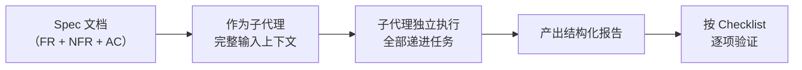

# Spec 驱动子代理执行模式

## 模式类型
方法论模式 / 工作流 / AI 协作

## 成熟度
L2 已验证（2次验证：2026-07-06 Orca IDE 文章分析 + 2026-07-07 HiAgent平台产品分析）

## 适用场景

- 任务结构清晰、依赖关系线性
- 可以通过 Spec 文档完整描述任务需求
- 任务的验收标准明确可量化
- 需要子代理独立完成多步骤分析工作

## 核心模式

## 实施步骤

### 步骤 1：编写完整 Spec

Spec 文档需包含：
- **Functional Requirements (FR)**：明确的功能需求列表
- **Non-Functional Requirements (NFR)**：质量要求（准确性、完整性、可读性等）
- **Acceptance Criteria (AC)**：可量化的验收标准
- **Background & Context**：任务背景和上下文信息

### 步骤 2：设计线性任务依赖

将任务按依赖关系排列为线性序列：
- 每个任务有明确的输入（前序任务输出）和输出
- 避免循环依赖和并行冲突
- 最终任务为整合输出

### 步骤 3：委派单子代理执行

- 将 Spec 全文 + 原始数据作为子代理的输入
- 使用单子代理完成全部任务（而非多子代理并行）
- 子代理按任务顺序递进执行

### 步骤 4：按 Checklist 验证

- 子代理完成后，按 Checklist 逐项验证
- 验证通过则任务完成
- 验证不通过则补充任务并重新执行

## 设计原则

1. **Spec 即合约**：Spec 是子代理的执行边界，清晰的 Spec 减少沟通成本
2. **单代理优先**：线性任务适合单代理完成，避免多代理间的上下文传递损耗
3. **Checklist 驱动验证**：验收标准量化后，验证过程自动化

## 适用条件

- 任务总复杂度在单子代理处理能力范围内
- 原始数据量适中（不超过子代理上下文窗口）
- 任务之间依赖关系清晰，无分叉和合并

## 不适用场景

- 任务之间存在并行分支（应使用多子代理）
- 原始数据量过大（应分段处理）
- 需要实时交互或多次迭代

## 案例分析

### 案例1：Orca 文章分析
- **Spec**：15 FR + 7 NFR + 10 AC
- **任务链**：8 个递进任务（内容记录→定位识别→功能梳理→设计理念→范式分析→行业洞察→方法论总结→结构化输出）
- **子代理**：1 个 general_purpose_task 子代理
- **产出**：443 行分析报告，31 个检查点全部通过

### 案例2：HiAgent 平台产品分析
- **Spec**：10 个验收标准（AC）
- **任务链**：11 个递进任务（网页内容提取→产品定位→八大优势→十大场景→技术架构→客户案例→UX设计→商业价值→可借鉴模式→格式规范→文档整合）
- **子代理**：1 个 general_purpose_task 子代理（执行Task2-11，Task1内容提取由主代理完成以确保数据源可靠）
- **产出**：800+行结构化学习笔记，11个章节含Mermaid图表，43个检查点全部通过
- **关键差异**：Task1（网页内容提取）由主代理先执行（涉及工具切换和MCP交互），将提取的结构化内容保存后，再委托子代理执行后续分析任务。这种"主代理获取数据→子代理深度分析"的分工模式在涉及复杂工具交互时更可靠。

**验证结论**：两次跨领域验证（技术IDE文章分析 + 企业AI平台产品分析）均验证了该模式的有效性。Spec三件套（spec.md/tasks.md/checklist.md）为子代理提供了清晰的执行边界和验收标准，单子代理递进执行避免了多代理间的上下文传递损耗。

## 相关模式

- [spec-driven-batch-doc-generation](spec-driven-batch-doc-generation.md) - Spec 驱动批量文档产出
- [subagent-atomic-task-template](subagent-atomic-task-template.md) - 子代理原子任务模板