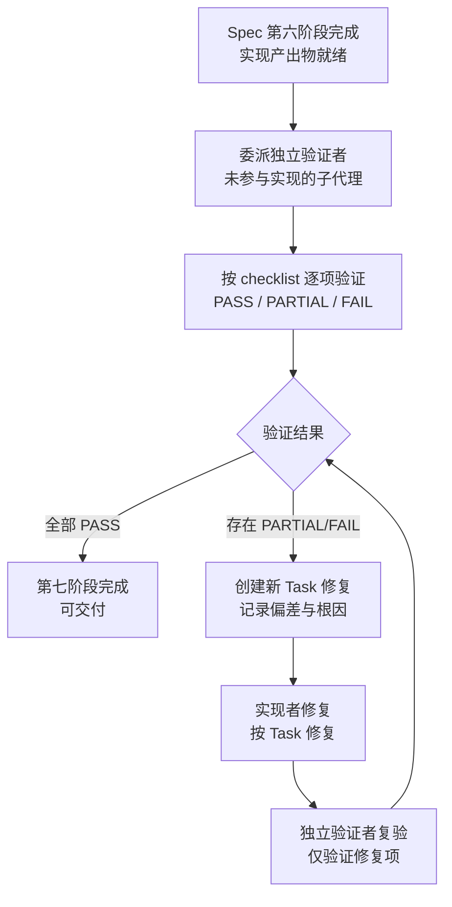

# Spec 模式第七阶段独立验证机制

## 模式概述

Spec 实现完成后（第六阶段结束），不直接交付，而是委派**未参与实现的子代理**按 checklist 逐项验证产出物是否符合 spec 要求。对 PARTIAL/FAIL 项创建新 Task 修复，修复后由独立验证者复验，直到全部 PASS 才完成第七阶段。

与"实现者自检"或"主代理审查"相比，独立验证机制能更客观地发现"实现与规范的偏差"，尤其是实现者因上下文共享而无法察觉的"共享误解"问题。

## 核心逻辑

```
Spec 第七阶段验证 = 独立验证者（未参与实现） + checklist 逐项验证 + PARTIAL/FAIL 修复闭环
                ≠ 实现者自检（确认偏误，自己写的代码自己难发现问题）
                ≠ 主代理审查（与实现者共享上下文，存在"共享误解"盲区）
                ≠ 一次性通过即交付（无修复闭环，PARTIAL 项被忽略）
```

**为什么有效**：

1. **视角独立性**：验证者未参与实现，不带"实现者偏见"——不知道实现者的设计意图，只看代码与 spec 是否一致
2. **结构化覆盖**：checklist 提供系统性检查点，避免"看了主要功能就放过边界场景"
3. **客观证据**：基于代码内容给出 PASS/PARTIAL/FAIL 证据，非主观判断
4. **修复闭环**：PARTIAL 项不放过，必须创建 Task 修复并复验，避免"差不多就行"

## 问题现象：实现完成即交付的质量盲区

Spec 实现完成后直接交付的常见问题：

1. **docstring 声明 vs 代码实现不一致**：docstring 声明了功能，但代码未实现（或反之）——实现者知道"应该实现什么"，但没意识到"自己漏了什么"
2. **多输出模式不一致**：JSON 模式输出完整字段，文本模式简化了——实现者认为"机器读取需要完整，人类读取可以简化"，但 spec 没有这个授权
3. **跨场景一致性遗漏**：实现了主场景（如日期检测），忽略了替代场景（如 task-id 检测）——实现者聚焦主场景时，验证者能从 spec 全文发现遗漏
4. **环境依赖问题**：在开发者环境正常，在用户环境崩溃（如 GBK 终端编码）——实现者环境与验证者环境差异能暴露跨环境问题

这些问题的共性是：**实现者因为"知道应该怎么做"而无法发现自己的遗漏**，只有独立第三方才能从"spec 全文"的视角系统检查。

## 模式流程



### 阶段 1：委派独立验证者

**关键要求**：验证者必须是**未参与实现**的子代理。

任务描述应包含：
1. 完整的 checklist 文件路径（让验证者自己读取）
2. 完整的 spec 文件路径（作为验证依据）
3. 实现产出物清单（脚本路径、文档路径）
4. 验证产出物要求：逐项标注 PASS / PARTIAL / FAIL，给出证据（代码行号、文件路径）
5. **不要**让验证者自行修复——只报告问题清单

### 阶段 2：按 checklist 逐项验证

每个检查点的验证产出格式：

```
检查点：<检查点内容>
状态：PASS / PARTIAL / FAIL
证据：<代码行号/文件路径/运行结果>
说明（PARTIAL/FAIL 时必填）：<偏差描述+根因分析>
```

**PARTIAL 的判定标准**：
- 主功能实现，但边界场景遗漏
- 主输出模式正确，但替代模式不完整
- docstring 声明部分实现，但非全部实现

### 阶段 3：修复闭环

对每个 PARTIAL/FAIL 项：
1. 创建新 Task（含背景说明：来自第七阶段验证发现的偏差）
2. 拆分 SubTask（修复步骤）
3. 由实现者修复
4. 独立验证者复验（仅验证修复项，不重复全部检查）
5. 复验通过则该项 PASS，全部 PASS 则第七阶段完成

## 适用边界

### 适用场景

- ✅ Spec 模式第六阶段（实现）完成后
- ✅ 复杂 spec（≥5 个 Requirement 或 ≥10 个 checklist 检查点）
- ✅ 实现涉及多个子代理（实现者与验证者可以真正隔离）
- ✅ 高质量要求的产出物（CI 集成脚本、治理文档等）

### 反模式（何时不适用）

- ❌ **简单 spec**（<5 个检查点）：独立验证开销超过直接交付，主代理自检即可
- ❌ **没有可用子代理**：无法实现"独立验证者"，主代理审查存在共享上下文盲区
- ❌ **时间紧急**：独立验证+修复闭环至少增加 30-50% 时间，紧急场景不适用
- ❌ **创意类产出物**：创意作品的"验证"标准主观，独立验证者难以客观判定

## 反模式（不要这么做）

### 反模式 1：让实现者自检

```
❌ 实现 Task 完成后，让实现者"检查一下是否符合 spec"
```

**为什么错误**：实现者有"确认偏误"——自己写的代码自己难发现问题，大脑（AI 也一样）会自动补全逻辑漏洞。本次复盘中的 task-id 检测缺失，正是因为实现者聚焦日期检测主场景，忽略了 task-id 替代条件。

**正确做法**：必须切换到独立子代理，从未参与实现的视角按 checklist 验证。

### 反模式 2：主代理审查代替独立验证

```
❌ 主代理（编排者）审查所有实现产出物，判定是否符合 spec
```

**为什么错误**：主代理与实现者共享 spec 上下文，可能存在"共享误解"——主代理和实现者都对 spec 某条款有相同的（错误的）理解，主代理审查时不会发现这个错误。

**正确做法**：独立验证者应该是新启动的子代理，未参与 spec 制定与实现讨论。

### 反模式 3：一次性通过即交付

```
❌ 验证者报告"2 项 PARTIAL"，主代理认为"主要功能都过了"，直接交付
```

**为什么错误**：PARTIAL 项虽然不影响主功能，但代表"实现与 spec 不一致"——下游使用者按 spec 调用时会发现功能缺失。本次复盘中 task-id 检测缺失就是 PARTIAL，但纯 task-id 命名的内容会被误判为不合规。

**正确做法**：PARTIAL 必须创建 Task 修复并复验，直到全部 PASS。

### 反模式 4：让验证者既验证又修复

```
❌ 验证者发现问题后，直接让验证者修复
```

**为什么错误**：验证者修复后会形成"自验证自修复"的闭环，失去独立性。后续验证时验证者会倾向于认为自己修复的是对的。

**正确做法**：验证者只报告问题清单，修复由实现者完成，复验由验证者完成。

## 检验标准

做完之后怎么知道做对了？

1. **独立性**：验证者未参与实现，可通过询问"你参与了哪个 Task 的实现？"确认
2. **结构化**：每个 checklist 检查点都有明确的 PASS/PARTIAL/FAIL 判定与证据
3. **修复闭环**：所有 PARTIAL/FAIL 项都有对应的 Task，且复验通过
4. **根因记录**：每个 PARTIAL/FAIL 项都记录了根因分析（不只是"功能缺失"，而是"为什么缺失"）
5. **覆盖完整**：checklist 所有检查点都被验证，无遗漏

## 跨场景迁移示例

| 应用场景 | 验证对象 | checklist 来源 | 修复机制 |
|---------|---------|---------------|---------|
| **Spec 模式实现验证** | 代码+文档产出物 | spec.md 中的 Scenario 与 checklist.md | 创建新 Task 修复 |
| **API 文档审查** | API 文档与实现 | API 规范文档 + 字段清单 | 提交 PR 补充缺失字段 |
| **测试覆盖率审查** | 测试用例 | 需求文档中的功能点 | 补充测试用例 |
| **文档本地化审查** | 翻译文档 | 原文文档 + 术语表 | 修订翻译不一致项 |
| **代码审查** | 代码实现 | 编码规范 + 设计文档 | 提交修复 PR |

## 实际案例

### 案例：config-file-placement-governance spec 第七阶段验证（本模式来源）

**Spec 实现产出物**：
- 3 个 Python 脚本（verify-sitecustomize-autoload.py、check-file-placement.py、check-temp-lifecycle.py）
- 2 个 CI 集成模块（lib/checks/file_placement.py、lib/checks/temp_lifecycle.py）
- 1 个治理文档（config-file-placement-convention.md）
- 1 个 pre_commit.py 修改

**Checklist 检查点数**：74 项（覆盖 6 大类：sitecustomize 自动加载、文件放置校验、治理文档、预提交钩子与 CI、.temp 生命周期、端到端验证）

**验证结果**：
- 初验：72 PASS + 2 PARTIAL
- PARTIAL 1：check-temp-lifecycle.py 命名合规校验缺失 task-id 检测（docstring 声明"日期或 task-id"，代码仅实现日期检测）
- PARTIAL 2：check-temp-lifecycle.py 文本模式未对每项输出基准日期来源（JSON 模式完整，文本模式仅对过期项标注）

**修复闭环**：
- Task 8：新增 TASK_ID_PATTERN 正则，classify_item 函数在日期解析失败时检查 task-id 模式
- Task 9：不合规项输出行追加 `(it.date_source)` 标注，新增合规未过期项汇总说明
- 复验：74/74 PASS

**价值证明**：2 个 PARTIAL 均通过独立验证者发现，实现者自检时未发现。证明独立验证机制有效。

## 与其他模式的关系

| 关联模式 | 关系类型 | 关系说明 |
|---------|---------|---------|
| [generation-validation-closed-loop.md](generation-validation-closed-loop.md) | 上位 | 生成-验证闭环是通用方法论，本模式是其在 Spec 模式场景的具体应用——验证阶段由独立子代理按 checklist 执行 |
| [batched-creation-independent-review.md](batched-creation-independent-review.md) | 互补 | 分批创作+独立质检聚焦长文档创作场景，本模式聚焦代码+文档实现验证场景，两者共享"独立验证者"核心理念 |
| [spec-mode-doc-creation-workflow.md](spec-mode-doc-creation-workflow.md) | 上下游 | Spec Mode 工作流中，第六阶段实现完成后进入第七阶段独立验证 |
| [external-content-fact-verification.md](external-content-fact-verification.md) | 类比 | 外部内容事实核查用独立子代理验证引文真实性，本模式用独立子代理验证实现一致性，都基于"独立验证者"原则 |
| [cognitive-practice-gap-recursive-defense.md](../governance-strategy/cognitive-practice-gap-recursive-defense.md) | 防御补充 | 认知偏差递归防御解释了为什么实现者无法发现自己的遗漏（共享误解），本模式提供具体的独立验证机制 |

## 待验证场景

本模式目前仅有 1 个案例支撑（config-file-placement-governance spec），标记为 L1-draft。建议在以下场景验证以提升至 L2-validated：

1. **下次 Spec 模式实现完成后**：强制执行第七阶段独立验证，记录是否发现 PARTIAL/FAIL 项
2. **不同类型 spec**：当前案例是 standards-tools 类 spec，下次可尝试 documentation 类或 feature 类 spec
3. **不同复杂度 spec**：当前案例 74 项检查点，可尝试更小（<30 项）或更大（>100 项）的 spec

## Changelog

<!-- changelog -->
- 2026-07-18 | create | 初始版本，从 config-file-placement-governance spec 复盘 S3.1 模式 1 沉淀，L1-draft（单案例待验证），来源：retrospective-config-file-placement-governance-20260718
