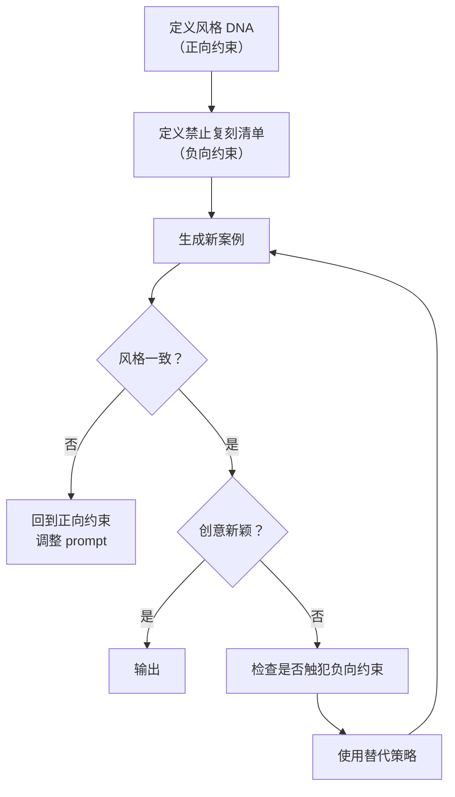

> **已原子化自**：[insight-extraction.md 洞察 7 + 规律 2](../../../reports/competitive-analysis/retrospective-ian-xiaohei-source-analysis-20260625/insight-extraction.md) —— Ian Xiaohei Illustrations 仓库源码分析

# 风格-创意分离控制（Style-Creativity Separation Control）

## 模式类型

方法论模式

## 成熟度

L2 已验证（Ian Xiaohei Illustrations 完整实践验证）

## 适用场景

设计 AI Skill 时，需要同时满足「输出风格稳定」和「每次创意新颖」这两个看似矛盾的需求。

## 问题背景

AI Skill 设计中的一个核心矛盾：我们既希望 AI 在**风格**上保持一致（每次输出都符合品牌调性），又希望 AI 在**创意**上不断创新（不要每次都是同一套构图）。

传统的 few-shot 示例会**同时固化风格和创意**——提供 3 个示例后，AI 不仅学会了风格，还会反复复用示例中的构图模式。这导致输出趋同——AI 的创造力随使用频次增加而**熵增**。

解决方案是将「风格一致性」和「创意多样性」作为两个独立维度，分别使用不同的约束机制：

| 维度 | 控制手段 | 机制类型 |
|------|---------|---------|
| 风格一致性 | 正向规则（必须遵守的风格 DNA） | 硬约束 |
| 创意多样性 | 负向规则（禁止复用的已知成功案例） | 软约束 + 替代策略 |

## 核心规则

### 规则 1：正向约束控制风格一致性

定义必须遵守的风格规则，作为 Agent 的「硬约束」：

```text
必须：
- 16:9 横版
- 纯白背景
- 黑色手绘线稿
- 少量红橙蓝中文批注

绝对不要：
- 商业插画、PPT 信息图
- 可爱卡通、儿童插画
- 左上角写类型标题
```

### 规则 2：负向约束保证创意多样性

列出**明确禁止复用的已知成功案例**，并为每个案例提供替代方向：

```
禁止复刻：
- 传送带两个断点 → 替代：能量条断开
- 小黑拉三层信息源 → 替代：小黑在井口接不同方向落下的信息块
- 素材鱼 → 替代：小黑把一个纸团压成几种形状

同类主题也要换新隐喻。例如「承接路径」不一定画路线，
可以画小黑把内容尾巴接到门把手。
```

### 规则 3：替代策略必须具体

仅说「不要用旧方案」是不够的——必须给 Agent 一个可执行的替代方向。替代策略应：

- 保留核心意思（如「内容从 A 到 B 的传递」）
- 更换主物件（从「路线」换为「门把手」）
- 更换动作（从「牵着走」换为「接上去」）

### 规则 4：Only-Add 管理模式

正向约束和负向约束都采用「只增不删」的管理策略：

- 新增成功案例后：同步添加到负向约束清单
- 发现新的风格违规模式后：同步添加到正向约束的「绝对不要」
- 不删除已列出的禁止复刻条目（历史记录有助于 AI 理解模式的演化）

## 操作流程



## 实施检查清单

- [ ] 正向约束是否覆盖了所有关键风格维度（色彩、构图、密度、语言）？
- [ ] 负向约束是否列出了已知的成功案例（至少 5 个）？
- [ ] 每个禁止复刻案例是否有至少 1 个具体的替代方向？
- [ ] 替代策略是否保留了核心意思的同时更换了物件和动作？
- [ ] 正向和负向约束的管理策略是否明确（Only-Add）？

## 反例警示

| 错误做法 | 后果 |
|---------|------|
| 只提供 few-shot 示例，无禁止复刻规则 | AI 倾向于反复使用示例中的构图，输出趋同 |
| 正向约束只写「必须」，不写「绝对不要」 | AI 对边界理解模糊，倾向于试探边界 |
| 负向约束不提供替代策略 | AI 知道不该做什么但不知道应该做什么 |
| 负向约束过少（≤ 3 个） | 无法覆盖主要的复刻倾向 |
| 删除旧的禁止复刻条目 | AI 可能重新「发现」并复刻这些旧模式 |

## 正例

Ian Xiaohei Skill 的分离控制体系：

**正向约束**（style-dna.md）：
```
必须：纯白背景、黑色手绘线稿、大量留白、一张图一个核心
绝对不要：商业插画、PPT 信息图、可爱卡通、左上角标题
颜色：黑色 85% + 红橙蓝辅助
```

**负向约束**（composition-patterns.md 反复刻规则）：
```
禁止复刻 9 个旧案例构图 + 每个配替代策略
同类主题也要换新隐喻
```

## 与现有模式的关系

- `constraint-driven-creativity.md`：本模式是该模式的精细化——约束驱动创造力关注「通过约束聚焦信息」，本模式进一步将约束分为正向（风格控制）和负向（创意多样性），实现分离控制。
- `programmable-creativity-algorithm.md`：本模式的「替代策略」可以调用该模式的三步隐喻转换法来生成新的创意方向。
- `symptom-prescription-qa.md`：本模式的负向约束清单可以作为该模式「失败信号」的来源——如果生成结果与禁止复刻案例相似，触发 QA 处方。

> **关联模块**：
> - `constraint-driven-creativity.md`
> - `programmable-creativity-algorithm.md`
> - `symptom-prescription-qa.md`
