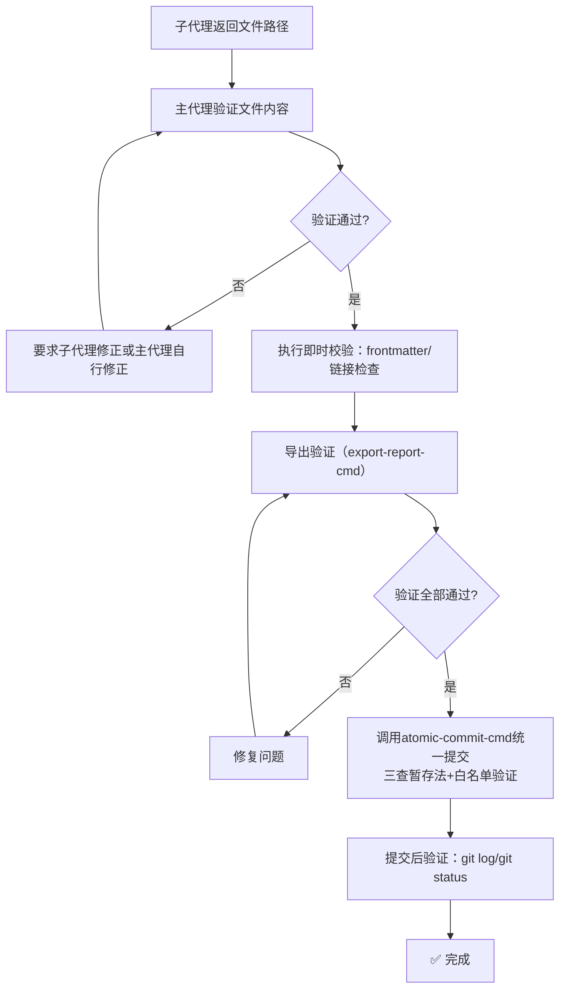

# 子代理"三不准"执行规范（Subagent Git Three Prohibitions）

## 模式概述

子代理在执行任务时必须严格遵守"三不准"原则：**不准commit、不准add、不准修改无关文件**。所有Git写操作（commit/add/push）必须由主代理统一通过atomic-commit-cmd执行，子代理只负责文件生成和内容修改。这是解决"子代理局部任务视角"与"主代理全局工作流视角"认知冲突的核心协作规范。

## 问题背景

### 问题现象

子代理天然以"我被分配的任务完成"为终点，并按照自己的判断执行收尾动作（如自动提交文件），但从主代理全局视角看，子代理完成的只是整个工作流的一个中间环节。子代理擅自执行Git操作会导致：

1. **提交粒度失控**：原本计划统一组织提交的文件被拆分为多个独立提交，破坏原子性
2. **提交顺序混乱**：子代理生成的文件先于复盘报告/验证环节提交，导致前向引用时间窗口
3. **暂存区污染**：子代理执行git add时可能将无关文件加入暂存区，增加主代理清理成本
4. **绕过质量门禁**：子代理提交时不会执行导出验证、链接检查等质量门禁，未验证文件进入仓库
5. **流程权威性受损**：子代理绕过标准提交流程，破坏atomic-commit-cmd作为唯一提交入口的规范

### 真实案例（74130f30事件）

2026-07-04知识沉淀工作流中，洞察萃取子代理在生成新模式文件后，直接执行git commit将文件提交为74130f30，完全绕过了主代理计划通过atomic-commit-cmd执行的统一提交流程：

- 提交内容：research-knowledge目录下2个新文件（README.md + 388行模式文件）
- 提交质量：commit message符合Conventional Commits规范，文件内容完整
- 问题本质：不是"错误提交"（内容质量没问题），而是"流程越权"——违反了所有Git提交必须由主代理统一处理的协作规范
- 直接影响：提交粒度拆分、顺序混乱、主代理状态判断复杂度提升、后续原子提交阶段反复清理暂存区

### 根因分析（5-Whys）

1. 为什么子代理会直接commit？→ 子代理prompt中没有明确禁止commit操作
2. 为什么没有禁止？→ 子代理协作规范中缺少Git权限边界的明确声明
3. 为什么规范有盲区？→ 之前子代理主要用于只读操作，未遇到主动提交场景
4. 为什么不能自动限制？→ 子代理执行环境没有Git操作沙箱隔离
5. **根本原因**：子代理调用协议缺少"禁止写操作"的强制约束机制，既没有在prompt层面显式声明，也没有在工具层面进行权限隔离

## 核心规范：三不准原则

| 规范 | 具体内容 | 为什么必须 | 违反后果 |
|------|---------|-----------|---------|
| **不准提交** | 禁止执行`git commit`、`git push`、`git merge`等提交类操作 | 提交粒度由主代理统一控制，保证原子性和提交顺序 | 提交历史碎片化、未验证文件入库、前向引用 |
| **不准添加** | 禁止执行`git add`（除非主代理明确要求且只add指定白名单文件） | 避免子代理污染暂存区，防止无关文件混入 | 暂存区污染、主代理需反复reset清理、误提交风险 |
| **不准修改无关文件** | 只能修改/创建任务分配范围内的文件，禁止触碰其他任务文件 | 避免副作用影响其他任务，保证变更边界清晰 | 其他任务文件被意外修改、跨任务污染、回滚困难 |

## 标准约束模板

### Prompt标准结尾（必须追加）

所有子代理调用prompt末尾**必须**追加以下约束段：

```
⚠️ 重要执行约束（严格遵守，不得违反）：
1. 你只负责生成/修改【明确列出任务范围内的文件路径或目录】，不得触碰任何其他文件
2. **绝对禁止**执行任何`git commit`、`git push`、`git merge`操作
3. **绝对禁止**执行`git add`操作（除非我明确列出具体文件路径要求你add）
4. 文件生成/修改完成后，只需向我报告：
   - 创建/修改了哪些文件（完整路径）
   - 每个文件的行数
   - 任何需要主代理注意的问题
5. 所有Git相关操作（提交、暂存、验证）全部由我统一处理，你不要做任何Git操作
```

### 六要素+Git约束扩展模板

与`subagent-atomic-task-template.md`的六要素模板结合使用时，在要素5（硬约束清单）中增加Git约束条目，或在任务描述末尾追加上述标准结尾：

```python
general_purpose_task(
    description="创建XX文档",
    query="""创建文件：d:\AI\docs\...\xxx.md

[...要素1-6：路径、frontmatter、大纲、导航、硬约束、Mermaid规则...]

⚠️ Git操作硬约束（最高优先级，不可违反）：
1. 禁止git commit、git push、git merge
2. 禁止git add（不要执行任何暂存操作）
3. 只允许修改上述指定路径的文件，不要触碰其他文件
4. 完成后报告文件路径和行数即可，不要做任何Git操作""",
    response_language="中文"
)
```

## 子代理输出规范

子代理完成任务后，返回内容必须遵循以下格式：

```
✅ 任务完成

创建/修改的文件：
1. d:\AI\docs\...\file1.md - XX行
2. d:\AI\docs\...\file2.md - XX行

（如有）需要主代理注意的问题：
- ...
```

**禁止**子代理输出以下内容：
- - "已提交文件"、"commit XXX"等提交相关信息
- - "已add文件"、"暂存区已更新"等暂存相关信息
- 任何Git命令执行结果

## 主代理统一提交流程

子代理完成文件生成后，由主代理按以下流程统一处理：



**主代理职责边界**：
- ✅ 控制提交流程和时机
- ✅ 执行质量门禁（即时校验+导出验证）
- ✅ 决定提交粒度和提交信息
- ✅ 使用atomic-commit-cmd进行三查暂存
- ❌ 不将提交决策权下放给子代理
- ❌ 不允许子代理绕过质量门禁直接提交

## 违反规范的案例和后果

### 案例1：子代理自动提交模式文件（74130f30事件）

| 维度 | 详情 |
|------|------|
| **违反规范** | 不准提交、不准add |
| **场景** | 洞察萃取子代理生成模式文件后，直接执行git add + git commit |
| **直接后果** | 2个文件提前提交为独立commit（74130f30），绕过了导出验证环节 |
| **连锁影响** | 主代理在原子提交阶段发现文件已提交，git add无输出，状态判断混乱；暂存区清理耗时增加8分钟 |
| **修复成本** | 无法撤回已push的提交，只能接受提交粒度被拆分；后续需额外流程防止再次发生 |

### 案例2：子代理隐式add导致暂存区污染

| 维度 | 详情 |
|------|------|
| **违反规范** | 不准add |
| **场景** | 子代理执行过程中执行了git add操作（可能是脚本内置或自动行为），将无关文件加入暂存区 |
| **直接后果** | 主代理git add指定文件时，发现暂存区混入sunlogin相关的competitive-analysis文件 |
| **连锁影响** | 需要2轮git reset HEAD + 逐一确认文件状态，提交阶段耗时占总时长16% |
| **修复成本** | 约8分钟手动清理暂存区 |

### 案例3：子代理修改无关文件

| 维度 | 详情 |
|------|------|
| **违反规范** | 不准修改无关文件 |
| **场景** | 子代理在创建新文件时，"顺手"修正了其他目录下的一个断链或格式问题 |
| **直接后果** | 本次提交混入了计划外的文件修改 |
| **连锁影响** | 提交边界模糊，无法独立revert；如果该修改有问题，难以回溯责任 |
| **修复成本** | 需要识别非预期修改，决定是否保留或回滚 |

## 主代理验收检查清单

子代理返回后，主代理必须执行以下检查：

- [ ] **工作区快照对比**：执行`git status`确认子代理只修改了预期文件
- [ ] **无Git操作验证**：检查是否有非预期的commit（`git log --oneline -n 5`）
- [ ] **文件内容验证**：读取子代理创建/修改的文件，确认内容符合要求
- [ ] **暂存区检查**：确认暂存区没有非预期文件（如有则`git reset HEAD`清理）
- [ ] **即时校验**：运行frontmatter检查和链接检查

## 反模式

### 反模式1：信任子代理"不会提交"，不在prompt中明确约束

认为"子代理应该知道不能提交"，不追加Git约束段。但子代理是无状态的，没有项目上下文，无法"自觉"理解全局流程——必须显式声明。

**正确做法**：每次调用子代理都追加标准约束段，形成条件反射。

### 反模式2：要求子代理"帮我提交一下"

将提交任务委托给子代理，认为"反正最后都是要提交的，谁提交都一样"。这破坏了主代理对提交粒度和质量门禁的控制权。

**正确做法**：子代理只负责生成内容，提交永远由主代理亲自执行。

### 反模式3：子代理返回后不检查工作区状态

觉得"子代理说只创建了X文件，应该没问题"，直接进入下一步。等提交时才发现暂存区被污染或有非预期修改。

**正确做法**：子代理返回后立即执行`git status`验证工作区状态。

## 与其他模式的关系

| 关系模式 | 关系类型 | 说明 |
|---------|---------|------|
| [subagent-atomic-task-template.md](subagent-atomic-task-template.md) | 补充扩展 | 本模式是六要素模板的补充，在六要素基础上增加Git操作约束作为第七要素 |
| [commit-quality-gate-staging-inspection.md](../governance-strategy/commit-quality-gate-staging-inspection.md) | 前置依赖 | 主代理提交时使用三查暂存法，本子代规范确保子代理不干扰主代理的暂存区管理 |
| [knowledge-sedimentation-workflow-sop.md](../retrospective-knowledge/knowledge-sedimentation-workflow-sop.md) | 组成部分 | 本模式是知识沉淀工作流SOP中子代理协作环节的核心规范 |
| [session-boundary-commit.md](../governance-strategy/session-boundary-commit.md) | 互补 | session-boundary-commit解决多会话变更分组问题，本模式解决子代理不越权问题 |

## 适用场景

- ✅ 所有使用general_purpose_task委托子代理创建/修改文件的场景
- ✅ 知识沉淀工作流（复盘→洞察→萃取→导出→提交）中的子代理调用
- ✅ 多代理并行协作场景
- ✅ 任何子代理可能接触Git工作区的场景
- ❌ 子代理只执行只读查询/搜索任务（不接触文件系统）——可简化约束，但建议仍保留基础约束以防万一
