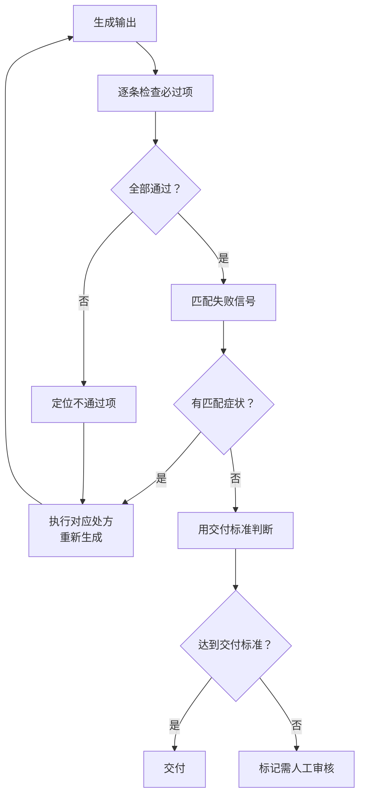

> **已原子化自**：[insight-extraction.md 洞察 6](../../../reports/competitive-analysis/retrospective-ian-xiaohei-source-analysis-20260625/insight-extraction.md) —— Ian Xiaohei Illustrations 仓库源码分析

# 症状-处方 QA 系统（Symptom-Prescription QA）

## 模式类型

方法论模式

## 成熟度

L2 已验证（Ian Xiaohei Illustrations 完整实践验证）

## 适用场景

设计 AI Skill 的质量检查环节时，需要让 Agent 能够自主完成「发现问题 → 诊断原因 → 执行修复」的闭环，而非依赖人类判断。

## 问题背景

传统的 QA 清单通常是抽象的质量标准（如「图片质量高」「代码整洁」），这类标准对人类审查者有用，但对 AI Agent 几乎毫无价值——Agent 无法将抽象标准映射为具体的修改动作。

AI Skill 需要一个**可操作的故障诊断手册**：每条症状（具体、可识别）对应一个处方（具体、可执行的修改指令）。Agent 可以自主完成「检查 → 匹配症状 → 执行处方 → 重新生成」的完整闭环。

## 核心规则

### 规则 1：症状描述必须具体可识别

不要写抽象的质量判断，而应写可观察的具体症状：

| 抽象（无效） | 具体（有效） |
|------------|------------|
| 质量不高 | 左上角有「流程图」标题 |
| 不够好 | 背景不是纯白色 |
| 需要改进 | 小黑只是站在旁边，没有参与动作 |
| 不符合要求 | 画面有 10+ 个节点和箭头 |

### 规则 2：每症状对应一条可执行处方

处方必须是 Agent 可以直接执行的修改指令：

| 症状 | 处方 |
|------|------|
| 太普通 | 让小黑成为动作主体，加入一个奇怪但成立的隐喻 |
| 太复杂 | 删节点，只保留一个动作和 3-5 个短标注 |
| 太可爱 | 强调 deadpan、blank serious expression、not cute、not mascot |
| 太 PPT | 去掉标题、边框、整齐网格和过多箭头，改成手绘场景 |
| 太像旧案例 | 保留核心意思，换掉主物件和小黑动作 |
| 文字错 | 优先局部编辑；错得多就重生成并减少标注数量 |

### 规则 3：必过项使用二分检查

对于必须满足的条件，使用「通过/不通过」的二分判断，而非模糊评分：

```
✅ 是 16:9 横版
✅ 背景是干净白底
✅ 有小黑
✅ 小黑承担核心动作，不只是装饰
```

### 规则 4：包含迭代策略

多轮迭代后仍失败的退出机制：

- 第 1 轮：执行处方，重新生成
- 第 2 轮：如果同一症状再次出现，换一种处方
- 第 3 轮：如果仍失败，降级接受当前最优结果，标记为「需人工审核」

### 规则 5：用一句话概括最终交付判断标准

```
高质量图应该让读者先觉得「有点怪」，然后 1 秒内看懂结构。
```

## 操作流程



## 实施检查清单

- [ ] 必过项是否使用二分检查（通过/不通过）？
- [ ] 失败信号是否具体可识别（非抽象质量判断）？
- [ ] 每条症状是否有对应的可执行处方？
- [ ] 是否包含了多轮迭代后的退出策略？
- [ ] 是否有最终交付判断的一句话标准？
- [ ] QA 清单是否控制在 50 行以内（避免 Agent 被 QA 流程本身消耗太多 token）？

## 反例警示

| 错误做法 | 后果 |
|---------|------|
| 写「检查质量是否合格」 | Agent 无法判断什么是「合格」 |
| 处方过于抽象（如「改进构图」） | Agent 不知道具体怎么改 |
| 缺乏退出策略 | Agent 陷入无限迭代循环 |
| QA 清单超过 200 行 | Agent 在 QA 环节消耗的 token 超过任务本身 |
| 症状和处方不是一一对应的 | Agent 需要自行推理匹配，增加出错概率 |

## 正例

Ian Xiaohei Skill 的 qa-checklist.md 结构：

```text
必过项（12 条，二分检查）：
✅ 16:9 横版 / ✅ 干净白底 / ✅ 有小黑 / ...

失败信号（10 条，具体症状）：
左上角有标题 / 小黑像吉祥物 / 画面像 PPT / ...

迭代方法（6 条，每症状对应一个处方）：
太普通 → 让小黑成为动作主体 / 太复杂 → 删节点 / ...

交付判断（一句话）：
先觉得「有点怪」，然后 1 秒内看懂结构。
```

## 与现有模式的关系

- `output-behavior-specification.md`：该模式控制「正常流程的输出行为」，本模式控制「异常流程的反馈行为」。两者共同构成 Agent 的完整沟通行为规范。
- `style-creativity-separation-control.md`：本模式的症状诊断可以引用该模式的正向约束和负向约束作为检查和修复的依据。

> **关联模块**：
> - `output-behavior-specification.md`
> - `style-creativity-separation-control.md`
