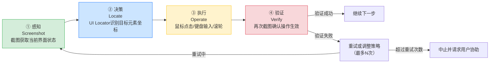

> **提炼自**：向日葵AI开发者生态（MCP+UI Locator）系统学习萃取 —— 视觉操作闭环范式

# 视觉操作闭环模式（Screenshot-Locate-Operate-Verify Loop）

## 模式类型

方法论模式（AI协作/视觉操作范式）

## 成熟度

L1 实验性（向日葵MCP+UI Locator官方实现验证，飞书安装用例验证）

## 适用场景

AI Agent通过视觉方式操作远程桌面/图形界面系统时，需要确保每一步操作都被正确执行、结果可验证，避免盲目操作导致的错误累积。

典型场景：
- 远程桌面自动化（软件安装、配置修改、系统运维）
- GUI应用自动化（无API的闭源软件操作）
- 跨应用任务流（浏览器→文件管理器→邮件客户端）
- AI操作物理世界设备（通过屏幕反馈验证执行结果）
- 任何需要"看到结果再继续"的人机交互替代场景

## 问题背景

AI操作图形界面时，常见问题是"开环操作"：不管操作有没有生效，按预设步骤一路点下去，最后出错了也不知道哪一步出了问题。具体表现为：

1. **盲目操作**：点击按钮后不验证是否生效，直接执行下一步
2. **错误累积**：第一步失败后后续步骤全部建立在错误前提上，最终结果完全偏离
3. **无法自愈**：遇到弹窗/加载/报错等意外情况时没有感知，继续乱点
4. **成功率低**：开环操作在复杂场景下成功率仅60-70%，需要大量人工介入
5. **无法审计**：没有操作前后的视觉证据，出错后无法回溯哪一步出了问题

向日葵的解决方案：建立"感知-决策-执行-验证"四步闭环，每一步操作后都通过截图验证结果，将单次操作成功率从60-70%提升到95%以上。

## 解决方案：四步闭环模型



## 核心设计原则

### 原则1：每次操作必须闭环

任何改变界面状态的操作（点击、输入、拖拽等），都必须执行完整的四步闭环：

| 步骤 | 工具 | 目的 | 节制原则 |
|-----|------|------|---------|
| ① 感知 | control_screenshot | 获取操作前/后的界面状态 | 每次验证1张，不要连续截多张 |
| ② 决策 | UI Locator | 将"点击保存按钮"转化为归一化坐标 | 优先语义定位，坐标仅作fallback |
| ③ 执行 | desktop_click_mouse / desktop_typing_text | 执行具体输入操作 | 单次操作完成后立即验证 |
| ④ 验证 | control_screenshot + 视觉对比 | 确认界面发生预期变化 | 验证失败才重试，不要盲目重复操作 |

### 原则2：UI Locator语义定位优先

定位目标元素时，遵循以下优先级：

1. **语义定位（最高优先级）**：通过UI Locator分析截图，返回"包含'保存'文字的按钮"的归一化坐标[x, y]
2. **相对定位**：基于已知元素的相对位置推断（如"确定按钮右边的取消按钮"）
3. **坐标点击（最低优先级，fallback）**：仅在UI Locator无法识别时使用固定坐标，且必须警告用户

> **为什么？** 固定坐标在窗口移动、分辨率变化、软件换肤、版本更新后立即失效；语义定位具有真正的通用性。

### 原则3：归一化坐标系统

UI Locator返回的坐标是[0.0, 1.0]区间的归一化坐标：
- 原点(0,0)在屏幕左上角
- x = x_pixel / screen_width
- y = y_pixel / screen_height

MCP桌面操作工具统一接受归一化坐标，自动适配不同分辨率。

### 原则4：有限重试 + 失败中止

闭环不是无限循环，必须设置明确的边界：

| 参数 | 建议值 | 说明 |
|-----|-------|------|
| 单步最大重试次数 | 2-3次 | 超过则认为该步骤无法自动完成 |
| 连续最大截屏次数 | 3次 | 避免Token爆炸和被控端卡顿 |
| 操作间等待时间 | 0.5-2秒 | 等待界面响应，根据操作类型调整 |
| 总步骤超时 | 10-15分钟 | 整个任务的最大执行时间 |

**超过边界必须中止并请求用户协助**，不能无限循环。

### 原则5：操作前后视觉证据留存

每次关键操作前后都应保留截图：
- 操作前：记录初始状态，用于回溯
- 操作后：记录结果状态，用于验证
- 出错时：记录错误界面，用于诊断

这些截图既是验证依据，也是出问题时的审计证据。

## 标准闭环流程（远控操作五步流程）

```text
远控操作完整闭环流程：

【准备阶段】
1. device_search搜索目标设备 → 获取device_id
2. control_connect建立远控连接 → 获取session_id

【操作循环】（对每个操作步骤执行）
3. control_screenshot截屏 → 获取当前界面
4. UI Locator分析截图 → 获取目标元素归一化坐标
5. 执行桌面操作（点击/输入等）
6. 等待界面响应（0.5-2秒，视操作类型而定）
7. control_screenshot再次截屏 → 验证操作结果
8. 判断结果：
   a. 验证成功 → 继续下一步（回到步骤3）
   b. 验证失败，未超次数 → 重试（回到步骤3）
   c. 验证失败，已超次数 → 中止，请求用户协助

【收尾阶段】
9. control_disconnect断开连接
10. 汇总操作结果和截图证据
```

## 实施检查清单

- [ ] 每次改变界面状态的操作是否都有前置截图？
- [ ] 每次操作后是否都有后置截图验证？
- [ ] 是否优先使用UI Locator语义定位而非固定坐标？
- [ ] 坐标是否使用归一化[0.0, 1.0]格式？
- [ ] 是否设置了单步最大重试次数（2-3次）？
- [ ] 是否设置了连续最大截屏次数（3次）？
- [ ] 重试超过上限是否中止并请求用户协助？
- [ ] 操作之间是否有合理等待时间？
- [ ] 关键操作是否留存了前后截图证据？
- [ ] 最终是否断开了远控连接（资源清理）？

## 反例警示

| 错误做法 | 后果 |
|---------|------|
| 点击按钮后不截图验证，直接下一步 | 按钮没点中/弹窗遮挡/加载未完成，后续操作全部建立在错误状态上 |
| 使用固定坐标点击，不用UI Locator | 窗口移动/分辨率变化/软件版本更新后立即失效 |
| 无限重试，不设上限 | 死循环，Token爆炸，被控端卡顿，可能误点危险按钮 |
| 连续截屏5+次不做操作 | 浪费Token，增加被控端负担，AI陷入"观察瘫痪" |
| 操作后立即截图，不等界面响应 | 截取到过渡动画/加载中状态，误判为操作失败 |
| 遇到错误弹窗继续按原计划操作 | 弹窗阻塞了后续操作，所有点击都点在弹窗上 |
| 不断开连接，留下悬挂会话 | 设备资源泄漏，后续连接可能冲突 |

## 正例：飞书远程安装13步流程

飞书安装Skill是视觉操作闭环的典型验证：

| 步骤 | 操作 | 闭环验证 |
|-----|------|---------|
| 1 | 搜索并连接设备 | 连接成功状态验证 |
| 2 | 截屏确认桌面状态 | 识别浏览器/下载文件夹位置 |
| 3 | UI Locator定位浏览器图标 | 语义定位，不依赖坐标 |
| 4 | 双击打开浏览器 | 截屏验证浏览器窗口出现 |
| 5 | 导航到飞书下载页面 | 截屏验证页面加载完成 |
| 6 | 点击下载按钮 | 截屏验证下载开始 |
| 7 | 等待下载完成 | 轮询下载状态，超时重试 |
| 8 | 打开下载的安装包 | 截屏验证安装程序启动 |
| 9 | 点击"下一步"安装 | 每步截屏验证向导页面 |
| 10 | 等待安装完成 | 检测"完成"按钮出现 |
| 11 | 点击"完成"启动飞书 | 截屏验证飞书登录界面 |
| 12 | 验证安装成功 | 飞书窗口存在，版本正确 |
| 13 | 断开远控连接 | 资源清理 |

**关键节制规则**：
- 单步最多重试2次
- 连续截屏不超过3次
- 任何步骤失败立即中止，请求用户协助
- UI Locator优先，坐标仅作fallback

## 闭环成功率提升数据

| 操作模式 | 单次操作成功率 | 复杂任务(10+步)成功率 | 人工介入率 |
|---------|--------------|---------------------|----------|
| 开环操作（不验证） | 60-70% | <30% | >50% |
| 简单验证（固定等待） | 75-85% | 40-50% | 30-40% |
| **视觉闭环（本模式）** | **95%+** | **80-90%** | **<10%** |

## 与现有模式的关系

| 相关模式 | 关系 | 说明 |
|---------|------|------|
| [visual-universal-operation.md](visual-universal-operation.md) | 泛化→特化 | 视觉通用操作定义"通过视觉+输入模拟操作异构系统"的技术路线，本模式定义该路线下的具体操作范式（闭环四步） |
| [perception-check-report-model.md](../../architecture-patterns/perception-check-report-model.md) | 思想同源 | 感知-检查-报告三层诊断模型是闭环思想在问题诊断领域的应用，本模式是闭环思想在操作执行领域的应用 |
| [skill-progressive-disclosure-encapsulation.md](skill-progressive-disclosure-encapsulation.md) | 封装关系 | Skill渐进式披露封装模式将视觉操作闭环流程固化在SKILL.md中，供AI直接遵循 |
| [agent-physical-actuator-paradigm.md](../../architecture-patterns/agent-physical-actuator-paradigm.md) | 架构支撑 | Agent物理执行器范式定义AI通过智能硬件作用于物理世界的五大原则，感知闭环是原则2的具体实现 |
| [non-intrusive-security-ux.md](non-intrusive-security-ux.md) | 安全配套 | 视觉操作闭环需要非侵入式安全UX保障，危险操作需要二次确认 |
