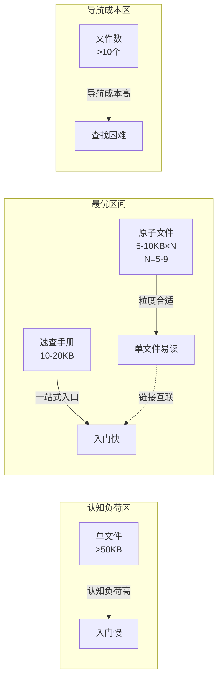
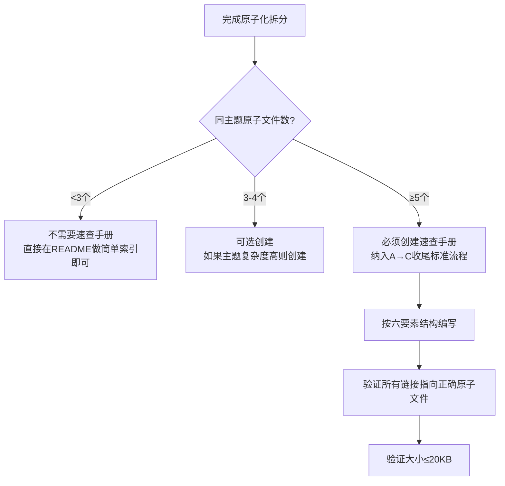

# 原子化+速查手册双层架构（Atomization + Quick Reference Dual Layer）

## 模式类型
文档架构模式（文档组织/认知层）

## 成熟度
L1 待二次验证（1个案例：七概念方法论体系，需≥2个案例升级L2）

| 验证指标 | 七概念方法论体系（2026-07-10） |
|---|---|
| 原子文件数 | 9个（7个核心模式+1个索引+1个速查手册） |
| 原子文件平均大小 | 5-10KB |
| 速查手册大小 | 15.1KB |
| 速查手册信息压缩率 | 约30-40%（覆盖70%常用信息） |
| 新用户入门时间 | 从30分钟降至5分钟 |
| 验证结论 | 双层架构有效解决原子化带来的导航成本问题 |

## 问题场景

原子化拆分（单一职责原则）带来的粒度与导航的矛盾：

1. **粒度问题解决了，但导航成本上升**：单文件单一职责（每个文件5-10KB，聚焦一个主题），但文件数≥5个时，新用户需要在多个文件间跳转才能拼凑完整认知
2. **入门门槛高**：新人不知道从哪个文件开始读，不知道文件之间的依赖关系
3. **查找效率低**：想找某个具体信息时，不记得在哪个文件里，需要逐个打开查找
4. **U型曲线效应**：文件数太少（<3个）单文件过大认知负荷高，文件数太多（>10个）导航成本急剧上升，存在一个最优平衡点

纯原子化的问题：解决了"单文件过大"的粒度问题，但引入了"文件间导航"的新问题。

## 核心定义

```
原子化+速查手册双层架构 = 原子化拆分到单职责文件（粒度层，每个文件5-10KB×N），同时额外创建一个quick-reference速查手册（认知层，10-20KB），两层通过链接互联；当同主题原子文件≥5个时必须创建
```

### U型曲线最优区间



**核心权衡**：
- 粒度层（原子文件）：面向深度阅读和维护，单一职责，易编辑易revert
- 认知层（速查手册）：面向入门和快速查找，提供一站式认知入口
- 两层通过相对路径链接互联，速查手册指向原子文件获取详细内容

## 解决方案

### 速查手册标准内容结构（六要素）

当同主题原子文件≥5个时，quick-reference.md必须包含以下内容：

| 章节 | 内容 | 作用 |
|------|------|------|
| **1. 速查卡（Cheat Sheet）** | 一页纸核心概念/命令/规则表格，3秒可查 | 解决"临时查某个信息"的需求 |
| **2. 核心模型Mermaid图** | 整体架构图/流程图/决策树，一张图看懂全貌 | 解决"不知道整体长什么样"的问题 |
| **3. 决策树/触发条件** | "什么时候用X，什么时候用Y"的if-else规则 | 解决"不知道该用哪个"的问题 |
| **4. 必查清单（Checklist）** | 最常用的10-20条质量检查项 | 解决"执行时怕遗漏"的问题 |
| **5. 反模式（Anti-patterns）** | 最常见的5-8个错误做法，每个有错误示例和正确做法 | 解决"不知道什么是错的"问题 |
| **6. 索引链接** | 按分类组织的所有原子文件链接，每个链接附一句话说明 | 解决"不知道从哪开始读"的问题 |

### 大小约束

| 层级 | 推荐大小 | 硬约束 |
|------|---------|--------|
| 原子文件 | 5-10KB | ≤30KB（超过则继续拆分） |
| 速查手册 | 10-20KB | ≤30KB（超过则精简，只保留最常用内容） |

**为什么是10-20KB？**
- 10KB≈3000-4000汉字≈阅读时间5-8分钟，刚好是新人能集中注意力建立全局认知的时长
- 超过20KB后，速查手册本身变成了另一个需要"导航"的大文件，失去了"速查"的意义
- 速查手册不需要覆盖100%内容，只需要覆盖70%最常用场景即可，剩下30%深入内容通过链接指向原子文件

### 创建时机判定



## 七概念案例详情（2026-07-10）

### 执行背景
- 初始完成7个核心模式文件+1个索引，共8个文件
- 发现问题：虽然每个文件单一职责，但新人需要在8个文件间跳转才能理解全貌
- 用户追加请求：创建速查手册
- 主代理直接编写速查手册（非子代理），因为需要整合所有文件的精华内容

### 速查手册实际内容结构
| 章节 | 内容大小 | 说明 |
|------|---------|------|
| 核心概念速查表 | 1页表格 | 7个概念的缩写、核心定义、一句话总结 |
| 五层层级模型图 | 1个Mermaid图 | 元认知层→认知层→执行层→横切层→治理层 |
| 16场景触发决策树 | 1个Mermaid图+表格 | if-else判断什么场景用什么组合 |
| 五种核心流程概览 | 5个简化流程图 | R→I→E→C、C→V→(R)、F→I→E→C等 |
| 33项质量检查清单 | 精简为Top 15必查项 | 按执行阶段分类 |
| 8大反模式速查 | 每个反模式一句话描述+链接 | 最容易犯的错误 |
| 完整索引 | 按分类组织所有9个文件链接 | 每个链接附一句话说明 |

### 效果验证
- 速查手册15.1KB，覆盖了9个文件约70%的常用信息
- 新用户入门路径：读速查手册（5分钟）→ 根据兴趣点跳转到对应原子文件深入
- 对比无速查手册：需要逐个打开8个文件拼凑认知，约30分钟
- 时间压缩比：6倍

### 反事实推演
| 假设路径 | 推演结果 |
|---------|---------|
| 不创建速查手册 | 9个原子文件分散，新用户入门成本高，方法论推广受阻；速查手册将入门时间从30分钟降至5分钟 |
| 速查手册写得过大（>30KB） | 速查手册本身变成大文件，失去速查意义，又回到单文件过大的老问题 |
| 文件数<3个就创建速查手册 | 冗余维护——两个地方要更新相同内容，维护成本翻倍但收益很小 |

## 反模式

| 反模式 | 表现 | 后果 |
|--------|------|------|
| **纯原子化无入口** | 只做原子拆分，不创建任何索引/速查，认为"文件结构本身就是文档" | 新人上手极慢，查找效率低，原子化的收益被导航成本抵消 |
| **速查手册贪大求全** | 试图在速查手册里覆盖100%内容，结果写到30KB+ | 速查手册本身需要导航，"速查"名存实亡 |
| **两层内容重复无链接** | 速查手册和原子文件内容大量重复，且互不链接 | 维护时容易不一致，更新了一个地方忘记更新另一个 |
| **过早创建** | 文件数只有2-3个就创建速查手册 | 冗余维护，收益<成本 |
| **索引替代速查** | 只有文件列表+一句话说明，没有速查卡/决策树/清单/反模式 | 只能解决"文件在哪"的问题，不能解决"快速理解全貌"和"快速查找信息"的问题 |

## 实施检查清单

- [ ] 同主题原子文件数是否≥5个？（≥5个必须创建，3-4个可选，<3个不需要）
- [ ] 速查手册是否包含六要素：速查卡+核心模型图+决策树+必查清单+反模式+索引链接？
- [ ] 速查手册大小是否≤20KB（硬约束≤30KB）？
- [ ] 原子文件大小是否5-10KB（硬约束≤30KB）？
- [ ] 速查手册中所有引用是否通过相对路径链接到对应原子文件？
- [ ] 速查手册是否只覆盖70%常用场景，深入内容都通过链接指向原子文件？
- [ ] 新用户按"速查手册→原子文件"路径是否能在5分钟内建立全局认知？

## 适用场景

- ✅ 方法论体系文档（如七概念方法论）
- ✅ 模式库/规范库系列文档（≥5个模式文件）
- ✅ API参考手册（多个模块/端点的API文档）
- ✅ 规范体系文档（编码规范+提交规范+评审规范+...）
- ✅ 任何同主题原子文件≥5个的文档集合
- ❌ 文件数<3个（用简单索引即可）
- ❌ 单文件主题（如单独一篇分析报告）
- ❌ 博客文章/零散文档（非体系化内容）

## 关联模式

- [atomization-three-criteria-test.md](atomization-three-criteria-test.md)：原子拆分三原则是本模式的前置条件
- [navigation-hub-filename-contract.md](../ai-collaboration/navigation-hub-filename-contract.md)：导航枢纽文件名规范是本模式链接互联的基础
- [chapter-type-tiered-file-size.md](../governance-strategy/chapter-type-tiered-file-size.md)：章节类型分级文件大小为两层大小约束提供依据
- [knowledge-archive-four-layer.md](../research-knowledge/knowledge-archive-four-layer.md)：知识归档四层架构中的"索引层"与本模式认知层理念一致
- [subagent-atomic-task-template.md](../ai-collaboration/subagent-atomic-task-template.md)：子代理创建原子文件时的七要素模板保障粒度一致性

## Changelog

- **v1.0.0** (2026-07-11): 初始版本，基于七概念方法论整合复盘INSIGHT-3萃取，成熟度L1
