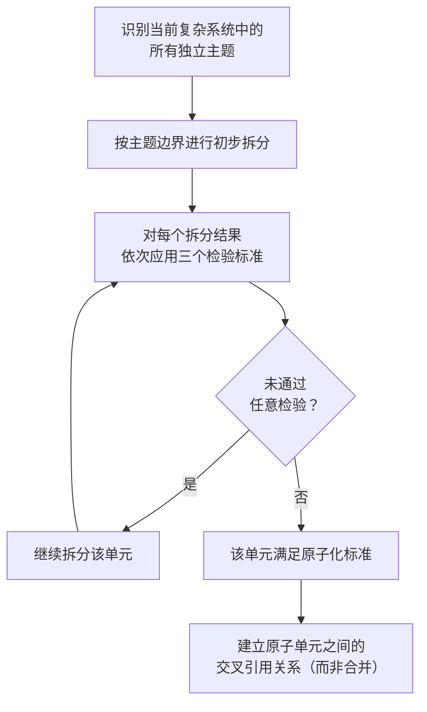

> **来源**：从 `.agents/docs/methodology-analysis-report.md` 第 3.5 节「原子化的粒度判定法」拆分

# 原子化三标准检验（Atomization Three-Criteria Test）

## 模式类型
方法论模式

## 成熟度
L1 实验性（1 次成功案例：methodology-analysis-report.md 综合方法论分析）

## 适用场景
判断一个对象（章节、文件、模块）是否已经达到了"原子级"粒度，避免过度拆分或拆分不充分。

## 问题背景

原子化的核心是"最小完备单元"——但"最小"到什么程度是合规的？这是一个反复困扰实践者的问题。常见的两类陷阱：
- **拆分不充分**：把多个独立主题混杂在一个单元中，导致一个主题的修改牵动整个单元
- **过度拆分**：把语义完整的内容硬拆成多个碎片，读者需要跳转 10 次才能拼凑出完整理解

三标准检验提供了三个可操作的判定准则，每个准则对应一种特定的失败模式。

## 三个检验标准

### 检验一：单一职责检验

**问题**：该单元是否只有一个引起变化的原因？

**判定方法**：思考"如果这个主题的某一方面发生变化，整个条目都需要修改吗？"
- 是 → 单一职责，通过检验
- 否 → 包含多个独立主题，应拆分

**反例**：
- 一个知识条目同时涉及"配置问题"和"性能优化"两个独立主题
- 一个角色定义文件同时描述"工作职责"和"晋升标准"

**正例**：
- - "Windows PowerShell 不支持 heredoc 语法"——一个独立问题 + 一个解决方案
- - "Git 提交信息必须使用中文"——一个独立约束

### 检验二：独立可测检验

**问题**：该单元能否在不依赖其他单元内部实现的情况下被完整理解？

**判定方法**：让一个不了解系统的同事阅读该单元，统计他需要跳转其他单元的次数。
- 0 次跳转即可理解 → 通过检验
- 1-2 次跳转可接受（指向其他单元是必要的）
- ≥ 3 次跳转 → 原子化不充分或过度拆分

**反例**：
- 阅读者需要先读完另外三个文档才能理解当前文档
- 文档中大量"参见 A 节""参见 B 节"的内部实现引用

**正例**：
- 自包含的知识点，读者可以独立理解
- 通过引用而非嵌入来建立与外部的关联

### 检验三：命名聚合检验

**问题**：能否用一个简洁的、无需"和"字连接的名词或短语准确描述该单元的功能？

**判定方法**：尝试用一个名词短语命名该单元：
- 名称中不出现"和""与""及" → 通过检验
- 名称中出现"和""与""及" → 包含多个主题，应拆分

**反例**：
- - "Move-Item 目录重命名**与** Git 提交规范" → 包含两个主题
- - "复盘报告**与**改进建议" → 包含两个独立活动

**正例**：
- - "Windows PowerShell heredoc 替代方案"——一个明确主题
- - "复盘四步法模板"——一个明确方法

## 检验流程



## 三标准与陷阱对应表

| 陷阱 | 主要被哪个标准捕获 | 修复方向 |
|------|------------------|---------|
| 拆分不充分（混杂多主题） | 单一职责、命名聚合 | 按主题边界进一步拆分 |
| 过度拆分（语义碎片化） | 独立可测 | 合并相关碎片，恢复语义完整性 |
| 单元与外部实现耦合 | 独立可测 | 抽象出独立可读的描述 |

## 三个标准的互验关系

三个标准并非彼此独立，而是互为验证：

```
[单一职责] → 主题边界清晰
[独立可测] → 自包含不依赖外部
[命名聚合] → 名称精确反映主题

三者全部通过 = 真正的原子单元
任意一项不通过 = 需要继续调整
```

## 反模式警示

| 错误做法 | 后果 |
|---------|------|
| 仅以"行数"判断原子粒度 | 50 行的混杂文件可能比 200 行的单一主题文件更需要拆分 |
| 通过检验后强行合并独立主题 | 违反单一职责，单元开始"熵增" |
| 拆分不充分时增加"概述章节" | 概述无法解决主题混杂问题，应回到拆分 |
| 过度拆分后用 README 串联 | 串联合并后的体验差于保持原始整体 |

## 与现有模式的关系

- `atomization-three-tier-classification.md`：本模式是其"新建模式"分支的前置判断——新建模式前需通过三标准检验
- `document-system-refactoring.md`：本模式是其"原子化拆分"步骤的具体判定工具
- `post-atomization-content-merge-back.md`：回源合并后，被合并的内容也应通过三标准检验以决定保留粒度

> **关联模块**：
> - `atomization-three-tier-classification.md` — 原子化三级分类策略
> - `modularization-interface-design.md` — 模块化接口设计四步法（原子化的下游）
