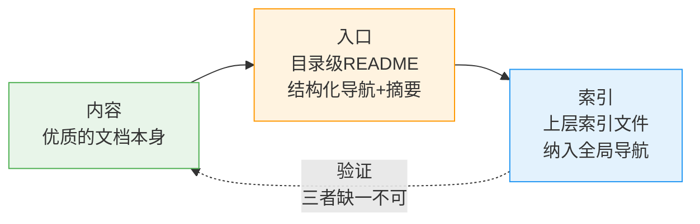

# 内容-入口-索引三位一体原则

## 模式类型
文档架构模式 → 知识库结构

## 成熟度
**L1 实验性**（基于 2026-07-09 best-practices 目录断链修复任务单次验证）

## 问题背景

知识库建设存在"重内容、轻入口"的倾向：将"有内容"等同于"可用"，缺乏对可发现性的系统性保障。典型表现是内容目录持续累积优质文档，但长期缺少结构化入口 README，导致：

- **知识孤岛效应**：10个文档散落在目录中没有导航，新用户难以了解目录全貌
- **索引遗漏**：上层索引文件手动维护，新增文档时容易忘记更新，导致部分文件"隐形"
- **引用率低**：缺乏入口指向，文档难以被其他文档引用和发现

根因：内容的存在 ≠ 内容的可发现性。可发现性是独立于内容质量的第二维度，需要专门的基础设施保障。

## 核心原则

**"内容-入口-索引"三位一体原则**：

| 层 | 职责 | 载体 | 失效后果 |
|----|------|------|---------|
| 内容 | 优质的文档本身 | 目录下的 .md 文件 | 知识库空洞 |
| 入口 | 结构化导航和摘要 | 目录级 README.md | 知识孤岛效应 |
| 索引 | 纳入全局导航 | 上层 README/索引文件 | 内容"隐形"无法发现 |

三者缺一不可：只有内容没有入口是孤岛，只有入口没有索引是死角，只有索引没有内容是空壳。

## 目录 README 必备要素

| 要素 | 作用 | 示例 |
|------|------|------|
| 目录定位和适用场景 | 让读者3秒判断是否需要继续读 | "本目录收录八维检查法的最佳实践文档" |
| 文档分类导航 | 按主题/类型分组，避免平铺 | 表格、分类列表 |
| 每个文档的一句话摘要 | 帮助读者快速判断哪个文档相关 | "相对路径三类特殊踩坑案例" |
| 快速链接/上手指南 | 降低首次使用门槛 | "新手从这里开始" |
| 相关资源引用 | 拓展上下文 | 链接到关联目录、模式库 |

## 正反例对照

### 反例（本次修复前）

- best-practices 目录有 10 个优质实践文档
- 没有 README 入口文档
- knowledge/README.md 索引遗漏了 2 个文件
- 结果：新用户难以了解目录全貌，文档引用率低

### 正例（本次修复后）

- 创建 93 行结构化 README，包含分类导航、每个文档的摘要、相关资源链接
- 重新生成索引，所有 10 个文件都被正确索引
- 结果：可发现性显著提升，有明确的入口指向所有内容

## 适用场景

- ✅ 内容目录持续累积文档（≥5个）但缺少 README 入口
- ✅ 知识库体系建设，需要系统性保障可发现性
- ✅ 目录文档被频繁引用但发现率低
- ✅ 团队协作中需要统一目录结构标准

## 不适用场景

- 单文件目录（无需 README）
- 临时性目录（一次性使用后归档）
- 纯配置文件目录（非知识性内容）

## 与其他模式的关系

| 模式 | 关系 |
|------|------|
| [progressive-readme-growth.md](progressive-readme-growth.md) | 本模式定义"目录必须有README"的结构原则，渐进式生长模式解决"如何更新已有README"的过程问题 |
| [entry-container-separation.md](entry-container-separation.md) | 入口-容器分离关注 AGENTS.md/README.md 双入口的受众分离，本模式关注内容目录级README的结构性必备 |
| [spec-discoverability-guarantee.md](../governance-strategy/spec-discoverability-guarantee.md) | 规范可发现性保障聚焦"规范文档"的三层映射，本模式聚焦"内容目录"的入口结构 |
| [derived-file-auto-generation.md](../tools-automation/derived-file-auto-generation.md) | 索引层应由自动化工具生成，不手动维护 |
| [meta-document-leverage.md](meta-document-leverage.md) | 元文档杠杆效应解释README为何值得投入，本模式提供具体结构要素 |

## 验证状态

- ✅ 本次任务验证：创建 README 后，best-practices 目录有了清晰入口，索引完整
- ⚠️ 待推广：需扫描其他目录验证此模式的普适性

## 关联资源

- 来源复盘：[best-practices目录断链修复复盘](../../../reports/task-reports/retrospective-best-practices-readme-link-fix-20260709/README.md)
- 洞察萃取：[insight-extraction.md 洞察1](../../../reports/task-reports/retrospective-best-practices-readme-link-fix-20260709/insight-extraction.md)
- 自动生成工具：[generate-readme.py](../../../../../scripts/generate-readme.py)
