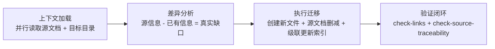

# 文档内容迁移的标准操作流程（content-migration-workflow）

## 模式类型
方法论模式

## 成熟度
L2 已验证

## 适用场景
从综合性文档中提取特定领域的结构化内容，迁移到独立规范文件，同时保留源文档的导航引用。

## 操作流程

### 步骤 1：上下文加载（并行）

| 活动 | 工具/手段 | 产出 |
|------|----------|------|
| 读取源文档全文 | Read | 源内容完整图谱 |
| 扫描目标目录已有文件列表 | LS / Glob | 现有文件清单 |
| 提取目标文件 frontmatter/标题做结构对比 | Grep `## ` | 差异集初步判断 |

### 步骤 2：差异分析

| 判断条件 | 处理方式 |
|---------|---------|
| 源文档中已存在 → 目标目录有完整定义 | 跳过（避免重复造物） |
| 源文档中存在但目标缺失 | 标记待迁移 |
| 目标中存在但源文档无 | 标记待同步回源（可选） |

### 步骤 3：执行迁移

| 活动 | 规范 |
|------|------|
| 创建新文件 | TOML frontmatter + `source` 溯源字段 + 结构化正文 |
| 源文档删减 | 保留概要（3-5 句）+ 引用链接块 |
| 级联更新索引文件 | README 导航表 + AGENTS 路由表 + 同级目录 README + 容器说明 |

### 步骤 4：验证闭环

| 验证项 | 脚本 | 通过条件 |
|--------|------|---------|
| 链接有效性 | check-links.py | 所有本地引用有效 |
| 溯源一致性 | check-source-traceability.py | 派生产物正确标注 source |

## 关键要点

1. **存量盘点先于全量提取**：避免重复造物，防止信息双源冲突
2. **缺口 = 源信息 − 已有信息**：只处理真实缺口
3. **引用闭环四层覆盖**：根部路由表 → 根部导航表 → 同级目录索引 → 容器说明文件
4. **溯源字段是提取物的脐带**：`source = "<文件>#<章节>"` 使产物可被源头变更驱动更新

## 成功案例

| 任务 | 源文档 | 目标目录 | 产出 |
|------|--------|---------|------|
| README 角色协作场景迁移 | README.md#角色协作场景 | .agents/roles/ | collaboration-scenarios.md + 5 处索引更新 |
| README 自我演进模块提取 | README.md#系统规划 | .agents/modules/ | 8 个 self-*.md + modules/README.md |

## 反例警示

| 错误操作 | 后果 |
|---------|------|
| 机械全量提取（不做存量盘点） | 产生冗余副本，信息双源冲突 |
| 源文档完全删除（不留概要+引用） | 人类读者无法发现新文件 |
| 索引更新不完整（仅一处引用） | 文件可发现性受限 |