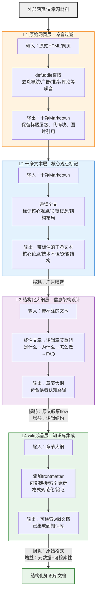

# 文档内容加工漏斗模型（Document Content Funnel）

## 模式类型
方法论模式

## 成熟度
L3 可复用（3次成功案例：tech-interface-wiki、text-to-cad-wiki、longcat-agent-learning-wiki；3次复用：wiki-spec-template.md固化、MopMonk wiki、LongCat wiki）

## 适用场景
将外部非结构化内容源（网页文章、微信公众号、开源项目文档、技术博客等）转化为内部知识库结构化文档（wiki教程、学习笔记、技术参考）的加工过程。

常见触发场景：
- ✅ 网页文章/微信公众号文章学习后输出结构化wiki教程
- ✅ 开源项目文档/代码内化整理为知识库条目
- ✅ 多源信息整合为统一教程
- ✅ 任何"外部内容源→内部知识库"的转化任务

## 问题背景
直接将外部文章复制粘贴到知识库是最常见的"偷懒做法"，但会导致：
1. 文章保留大量原文叙事flow，不适合作为知识库检索条目
2. 缺少元数据（frontmatter、标签、分类），无法被索引系统收录
3. 包含广告、导航、推荐、评论等噪音内容
4. 信息架构是线性文章结构，而非知识库的主题分类结构

内容加工漏斗模型将这一过程分解为四个递进加工层，每一层都有明确的加工目标、交付物和质量标准，避免跳步导致质量问题。

## 核心流程

## 四层详解

### L1 原始网页层——噪音过滤
- **目标**：去除网页中的非内容元素（导航栏、公众号头部信息、底部相关推荐、评论区、广告、分享按钮等），获取文章的纯内容文本
- **工具**：优先使用defuddle工具提取（而非手动WebFetch+清理），defuddle对微信公众号等平台的提取质量稳定
- **交付物**：干净Markdown文本，保留原文的标题层级、代码块、图片引用、列表等核心结构
- **质量标准**：无广告/导航/推荐/评论等噪音；标题层级正确；代码块、引用格式保留
- **常见误区**：跳过L1直接用WebFetch原始HTML开始工作，导致大量噪音干扰后续加工

### L2 干净文本层——核心观点标记
- **目标**：通读L1产出的干净文本，系统性理解内容，标记核心观点、关键概念、技术要点、结构布局
- **关键操作**：
  - 识别文章的核心论点/主要观点
  - 标记关键技术术语和专业概念
  - 梳理文章的内在逻辑结构（非照搬原文标题层级）
  - 标注需要补充解释的地方（原文可能假设读者有前置知识）
- **交付物**：带核心观点标注的干净文本（在原文基础上添加标记/注释）
- **质量标准**：能够准确复述原文核心思想；关键概念无遗漏；不加入个人解读
- **常见误区**：L1完成后直接跳到L4写文档，跳过L2的理解和L3的架构设计——这是"复制粘贴式wiki"的根本原因

### L3 结构化大纲层——信息架构设计
- **目标**：将L2的线性文章内容重新组织为知识库友好的逻辑章节结构
- **关键操作**：
  - 按照"是什么→为什么→怎么做→注意事项→常见问题→延伸阅读"的知识结构而非原文叙事顺序重组
  - 设计合理的章节划分和标题层级
  - 合并相关内容，拆分过大的章节
  - 补充原文缺失但读者需要的章节（如前置知识、安装步骤、FAQ等）
  - **原子化决策检查点**（L3层新增强制步骤）：在章节大纲设计完成后，通过4项量化判断标准决定是否需要原子化拆分：
    | 判断维度 | 拆分阈值 |
    |---------|---------|
    | 内容长度 | >300行建议拆分，<200行可保持单文件 |
    | 章节独立性 | 各章节是否可单独阅读/引用 |
    | 未来扩展 | 是否预期会持续新增章节/内容 |
    | 复用需求 | 单个章节是否会被其他文档引用 |
    - 满足任一条件即建议拆分，在spec阶段明确决策，避免事后追加重构
- **交付物**：wiki文档章节大纲（可作为Spec的一部分进行审批）
- **质量标准**：章节逻辑清晰，符合读者认知路径；不是原文标题的简单复制；覆盖所有核心知识点；原子化决策已明确记录
- **常见误区**：照搬原文章节顺序作为wiki结构，导致wiki读起来像文章而非参考文档；原子化决策留到事后追加，导致二次重构

### L4 wiki成品层——知识库集成
- **目标**：将L3大纲展开为完整wiki文档，完成知识库集成
- **关键操作**：
  - 添加标准YAML frontmatter（title/source/date/tags）
  - 按大纲展开各章节内容
  - 添加内部链接（链接到知识库中相关条目）
  - 添加到知识库索引（如docs/knowledge/README.md）
  - 格式规范化（统一术语、添加目录、代码块标注语言）
  - 验证：格式检查、链接检查、文件名规范检查
- **交付物**：完整可检索的wiki文档，已集成到知识库索引
- **质量标准**：frontmatter格式正确；内部链接有效；索引已更新；文件名符合kebab-case规范
- **常见误区**：frontmatter格式错误（如误用TOML/YAML）；忘记更新知识库索引；内部链接断链

## 核心洞察
1. **每一层都有信息损耗和价值增益**：损耗的是原文的叙事flow和非核心内容，增益的是知识库的可检索性、结构化程度和可复用性
2. **defuddle只解决L1→L2**：工具只能做去噪，L2（理解标记）和L3（信息架构）必须由AI/人完成，这是最体现能力的环节
3. **跳步是质量问题的根源**：L1→L4跳步产生"复制粘贴wiki"，L2→L4跳步产生"理解不深的wiki"，L3→L4直接写（无大纲审批）产生"结构散乱的wiki"
4. **L3大纲是Spec的天然组成部分**：在Spec Mode工作流中，L3大纲应在spec.md中明确，经审批后再进入L4执行
5. **原子化决策前置效率最高**：在L3层通过4项量化标准决定是否拆分，可在L4一次完成内容+结构，避免事后追加重构。LongCat案例验证：前置决策节省约30%时间

## 反模式警示

| 错误做法 | 后果 | 对应层 |
|---------|------|--------|
| 直接复制粘贴文章到wiki | 包含大量噪音，缺少元数据，无法检索 | 跳过L1-L3 |
| defuddle提取后不通读直接写 | 理解不深，遗漏核心观点，wiki质量低 | 跳过L2 |
| 照搬原文章节顺序作为wiki结构 | wiki读起来像文章，不是参考文档 | 跳过L3 |
| 不更新知识库索引 | 文档存在但无法被发现 | L4不完整 |
| frontmatter格式凭记忆决定 | TOML/YAML混用，格式不一致 | L4质量问题 |

## 与其他模式的关系
- [format-evidence-over-memory-pattern.md](../governance-strategy/format-evidence-over-memory-pattern.md)：L4添加frontmatter时必须遵循此模式，读取同目录现有文档确认实际格式
- [spec-mode-doc-creation-workflow.md](../ai-collaboration/spec-mode-doc-creation-workflow.md)：本漏斗是该工作流"阶段0外部内容提取"的精化，L1-L2在阶段0完成，L3在阶段2 Spec规划中完成，L4在阶段3-5完成
- [wiki-spec-template.md](../../../../../templates/wiki-spec-template.md)：本漏斗已固化到wiki教程制作模板中，四层漏斗是模板的核心加工框架
- [extraction-four-layer-funnel.md](../retrospective-knowledge/extraction-four-layer-funnel.md)：同构模型——两者都是四层递进加工漏斗，但领域不同：萃取漏斗用于"洞察→知识资产"的复盘知识沉淀，本模式用于"外部源材料→wiki文档"的内容加工转化
- [fact-statement-consistency-loop.md](fact-statement-consistency-loop.md)：L2核心观点标记时应遵循事实陈述一致性，区分原文事实与个人解读

## 实际案例

### 案例1：tech-interface-wiki（首次验证）

| 层 | 产出物 |
|---|--------|
| L1 | defuddle提取微信公众号文章干净Markdown |
| L2 | 标记核心观点（技术接口概念、设计原则、实现方式） |
| L3 | 重组为概述→核心概念→设计原则→实现方式→最佳实践→FAQ的wiki结构 |
| L4 | the-agency-project-wiki.md + 索引更新 |

### 案例2：text-to-cad-wiki（第二次验证，L2）

| 层 | 产出物 |
|---|--------|
| L1 | defuddle提取微信公众号text-to-cad文章干净Markdown |
| L2 | 标记核心观点（传统AI CAD三大痛点、Build123d技术栈、5大功能、6项局限） |
| L3 | Spec中规划8章节结构（概述→核心功能→安装→使用流程→局限性→价值总结→FAQ→资源） |
| L4 | text-to-cad-wiki.md（308行）+ docs/knowledge/README.md索引更新 |

关键发现：案例2中子代理初次创建时在L4层出现frontmatter格式错误（TOML而非YAML），通过format-evidence-over-memory-pattern的强制前置检查在验证阶段发现并修正。这验证了L4层格式检查的必要性。

### 案例3：longcat-agent-learning-wiki（第三次验证，L3升级）

| 层 | 产出物 |
|---|--------|
| L1 | defuddle提取微信公众号LongCat-2.0文章（HTML→手动解析为干净文本） |
| L2 | 标记核心观点（MoE架构、稀疏注意力、Loop Engineering、Agent原生设计等） |
| L3 | Spec中规划9章节结构（8章节标准+Loop Engineering方法论），在L3层通过4项量化标准决定"需要拆分" |
| L4 | longcat-agent-learning-wiki.md索引页 + 9个原子文件（00-08）+ 10个TOML元数据 + 知识库索引更新 |

关键发现：案例3在L3层执行了原子化决策前置，在spec阶段就通过4项量化标准决定"需要拆分"，L4阶段一气呵成。相比案例1和案例2的"事后追加原子化"，减少了一次额外提交和一次重构，整体耗时约25分钟，比过往同类任务减少约30%。这验证了在L3层增加原子化决策检查点的必要性，也是本模式从L2升级到L3的核心升级点。
