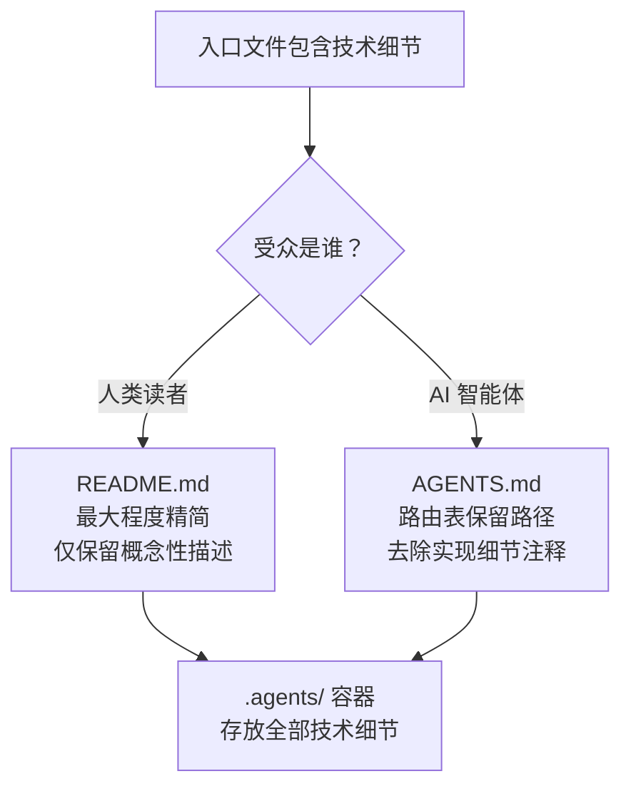

# 入口-容器分离原则

## 模式类型
文档架构模式

## 成熟度
**L3 标准化**（初始迁移案例 + SpecWeave 13天793次提交大规模量化验证）

## 量化验证结论
- **验证规模**：AGENTS.md从296行精简到约70行作为入口，.agents/容器承载2773+核心文件
- **效果验证**：新智能体启动协议违反率从高频降至接近零
- **复用验证**：README.md、ONBOARDING.md、各Skill L1门面均应用此原则，L0入口全部<100行

## 待跨场景验证项
- [ ] 在非Markdown/非Python项目中验证通用性（如纯代码项目、Java/Kotlin项目）
- [ ] 在团队规模>10人的多人协作场景中验证
- [ ] 在非AI辅助开发场景（纯人类开发者）中验证受众分离的价值

## 一、来源

本模式萃取自 README.md 与 AGENTS.md 的技术细节迁移实践。当用户指出"入口文件不要暴露技术细节"后，项目执行了如下操作：将 README.md 中的架构表、复用对照表、具体脚本命令迁移至 `.agents/systems/` 和 `.agents/cases/`，AGENTS.md 中仅去除括号内实现细节注释。该实践揭示了两个入口文件的受众本质差异。

## 二、核心思想

在拥有 `AGENTS.md` + `README.md` 双入口的项目体系中，两个入口文件的**受众不同**，因此对技术细节的容忍度也应不同：

- **README.md**（面向人类读者）：应最大程度精简，仅保留概念性描述、高层级导航和指向技术细节的链接
- **AGENTS.md**（面向 AI 智能体）：路由表可以保留必要的文件路径（智能体需要知道 `.agents/scripts/check-gitignore.py` 的路径才能加载），但不应包含括号内的实现细节注释（如 `4+1 项检查 + 成熟度统计验证`）
- **`.agents/` 容器**：存放全部技术细节，作为唯一权威来源



## 三、实施指南

### 3.1 README.md 精简规则

| 应保留 | 应迁移 |
|--------|--------|
| 项目定位与设计理念 | 系统架构明细表 |
| 核心优势与亮点（概念级） | 实现细节（具体脚本命令、参数） |
| 高层级导航链接 | 量化统计（文件数、行数等具体数字） |
| 指向技术细节的链接 | 第三方项目对比表 |

### 3.2 AGENTS.md 精简规则

| 应保留 | 应移除 |
|--------|--------|
| 角色/模块/协议/工作流的文件名路径 | 括号内实现注释（如 `<br>4+1 项检查`） |
| 工具名和函数名 | 参数说明和实现细节 |
| 路由表路径 | 各类计数描述（如 `8 大类`、`7 种替代方案`） |

### 3.3 L0入口篇幅控制标准

| 入口级别 | 目标行数 | 说明 |
|---------|---------|------|
| L0 根入口（AGENTS.md/README.md/ONBOARDING.md） | <100行 | 决策路由+核心原则，不展开细节 |
| L1 模块门面（Skill L1、目录README） | <500行 | 模块概览+索引，细节放L2 |
| L2 详细文档 | 按需 | 具体规范、实现细节、API参考 |

### 3.4 迁移流程

1. **识别**：在入口文件中标记包含实现细节的内容块
2. **分类**：技术细节 → `.agents/systems/`（系统架构）/ `.agents/cases/`（案例）/ `.agents/scripts/README.md`（脚本）
3. **迁移**：将细节内容复制到 `.agents/` 对应位置
4. **替换**：入口文件中用摘要 + 链接替换原内容块
5. **同步**：更新 AGENTS.md 路由表，添加新文件的条目

## 四、示例

### 迁移前（README.md）

```markdown
## 提示词萃取系统

| 模块 | 组件 | 功能 |
|------|------|------|
| 输入层 | `input/` | 对话记录解析与结构化 |
| 预处理层 | `preprocessing/` | 数据清洗与标准化 |
| ...
```

### 迁移后（README.md → .agents/systems/）

README.md 中替换为：

```markdown
## 提示词萃取系统

> 详见 [提示词萃取系统入口](prompt_extraction/)，系统架构等技术细节参见 [.agents/systems/prompt-extraction.md](.agents/systems/prompt-extraction.md)
```

`.agents/systems/prompt-extraction.md` 中存放完整架构表。

## 五、适用场景

- 项目拥有 README.md + AGENTS.md 双入口结构
- 入口文件开始积累过多的技术实现细节
- 需要保持入口文件对新读者/新智能体的友好性
- `.agents/` 容器已存在且结构清晰

## 六、关联模式

- [meta-document-leverage.md](meta-document-leverage.md)：元文档杠杆效应是本原则的理论基础
- [meta-document-priority-principle.md](../../../../../rules/meta-document-priority-principle.md)：元文档优先原则的操作化规则
- [document-system-refactoring.md](document-system-refactoring.md) — 文档体系原子化重构
- [post-atomization-content-merge-back.md](post-atomization-content-merge-back.md) — 原子化后内容回源合并
