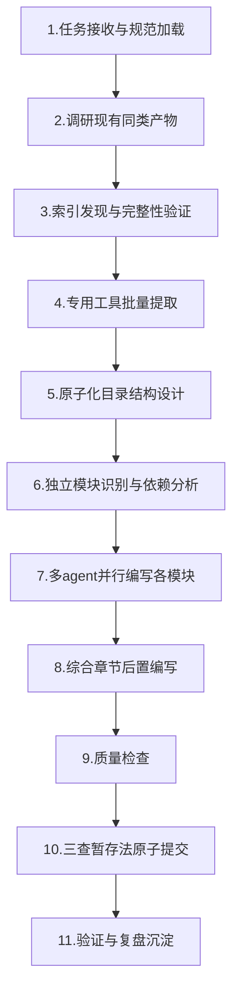

# 外部技术文档Wiki标准结构与创建流程

## 模式概述

经过Minitap官方文档中文Wiki创建任务（61个文件、13,208行内容、2个独立模块并行编写）的完整验证，沉淀出外部技术文档转中文Wiki教程的标准结构与11步创建流程。该模式涵盖从内容提取到原子化结构设计、并行编写、综合章节补充、质量检查到原子提交的完整生命周期，适用于将外部API文档、SDK文档、产品文档、开源项目文档等技术资料系统化整理为中文学习Wiki。

## 核心逻辑

```
外部技术文档Wiki = 1个总览入口页 + N个模块子目录（含00-overview + 数字前缀章节） + 4个综合章节
```

**核心原则**：
1. **索引优先发现**：先通过llms.txt/sitemap.xml获取完整页面列表，再开始提取
2. **专用工具提取**：使用defuddle而非通用工具获取纯净Markdown
3. **参考现有约定**：先调研项目内同类Wiki结构，再设计目录
4. **原子化拆分**：按模块和章节拆分，每个文件职责单一
5. **模块并行化**：识别独立模块边界，多agent并行编写
6. **综合章节后置**：FAQ/最佳实践/术语表/资源在所有模块完成后编写

## 两种结构变体

根据外部文档的规模和模块数量，选择合适的结构：

### 变体A：单文件结构（单产品/单模块，预计<500行）

```
wiki-root/
└── {product}-wiki.md  （单文件包含所有章节）
```

适用：单个小型库/工具文档、单模块技术文档、预计<10个页面的文档站点。

### 变体B：原子化结构（多模块/大文档，推荐默认使用）

```
wiki-root/
├── {product}-official-docs-wiki.md  （总览入口页，学习路径+导航）
├── {module-a}-docs/
│   ├── 00-overview.md          （模块概述）
│   ├── 01-{chapter1}.md
│   ├── 02-{chapter2}.md
│   └── ...
├── {module-b}-docs/
│   ├── 00-overview.md
│   ├── 01-{chapter1}.md
│   └── ...
├── faq.md                      （跨模块常见问题）
├── best-practices.md           （跨模块最佳实践）
├── glossary.md                 （综合术语表）
└── resources.md                （资源链接汇总）
```

适用：多模块产品文档、SDK+产品双文档、预计>20个页面的文档站点、需要并行编写的任务。

**结构决策树**：
```
页面数量≤10？→ 单文件结构
页面数量11-20？→ 评估模块独立性：单模块→单文件，多模块→原子化
页面数量≥20？→ 必须原子化结构
模块数≥2？→ 原子化结构+并行编写
```

## 标准11步创建流程



### 步骤1：任务接收与规范加载

- 读取AGENTS.md和上下文路由表，遵循项目启动协议
- 明确Wiki目标受众、内容深度要求、交付格式
- 判定使用单文件结构还是原子化结构

### 步骤2：调研现有同类产物（必做，wiki-pre-creation-three-checks第一查）

- Grep/Glob搜索项目中已有的同类Wiki（如ffi-wiki、idl-wiki、sunlogin-hardware-wiki等）
- 分析3-5个代表性样本的：
  - 目录结构和命名规则（kebab-case纯英文）
  - frontmatter字段和格式
  - 章节组织方式
  - 链接格式规范（相对路径）
  - 总览页结构（学习路径+目录导航）

### 步骤3：索引发现与完整性验证（triangular-source-verification）

**索引发现优先级**：
1. **第一优先级**：检查 `<domain>/llms.txt`（现代文档站点标准配置）
2. **第二优先级**：检查 `<domain>/sitemap.xml`
3. **第三优先级**：浏览器探索导航结构
4. **第四优先级**：递归爬取页面内链接

**三源验证覆盖完整性**：
- 通过llms.txt获取主列表
- 浏览器人工验证关键入口页是否在列表中
- 提取后检查页面内链接是否有遗漏的重要文档

### 步骤4：专用工具批量提取（defuddle-web-extraction-preferred）

- 优先使用defuddle CLI工具（`defuddle parse <url> --md`）提取纯净Markdown
- 使用批量提取脚本（defuddle-batch-extract.py）并发处理所有URL
- WebFetch仅作为缺失内容补全的兜底工具
- 提取后进行完整性预评估：页面标题是否匹配、是否包含主内容、是否有明显截断

### 步骤5：原子化目录结构设计

**目录命名规范**：
- 目录名：kebab-case纯英文，模块名加`-docs`后缀（如`minitest-docs/`）
- 文件名：两位数字前缀+kebab-case英文（如`01-what-is-minitest.md`）
- 每个模块子目录必须有`00-overview.md`作为模块入口
- 综合章节直接放在Wiki根目录，不加数字前缀

**文件职责划分**：
- 每个文件只覆盖一个独立主题
- 单文件长度建议控制在200-500行
- 超过500行考虑进一步拆分
- 章节间通过相对路径互相链接

### 步骤6：独立模块识别与依赖分析

**独立模块判断标准**（同时满足方可并行）：
- 文件位于不同子目录
- 内容上没有相互引用依赖
- 可以独立完成编写，不需要等待其他模块结果
- 即使同时修改也不会产生冲突

**模块划分方法**：
- 按官方文档的导航结构划分（如官方分minitest和mobile-use-sdk两个产品）
- 按知识领域划分（如入门/核心概念/API参考/故障排除）
- 每个模块规模大致均衡（5-10个文件）

### 步骤7：多agent并行编写各模块

- 为每个独立模块创建独立的subagent任务
- 任务描述中必须包含：
  - 明确的frontmatter格式要求
  - 章节结构模板
  - 参考现有Wiki文件路径
  - 内容深度和语言要求（中文翻译+本地化整理）
  - 链接格式规范（相对路径）
- subagent交付物：模块内所有章节文件 + 模块00-overview.md
- 并行执行期间主代理不干涉，等待所有模块完成

### 步骤8：综合章节后置编写（所有模块完成后）

必须在所有模块内容完成后编写以下4个综合章节：

| 章节 | 内容要点 | 编写方法 |
|------|---------|---------|
| **faq.md** | 跨模块常见问题、官方FAQ、用户常见疑问 | 扫描所有模块内容，提取高频问题，补充官方FAQ |
| **best-practices.md** | 跨模块最佳实践、使用建议、避坑指南 | 总结各模块中的注意事项、推荐用法、常见陷阱 |
| **glossary.md** | 全书统一术语表 | 提取各模块中的专业术语，统一定义 |
| **resources.md** | 官方链接、GitHub仓库、相关资源、项目内交叉引用 | 汇总所有外部链接，补充项目内相关Wiki链接 |

**为什么必须后置**：综合章节本质是对各模块内容的二次加工，前置编写会导致遗漏、矛盾、术语不一致。

### 步骤9：质量检查

检查清单：
- [ ] frontmatter字段完整且格式正确
- [ ] 所有文件名符合kebab-case规范
- [ ] 所有内部链接使用相对路径且可访问
- [ ] 章节编号顺序正确无跳号
- [ ] 每个模块有00-overview.md
- [ ] 4个综合章节齐全
- [ ] 总览页的学习路径和目录导航完整
- [ ] 无残留调试内容或临时注释

### 步骤10：三查暂存法原子提交

- **禁止使用`git add .`**
- 显式指定文件路径逐个添加
- 添加后立即`git status --short`验证暂存区
- 三查暂存：查新增(A)、查修改(M)、查删除(D)
- 提交信息遵循Conventional Commits（`docs(learning-wiki): subject`）

### 步骤11：验证与复盘沉淀

- 验证提交结果（`git log --oneline`）
- 执行复盘流程，萃取可复用方法论
- 更新模式库成熟度
- 记录验证案例

## 总览入口页标准结构

总览页（`{product}-official-docs-wiki.md`）是Wiki的入口，必须包含以下要素：

```yaml
---
title: "{中文完整标题}"
category: "learning"
source: "{官方文档根URL}"
date: "{YYYY-MM-DD}"
status: "published"
summary: "{100-200字内容摘要}"
tags: ["tag1", "tag2", "..."]
---
```

**内容章节**：
1. **文档元信息块**：官方文档链接、核心产品/项目、生成日期
2. **教程简介**：Wiki覆盖范围、目标读者、内容价值
3. **产品/模块概览**：Mermaid架构图/关系图展示各模块关系
4. **前置知识要求**：阅读本Wiki需要的基础知识
5. **学习路径建议**：
   - 路径一：XX使用者（按角色推荐阅读顺序）
   - 路径二：XX开发者（按角色推荐阅读顺序）
   - 路径三：完整学习（全内容顺序）
6. **完整目录导航**：表格形式列出所有章节，带文件链接
7. **相关资源交叉引用**：项目内相关Wiki、外部资源链接
8. **开始阅读引导**：指向第一章的链接

## 模块00-overview.md标准结构

每个模块子目录下的`00-overview.md`应包含：
1. 模块概述和学习目标
2. 本模块章节导航表（章节号、标题、文件链接）
3. 阅读建议（哪些必读、哪些选读）
4. 与其他模块的关系说明

## 章节文件内容结构

每个具体章节文件建议结构：
1. 章节标题（H1）
2. 章节引言/概述（1-2段）
3. 核心内容（按逻辑分H2/H3小节）
4. 代码示例/配置示例（如适用）
5. 注意事项/常见陷阱（如适用）
6. 下一章引导链接

## 七次验证案例与成熟度

| 验证次序 | Wiki类型 | 结构变体 | 文件数 | 验证重点 |
|---------|---------|---------|-------|---------|
| 第1次 | FFI技术教程 | 原子化（7文件） | 8 | 基础原子化结构验证 |
| 第2次 | IDL技术教程 | 原子化（8文件） | 9 | 概念对比类Wiki结构验证 |
| 第3次 | Agent通信协议 | 原子化（多模块） | 12 | 多模块并行编写验证 |
| 第4次 | Agent Skills规范 | 原子化（15文件） | 16 | 规范文档类Wiki验证 |
| 第5次 | TVM FFI深度Wiki | 原子化（15文件） | 16 | 大型技术Wiki结构验证 |
| 第6次 | 向日葵硬件系列 | 单文件→原子化 | 1→12 | 硬件产品Wiki专用结构 |
| 第7次 | Minitap官方文档 | 原子化（双模块） | 61 | **外部技术文档转Wiki完整流程验证，11步流程沉淀** |

## 适用边界

### 适用场景

- ✅ 外部API文档、SDK文档、产品文档转中文Wiki
- ✅ 开源项目文档系统化整理
- ✅ 多模块技术教程/学习指南创建
- ✅ 需要多agent并行编写的大型文档任务
- ✅ 需要中文翻译+本地化整理的外文技术资料

### 不适用场景

- ❌ 硬件产品Wiki（使用sunlogin-hardware-wiki-structure模式）
- ❌ 商业趋势/市场分析类Wiki（结构不同）
- ❌ 纯概念对比/理论教程（使用concept-comparison-tutorial-structure）
- ❌ <10页的小型文档（直接使用单文件结构，无需完整11步流程）

## 与其他模式的关系

| 关系模式 | 关系类型 | 说明 |
|---------|---------|------|
| [sunlogin-hardware-wiki-structure.md](sunlogin-hardware-wiki-structure.md) | 并列/互补 | 硬件产品Wiki专用结构，本模式针对外部技术文档 |
| [wiki-pre-creation-three-checks.md](../governance-strategy/wiki-pre-creation-three-checks.md) | 前置依赖 | Wiki创建前三查是本模式步骤2的具体执行规范 |
| [wiki-dual-track-frontmatter.md](../governance-strategy/wiki-dual-track-frontmatter.md) | 规范约束 | frontmatter双轨规范指导本模式的元数据填写 |
| [defuddle-web-extraction-preferred.md](../tools-automation/defuddle-web-extraction-preferred.md) | 工具依赖 | defuddle批量提取是本模式步骤4的核心工具 |
| [triangular-source-verification.md](../retrospective-knowledge/triangular-source-verification.md) | 方法支撑 | 三源验证是本模式步骤3索引完整性的验证方法 |
| [large-document-atomization-method.md](large-document-atomization-method.md) | 理论基础 | 大文档原子化拆分方法论指导本模式的目录结构设计 |
| [convention-driven-creation.md](../governance-strategy/convention-driven-creation.md) | 上位原则 | 约定驱动创建是本模式步骤2调研现有产物的理论依据 |

## 子代理任务描述模板

委派子代理编写模块章节时，使用以下模板：

```
【任务】编写{模块名}模块的所有章节文件

【前置要求-必做】
1. 先用Read工具查看以下参考文件确认格式：
   - {参考Wiki1}/00-overview.md（确认frontmatter和章节结构）
   - {参考Wiki2}/01-xxx.md（确认具体章节写法）
2. frontmatter格式：（按实际参考文件格式填写）
3. 文件名：两位数字前缀+kebab-case英文
4. 所有链接使用相对路径

【模块内容来源】
- 原始Markdown文件位置：{提取内容目录}
- 需要覆盖的页面列表：{URL列表或文件列表}

【交付物】
1. {模块名}-docs/00-overview.md（模块概述+章节导航）
2. {模块名}-docs/01-xxx.md
3. {模块名}-docs/02-yyy.md
...

【质量要求】
- 内容忠实于原文，技术准确无误
- 中文表达流畅自然，避免机翻腔
- 代码块保留原文
- 每个文件专注单一主题
```
