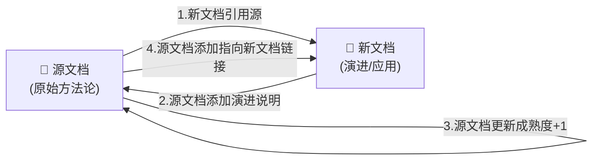

# 方法论演进交叉引用链：知识网络双向链接模式

## 模式类型
领域/方法论模式（文档架构/知识管理）

## 成熟度
L2 验证中（3次验证：六维→八维检查法演进、PDF导出三阶段法沉淀、第一性原理功能分析法模式化）

## 适用场景
可复用模式/方法论在后续任务中被扩展、升级、重构、自动化或应用时的文档维护；知识库演进过程中的版本追溯与关系维护。

## 问题背景

复盘报告和模式文档按任务时间线独立创建，天然是"时间序列"结构而非"知识网络"结构：

1. **演进关系断裂**：当一个方法论在A报告中首次提出，在B报告中扩展升级，读者读A不知道B的存在，读B不知道其源头是A
2. **成熟度失真**：源文档记录的成熟度（验证次数）不会随着后续应用自动更新
3. **信息孤岛形成**：没有主动交叉引用时，知识之间的演进关系被时间线掩盖，形成独立的信息孤岛
4. **反向链接缺失**：只在新文档中引用源文档，但源文档不知道后续演进，形成单向链接

**典型反模式**：
```markdown
---
id: "new-methodology"
source: "task-B"
# 没有cross_refs指向源文档
---
# 扩展后的方法论

（正文描述升级版方法论，但不提及其来源和演进历史）
```
读者无法追溯该方法论的起源和演进脉络。

## 解决方案

当一个可复用模式/方法论在后续任务中被扩展、升级、重构或自动化时，必须建立**双向交叉引用链**：



### 标准操作流程（四步法）

| 步骤 | 动作 | 位置 | 必做 |
|------|------|------|:----:|
| 1 | 在新文档frontmatter的`cross_refs`中引用源文档ID | 新文档frontmatter | ✅ |
| 2 | 在源文档中添加"演进说明"段落，记录后续扩展情况 | 源文档洞察/模式描述末尾 | ✅ |
| 3 | 更新源文档中的成熟度等级（验证次数+1） | 源文档成熟度字段 | ✅ |
| 4 | 在源文档的洞察/模式描述中添加指向新文档的链接 | 源文档正文 | ✅ |

### 链接类型分类

根据关系性质，交叉引用分为三类：

| 链接类型 | 符号 | 含义 | 示例 |
|---------|:----:|------|------|
| **演进链** | A→B | B是A的扩展/升级/重构/自动化版本 | 六维检查法→八维检查法（新增2维度+pre-commit自动化） |
| **应用链** | A→B | B是A的应用实例/实践案例 | edit-verify-separation模式→某次代码审查实践 |
| **关联链** | A↔B | A和B处理同类问题但方案不同/互补 | 文档更新三查法↔源代码回查原则 |

### Frontmatter cross_refs 规范

在文档YAML frontmatter中使用`cross_refs`字段声明双向链接：

```yaml
cross_refs:
  -   - "source-methodology-id"    # 演进源
  -   - "related-pattern-id"       # 关联模式
  -   - "application-case-id"      # 应用案例
```

注意：每个引用项使用 `-   - "id"` 格式（嵌套列表项）。

### 源文档"演进说明"模板

在源文档的洞察/模式描述末尾添加演进说明：

```markdown
**演进记录**：

- **2026-XX-XX**：在[任务名称](相对路径.md)中扩展为X维（新增XX维度），成熟度从L1升级为L2
- **2026-XX-XX**：在[另一任务](相对路径.md)中自动化为pre-commit钩子
```

## 实际案例

### 案例1：六维检查法→八维检查法演进

**场景**：六维检查法在冲突解决机制复盘中首次萃取为人工审查方法论，同日在并发安全检查器任务中扩展为八维并自动化。

**执行**：
1. 新文档（并发安全检查器复盘）cross_refs添加源文档ID
2. 源文档（冲突解决机制复盘）添加演进说明
3. 源文档成熟度从L1更新为L2
4. 源文档添加指向新文档的链接

**结果**：读者从任一文档都能追溯完整的演进脉络。

### 案例2：PDF导出三阶段法沉淀

**场景**：Mermaid漏斗重设计PDF导出任务中首次实践三阶段导出法（Pandoc+Mermaid.js+Playwright），后续在"一画开天"会议分析报告导出中再次验证，最终沉淀为独立模式。

**执行**：
1. 独立模式文件source字段标注首次实践来源
2. 首次实践复盘cross_refs添加新模式ID
3. 二次应用复盘cross_refs添加首次实践和新模式ID

### 案例3：第一性原理功能分析法模式化

**场景**：学习模式第一性原理分析任务中系统化应用第一性原理分析方法，萃取后沉淀为独立模式文件`first-principles-feature-analysis.md`。

**执行**：
1. 新模式文件source字段标注学习模式分析报告来源
2. 学习模式分析报告cross_refs添加新模式ID
3. 新模式成熟度初始化为L1（1次验证）

## 反模式

### 反模式1：单向链接（只新引旧，旧不引新）

```yaml
# 新文档有cross_refs
cross_refs:
  -   - "old-methodology"
```
但源文档没有任何更新。

**问题**：读者读到旧文档时，不知道该方法论已经有了新版本，可能会用过时的方法。

**修正**：执行四步法，确保源文档同步更新。

### 反模式2：有cross_refs但正文无链接

只在frontmatter中添加了cross_refs，但正文没有相应的说明和可点击链接。

**问题**：cross_refs主要用于工具索引和机器可读，人类读者阅读正文时看不到演进关系。

**修正**：在正文中用明确的文字说明演进关系，并提供可点击的Markdown链接。

### 反模式3：成熟度不更新

建立了链接但忘记更新源文档的成熟度等级。

**问题**：成熟度是方法论可信度的重要指标，不更新会导致后续使用者误判方法论的验证程度。

**修正**：每次成功应用/演进后，源文档成熟度验证次数+1，等级按L1→L2→L3规则晋升。

### 反模式4：关系类型不明确

交叉引用只写ID，不说明是什么关系（演进/应用/关联）。

**问题**：读者看到一堆ID不知道它们之间是什么关系，无法理解知识网络结构。

**修正**：在正文中用"演进自"、"应用于"、"参见"等词汇明确关系性质。

## 与其他模式的关系

| 相关模式 | 关系 | 说明 |
|---------|------|------|
| bidirectional-navigation-links | 同属双向链接 | 前者解决原子文件阅读导航问题，本模式解决方法论演进知识网络问题 |
| insight-two-tier-structure | 前置依赖 | 洞察萃取采用"洞察报告→可复用模式"两层结构，本模式规范两层之间的链接 |
| knowledge-sedimentation-workflow-sop | 配套使用 | 知识沉淀SOP中包含模式萃取环节，本模式是沉淀过程中的链接规范 |
| three-tier-knowledge-sedimentation | 上层框架 | 三层知识沉淀（洞察→模式→方法论）中，每层演进都需要交叉引用链 |
| documentation-update-three-checks | 配套 | 更新旧文档添加演进链接前，用文档更新三查法验证文档内容准确性 |

## 检查清单

建立交叉引用链后，逐项检查：
- [ ] 新文档frontmatter的cross_refs是否包含源文档ID？
- [ ] 源文档是否添加了"演进说明"段落？
- [ ] 源文档成熟度是否正确更新（验证次数+1）？
- [ ] 源文档正文是否有指向新文档的可点击链接？
- [ ] 链接关系类型（演进/应用/关联）是否在正文中明确说明？
- [ ] 所有链接是否通过了check-links验证（无断链）？
- [ ] cross_refs格式是否正确（嵌套列表`-   - "id"`格式）？
- [ ] 如果是演进关系，源文档中是否说明了演进内容（新增什么、修改什么）？
