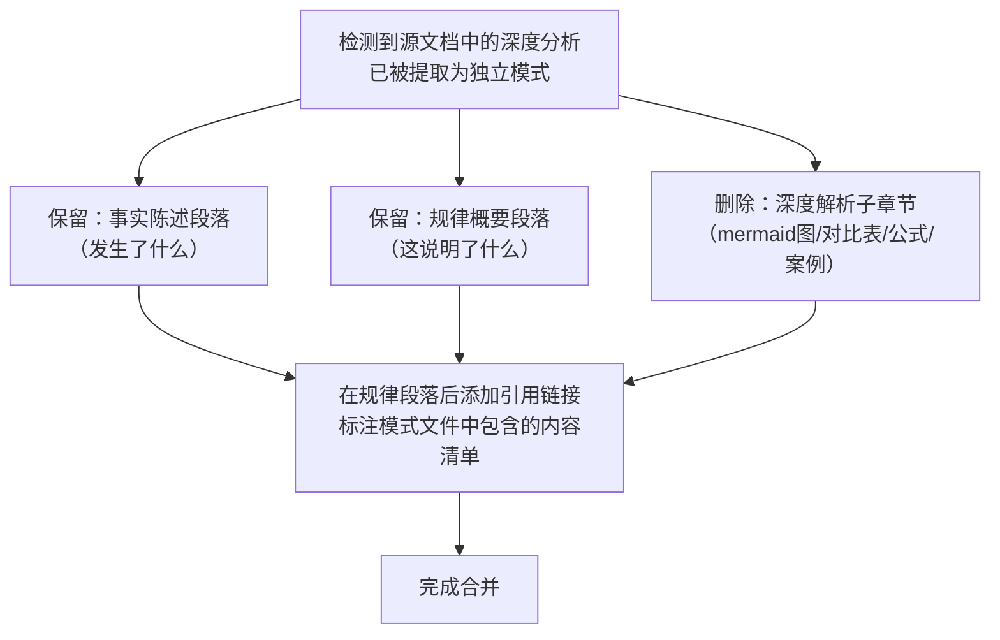

> **来源**：从 `docs/retrospective/reports/retrospective-atomization-execution-s1-7-20260624.md` 四、萃取 4.2 拆分

# 原子化后内容回源合并（Post-Atomization Content Merge-Back）

## 模式类型
方法论模式

## 成熟度
L1 实验性（1 次成功案例：execution-s1-s3.md 发现三深度解析合并）

## 适用场景
将源文档中的深度分析内容提取为独立模式文件后，需要处理源文档中残留的重复内容。

## 问题背景

原子化操作将源文档中的深度分析提取到独立模式文件后，产生了一个"内容所有权"问题：

- **模式文件**：包含完整的分析（mermaid 图、对比表、数学公式、案例代码）
- **源文档**：仍保留着同样的完整分析

如果源文档不合并，两份内容将形成"双写"——任何修正都需要在两个地方同步，违反 DRY 原则。但简单删除源文档中的内容又会破坏其作为"复盘记录"的完整性。

解决方案是**降级而非删除**：将源文档中的深度分析精简为概要陈述 + 引用链接，模式文件作为唯一权威来源。

## 核心原则

```
唯一权威来源 = 模式文件（完整分析）
源文档角色 = 事实陈述 + 规律概要 + 跳转指引
引用格式   = 链接 + 内容索引（告知读者模式文件中有什么）
```

## 操作流程



## 降级标准

### 保留内容（维持源文档的叙事连贯性）

| 保留 | 原因 | 格式 |
|------|------|------|
| 事实陈述 | 源文档作为"复盘记录"需要保留发生了什么 | 保持原文 |
| 规律概要 | 读者不跳转也能理解核心结论 | 精简为 1-2 句 |
| 关键数据 | 量化数据（如"26 行"）为事实陈述的一部分 | 合并到规律段中 |

### 删除内容（迁移至模式文件）

| 删除 | 原因 |
|------|------|
| Mermaid 流程图 | 模式文件中有更完整的版本 |
| 对比表格（如分层包 vs 扁平包） | 模式文件中有相同的表格 |
| 数学公式推导 | 模式文件中有完整推导 |
| 代码示例 | 模式文件中有完整的代码块 |
| 一句话总结 | 模式文件中有一句话总结 |

### 引用格式模板

```markdown
> **详细分析已原子化至**：[pattern-name.md](path)——含 mermaid 图解、维度对比表、数学公式推导、lib/ 推广验证。
```

关键要素：
- **链接**：指向模式文件的相对路径
- **内容索引**：破折号后列出模式文件中包含的内容清单，方便读者决策是否跳转

## 本案例数据

| 维度 | 合并前 | 合并后 |
|------|--------|--------|
| 文件行数 | 231 行 | 168 行 |
| 删除内容 | 63 行深度解析（mermaid 图 + 表格 ×3 + 数学公式 + 代码示例 + 一句话总结） | — |
| 保留内容 | 事实 + 规律 + 数据 | 3 行（精简规律 1 + 数据 1 + 引用 1） |
| 引用格式 | — | `> **详细分析已原子化至**：[package-structure-leverage.md]——含三层结构 mermaid 图解、杠杆本质表格、分层包与扁平包的维度对比、数学公式推导、lib/ 公共库推广验证。` |

## 实施检查清单

- [ ] 识别源文档中已被提取为独立模式的分析内容
- [ ] 确认模式文件包含完整的分析（不丢失信息）
- [ ] 保留源文档中的事实陈述和规律概要
- [ ] 删除冗长的深度解析子章节
- [ ] 在规律段落后添加引用链接，含内容索引
- [ ] 验证引用链接可正确跳转

## 反例警示

| 错误操作 | 后果 |
|---------|------|
| 简单删除全部内容 | 破坏源文档叙事连贯性，读者无法理解上下文 |
| 保留全部内容不合并 | 内容双写，修正时需双向同步；读者困惑"以哪个为准" |
| 引用链接无内容索引 | 读者不知道跳转后能找到什么，降低跳转意愿 |
| 引用链接使用裸文件名 | 读者无法判断内容覆盖范围 |

## 与现有模式的关系

- `atomization-three-tier-classification.md`：本模式是其"新建模式"分支的后置步骤——创建新模式后必须回源合并
- `fact-statement-consistency-loop.md`：本模式是其"修正一处→搜索同类→统一修正"在原子化场景的应用——合并一处后应搜索其他源文档中是否也有同样的重复

> **关联模块**：
> - `atomization-three-tier-classification.md`
> - `fact-statement-consistency-loop.md`
