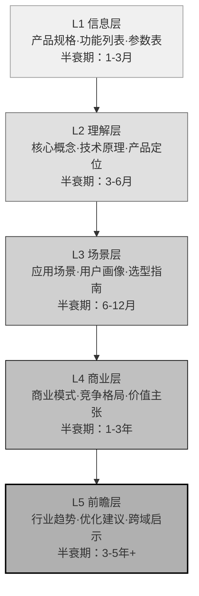

> **来源**：从 `retrospective-sunlogin-pdu-hardware-wiki-20260704` 向日葵智能PDU硬件产品Wiki教程复盘萃取

# 产品学习文档5层价值金字塔

## 一、核心定义

产品学习文档5层价值金字塔（Product Learning Five-Tier Pyramid）是外部产品学习文档从信息汇总到多维洞察的价值递进模型。该模型将产品文档的价值分为5个层级，越往上层价值半衰期越长、可复用性越高、对决策的支撑越强。

**核心洞察**：

```
L1信息 → L2理解 → L3场景 → L4商业 → L5前瞻
（半衰期短）                    （半衰期长）
```

传统产品评测文档停留在L1-L2层（参数罗列、功能说明），价值随产品迭代快速衰减；高价值学习文档应覆盖到L4-L5层，提炼跨产品、跨行业的可复用洞察。

## 二、5层金字塔结构

| 层级 | 名称 | 核心内容 | 回答的问题 | 价值半衰期 |
|------|------|---------|-----------|-----------|
| L5 | 前瞻层 | 行业趋势、优化建议、跨领域启示 | 对我们有什么用？ | 最长（3-5年+） |
| L4 | 商业层 | 商业模式、竞争格局、价值主张 | 为什么这样设计？ | 长（1-3年） |
| L3 | 场景层 | 应用场景、用户画像、选型指南 | 谁用、怎么用？ | 中（6-12个月） |
| L2 | 理解层 | 核心概念、技术原理、产品定位 | 是什么？ | 短（3-6个月） |
| L1 | 信息层 | 产品规格、功能列表、参数表 | 有什么？ | 最短（产品迭代即失效） |

### 各层级详细说明

**L1 信息层**：基础事实汇总
- 产品规格参数、接口说明、功能清单
- 价格、版本对比表
- 开箱清单、外观尺寸
- 特点：客观、可验证，但无解读

**L2 理解层**：概念与原理解释
- 核心技术概念解释（如什么是智能PDU、远程唤醒原理）
- 产品定位与目标用户群
- 技术架构与工作原理
- 特点：帮助读者建立认知框架

**L3 场景层**：应用与选型指导
- 典型应用场景（如机房运维、家庭实验室、小微企业IT管理）
- 用户画像与需求匹配
- 选型对比指南（不同型号如何选、与竞品对比）
- 最佳实践与使用教程
- 特点：连接产品与用户需求

**L4 商业层**：商业逻辑分析
- 公司商业模式与盈利逻辑
- 竞争格局与差异化策略
- 价值主张与定价策略分析
- 产品演进路线推测
- 特点：理解产品背后的商业思考

**L5 前瞻层**：洞察与启示提炼
- 行业发展趋势判断
- 产品可优化点与改进建议
- 跨领域可复用的方法论启示
- 对我方产品/业务的借鉴意义
- 特点：知识迁移与决策支撑

## 三、价值半衰期分析

```
L5 前瞻层  ████████████████████ 3-5年+  （跨行业可复用）
L4 商业层  ██████████████        1-3年   （同赛道可复用）
L3 场景层  ████████              6-12月  （同产品周期）
L2 理解层  ████                  3-6月   （版本迭代）
L1 信息层  ██                    1-3月   （产品更新即失效）
```

关键规律：
- **信息密度≠价值密度**：L1篇幅最长但价值衰减最快，L5篇幅最短但价值最持久
- **投入产出不对称**：写L5需要更高阶的思考，但单位投入的长期价值最大
- **文档价值 = Σ(各层内容 × 半衰期系数)**：顶层内容权重应远高于底层

## 四、与传统产品评测文档的区别

| 维度 | 传统产品评测文档 | 5层金字塔学习文档 |
|------|----------------|------------------|
| 核心目标 | 信息汇总、购买决策参考 | 多维洞察、知识沉淀、决策支撑 |
| 覆盖层级 | L1-L2为主 | L1-L5完整覆盖 |
| 价值半衰期 | 短（产品更新即过时） | 长（顶层洞察跨周期复用） |
| 读者视角 | 第三方旁观者评价 | 学习者+同行者视角 |
| 内容深度 | 是什么、好不好用 | 是什么→为什么→对我有什么用 |
| 可复用性 | 仅针对该产品 | L4-L5可跨产品/跨行业复用 |
| 典型问题 | 参数堆料、主观体验、购买建议 | 模式提炼、方法论萃取、行动启示 |
| 写作思维 | 评测思维（评判好坏） | 学习思维（萃取价值） |

## 五、实施指南

### 步骤 1：金字塔结构规划

写作前先按5层结构列出大纲：
- L1信息：需要哪些基础事实和参数？
- L2理解：哪些核心概念需要解释？
- L3场景：目标用户是谁？在什么场景下使用？
- L4商业：这个产品的商业逻辑是什么？为什么这样设计？
- L5前瞻：我们能从中学到什么？有什么可复用的模式？

### 步骤 2：逐层填充内容

建议按自底向上顺序写作：
1. 先整理L1信息层事实（确保基础信息准确）
2. 再解释L2理解层概念（建立认知框架）
3. 然后分析L3场景层应用（连接用户需求）
4. 接着挖掘L4商业层逻辑（理解why）
5. 最后提炼L5前瞻层洞察（知识迁移）

### 步骤 3：篇幅分配控制

遵循「金字塔篇幅倒金字塔」原则：
- L1信息层：精炼，用表格呈现，避免大段文字（20%篇幅）
- L2理解层：清晰解释核心概念，避免过度技术细节（20%篇幅）
- L3场景层：重点写场景和选型，这是最实用的部分（30%篇幅）
- L4商业层：深入分析商业逻辑，体现思考深度（20%篇幅）
- L5前瞻层：精雕细琢，提炼真正有价值的洞察（10%篇幅）

### 步骤 4：洞察萃取自检

完成初稿后，针对L5层进行自检：
- [ ] 这些洞察是否可以应用到其他产品/行业？
- [ ] 如果产品明天停售，这篇文档还有价值吗？
- [ ] 读者读完后能否获得可行动的启示？
- [ ] 是否提炼出了可复用的模式/方法论？

### 步骤 5：任务级三层价值闭环（Wiki交付≠任务完成）

> **来源**：向日葵安全产品学习复盘洞察5——三层价值标准

完成L1-L5的Wiki文档只是第一层价值。产品学习任务的完整价值交付需要三层闭环：

| 价值层级 | 交付物 | 验收标准 | 常见遗漏 |
|---------|--------|---------|---------|
| **L1 信息整理** | Wiki教程文档（L1-L5金字塔） | frontmatter规范、链接正确、信息准确、Mermaid无语法错误 | ❌ 做到这一步就提交，止步于"整理好" |
| **L2 技术解析+复盘** | 复盘报告（执行复盘+洞察萃取+导出建议） | CMD-LOG结构化日志、洞察四段式格式、模式候选清单 | ❌ 跳过复盘直接提交Wiki |
| **L3 模式萃取+跨领域映射** | 可复用模式入库+索引更新+TOML配套 | 模式frontmatter标准字段齐全、成熟度诚实标注、索引/TOML同步更新、跨领域映射明确 | ❌ 洞察只写在复盘报告里不入库，或成熟度高估 |

**反模式警告**：
- 止步于L1：Wiki写得很完整，但没有复盘和模式萃取，价值只在文档本身
- 虚假的L3：把"AI Agent启示"写在Wiki末尾就算跨领域映射，但没有提取为可复用模式入库
- 成熟度膨胀：新模式首次提炼就标L2/L3，把理论推演当作验证案例

**任务完成验收清单**：
- [ ] Wiki文档L1-L5内容完整、格式规范
- [ ] 复盘报告四件套齐全（README+execution-retrospective+insight-extraction+export-suggestions）
- [ ] 达到L2/L3成熟度的模式已正式入库（frontmatter+TOML+索引三件套同步）
- [ ] L1实验性模式明确标注"待验证"，不夸大成熟度
- [ ] 跨领域映射有具体落地方向而非泛泛而谈
- [ ] 知识库索引（README.md计数）已更新

> **教训**：向日葵安全产品初次提交时，3个L1模式被误标为L2，缺少frontmatter标准字段，配套文件不同步。元复盘修正了这些问题——但如果在步骤5自检时就发现，可避免返工。

## 六、Mermaid金字塔可视化



---

> **关联模块**：
> - `methodology-patterns/document-architecture/tutorial-cognitive-ladder.md` — 教程认知阶梯模型
> - `methodology-patterns/retrospective-knowledge/insight-iceberg-model.md` — 洞察冰山模型
> - `methodology-patterns/document-architecture/document-content-funnel.md` — 文档内容漏斗
