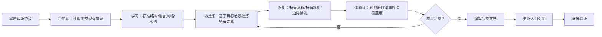

# 协议文档「参考-提炼-验证」三步法（Reference-Distill-Verify Three-Step Method）

## 模式类型
方法论模式（文档架构/写作流程）

## 成熟度
L2 验证级（2次验证：workspace-discovery.md编写 + prompt-bootstrap.md编写）

## 问题陈述

在已有规范体系中编写新协议/规范文档时，存在三类典型问题：

| 问题 | 表现 | 后果 |
|------|------|------|
| **盲目创作** | 不看现有同类协议，凭经验从头开始写 | 风格不一致（有人喜欢流程图开头、有人喜欢定义开头）、缺少标准章节（如反模式、验证清单）、术语不统一 |
| **生搬硬套** | 直接复制现有协议，替换关键词后就完事 | 新协议特有的流程、规则、边界情况没有体现，内容空洞无用 |
| **无验证闭环** | 写完直接提交，不对照验收标准检查 | 遗漏关键章节、链接错误、与其他协议不一致、验收不通过需要返工 |

这三类问题导致新协议文档质量参差不齐，增加维护成本和读者认知负担。

## 解决方案

在编写任何新协议/规范文档前，严格按顺序执行三步：

### 第一步：参考（Reference）— 先读后写

**目标**：学习现有协议的标准结构、语言风格、术语体系，保证风格一致性。

**操作步骤**：
1. 在 `.agents/protocols/` 或 `docs/retrospective/patterns/` 下找到最同类的1-3个现有协议
2. 完整阅读这些文档，重点观察：
   - **文档结构**：有哪些标准章节？顺序是什么？（通常是：协议目标→设计理念→流程定义→数据结构→边界情况→反模式→验证清单）
   - **语言风格**：指令式语气？描述式语气？术语选择？
   - **图表使用**：哪些位置放Mermaid流程图？什么类型的图？
   - **frontmatter字段**：有哪些标准元数据字段？
3. 记下标准章节清单作为写作模板

**本次案例**：编写workspace-discovery.md前，先读取了onboarding-protocol.md，学习了"协议目标→设计理念→流程→反模式→验证清单"的结构。

**反模式**：还没看现有文档就开始写 → 大概率风格不一致。

### 第二步：提炼（Distill）— 从场景到要素

**目标**：基于目标协议的应用场景，提炼出该协议特有的、不能从参考文档复制的要素。

**需要提炼的要素清单**：

| 提炼维度 | 思考问题 | 示例（以工作区发现协议为例） |
|---------|---------|---------------------------|
| **核心流程** | 该协议要解决什么问题？标准步骤是什么？有几个决策分支？ | 五步发现流程：AGENTS.md→workspace.yaml→.agents/→向上递归→用户确认 |
| **形态分类** | 该领域有多少种不同形态/类型？分类标准是什么？ | 6种工作区形态：Root/Source/Installed/Activated/Compatible/None |
| **安全规则** | 使用该协议时有哪些风险？需要什么防护规则？ | 提示词自举协议的8条安全规则S1-S8 |
| **边界情况** | 有哪些异常/边缘场景？失败时如何降级？ | Git不可用、网络故障、权限不足等7个边界情况E1-E7 |
| **最小可行子集** | 如果只保留最必要的内容，哪些区块必须存在？ | AGENTS.md必须包含启动协议、上下文路由表、核心规范入口表 |
| **反模式** | 使用该协议时常见的错误做法是什么？ | 跳过AGENTS.md直接读.agents/、在非工作区目录递归过深 |

**关键原则**：参考文档提供"骨架"（标准结构），提炼提供"血肉"（特有内容）。不要跳过提炼直接填空。

### 第三步：验证（Verify）— 清单化检查

**目标**：在正式编写前，对照验收清单检查提炼结果的覆盖完整性，避免遗漏。

**验证清单**：

- [ ] 核心流程是否完整？每个步骤的输入输出是否明确？
- [ ] 分类/形态是否覆盖所有已知情况？
- [ ] 安全规则/风险防护是否充分？
- [ ] 边界情况/异常处理是否覆盖主要失败场景？
- [ ] 最小可行子集是否定义明确？
- [ ] 反模式是否列出了常见错误做法？
- [ ] 与其他协议的边界是否清晰？
- [ ] 验收标准是什么？如何验证实现正确性？

**验证后**：所有清单项都有明确答案后，再开始编写完整文档。文档写完、入口引用更新后，还需要做最后一步：
- [ ] 链接验证：运行链接检查脚本确认所有内部链接有效

## 适用场景

| 场景 | 适用度 | 说明 |
|------|--------|------|
| 在已有规范体系中新增协议文档 | 核心场景 | 本次验证场景，完美匹配 |
| 在已有模式库中新增模式文档 | 核心场景 | 同类问题，模式文档也有标准结构 |
| 为现有项目编写新的技术规范 | 适用 | 先看现有规范风格，再提炼新规范要素 |
| 从零开始编写全新领域的首个协议 | 部分适用 | 第一步"参考"改为参考行业标准/通用规范 |
| 编写一次性便签/临时文档 | 不适用 | 过于正式，简单笔记不需要此流程 |

## 与两阶段先大纲后展开模式的关系

本模式与 two-stage-outline-then-expand（两阶段先大纲后展开）互补：
- 本模式关注**内容来源**（参考现有→提炼新要素→验证覆盖）
- 两阶段模式关注**写作过程**（先写大纲→再展开细节）

组合使用：先用本模式完成"参考→提炼→验证"，再用两阶段模式"大纲→展开"。

## 验证来源

- **验证1：workspace-discovery.md编写**（2026-07-13）：参考onboarding-protocol.md结构→提炼五步发现流程/六种形态/反模式/最小子集→对照Task 0验收清单验证→完成307行协议文档
- **验证2：prompt-bootstrap.md编写**（2026-07-13）：参考workspace-discovery.md刚确立的协议风格→提炼一句话装载/8条安全规则/7个边界情况/5种环境路径→对照验收清单验证→完成403行协议文档

## 关联资源

- 关联模式：[reference-as-trigger.md](../governance-strategy/reference-as-trigger.md)（引用作为触发器）
- 关联模式：[progressive-templating.md](../ai-collaboration/progressive-templating.md)（渐进式模板化）
- 关联模式：[two-stage-outline-then-expand.md](../ai-collaboration/two-stage-outline-then-expand.md)（两阶段先大纲后展开）
- 关联模式：[pre-decision-three-checks.md](../ai-collaboration/pre-decision-three-checks.md)（决策前三查）
- 验证来源：[2026-07-13-task0-workspace-protocols.md](../../../2026-07-13-task0-workspace-protocols.md)（复盘报告）
