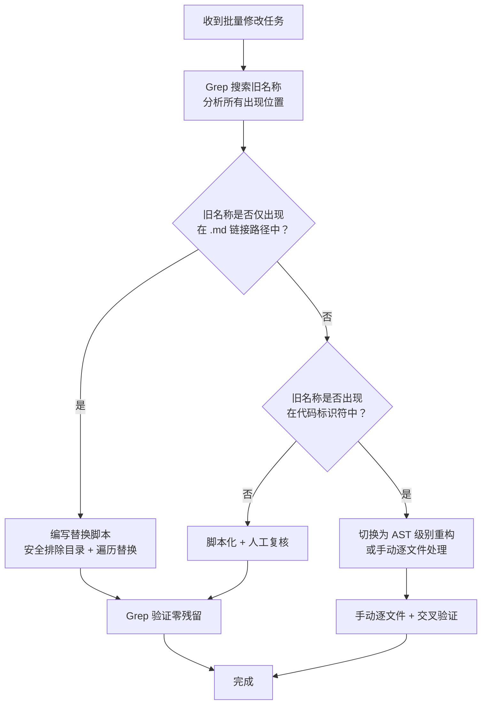

> **来源**：从 `docs/retrospective/reports/retrospective-comprehensive-20260623/execution-s1-s3.md` 六、6.1.2 决策 S2-1 + 6.2 发现二 拆分

# 脚本化批量修正的安全决策（scripted-batch-correction）

## 模式类型
方法论模式

## 成熟度
L1 实验性（1 次成功案例：14 个文件 33 处引用全局替换）

## 适用场景
需要跨多个文件批量修改同一内容时，面临"手动逐文件修改"还是"编写脚本一次性处理"的决策。

## 问题背景

当重命名操作影响多个文件中的引用时，手动逐文件替换存在两个风险：
- **遗漏风险**：人类在处理机械重复任务时的遗漏概率约为 15%，导致部分引用未更新
- **误改风险**：在某些场景下，目标字符串可能同时出现在路径引用和代码标识符中，脚本化替换可能"误杀"

两种风险互相制约：手动替换低误改但高遗漏；脚本替换低遗漏但可能高误改。核心决策依据是**旧名称在代码库中的出现模式**。

## 核心规则

### 安全决策矩阵

| 旧名称出现模式 | 推荐策略 | 风险等级 | 说明 |
|--------------|---------|---------|------|
| 仅在 `*.md` 文件中作为链接路径出现 | 脚本化批量替换 | 零风险 | 纯字符串替换，无误杀可能 |
| 同时出现在代码标识符中（变量名、函数名、配置键名） | 手动替换或 AST 级别重构 | 高风险 | 需精确匹配上下文 |
| 出现在代码注释/文档中，但非标识符 | 脚本化 + 人工复核 | 低风险 | 脚本处理主体，人工抽查边缘 |
| 出现在二进制文件或生成物中 | 脚本化（排除二进制目录） | 零风险 | 在脚本中排除 `.git/`/`.venv/` 等目录 |

### 本案例数据

| 指标 | 数值 |
|------|------|
| 影响文件数 | 14 |
| 引用总次数 | 33 |
| 旧文件名数 | 3 |
| 出现模式 | 全部为 `*.md` 中的链接路径引用 |
| 策略 | 编写 30 行 Python 脚本一次性处理 |
| 验证手段 | Grep 零残留确认 |

## 操作流程



## 步骤详解

### 步骤 1：Grep 全景扫描

```bash
# 搜索旧名称在所有文件中的出现
grep -rn "old_name" --include="*.md" --include="*.py" --include="*.toml"
```

关键输出：每次匹配的文件路径、行号、上下文（确定是路径引用还是代码标识符）。

### 步骤 2：模式分类

| 模式 | 示例 | 安全级别 |
|------|------|---------|
| 路径引用 | `[link](path/old_name.md)` | 安全（可脚本化） |
| 代码标识符 | `old_name = "value"` | 危险（需 AST 级别） |
| 注释文本 | `# 参考 old_name.md` | 中等（脚本 + 复核） |

### 步骤 3：编写替换脚本（安全模式）

脚本必须包含：
- **排除目录**：`.git/`、`vendor/`、`.venv/`、`node_modules/`、`.temp/`、`__pycache__/`
- **文件过滤**：仅处理目标文件类型
- **仅写入变更**：对比替换前后的内容，无变更不写入
- **变更统计**：输出每个文件的替换次数和总计

### 步骤 4：Grep 验证

替换完成后，用原搜索命令验证零残留：
```bash
grep -rn "old_name" --include="*.md"  # 期望输出为空
```

## 脚本模板

```python
import os
import sys

REPLACEMENTS = [
    ("old_name_1.md", "new_name_1.md"),
    ("old_name_2.md", "new_name_2.md"),
]

EXCLUDE_DIRS = {'.git', 'vendor', '.venv', 'node_modules', '.temp', '__pycache__'}
TARGET_EXTS = {'.md'}

def replace_in_file(filepath):
    with open(filepath, 'r', encoding='utf-8') as f:
        content = f.read()
    new_content = content
    for old, new in REPLACEMENTS:
        new_content = new_content.replace(old, new)
    if new_content != content:
        with open(filepath, 'w', encoding='utf-8') as f:
            f.write(new_content)
        return True
    return False

def walk_and_replace(root_dir):
    changed = []
    for dirpath, dirnames, filenames in os.walk(root_dir):
        dirnames[:] = [d for d in dirnames if d not in EXCLUDE_DIRS]
        for filename in filenames:
            if os.path.splitext(filename)[1] in TARGET_EXTS:
                filepath = os.path.join(dirpath, filename)
                if replace_in_file(filepath):
                    changed.append(filepath)
    return changed

if __name__ == '__main__':
    root = sys.argv[1] if len(sys.argv) > 1 else '.'
    changed = walk_and_replace(root)
    print(f'Updated {len(changed)} files:')
    for f in changed:
        print(f'  {f}')
```

## 实施检查清单

- [ ] Grep 搜索旧名称在所有文件中的出现位置
- [ ] 分析每次出现的上下文，判断是路径引用还是代码标识符
- [ ] 若全部为路径引用 → 脚本化处理
- [ ] 若存在代码标识符 → 切换为手动或 AST 级别
- [ ] 脚本中排除 `.git/` 等目录
- [ ] 替换后 Grep 验证零残留

## 成功案例

| 场景 | 文件数 | 引用次数 | 模式 | 策略 | 耗时 | 结果 |
|------|--------|---------|------|------|------|------|
| 复盘报告命名统一 | 14 | 33 | 全部 .md 路径引用 | 脚本化 | 10 分钟 | 零残留 |

## 风险估算

```
手动逐文件替换：遗漏概率 ≈ 15%（人类操作失误率）
脚本化替换（路径引用模式）：遗漏概率 = 0%（只要搜索模式覆盖全面）
脚本化替换（含代码标识符）：误杀概率 > 0（取决于命名冲突程度）
```

## 与现有模式的关系

- `fact-statement-consistency-loop.md`：本模式是其"修正一处→搜索同类→统一修正"闭环在批量重命名场景的具体应用
- `structure-first-extension.md`：编写替换脚本前应先阅读目标目录结构，确定排除目录范围

> **关联模块**：
> - `fact-statement-consistency-loop.md`
> - `structure-first-extension.md`
