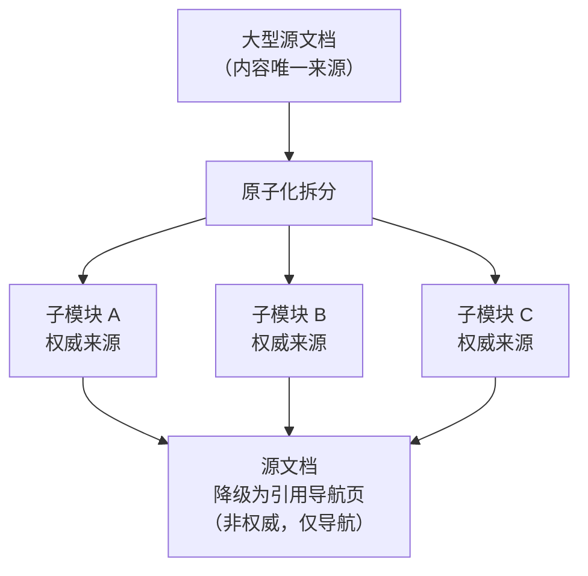

> **来源**：从 `docs/retrospective/reports/retrospective-entry-detail-migration-20260624.md` 成功经验"文档降级模式成熟"萃取

# 源文档降级模式

## 一、来源

本模式萃取自综合复盘报告的原子化实践。一份 811 行的综合性复盘报告被横切为 6 个独立子模块后，源文档并未被删除，而是降级为 5 行引用链接——每个链接指向对应的子模块文件。这一处理方式既避免了引用失效，又确立了子模块作为唯一权威来源的地位。

## 二、核心思想

当大型文档被原子化拆分后，**不删除源文档，而是将其降级为"引用导航页"**。导航页仅包含指向各子模块的链接，子模块文件成为内容的唯一权威来源。

这不同于 `post-atomization-content-merge-back`（将深度分析回并到源文档），而是其**逆向操作**——源文档放弃内容权威性，将权威性转移给子模块。



## 三、实施步骤

### 步骤 1：完成原子化拆分

按照 `two-phase-processing` 模式完成大型文档的原子化拆分，确保每个子模块独立、自包含。

### 步骤 2：建立子模块权威性

- 每个子模块文件包含完整内容（非引用片段）
- 子模块文件的 TOML frontmatter 标注 `source` 指向源文档
- 子模块之间的交叉引用使用相对路径

### 步骤 3：降级源文档

将源文档内容替换为导航结构：

```markdown
# {原文档标题}

> **本文档已原子化拆分。** 以下子模块为各章节的权威来源。

## 子模块导航

| 章节 | 权威来源 |
|------|---------|
| 项目概述 | [project-retrospective.md](project-retrospective.md) |
| 执行复盘 | [execution-s1-s3.md](execution-s1-s3.md) |
| 洞察萃取 | [insight-extraction.md](insight-extraction.md) |
| 改进建议 | [improvement-suggestions.md](improvement-suggestions.md) |
```

### 步骤 4：验证引用完整性

- 确保所有指向源文档的外部引用不会因降级而断裂（因为文件仍然存在）
- 更新索引文件中的链接，指向子模块的权威来源

## 四、决策矩阵

| 场景 | 策略 | 原因 |
|------|------|------|
| 源文档被外部大量引用 | **降级**（保留文件） | 删除会导致引用断裂 |
| 源文档无外部引用 | 可直接删除 | 无断裂风险 |
| 子模块尚不完整 | 暂不降级，保持源文档权威 | 避免信息丢失 |
| 源文档有历史价值（如版本记录） | **降级** + 添加历史说明 | 保留上下文 |

## 五、优势

1. **引用不失效**：文件仍存在，所有旧链接仍然有效
2. **单一权威来源**：子模块成为内容的唯一权威，消除多版本同步问题
3. **保留历史上下文**：降级的源文档可以作为原子化过程的见证
4. **渐进式迁移**：读者可以逐步从导航页过渡到子模块

## 六、与相关模式的区别

| 模式 | 操作方向 | 权威性归属 |
|------|---------|-----------|
| **本模式**（源文档降级） | 源文档 → 子模块 | 子模块为权威 |
| `post-atomization-content-merge-back` | 子模块 → 源文档 | 源文档为权威 |
| `two-phase-processing` | 横切 + 纵切 | 子模块各自权威 |

## 七、适用场景

- 大型文档（>200 行）已完成原子化拆分
- 源文档被其他文件引用，不能直接删除
- 需要确立子模块为单一权威来源
- 文档体系正在从"大文件"模式迁移到"模块化"模式

> **关联模块**：
> - `methodology-patterns/post-atomization-content-merge-back.md` — 原子化后内容回源合并（逆向操作）
> - `methodology-patterns/two-phase-processing.md` — 双阶段加工策略
> - `methodology-patterns/document-system-refactoring.md` — 文档体系原子化重构
> - `methodology-patterns/entry-container-separation.md` — 入口-容器分离原则
