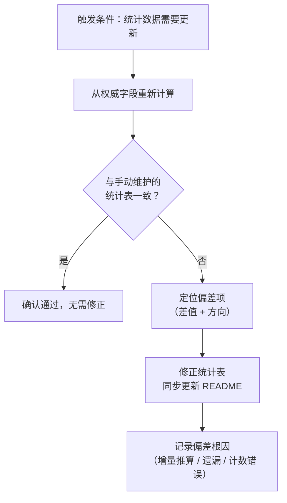

> **来源**：从 `docs/retrospective/reports/retrospective-meta-atomization-full-chain-20260624.md` 三、3.3 发现三 + 四、4.1 元模式二 合并拆分

# 合成统计的权威数据来源（Synthetic Stats Source-of-Truth）

## 模式类型
方法论模式

## 成熟度
L1 实验性（1 次成功案例：模式成熟度分布 L1/L2 偏差发现与修正）

## 适用场景
任何需要跨多文件维护合成统计数据（如模式成熟度分布、文档覆盖率、资产清单）的体系，尤其是数据跨多轮手动更新的场景。

## 问题背景

跨文件汇总的合成统计数据（例如"32 个方法论模式中 L1=15、L2=16、L3=1"）与各文件的原始 metadata 字段存在两层耦合：

1. **时间耦合**：每次新增/修改文件后，统计数据需要同步更新
2. **值耦合**：统计数据的值必须与各文件的 metadata 字段保持一致

当统计数据的维护方式是"增量推算"（`上次值 ± 本次新增`）而非"全量重新计算"（`grep 所有文件的 metadata 字段 → 汇总`）时，偏差会随更新轮次累积。

## 偏差累积公式

```
P(偏差) ≈ 1 - (1 - p)^n

其中：
  p = 单次手动推算出错概率（约 5%）
  n = 连续更新轮次
```

| 更新轮次 (n) | 累积出错概率 |
|-------------|------------|
| 1 次 | ~5% |
| 3 次 | ~14% |
| 5 次 | ~23% |
| 10 次 | ~40% |

本案例中 n=5 轮连续更新后，L1/L2 分布出现了互换偏差（报告 15/13 → grep 实际 12/16）。

## 核心规则

> 合成统计数据 = 从各文件的权威字段 grep → 汇总（全量重算），而非 `上次值 ± 新增`（增量推算）

### 权威字段定义

| 数据类型 | 权威来源 | grep 示例 |
|---------|---------|----------|
| 模式成熟度 | 各模式文件 TOML frontmatter 的 `maturity` 字段 | `grep 'maturity = "L[123]"' *.md` |
| 验证计数 | 各模式文件的 `validation_count` 字段 | `grep 'validation_count = \d+' *.md` |
| 复用计数 | 各模式文件的 `reuse_count` 字段 | `grep 'reuse_count = \d+' *.md` |
| 文档增删 | Git 提交记录的 diff | `git diff --stat` |

## 操作流程



## 本案例验证

**偏差发现**：R5 轮次发现 `patterns/README.md` 中 methodology-patterns 的 L1=15/L2=13，但 `grep 'maturity = "L[123]"' *.md` 的汇总结果为 L1=12/L2=16。

**根因**：连续 5 轮原子化采用"上次值 ± 新增"的增量推算——某轮将 L1/L2 各记为了 13/13，后续几轮在此基础上加减，导致偏差累积。

**修正**：`grep maturity` 全部 32 个模式文件的 `maturity` 字段后重新计数，修正为 L1=12/L2=16。

## 实施建议

| 原则 | 具体做法 |
|------|---------|
| **优先重算** | 每次需要统计数据时，优先从权威字段重新计算，而非信任缓存值 |
| **定期验证** | 每 N 轮更新后（建议 N=3），运行全量 grep 与统计表做对比 |
| **自动化对比** | 将 `check-atomization-duplication.py` 扩展"统计表 vs grep 对比"功能 |
| **记录偏差** | 发现偏差时记录根因（增量推算 / 遗漏 / 计数错误），避免同类问题复发 |

## 实施检查清单

- [ ] 识别项目中所有跨文件合成统计数据
- [ ] 为每类统计数据确定权威字段和 grep 命令
- [ ] 建立定期验证周期（每 3 轮更新或每次发布前）
- [ ] 将验证逻辑脚本化，纳入 CI 检查

## 与现有模式的关系

- `fact-statement-consistency-loop.md`：本模式是其"修正一处→验证同类→统一修正"在统计数据的应用——发现一个统计偏差后，应 grep 全量验证所有统计数据
- `check-atomization-duplication.py`：可扩展统计验证功能，实现本模式的自动化

> **关联模块**：
> - `fact-statement-consistency-loop.md`
> - `.agents/scripts/check-atomization-duplication.py`
