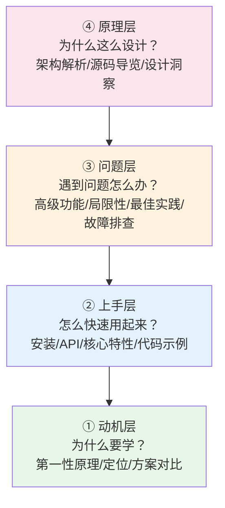

# 技术wiki四层需求结构（Tech Wiki Four-Layer Need Structure）

## 模式类型
方法论模式（技术教程/wiki文档写作结构框架）

## 成熟度
L1 实验性（1次完整验证：WeasyPrint完整教程14章节结构）

## 问题场景

写技术教程、开源项目wiki、工具使用文档时，常见的结构问题：

1. **上来就讲API**：读者还没搞懂"这东西是干嘛的、我为什么需要它"就直接讲函数参数，看完了还是不知道什么时候用
2. **只有Hello World**：快速开始写完就没了，真正用的时候遇到坑完全不知道怎么解决
3. **只有API没有原理**：像字典一样列完所有接口，读者遇到问题无法调试，因为不知道底层怎么工作的
4. **结构混乱想到哪写到哪**：一会讲安装一会讲原理一会讲排障，读者需要跳来跳去找不到需要的信息
5. **只适合新手不适合老手**：写的太浅资深用户觉得没价值，写的太深新用户看不懂
6. **缺少最佳实践和坑点**：教程看完写出来的代码踩一堆坑，作者知道但没写出来

这些问题的根源是：**教程结构没有按照读者的认知需求层次来组织——不同水平的读者在不同阶段需要完全不同的信息，但大部分文档没有分层满足这些需求。**

## 核心定义

技术wiki四层需求结构是一套按照读者"为什么学→怎么快速用→遇到问题怎么办→为什么这么设计"的四层认知需求组织教程内容的框架，核心隐喻是**"像盖房子一样，从地基到屋顶逐层搭建"**——第一层建立动机（地基），第二层教快速上手（一层），第三层解决问题（二层），第四层讲透原理（屋顶），满足从新手到资深用户的全场景需求。

| 读者层次 | 核心问题 | 对应需求层 | 传统文档问题 |
|---------|---------|-----------|------------|
| 潜在用户/新手 | 这东西是什么？我为什么要用它？我需要学吗？ | 第一层：动机与定位 | 直接跳过讲API，读者不知道价值就放弃了 |
| 入门用户 | 怎么快速跑起来？80%常见场景怎么用？ | 第二层：快速上手 | 只有Hello World，没有常用场景覆盖 |
| 中级用户 | 遇到问题怎么办？高级功能怎么用？坑在哪？ | 第三层：问题解决与进阶 | 完全没提坑点和常见问题，读者踩坑到处搜 |
| 资深用户/贡献者 | 它为什么这么设计？架构是怎样的？源码怎么读？ | 第四层：原理与架构 | 完全不讲原理，用户只能用无法扩展或贡献 |

## 解决方案

### 四层结构总览

**核心原则**：从上往下写，从下往上读——先讲清楚"为什么"（读者决定要不要继续看），再讲"怎么做"，最后讲"为什么这么做"。读者可以按需停在任意一层，不需要看完所有内容。

---

### 第一层：动机层——为什么要学（解决"要不要看"的问题）

**目标**：在读者打开文档的前3分钟回答三个问题：这东西是什么？解决了我什么痛点？和其他方案比好在哪？让读者判断"我需不需要继续看下去"。

**必选章节**：
1. **第一性原理/问题本质**：这个领域的核心矛盾是什么？（对应本质矛盾三步法）
2. **一句话定位**：它是什么？不是什么？核心价值是什么？
3. **方案对比/选型建议**：和现有其他方案比有什么优劣？什么场景选它？什么场景不要选？
4. **核心特性矩阵**：它支持什么？不支持什么？（明确边界非常重要）
5. **关键数据/事实**：项目年龄、下载量、Star数、许可证、支持的Python版本等信任信号

**关键提醒**：不要一开始就扔代码！读者如果没搞懂"这东西解决我什么问题"，根本不会有耐心看API。
**反模式**：首页直接是"安装方法"和"快速开始"，没有任何价值说明。

---

### 第二层：上手层——怎么快速用起来（解决"80%场景怎么用"的问题）

**目标**：让读者看完这一层就能解决80%的常见使用场景，快速上手产出成果。

**必选章节**：
1. **安装与配置**：分平台安装说明（Linux/macOS/Windows）、环境依赖、常见安装问题
2. **核心API/概念**：核心类/函数/概念是什么？每个做什么用？不要一开始就列所有参数，先讲最常用的
3. **代码示例**：从简单到复杂的完整可运行示例，覆盖5-10个最常见场景
4. **核心功能/特性指南**：最常用的核心特性怎么用？分小节讲，每个特性配示例
5. **命令行使用**（如果有）：常用命令示例

**关键提醒**：
- 代码示例必须是**可直接复制运行**的，不要写半截示例让读者自己猜
- 先讲最小可用路径，再讲更多选项——不要一上来就把所有参数列全
- 示例要贴近真实使用场景，不要只写"Hello World"

---

### 第三层：问题层——遇到问题怎么办（解决"剩下20%场景和坑"的问题）

**目标**：读者真正用起来之后会遇到的问题：高级功能怎么用？有什么坑？出问题怎么排查？最佳实践是什么？

**必选章节**：
1. **高级功能详解**：不常用但很重要的高级特性（如PDF变体、缓存、字体配置、扩展点）
2. **源码/模块导览**（可选但推荐）：如果你希望读者能读懂源码或做扩展，给一个模块地图
3. **局限性与不支持的功能**：明确说清楚它做不了什么！这比说清楚它能做什么更重要
4. **最佳实践**：踩过坑的人总结的经验，怎么用是对的，怎么用会踩坑
5. **常见问题/故障排查**：FAQ形式，列出最高频遇到的问题和解决方案，每个问题配"原因→解决方法"
6. **性能优化/生产环境部署**（如果适用）：生产环境需要注意什么？怎么优化性能？

**关键提醒**：这一层是区分"玩具教程"和"生产可用文档"的关键——大部分文档缺失这一层，读者照着写完代码一到生产就踩坑。要主动暴露局限性和坑点，不要藏着掖着。
**反模式**：只说"支持XX功能"不说"XX功能有bug/不支持YY场景"。

---

### 第四层：原理层——为什么这么设计（解决"知其所以然"的问题）

**目标**：满足想深入理解、二次开发、贡献代码的资深用户的需求——讲透架构、设计思路、源码组织，让读者不仅会用还能理解为什么这么设计。

**必选章节（按需）**：
1. **架构深度解析**：核心管线/处理流程是什么？关键设计决策是什么？
2. **源码模块导览**：目录结构说明、核心模块职责、从哪开始读源码
3. **设计洞察/架构思考**：为什么这么设计？做了什么取舍？和其他方案比设计上的优劣？
4. **相关资源链接**：官方文档、源码、规范、社区等延伸阅读
5. **学习笔记/总结**：作者自己的理解和思考，帮助读者建立更深的认知

**关键提醒**：这一层不是所有文档都需要，但如果你写的是深度教程/学习笔记，这一层是最有价值的部分——授人以鱼不如授人以渔，讲透原理读者可以举一反三。

---

### 14章标准结构模板（可直接套用）

按四层组织的14章标准结构（WeasyPrint教程已验证）：

| 层级 | 章节 | 内容 |
|------|------|------|
| ① 动机层 | 一、第一性原理：为什么需要XX | 问题本质、现有方案痛点、本方案的回答 |
| | 二、核心定位：XX是什么 | 一句话定义、关键数据、特性矩阵、不支持什么 |
| ② 上手层 | 三、核心架构/概念 | （可选）核心概念或管线介绍，帮助理解API |
| | 四、安装与配置指南 | 分平台安装、验证、CLI使用 |
| | 五、核心API完全指南 | 核心类、常用方法、代码示例（从简单到复杂） |
| | 六、核心特性/功能 | 最常用的核心功能，每个配说明和示例 |
| ③ 问题层 | 七、高级功能详解 | 复杂/不常用但重要的功能 |
| | 八、源码模块导览（可选） | 目录结构、模块职责、源码阅读路径 |
| | 九、与其他方案的对比 | 详细对比表、选型建议 |
| | 十、局限性与最佳实践 | 不支持什么、踩坑经验、推荐用法 |
| | 十一、常见问题与故障排查 | FAQ+解决方案 |
| ④ 原理层 | 十二、架构洞察与个人理解 | 设计思路、取舍思考、可迁移的架构思想 |
| | 十三、（可选）深度专题 | 某个特别复杂值得单独讲的主题 |
| | 十四、相关资源链接 | 官方文档、源码、规范、延伸阅读 |

**可裁剪说明**：
- 简单工具/库可以简化到8-10章，合并一些章节，但四层结构不要乱
- 非常复杂的系统可以扩展到20章以上，但仍然按四层组织
- 如果不是开源项目分析可以去掉源码导览章节

## 本案例验证（WeasyPrint教程）

| 层级 | WeasyPrint对应章节 | 效果 |
|------|-------------------|------|
| ① 动机层 | 一、第一性原理；二、核心定位；十、方案对比 | 读者看完前20页就能判断"我要不要用WeasyPrint？它适合我的场景吗？"——不需要看完API才发现它不支持JS |
| ② 上手层 | 五、安装；六、Python API；七、CSS分页特性 | 读者看完这部分就能写出完整的PDF生成代码，覆盖90%常见场景 |
| ③ 问题层 | 八、高级功能；十一、局限性与最佳实践；十二、FAQ | 覆盖了PDF变体、字体配置、图片缓存、中文乱码、表格跨页、性能优化等实际使用中一定会遇到的问题 |
| ④ 原理层 | 三、六步渲染管线；九、源码模块导览；十三、架构洞察 | 想深入的读者能理解它的架构为什么这么设计，甚至可以修改源码做扩展 |

**验证结果**：四层结构覆盖了从"我为什么要学"到"我能看懂源码做贡献"的全层次读者需求，新手能快速上手，老手能获得架构洞察。

## 反模式

| 反模式 | 表现 | 后果 | 规避方法 |
|--------|------|------|---------|
| **自底向上写文档** | 一开始就讲数据结构/内部实现，最后才说这东西干嘛用的 | 读者看了三页还不知道这东西能解决自己问题，直接关了 | 严格按四层顺序从上往下写：先动机再上手再问题最后原理 |
| **只讲功能不讲边界** | 列了一堆支持的功能，不说什么不支持、什么场景不要用 | 读者踩坑了才发现这功能在自己场景下根本不能用 | 必须有"不支持的特性"和"局限性"章节，主动说清楚边界 |
| **只有Hello World** | 示例只有最简单的例子，真实场景的用法完全不提 | 读者照着写完Hello World，真实需求做不出来还是要到处搜 | 示例要覆盖5-10个真实常见场景，不要只写玩具示例 |
| **避坑指南缺失** | 完全不提坑点和常见错误，好像大家用起来都一帆风顺 | 读者把所有坑踩一遍，浪费大量时间 | 专门写最佳实践和FAQ章节，把你踩过的坑都列出来 |
| **一刀切面向单一读者** | 要么写的太浅老手觉得没营养，要么写的太深新手看不懂 | 要么流失新手，要么对资深用户没价值 | 按四层分层，读者按需取阅——新手看前两层，老手看后两层 |
| **API字典式文档** | 像Javadoc一样按字母顺序列所有函数和参数，没有场景说明 | 读者知道有什么函数，但不知道什么时候用哪个 | API按使用场景组织，不是按字母顺序——先讲常用的，配合场景示例 |

## 实施检查清单

### 第一层：动机层
- [ ] 是否有一节讲清楚这个技术解决什么本质问题？
- [ ] 是否有一句话清晰的定位（它是什么/不是什么）？
- [ ] 是否有和其他方案的对比和选型建议？
- [ ] 是否明确列了不支持的功能？（边界）
- [ ] 读者看完这一层能不能判断"我需不需要学这个"？

### 第二层：上手层
- [ ] 是否有分平台的安装说明和验证方法？
- [ ] 核心API是否按使用场景组织而非字母顺序？
- [ ] 代码示例是否可直接复制运行？
- [ ] 是否覆盖了80%常用场景的示例？
- [ ] 读者看完这一层能不能写出可用的代码解决常见问题？

### 第三层：问题层
- [ ] 是否有高级功能章节？
- [ ] 是否明确讲了局限性和不推荐的用法？
- [ ] 是否有最佳实践章节？
- [ ] 是否有常见问题/故障排查FAQ？
- [ ] 读者遇到问题能不能在这一层找到答案而不用去搜？

### 第四层：原理层
- [ ] （可选）是否有架构/核心流程解析？
- [ ] （开源项目）是否有源码模块导览和阅读路径？
- [ ] 是否有作者自己的设计思考/洞察？
- [ ] 是否有相关资源延伸阅读链接？
- [ ] 资深用户看完能不能理解"为什么这么设计"？

## 适用场景

- ✅ **开源项目学习笔记/wiki教程**（如本次WeasyPrint教程）
- ✅ **技术工具/框架使用文档**
- ✅ **编程语言/库入门到精通教程**
- ✅ **内部技术分享文档**
- ✅ **技术博客深度文章/系列教程**

- ❌ 非常小的工具/库（总共就3个API，写个README就行）
- ❌ API参考手册（纯字典式参考不需要认知分层，但应该有教程型文档配合）
- ❌ 简单的操作指南/How-to（单一目标的短文不需要四层结构）
- ❌  release notes/变更日志（按时间线组织即可）

## 与其他模式的关系

- [tutorial-cognitive-ladder.md](tutorial-cognitive-ladder.md)：教程认知阶梯模型；本模式是认知阶梯在技术wiki/教程领域的具体落地结构
- [document-content-funnel.md](document-content-funnel.md)：文档内容漏斗模型；本模式四层结构符合漏斗原则，从宽（动机）到窄（原理）
- [cognitive-closure-document-split.md](cognitive-closure-document-split.md)：认知闭合文档拆分原则；当某一层内容太大时可以按本模式拆分
- [external-tech-doc-wiki-structure.md](external-tech-doc-wiki-structure.md)：外部技术文档wiki结构；本模式可作为其内容组织的参考框架
- [concept-comparison-tutorial-structure.md](concept-comparison-tutorial-structure.md)：概念对比教程结构；第一层的方案对比部分可以使用该模式
- [source-pipeline-penetration-method.md](../research-knowledge/source-pipeline-penetration-method.md)：源码学习管线穿透法；第四层源码导览部分推荐使用该方法分析源码
- [essential-contradiction-three-step.md](../research-knowledge/essential-contradiction-three-step.md)：技术方案本质矛盾三步法；第一层第一性原理分析使用该方法
