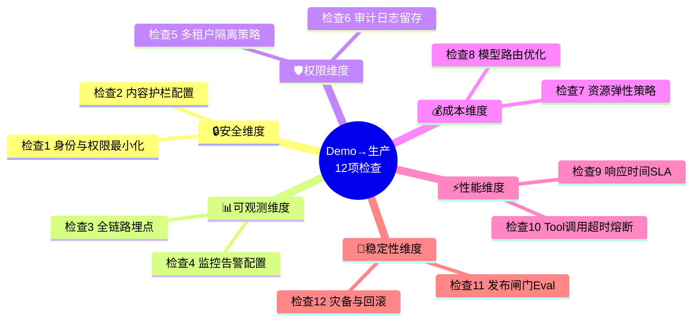

> **提炼自**：[patterns.md#模式3](../../../../../../.trae/specs/volcengine-agentkit-wiki/patterns.md#模式-3) —— 火山引擎AgentKit E阶段萃取（Demo→生产检查清单）

# 智能体从Demo到生产的12项检查清单

## 模式类型

方法论模式（治理策略/生产化检查清单/上线质量门）

## 成熟度

L1 实验性（火山引擎AgentKit生产化能力提炼，单案例待更多场景验证）

## 适用场景

智能体Demo验证完成（在Local模式跑通典型流程，核心场景通过率≥90%），需要进入生产环境部署，面对真实用户流量和SLA约束。典型场景：
- AI Agent应用从原型/PoC到生产部署
- RAG应用（知识库问答+检索增强）上线前检查
- AI工作流（审批流/文档处理流自动化）生产化
- LLM调用网关（统一模型接入层）上线
- 任何涉及LLM/Agent的应用从开发环境进入生产环境

## 问题背景

Demo到生产是AI应用最容易翻车的阶段，常见问题：

1. **功能能跑就上线**：Demo在Local模式跑通就直接全量上线，缺少安全/可观测/权限/成本/性能/稳定性6大维度检查，生产环境问题概率>80%
2. **密钥明文泄露**：AK/SK/Token硬编码在代码或配置文件中，代码仓库泄露即等于生产环境被攻破
3. **无全链路Trace**：线上出问题时无法定位是模型问题、Runtime问题、Tool调用问题还是检索问题，平均排错时间>4小时
4. **跳过发布闸门**：Demo环境只验证了10条Happy Path用例，真实用户输入多样性导致核心场景通过率从95%掉到60%，被迫回滚
5. **成本失控**：无模型路由策略、无弹性缩容，周末流量下降资源不回收、所有请求统一用大模型，云账单超预算300%
6. **多租户数据串扰**：测试环境单用户验证没问题，生产环境多租户并发时租户A能看到租户B的数据
7. **Tool超时雪崩**：单个Tool超时（如外部API响应慢）导致整个会话卡死，无超时熔断机制

## 核心思想

**智能体从Demo到生产必须通过6大维度12项量化检查（每项有明确Pass/Fail判定标准），覆盖安全（2项）、可观测（2项）、权限（2项）、成本（2项）、性能（2项）、稳定性（2项），所有检查项均为可量化的硬指标（错误率>1%告警、P95<5s、≥90天日志留存、≥50条评测用例通过率≥90%等），不存在"加强管理""提高质量"等空话。检查全部Pass后方可进入生产发布流程。**

### 6维度×12项总览



## 12项检查详情

### 🔒 安全维度

#### 检查1：身份与权限最小化

**Pass标准（全部满足）**：
1. Agent有独立身份标签（不与人类用户账号混用）
2. 每个Agent的工具权限仅限其任务场景必需的API（**白名单模式**，非黑名单）
3. 无明文密钥存储（所有AK/SK/Token均存入Secret Manager，代码和配置grep不到明文密钥）
4. 敏感写操作接口有「人类二次确认」或「审批流拦截」机制

**检查方法**：权限矩阵文档审核 + 凭据托管检查 + 代码grep扫描明文密钥正则 + 写操作渗透测试（Prompt注入尝试诱导调用敏感写接口）

#### 检查2：内容护栏配置

**Pass标准（全部满足）**：
1. 用户输入侧配置了敏感词拦截、Prompt注入检测、越权意图识别
2. 模型输出侧配置了事实幻觉检测（高风险领域）、合规输出校验（涉政/涉黄/涉赌/医疗建议等）
3. 对抗测试用例≥10条且全部被拦截（覆盖典型注入：角色扮演忽略系统提示、编码恶意指令、越权请求等）

**检查方法**：护栏规则清单审核（输入/输出两侧各≥5类拦截规则）+ OWASP LLM Top 10标准测试用例集对抗测试

### 📊 可观测维度

#### 检查3：全链路埋点

**Pass标准（全部满足）**：
1. 每次用户请求有唯一Trace ID贯穿全链路
2. Trace覆盖5大环节：模型调用 / Runtime执行 / Gateway Tool调用 / Knowledge检索 / Memory读写
3. 抽检≥5条完整调用链，每条均能从Trace ID看到各环节的耗时、输入输出摘要、状态码

**检查方法**：Trace埋点设计文档审核 + 预发环境5次典型场景（含1次故意失败）链路抽检 + 采样率确认（生产≥10%，错误100%采样）

#### 检查4：监控告警配置

**Pass标准（4个阈值均满足）**：
1. 错误率>1%（5分钟窗口）有告警
2. P95延迟>5s（简单场景）或>60s（复杂工作流）有告警
3. 日成本超出预算阈值（如超预算20%）有告警
4. 每个告警有明确接收人（Oncall轮值）和升级路径（15min未响应升级）

**检查方法**：告警规则配置导出审核 + 预发环境故障注入测试（人为注入500错误/sleep 10s/刷高成本）验证告警2分钟内送达

### 🛡️ 权限维度

#### 检查5：多租户隔离策略

**Pass标准（二选一满足）**：
1. **硬隔离**：每个租户有独立Runtime实例、独立DB Schema、独立Memory/Knowledge存储，跨租户请求返回403
2. **软隔离**：共享基础设施但租户ID强制透传所有数据层查询，SQL自动注入`WHERE tenant_id = ?`条件，跨租户访问测试≥10条全部失败

**检查方法**：隔离方式文档确认 + 跨租户访问测试（租户A Token尝试查询租户B数据，≥10条全部失败）

#### 检查6：审计日志留存

**Pass标准（全部满足）**：
1. 所有Agent调用日志（用户输入/模型输出/Tool调用参数和响应/权限判定结果）持久化存储
2. 日志留存≥90天（金融/医疗等强合规行业≥180天）
3. 支持多维度查询：按用户ID、时间范围、Tool名称、会话ID组合检索
4. 日志不可篡改（Append-only或写入后哈希校验）

**检查方法**：日志留存策略文档审核 + 4种维度各查询3次测试 + 篡改验证（尝试修改已写入日志校验哈希变化）

### 💰 成本维度

#### 检查7：资源弹性策略

**Pass标准（全部满足）**：
1. Serverless模式配置了自动扩缩容阈值（并发数/CPU/内存触发）
2. 空闲资源自动回收（无流量15~30min后缩容到0）
3. 压测报告验证：10→100并发线性增加，P95延迟不超过基线2倍，无5xx错误

**检查方法**：伸缩规则配置审核 + k6/JMeter/Locust 10→100并发压测10分钟

#### 检查8：模型路由优化

**Pass标准（量化下降≥20%）**：
1. 实现模型路由策略：高频简单任务（问答/分类/摘要）路由到小模型（7B/8x7B），复杂任务（推理/代码/多轮Tool调用）路由到大模型
2. 成本对比：与"所有请求统一用大模型"基线相比，生产流量下Token总成本下降≥20%，核心场景准确率下降<2%

**检查方法**：路由策略代码/配置审核 + A/B测试报告（开启路由vs全大模型各跑≥1000条生产请求对比成本和准确率）

### ⚡ 性能维度

#### 检查9：响应时间SLA

**Pass标准（按场景分）**：
1. 简单工具调用场景（单Tool调用+模型输出<500 Token）：P95延迟<5s
2. 复杂工作流场景（≥3次Tool调用或长文档处理）：P95<60s
3. 压测条件：≥100并发、≥1000次调用，SLA达标率≥99%

**检查方法**：SLA定义文档审核 + 按场景分类压测，记录P50/P95/P99延迟

#### 检查10：Tool调用超时熔断

**Pass标准（全部满足）**：
1. 所有Tool均配置超时时间（默认≤30s，下载/批处理等特殊场景≤300s需单独审批）
2. 失败重试策略：幂等Tool最多2次指数退避重试，非幂等Tool不自动重试
3. 熔断降级方案：单Tool 5分钟内错误率>30%自动熔断，返回预设降级响应（如"系统繁忙，稍后重试"）而非报错

**检查方法**：Tool配置清单审核 + 故障注入测试（模拟超时60s/连续5xx/限流429验证超时/重试/熔断行为）

### 🔄 稳定性维度

#### 检查11：发布闸门（Eval）

**Pass标准（量化指标）**：
1. 上线前评估用例≥50条（核心场景20条+边缘场景20条+对抗场景10条）
2. 整体通过率≥90%，核心场景通过率≥95%
3. 发布流程自动化：低于阈值自动拦截发布（CI/CD Pipeline中Gate），触发回滚到上一稳定版本
4. 回滚方案文档齐全

**检查方法**：评估用例集审核 + Evaluation评估报告 + 拦截验证（故意构造低通过率版本走发布流程确认CI/CD被拦截）

#### 检查12：灾备与回滚

**Pass标准（演练验证通过）**：
1. 自动回滚机制：发布后30分钟内错误率>5%或P95>基线3倍，自动触发回滚到上一稳定版本
2. 历史版本保留≥3个镜像（或部署包），可手动一键回滚
3. 知识库快照策略：每次上线前对Knowledge做快照，可在10分钟内恢复
4. 回滚演练记录：近30天内执行过≥1次完整回滚演练，演练报告齐全

**检查方法**：回滚机制配置审核 + 知识库快照策略确认 + 回滚演练记录核查

## 快速检查清单（Copy-Paste版）

上线前逐项确认，全部✅才能发布：

```markdown
## Demo→生产上线检查清单

### 🔒 安全
- [ ] 检查1：Agent独立身份+工具白名单+无明文密钥+写操作二次确认
- [ ] 检查2：输入侧Prompt注入检测+输出侧合规校验+≥10条对抗测试通过

### 📊 可观测
- [ ] 检查3：Trace ID贯穿5大环节+≥5条链路抽检完整+采样率配置正确
- [ ] 检查4：错误率/P95延迟/成本超支3类告警配置+故障注入验证告警送达

### 🛡️ 权限
- [ ] 检查5：多租户硬隔离或软隔离+≥10条跨租户访问测试全部失败
- [ ] 检查6：审计日志持久化+≥90天留存+4维度可查+不可篡改

### 💰 成本
- [ ] 检查7：自动扩缩容配置+空闲回收+10→100并发压测P95<2倍基线
- [ ] 检查8：模型路由策略+A/B测试验证成本下降≥20%准确率下降<2%

### ⚡ 性能
- [ ] 检查9：简单场景P95<5s/复杂场景P95<60s+100并发SLA达标率≥99%
- [ ] 检查10：所有Tool超时配置+幂等重试策略+30%错误率自动熔断

### 🔄 稳定性
- [ ] 检查11：≥50条Eval用例+整体≥90%/核心≥95%通过+CI/CD自动拦截+回滚方案
- [ ] 检查12：自动回滚阈值+≥3版本保留+知识库快照+30天内回滚演练通过
```

## 反模式

- **反模式1：能跑就上线**：Demo在Local跑通就直接全量上线，12项检查一项都没做，生产环境明文密钥泄露、租户数据串扰、无法定位报错、Tool超时卡死、成本超预算10倍，平均排错时间>4小时。
- **反模式2：跳过发布闸门**：Demo环境只验证10条Happy Path用例就上线，真实用户输入多样性导致核心场景通过率从95%掉到60%，用户投诉飙升5倍，被迫回滚返工，总延期2周。
- **反模式3：只关注功能忽略成本**：12项里只做了检查1（权限）和检查9（延迟），跳过成本维度（检查7和8），上线第一周无模型路由、无弹性缩容，周末流量下降资源不回收、小模型能力未启用，云账单超预算300%被财务冻结预算。
- **反模式4：无熔断裸奔上线**：Tool调用不设超时和熔断，外部API一次超时导致整个会话卡死，高并发下线程池耗尽整个服务雪崩，影响所有用户。
- **反模式5：无回滚方案强推上线**：发布出问题后只能紧急修复 hotfix，没有回滚能力和知识库快照，修复期间服务不可用1~2小时，用户流失。

## 检验标准

做完之后怎么知道做对了？

- 标准1：12项检查全部Pass，每项都有量化测试证据（非口头确认）
- 标准2：灰度发布期间（10%流量）错误率<1%、P95延迟达标、无安全事件
- 标准3：发布后第一周无P0/P1级生产事故，成本在预算±10%以内
- 标准4：线上出现问题时，通过Trace在30分钟内定位到具体环节和根因
- 标准5：有过至少一次回滚演练，团队知道怎么回滚、多久能恢复

## 迁移示例

这个模式还能用在什么其他场景？

- **场景1（任意Agent框架/平台）**：LangGraph/Dify/Coze/LlamaIndex/AutoGen/Semantic Kernel等任何Agent框架的生产化检查，6大维度12项检查完全通用，仅需将"AgentKit对应能力映射"列替换为对应框架的能力名称（Dify工作流日志/Coze插件权限/LangSmith观测等）
- **场景2（RAG应用生产化）**：知识库问答+检索增强的RAG应用上线——将"Tool调用"替换为"检索调用"，检查维度（安全/可观测/权限/成本/性能/稳定性）和量化标准完全复用
- **场景3（AI工作流生产化）**：审批流/文档处理流等AI工作流自动化——将"Tool调用"替换为"工作流节点"，增加工作流状态持久化检查项，核心框架不变
- **场景4（LLM网关生产化）**：统一模型接入层（LLM Proxy/Gateway）上线——12项检查中安全/可观测/权限/成本/性能/稳定性维度均适用，"Agent权限"替换为"API Key配额"，"Tool熔断"替换为"模型API熔断"
- **场景5（跨领域类比）**：传统Web应用/微服务上线检查——安全（认证/授权）、可观测（日志/监控/告警）、权限（租户隔离/审计）、成本（弹性伸缩）、性能（SLA/超时熔断）、稳定性（发布闸门/回滚）是所有生产级软件的通用6维度，本清单是传统软件上线检查在AI Agent领域的具体化

## 与现有模式的关系

| 相关模式 | 关系 | 说明 |
|---------|------|------|
| [P-AGENT-SELECT-001-agent-platform-selection-framework.md](P-AGENT-SELECT-001-agent-platform-selection-framework.md) | 姊妹模式：选型前 | 选型评估框架选择平台，本清单是选定平台后开发完成的上线检查 |
| [P-LEGACY-AI-UPGRADE-002-legacy-ai-upgrade-sop.md](P-LEGACY-AI-UPGRADE-002-legacy-ai-upgrade-sop.md) | 姊妹模式：改造中 | 存量改造SOP第5步MCP优化完成后，进入本清单的生产化检查 |
| [governance-outer-ring.md](../../architecture-patterns/governance-outer-ring.md) | 架构基础 | 治理外环架构（Identity+Gateway+Observability+Evaluation）是本清单的架构前提 |
| [data-lifecycle-economic-stratification.md](../../architecture-patterns/data-lifecycle-economic-stratification.md) | 架构支撑 | 数据经济分层中Memory半衰期审计是检查6审计日志管理的具体实践 |
| [quality-assurance-three-layer-model.md](quality-assurance-three-layer-model.md) | 质量原则 | 质量保证三层分工（自动化/人工/流程）是检查11发布闸门的质量原则 |
| [defensive-programming-first-principles.md](defensive-programming-first-principles.md) | 安全原则 | 防御性编程7项原则是检查1/2/10安全与熔断的底层原则 |
| [config-persistence-full-chain-coverage.md](config-persistence-full-chain-coverage.md) | 配置管理 | 配置全链路覆盖是检查7弹性配置和检查8路由配置的基础 |
