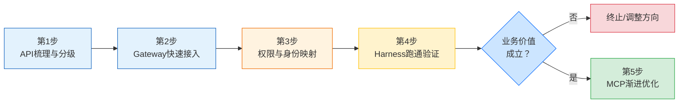

> **提炼自**：[patterns.md#模式2](../../../../../../.trae/specs/volcengine-agentkit-wiki/patterns.md#模式-2) —— 火山引擎AgentKit E阶段萃取（存量改造SOP）

# 存量业务系统智能化改造5步SOP

## 模式类型

方法论模式（治理策略/系统集成/AI落地SOP）

## 成熟度

L1 实验性（火山引擎AgentKit存量接入双轨设计验证，单案例待更多场景验证）

## 适用场景

企业已有工单/订单/CRM/审批/ERP/HR等业务系统（REST/OpenAPI为主，部分含gRPC/GraphQL），需要赋予Agent自然语言交互能力、工具调用能力、跨系统协同能力。典型场景：
- 传统企业业务系统智能化升级（客服Agent、运维Agent、审批Agent等）
- SaaS平台AI能力嵌入（为现有产品增加自然语言交互入口）
- 企业内部工具Copilot化（将内部API封装为Agent可用工具）
- 移动App/小程序后端API智能化改造
- 第三方SaaS（钉钉/飞书/企微/Salesforce）OpenAPI接入

## 问题背景

存量系统AI化改造中常见的失败路径：

1. **完美主义前置改造**：一开始就要求所有接口（含50%低频低价值接口）都支持MCP标准，改造周期拖到6个月以上，业务方失去耐心项目终止
2. **权限失控**：直接把业务系统管理员密钥（超级管理员Token）给Agent使用，Prompt注入后Agent可批量删除订单/修改薪酬等不可逆事故
3. **跳过Local验证直接上云**：开发阶段无法单步调试、无法模拟失败场景，每次修改走完整构建部署流程，调试成本从天级拉长到周级
4. **API分级错误**：只看业务价值不看调用频率，将季度调用<5次的接口纳入A级优先接入，每天调用500+次的核心接口反而在B级迟迟未上线
5. **MCP焦虑**：受技术舆论影响认为"不写MCP Server就是落后"，要求业务团队先重写所有接口再验证价值，改造成本远超Agent平台本身采购成本

## 核心思想

**存量系统智能化改造遵循"API分级→快速接入→权限映射→跑通验证→渐进优化"5步SOP，核心原则是"先接入验证价值，再优化核心接口"：第一步用业务价值×调用频率二维矩阵筛选Top 20%A级核心接口，第二步用Gateway的REST/OpenAPI转换能力1~2天批量接入（敏感写操作默认只读），第三步建立Agent-用户-工具三维权限映射遵循最小权限，第四步Local模式跑通≥20条典型场景验证业务价值，第五步基于Observability调用数据筛选Top 20%高频接口逐个MCP改造灰度切换。**

## 5步详细流程

### 第1步：API梳理与分级（业务分析阶段，约3~5天）

**输入**：存量系统API文档（Swagger/OpenAPI、Postman Collection、内部Confluence）

**核心动作**：
1. 收集所有暴露接口（含内部未文档化的接口，利用API网关流量日志补全）
2. 按「近90天调用频率 × 业务价值（营收影响/合规要求/人工耗时）」二维矩阵打分
3. 分ABC三级：A级（Top 20%高频+高价值，建议20~100个）、B级（中间30%）、C级（剩余50%低频低价值）
4. 标记敏感写操作接口（创建/修改/删除/审批通过）单独管控

**输出**：A级API清单 + 敏感写操作标记清单

**关键原则**：频率和价值**双维度**缺一不可——高频低价值（如心跳检测）和低频高价值（如年度结算）都不应是首批接入优先级。

### 第2步：Gateway快速接入（技术接入阶段，约1~2天）

**输入**：A级API清单 + 敏感写操作标记

**核心动作**：
1. 利用Gateway的REST/OpenAPI转换能力，批量导入A级API自动生成Tool定义（名称/描述/参数Schema/示例）
2. 对敏感写操作接口默认设置「只读模式」或「二次确认」包装
3. 为每个Tool分配独立的调用超时（默认30s）和重试策略（幂等接口最多2次指数退避，非幂等不重试）
4. 逐个Tool做连通性测试，确保鉴权头、参数映射、响应解析正确

**输出**：可被Agent调用的Tool清单（含超时/重试/权限标签）+ 连通性测试通过率报告

**关键原则**：此阶段目标是"快速接入"而非"最优体验"，1~2天完成全量A级接入，不要在此阶段陷入MCP改造。

### 第3步：权限与身份映射（安全治理阶段，约2~3天）

**输入**：业务系统RBAC/ABAC权限矩阵 + Tool清单 + 企业IAM用户目录

**核心动作**：
1. 定义Agent独立身份标签（区别于人类用户账号，Agent有独立审计轨迹）
2. 将业务系统角色映射为Agent的Tool访问白名单（**最小权限原则**：只授予A级API中与Agent任务场景匹配的子集）
3. 配置凭据托管：业务系统AK/SK/Token存入统一Secret Manager，**禁止代码硬编码**
4. 定义跨Agent权限隔离规则：A Agent不可通过B Agent间接调用自身白名单外的Tool

**输出**：Agent-用户-工具三维权限映射表 + 凭据托管配置确认表

**关键原则**：绝对不要给Agent超级管理员权限，遵循最小权限原则，每个Agent只能访问完成其任务所必需的最小API集合。

### 第4步：Harness跑通验证（价值验证阶段，约3~5天）

**输入**：Tool清单 + 权限映射表 + 典型业务场景用例清单（≥20条，覆盖80%高频诉求）

**核心动作**：
1. Harness配置编排：定义Agent模型、System Prompt、Tool挂载列表、会话配置
2. **Local模式启动调试**：Mock外部依赖、单步跟踪Tool调用链路、验证权限拦截是否生效
3. 典型场景批量测试：自动化执行20+条业务用例，记录成功率/平均延迟/Tool调用正确率
4. 修复通过率<90%的场景（优化Tool描述、补充Prompt约束、增加参数校验）

**输出**：测试通过的典型业务场景Demo + 用例执行报告 + 失败案例根因分析

**关键原则**：必须在Local模式完成验证后再上Cloud/Hybrid模式，此阶段是价值验证决策点——如果核心场景通过率<80%，应重新评估是否值得继续投入。

### 第5步：MCP渐进优化（可选优化阶段，持续进行）

**输入**：Observability调用数据（近2周Tool调用日志/Trace）+ 第4步Demo报告

**核心动作**：
1. 从Observability提取Tool调用频率排名，筛选Top 20%高频调用接口
2. 对筛选出的接口评估MCP改造收益：
   - 流式响应需求（>5s响应优先改造）
   - 错误码结构化需求（>3种业务错误优先改造）
   - 并发安全需求（涉及库存/余额等状态变更优先改造）
3. 逐个改造为MCP Server并**灰度切换**（新旧双轨并行观察≥3天）
4. 量化收益报告：延迟变化（P95）、错误率变化、Token消耗变化

**输出**：性能/稳定性提升报告 + MCP Server清单 + 灰度切换记录

**关键原则**：不是所有接口都需要MCP，80%的低频简单接口用REST转换即可满足需求，只优化真正高频且有体验瓶颈的核心接口。

## 实施检查清单

**第1步（API分级）检查项**：
- [ ] 是否收集了所有暴露接口（含网关流量日志中的未文档化接口）？
- [ ] 是否使用了「调用频率×业务价值」二维矩阵而非单一维度分级？
- [ ] A级接口是否控制在Top 20%（20~100个）？
- [ ] 是否标记了所有敏感写操作接口？

**第2步（快速接入）检查项**：
- [ ] 是否在1~2天内完成了全量A级接口接入？
- [ ] 敏感写操作是否默认只读或设置了二次确认？
- [ ] 每个Tool是否配置了独立超时和重试策略？
- [ ] 是否逐个Tool做了连通性测试？

**第3步（权限映射）检查项**：
- [ ] Agent是否有独立身份标签（不与人类用户账号混用）？
- [ ] 每个Agent的Tool权限是否遵循最小权限白名单原则？
- [ ] 所有凭据是否存入Secret Manager，代码中无硬编码密钥？
- [ ] 是否配置了跨Agent权限隔离规则？

**第4步（跑通验证）检查项**：
- [ ] 是否使用Local模式调试而非直接上Cloud？
- [ ] 测试用例是否≥20条且覆盖80%高频诉求？
- [ ] 核心场景通过率是否≥90%？
- [ ] 权限拦截是否经过了专门测试（尝试越权调用）？

**第5步（渐进优化）检查项**：
- [ ] 是否基于Observability真实数据（而非主观判断）筛选MCP改造接口？
- [ ] MCP改造是否逐个进行而非批量大爆炸切换？
- [ ] 是否有灰度机制（新旧双轨并行≥3天）？
- [ ] 是否量化了改造前后的延迟/错误率/Token消耗对比？

## 反模式

- **反模式1：MCP前置改造**：一开始就要求所有接口（含C级50%低频接口）都支持MCP标准，改造周期拖到6个月以上，业务方失去耐心项目终止。正确做法：先用REST/OpenAPI转换1~2天跑通A级，再渐进改造Top 20%高频。
- **反模式2：超级管理员密钥给Agent**：直接把业务系统管理员Token给Agent使用，最小权限原则完全失效。Prompt注入后Agent可调用所有敏感写接口（批量删除订单/修改薪酬），造成不可逆生产事故。
- **反模式3：跳过Local直接上生产**：跳过Local模式验证直接上Cloud模式，开发阶段无法单步调试，每次修改走完整构建部署流程，排错周期从小时级拉长到天级。
- **反模式4：API分级单维度错误**：只看业务价值不看调用频率，将季度调用<5次的高价值接口纳入A级，浪费2~3周在极少使用的接口上，而每天调用500+次的核心接口迟迟未上线。
- **反模式5：大爆炸MCP切换**：攒够一批MCP改造后集中上线切换，出现问题无法快速定位，回滚成本高。正确做法：改造完一个切换一个，可灰度、可回滚。

## 检验标准

做完之后怎么知道做对了？

- 标准1：第1~4步在2~3周内完成（而非2~3个月），业务方快速看到Demo验证价值
- 标准2：A级20~100个核心接口在1~2天内完成接入，而非逐接口开发数周
- 标准3：敏感写操作接口在测试阶段无法被Agent越权调用，渗透测试全部拦截
- 标准4：Local模式下单步调试Tool调用链路清晰，问题定位时间<30分钟
- 标准5：MCP改造的接口数量控制在A级的20%以内，但覆盖了80%的调用量（帕累托最优）
- 标准6：MCP改造后P95延迟下降≥20%或错误率下降≥30%，有量化收益数据

## 迁移示例

这个模式还能用在什么其他场景？

- **场景1（任意Agent框架改造REST系统）**：LangChain/LlamaIndex/AutoGen/Dify/Coze/Semantic Kernel等任何支持Tool Calling的Agent框架均适用：第2步Gateway接入替换为对应框架的Tool Wrapper，第3步权限映射替换为对应框架的权限中间件，其余步骤完全复用
- **场景2（移动App/小程序API智能化）**：iOS/Android后端API、微信/支付宝/抖音小程序服务端API智能化：核心5步流程不变，第2步需额外处理签名校验，第3步需处理用户身份映射（OAuth/手机号授权）
- **场景3（第三方SaaS集成）**：Salesforce/钉钉/飞书/企业微信OpenAPI接入：第2步通常需额外处理OAuth 2.0授权流程（Access Token纳入凭据托管+自动刷新），核心5步不变
- **场景4（跨领域类比）**：传统企业数字化转型（上云）——先梳理核心业务流程（对应API分级）、用PaaS快速搭建原型验证（对应REST快速接入）、做好数据权限和安全（对应权限映射）、试点跑通验证价值（对应Harness验证）、核心系统逐步优化上云（对应MCP渐进优化）

## 与现有模式的关系

| 相关模式 | 关系 | 说明 |
|---------|------|------|
| [P-AGENT-SELECT-001-agent-platform-selection-framework.md](P-AGENT-SELECT-001-agent-platform-selection-framework.md) | 姊妹模式：选型前 | 选型评估框架是本SOP的前置——选好平台后才进入存量改造 |
| [P-DEMO-TO-PROD-003-demo-to-prod-checklist.md](P-DEMO-TO-PROD-003-demo-to-prod-checklist.md) | 姊妹模式：上线前 | Demo→生产12项检查清单是本SOP第5步后的生产化部署检查 |
| [legacy-integration-dual-track.md](../../architecture-patterns/legacy-integration-dual-track.md) | 架构模式对应 | 存量系统双轨接入两阶段法是本SOP第2步+第5步的架构级抽象 |
| [governance-outer-ring.md](../../architecture-patterns/governance-outer-ring.md) | 架构基础 | 治理外环架构（Identity+Gateway+Observability+Evaluation）是本SOP的架构前提 |
| [phased-rollout-validation.md](phased-rollout-validation.md) | 执行策略 | 渐进式推广验证是第5步MCP灰度切换的执行方法论 |
| [fine-grained-least-privilege.md](../ai-collaboration/fine-grained-least-privilege.md) | 安全原则 | 细粒度最小权限是第3步权限映射的核心安全原则 |
