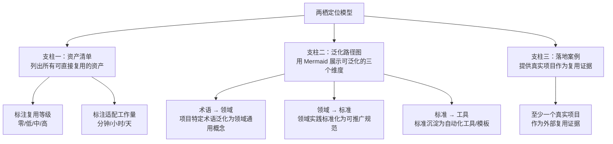
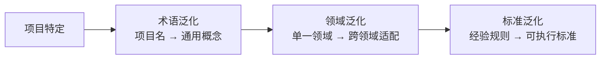

> **来源**：从 `docs/retrospective/reports/retrospective-insight-extraction-comprehensive-20260623.md` 四、萃取环节 拆分

# 两栖定位模型（Amphibious Positioning Model）

## 模式类型
方法论模式

## 成熟度
L1 实验性（基于本项目单次实践萃取）

## 适用场景
积累了大量可复用资产（模板、脚本、方法论、决策框架）的规范体系、脚手架项目或框架，需要同时服务自身团队和外部受众。

## 问题背景

一个项目在持续发展中会积累大量可复用资产，项目定位也随之变化——从"只服务于自己团队的规范"到"也可服务于其他项目的元框架"。但多数项目的文档定位未能体现这一变迁，导致潜在使用者无法感知其跨项目迁移的价值。

## 核心要素

两栖定位模型通过**三个支柱**支撑"具体规范 + 元框架"的双重定位：

### 1. 资产清单

列出所有可直接复用的资产，按类别分组：

| 类别 | 示例 | 复用方式 | 适配工作量 |
|------|------|---------|-----------|
| 模板 | README 模板、复盘报告模板 | 填充内容 | 低（5-30 分钟） |
| 脚本 | 验证脚本、检查工具 | 修改配置列表 | 低（5-30 分钟） |
| 协议 | 交接协议、消息传递协议 | 直接复用 | 零 |
| 模式 | 方法论模式、架构模式 | 按文档实施 | 中（1 小时） |

### 2. 泛化路径图

用 Mermaid 展示从"项目特定"到"通用标准"的泛化路径：

### 3. 落地案例

提供一个真实项目作为复用证据。例如本项目的 `vendor/flexloop/AgentForge` 就是依照此规范体系建造的实际应用。

## 关键原则

1. **不泛化尚未验证的内容**：只将已被自身团队反复验证的内容放入泛化路径
2. **资产清单先行**：在宣称"可迁移"之前，先整理出完整、准确的资产清单
3. **落地案例是可信度的锚点**：无落地案例的两栖定位是空洞的口号
4. **泛化程度与适配成本成反比**：越泛化的资产，适配成本越低，但适用面越窄

## 价值

将"只服务于自己"的项目转化为"也能服务他人"的平台型项目，实现影响力的量级跃迁——从"一个团队的内部规范"升级为"可被广泛采用的元框架"。

## 成功案例

| 项目 | 三支柱实施情况 | 效果 |
|------|---------------|------|
| 本项目（AI 智能体开发规范体系） | 资产清单 70+ 项 + 泛化路径图 3 维 + 落地案例 1 个 | README.md 定位从"项目描述"升级为"元规范框架" |

> **关联模块**：
> - `docs/retrospective/assets/asset-inventory.md`
> - `docs/retrospective/patterns/methodology-patterns/governance-strategy/convention-driven-creation.md`
> - `docs/retrospective/patterns/methodology-patterns/creative-design/spec-driven-development.md`
