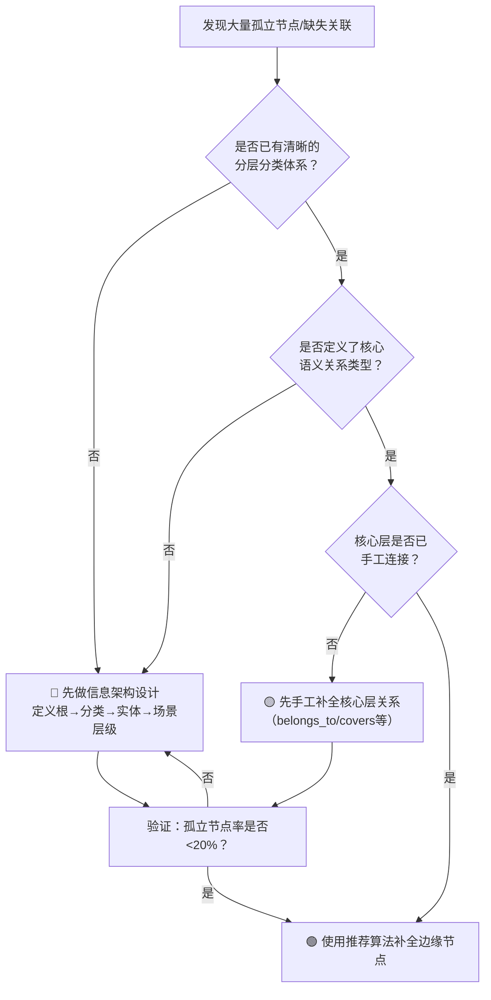

> **提炼自**：[insight-extraction.md](../../../reports/task-reports/retrospective-first-principles-knowledge-graph-20260709/insight-extraction.md#洞察7) —— 第一性原理交互式知识图谱复盘（IMP-001推广验证）

# 信息架构优先于算法补全（Architecture Over Algorithm）

## 模式类型

方法论模式（架构设计/信息组织/系统思维）

## 成熟度

L1 首次提炼（知识图谱领域验证：best-practices 0孤立 vs adversarial-review 67孤立正反对照）

## 第一性原理

**系统的连接性由结构决定，而非由算法事后补全。**

当系统中出现大量"孤立节点"、"缺失关联"、"找不到相关内容"等问题时，直觉反应是"加个推荐算法"、"做个智能匹配"。但这些问题的**根因通常是信息架构设计缺陷**——没有为实体设计天然的连接路径、分类体系混乱、导航结构断裂。算法是对架构缺陷的事后弥补，是"补丁"而非"解决方案"。好的信息架构天然消除大部分孤立问题，算法只应处理剩余的边缘案例。

## 适用场景

- 知识图谱、知识库、Wiki等知识系统设计
- 内容平台的相关推荐、关联阅读功能
- 文档体系的导航与交叉引用设计
- 任何需要"建立实体间关联"的系统
- 判断"该做架构重构还是加算法补丁"时

## 核心思想

### 架构vs算法：成本收益对比

| 方案 | 本质 | 成本 | 效果 | 覆盖率 | 维护成本 |
|------|------|------|------|--------|---------|
| **事前架构设计** | 为实体设计天然连接路径（分层、分类、导航） | 设计阶段投入 | 根本性解决，准确率100% | 覆盖80-90%核心连接 | 低（结构稳定后无需频繁调整） |
| **事后算法补全** | 用相似性/统计模型推荐可能的连接 | 开发+训练+调优 | 概率性推荐，有误报/漏报 | 覆盖剩余10-20%边缘 | 高（需要持续调优、bad case修复） |

### 关键洞察：孤立节点的三层归因

```
孤立节点问题
├─ 第一层（症状）：节点之间缺少边
├─ 第二层（直觉归因）：需要推荐算法自动找边
└─ 第三层（根因）：信息架构没有为节点设计连接路径
   ├─ 没有根节点/入口点
   ├─ 分类体系缺失或混乱
   ├─ 没有导航层（分类→实体→场景）
   └─ 实体间的语义关系类型未定义
```

### 反直觉结论

**没有用任何算法的系统，可能比用了复杂推荐算法的系统连接性更好。** 这不是算法不行，而是好的架构让算法"不需要存在"。

## 正反验证案例

### ✅ 正例：best-practices知识图谱（0孤立节点，无算法）

- **架构设计**：根节点→3个严重度级别→8个检查维度→11个最佳实践文档→9个应用场景
- **手工边数**：31条
- **孤立节点**：0个
- **算法使用**：未使用IMP-004推荐算法
- **结果**：所有节点通过层级关系天然连接，导航路径清晰，用户可以从任意入口遍历到相关内容

### ❌ 反例：adversarial-review-wiki知识图谱（67孤立节点，有配置）

- **架构设计**：80个节点但缺少清晰的分层分类体系，仅靠文档内链接自动解析
- **手工边数**：13条
- **孤立节点**：67个（83.75%）
- **算法支持**：IMP-004推荐算法可辅助补充，但Top1推荐仅解决部分问题
- **教训**：配置文件存在但架构设计缺失，算法只能辅助不能替代

## 决策框架：架构优先还是算法优先？



## 反模式与误区

### 误区1："算法能解决一切连接问题"
错误。算法基于相似性统计，无法识别需要领域知识的语义关系（如"这个错误模式是那个最佳实践的反例"）。这类关系只能通过架构设计+手工编码解决。

### 误区2："先做出来再说，后面加算法优化"
错误。这是技术债的一种——架构缺陷会随节点数量增加指数级恶化，后期补架构的成本远高于前期设计。

### 误区3："手工连接太麻烦，不如全自动算法"
错误。手工连接核心层（根→分类→关键实体）的成本是一次性的、可控的；算法调优是持续的、无止境的。80/20法则：20%的核心架构工作解决80%的连接问题。

### 误区4："孤立节点率高是因为算法不够好"
错误。如果孤立节点率>50%，几乎可以肯定是架构问题而非算法问题。best-practices案例证明：好的架构可以让孤立节点率降到0，不需要任何算法。

## 实施步骤

### 步骤1：诊断——判断是架构问题还是算法问题
- 计算孤立节点率（孤立节点/总节点）
- 孤立节点率>50% → 架构问题（先做步骤2）
- 孤立节点率20-50% → 混合问题（先架构后算法）
- 孤立节点率<20% → 边缘问题（可用算法补全）

### 步骤2：设计信息架构
1. 定义根节点/入口点（1-3个）
2. 设计分类层级（建议2-4层，不要过深）
3. 定义核心语义关系类型（如belongs_to/covers/leads_to等，3-7种足够）
4. 建立导航路径（根→分类→实体→场景）

### 步骤3：手工补全核心层关系
- 根→分类：必须全部连接
- 分类→核心实体：关键实体必须连接
- 实体→关键场景：高频访问场景必须连接
- 这一步通常能消除80%以上的孤立节点

### 步骤4：算法补全边缘节点
- 对剩余<20%的孤立节点使用推荐算法
- 算法输出必须是"建议"而非"自动添加"（人机协作）
- 人工确认的边回写到配置中，形成闭环

## 经验量化指标

| 指标 | 架构健康 | 需要改进 | 架构缺陷 |
|------|---------|---------|---------|
| 孤立节点率 | <20% | 20-50% | >50% |
| 手工边/节点比 | >0.8 | 0.3-0.8 | <0.3 |
| 核心层覆盖率 | 100% | 50-100% | <50% |
| 平均路径长度（根到任意节点） | <4跳 | 4-6跳 | >6跳 |

## 与现有模式的关系

- `human-in-the-loop-augmentation.md`：本模式中"算法只给建议，人工确认"是人在回路的具体应用
- `knowledge-system-five-foundations.md`：信息架构是知识系统五大基础之一
- `markdown-to-knowledge-graph.md`：Markdown→知识图谱自动化生成模式中，手工边配置是架构设计的实现手段

## 适用边界

- **适用于**：知识组织系统、内容平台、文档体系、导航设计等需要建立实体间关联的场景
- **不适用于**：纯相关性推荐（如"看了又看"的个性化推荐）、大规模无结构数据的探索性发现（这类场景算法优先）
