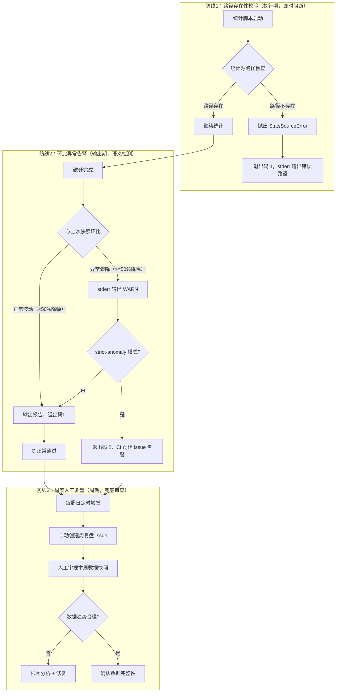
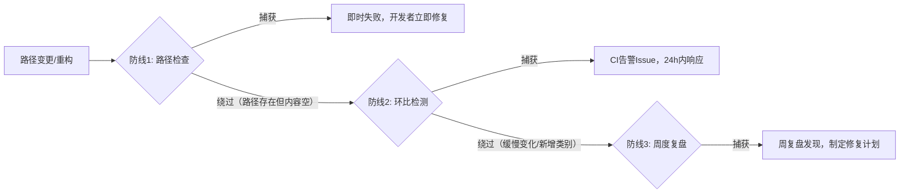

# 自动化统计三防线模式：路径校验→环比告警→人工复盘

## 模式概述

自动化统计/监控/报告生成系统中，最脆弱的环节不是统计逻辑本身，而是"静默失败"——脚本正常执行（退出码0）但结果已因路径变更、上游目录重命名等原因变为零值或空数据，且无人发现。本模式通过三道相互独立的防线，将"统计断链N天无人知"的风险从系统性漏洞降为可在24小时内被发现并修复的小问题：防线1（路径存在性校验）在源头阻断无效路径，防线2（环比异常告警）捕获语义层面的异常数据，防线3（周度人工复盘）覆盖前两道防线漏过的逻辑错误。三道防线职责分离，任何一道被绕过都有其他防线兜底。

## 问题现象

自动化统计脚本静默失败的典型后果：

1. **路径依赖脆弱**：统计脚本硬编码路径依赖（如 `root / "docs"`），一次目录重构（docs 从根目录迁移至 `.agents/docs/`）就导致统计值归零，但脚本无任何报错
2. **退出码掩盖错误**：脚本执行成功返回码 0，CI 显示绿色全过，实际产出数据已完全错误
3. **异常发现滞后**：数据断链后无人主动监控看板，直到3天后人工浏览才发现模式数显示为 0
4. **修复成本非线性增长**：断链当天修复只需改一行路径，但3天后已产生连锁影响：错误统计被写入changelog、错误数据被引用进报告、快照数据出现断层
5. **缺乏语义层校验**：即使路径正确，也可能因统计逻辑bug导致数据异常增长或骤降，纯语法检查无法发现此类问题

## 三防线架构



### 防线1：路径存在性校验（执行期阻断）

统计脚本启动时，在执行任何统计逻辑之前，先验证所有统计源路径的存在性：

```python
def _validate_stats_sources(agents: Path) -> list[str]:
    errors = []
    required = {
        "retrospective": agents / "docs" / "retrospective",
        "rules": agents / "rules",
        "commands": agents / "commands",
        "skills": agents / "skills",
        "scripts_dir": agents / "scripts",
    }
    for name, path in required.items():
        if not path.exists():
            errors.append(f"Stats source path not found: {name} = {path}")
    return errors
```

| 设计要点 | 说明 |
|---------|------|
| 执行时机 | 统计逻辑开始之前，fail-fast |
| 错误行为 | 抛出 `StatsSourceError`，退出码 1，stderr 输出具体缺失路径 |
| 覆盖范围 | 所有统计源目录（retrospective/rules/commands/skills/scripts）|
| CI 效果 | workflow 立即失败，红色状态明确可见 |

### 防线2：环比异常告警（语义层检测）

防线1只能捕获"路径不存在"的硬错误，无法捕获"路径存在但数据异常"的软错误（如统计逻辑bug导致某类别计数为0、全局过滤条件误删数据等）。环比告警通过与上次有效快照对比来检测语义异常：

```python
def _validate_with_snapshot(current: dict, snapshot_dir: Path, threshold: float = 0.5) -> list[str]:
    warnings = []
    prev_snap = _find_previous_snapshot(snapshot_dir)
    if prev_snap is None:
        return warnings
    prev = json.loads(prev_snap.read_text(encoding="utf-8"))
    for key in current["core"]:
        cur_val = current["core"][key]
        prev_val = prev["core"].get(key, 0)
        if prev_val > 0 and cur_val < prev_val * threshold:
            warnings.append(f"ANOMALY: {key} dropped {prev_val} -> {cur_val}")
    return warnings
```

| 设计要点 | 说明 |
|---------|------|
| 阈值 | 关键指标降幅 >50% 触发告警（可配置） |
| 普通模式 | stderr 输出 WARN 日志，退出码仍为 0（不阻断）|
| 严格模式（--strict-anomaly） | 退出码 2，CI 识别后自动创建告警 Issue |
| CI 集成 | daily-stats-update.yml 用严格模式，异常时 `gh issue create` 通知 |
| 快照依赖 | 需要 weekly snapshots 目录积累历史数据 |

### 防线3：周度人工复盘（兜底审查）

自动化防线无法覆盖所有异常类型：
- 数据缓慢劣化（每周降5%，不触发50%阈值）
- 新增统计类别没有历史基线
- 统计口径变化导致数据不可比

周度复盘以 Issue 形式自动提醒人工审视：

| 设计要点 | 说明 |
|---------|------|
| 触发频率 | 每周日 UTC 00:00 自动执行 |
| 触发方式 | weekly-iteration-reminder.yml workflow 自动创建复盘 Issue |
| 审查内容 | 本周 stats 快照对比上周、关键事件回顾、新增行动项 |
| 模板 | [weekly-retrospective-template.md](../../../../../templates/weekly-retrospective-template.md) |
| 兜底作用 | 即使前两道防线都被绕过，人工审视也能在一周内发现问题 |

## 防线间的协作关系



| 绕过防线1的场景 | 防线2是否捕获 | 防线3是否捕获 |
|----------------|-------------|-------------|
| 路径存在但目录为空（git clean后） | ✅ 降幅100%触发 | ✅ |
| 统计逻辑bug导致某类数据遗漏 | ✅ 骤降触发 | ✅ |
| 数据缓慢下降（每周-5%） | ❌ 不触发50%阈值 | ✅ 趋势审查发现 |
| 新增统计类别，无历史基线 | ❌ 无快照对比 | ✅ 人工确认是否合理 |
| 全局过滤条件误删所有数据 | ✅ 全类别骤降触发 | ✅ |
| CI 告警被忽略/关闭 | ❌ | ✅ 人工周审视仍能发现 |

## 实现清单（SpecWeave 落地实例）

| 组件 | 文件 | 防线 |
|------|------|------|
| 路径校验+异常类 | [docgen.py](../../../../../scripts/docgen.py) `StatsSourceError`, `_validate_stats_sources()` | 防线1 |
| 环比检测+strict模式 | [docgen.py](../../../../../scripts/docgen.py) `_validate_with_snapshot()`, `cmd_stats(strict_anomaly=True)` | 防线2 |
| 周快照生成 | [docgen.py](../../../../../scripts/docgen.py) `cmd_weekly()`, `_weekly_count_test_commits()` | 防线2数据源 |
| CI每日统计 | [daily-stats-update.yml](../../../../../../.github/workflows/daily-stats-update.yml) `--strict-anomaly` + `gh issue create` | 防线2执行 |
| CI质量门禁覆盖率 | [ci-quality-gates.yml](../../../../../../.github/workflows/ci-quality-gates.yml) pytest-cov 覆盖率报告 | 防线2辅助 |
| 周复盘提醒 | [weekly-iteration-reminder.yml](../../../../../../.github/workflows/weekly-iteration-reminder.yml) 每周日自动创建Issue | 防线3 |
| 周复盘模板 | [weekly-retrospective-template.md](../../../../../templates/weekly-retrospective-template.md) | 防线3 |
| 测试（TDD） | [test_docgen.py](../../../../../scripts/tests/test_docgen.py), [test_docgen_strict_anomaly.py](../../../../../scripts/tests/test_docgen_strict_anomaly.py), [test_docgen_weekly.py](../../../../../scripts/tests/test_docgen_weekly.py) | 验证 |

## 适用条件

本模式适用于以下场景：

1. **自动化统计/报告/指标采集系统**：数据由脚本定时生成，非人工维护
2. **数据被下游引用**：统计数据被写入changelog、展示在README、作为决策依据——数据错误会产生连锁影响
3. **存在静默失败风险**：脚本逻辑复杂，路径/依赖可能随项目演进而变化
4. **有CI/CD基础设施**：可以利用workflow实现自动化告警和定时提醒
5. **项目持续迭代**：目录结构/统计口径不是一成不变的，路径断链风险真实存在

## 反模式（请勿这样做）

1. ❌ **单靠退出码0判断成功**：脚本返回0不代表数据正确，路径变更可能导致结果为0但无报错
2. ❌ **只在防线1做校验**：路径正确但数据为空/骤降的软错误无法被路径检查捕获
3. ❌ **环比阈值设得过低**（如10%）：正常波动会产生大量误报，导致告警疲劳
4. ❌ **环比阈值设得过高**（如90%）：异常漏报率高，失去防线意义
5. ❌ **跳过防线3人工复盘**：纯自动化无法覆盖缓慢劣化和新增类别场景
6. ❌ **strict-anomaly直接阻断CI**：统计异常不应阻止代码合并，应是告警而非阻断——使用issue通知而非workflow fail
7. ❌ **没有历史快照**：没有基线数据则环比检测无从谈起，必须先积累至少一个快照周期

## 推广到其他场景

| 场景 | 防线1适配 | 防线2适配 | 防线3适配 |
|------|----------|----------|----------|
| API健康监控 | 端点可达性检查 | 响应时间/P99环比告警 | 周度SLA报告审视 |
| 数据库备份 | 备份文件存在性+大小校验 | 备份大小环比异常告警 | 月度恢复演练 |
| 依赖更新 | lock文件一致性校验 | 依赖数量/大小剧变告警 | 季度依赖审计 |
| 测试覆盖率 | 覆盖率报告文件生成校验 | 覆盖率环比下降>2%告警 | 迭代回顾审视覆盖率趋势 |
| 文档构建 | 构建产物存在性检查 | 页面数/链接数环比检查 | 月度文档质量审计 |

## 成熟度评估

| 维度 | 评估 | 依据 |
|---|---|---|
| 实践验证 | 中 | SpecWeave项目stats三防线完整实现，已通过17个专项测试+62个回归测试 |
| 可复用性 | 高 | 三道防线模式可直接迁移到任何自动化监控/统计场景 |
| 通用性 | 高 | "硬校验→语义检测→人工兜底"是通用容错架构 |
| 待提升点 | — | 需在更多项目中验证，积累绕过场景的补充规则 |
